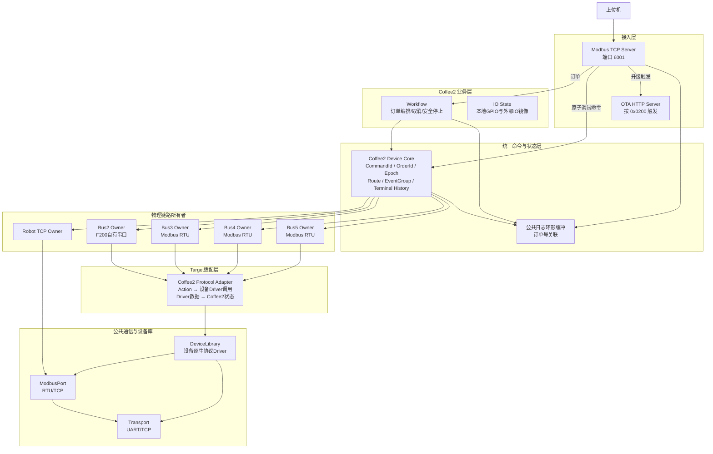
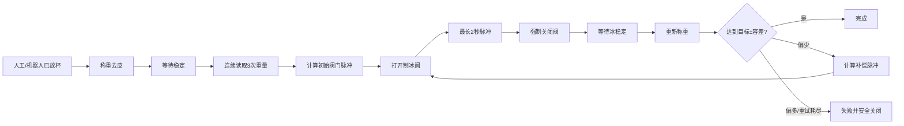

主人，结论先说：

当前 Coffee2 不是“架构完全不完善”，也不是“只能支持 Modbus”。更准确的判断是：

- 作为 Coffee2 单一产品的运行架构：主链路基本完整，任务所有权、队列投递、订单号追踪、机器人闭环和异常恢复都比较合理。
- 作为跨 Coffee2、MilkTea、多机器人、多自有协议的通用架构：只完成了大约一半，确实明显偏向 Modbus。
- 不建议推倒重写。应保留现有任务模型，逐步把 Modbus 类型泄漏、硬编码分派、IO 语义控制和多实例能力补齐。

综合结论是：Coffee2 当前架构可继续使用，但“公共设备库 + 通用物理 Bus + 多产品配置”尚未真正闭环。

# 一、当前架构到底是什么

````

````

核心思想不是“每个设备一个任务”，而是：

> 一个物理通信链路由一个 Owner 任务独占，所有使用该链路的设备命令进入同一个队列串行执行。

这个设计是正确的，尤其适合 RS485。

# 二、当前物理 Bus 和设备分配

设备绑定是编译期常量，不从上位机动态创建，见 [coffee2_device.c (line 135)](C:/Users/13193/Desktop/Project_Base/Application/UserAPP/Coffee2App/Device/coffee2_device.c:135)。

| Route   | 物理链路            | 协议                  | 设备                                 |
| ------- | ------------------- | --------------------- | ------------------------------------ |
| Route 0 | Ethernet TCP Client | Modbus TCP            | 越疆机器人                           |
| Bus2    | UART2               | F200 自有协议，115200 | 咖博士 F200                          |
| Bus3    | UART3               | Modbus RTU，9600      | 落杯 Unit1、落盖 Unit1、糖浆 Unit2   |
| Bus4    | UART4               | Modbus RTU，19200     | 制冰 Unit1、称重 Unit2、电能表 Unit3 |
| Bus5    | UART5               | Modbus RTU，38400     | IO 输入 Unit1、IO 输出 Unit2         |
| 本地 IO | STM32 GPIO          | HAL GPIO              | 本地 8DI/8DO                         |

这里已经证明当前架构不是纯 Modbus：

- Bus2 只创建 UART Transport，不创建 ModbusPort。
- F200 Driver直接使用 `TransportChannel_t` 收发自有26字节帧。
- Bus3～5才创建 Modbus RTU Port。

对应实现位于 [coffee2_rtu_bus.c (line 218)](C:/Users/13193/Desktop/Project_Base/Application/UserAPP/Coffee2App/Modbus_Rtu_Bus/coffee2_rtu_bus.c:218)。

但这个模块仍叫 `RtuBus`，执行结果仍统一使用 `ModbusPortResult_e`，所以抽象层在命名和类型上仍有明显 Modbus 偏置。

# 三、上电启动完整流程

当前启动并不是简单“创建几个任务”。

```
HAL/CubeMX 初始化
  ↓
尝试初始化日志 UART
  ↓
初始化公共日志环形缓冲
  ↓
初始化 UART2～UART5 默认串口参数
  ↓
创建设备 EventGroup 和状态对象
  ↓
初始化本地 IO 镜像
  ↓
创建 Bus2～Bus5 静态命令队列并注册 Route
  ↓
初始化 Robot TCP 上下文
  ↓
创建 Workflow 订单队列
  ↓
初始化 Modbus TCP Server 寄存器镜像
  ↓
依次创建 Server / Robot / Bus2～5 / Workflow
  ↓
日志串口可用时才创建 Logger 输出任务
  ↓
DefaultTask 等待并发布 lwIP/静态网络就绪
  ↓
Server 开始监听 6001
Robot 开始连接 192.168.5.1:502
各 Bus Owner 开始等待设备命令
```

日志系统不可用不会阻止业务任务创建，这是合理的降级设计。

当前公共日志使用32条静态覆盖式环形缓冲；满后覆盖最早日志，不动态申请内存，见 [app_log.c (line 25)](C:/Users/13193/Desktop/Project_Base/Application/Common/Log/app_log.c:25)。

# 四、真正订单从上位机到设备的完整链路

## 1. 上位机提交订单

上位机通过 Modbus TCP FC06/FC16 写入命令寄存器。

Server收到写请求后：

1. 检查地址范围；
2. 将数据复制到命令寄存器镜像；
3. 检查“订单存在”和“订单已确认”标志；
4. 将32个订单寄存器复制成不可变 `Coffee2Order_t`；
5. 提取上位机订单号；
6. 拒绝保留订单号 `0x0000` 和调试号 `0xF123`；
7. 投递给 Workflow。

入口见 [coffee2_server.c (line 623)](C:/Users/13193/Desktop/Project_Base/Application/UserAPP/Coffee2App/Modbus_Tcp_Server/coffee2_server.c:623) 和 [coffee2_server.c (line 708)](C:/Users/13193/Desktop/Project_Base/Application/UserAPP/Coffee2App/Modbus_Tcp_Server/coffee2_server.c:708)。

## 2. Workflow 接收订单

Workflow取得订单后生成：

- `OrderId`：上位机订单号；
- `OrderEpoch`：本次运行生命周期内部编号；
- `CommandId`：每条设备命令的唯一编号；
- `StepId`：订单步骤；
- `Action`：设备动作。

三者作用不同：

| 标识       | 作用                               |
| ---------- | ---------------------------------- |
| OrderId    | 人和上位机看到的订单号             |
| OrderEpoch | 防止同一订单号重用造成旧事件误匹配 |
| CommandId  | 区分订单内每一条设备动作           |
| StepId     | 定位业务流程执行到了哪一步         |

## 3. Workflow 将业务步骤变成设备命令

统一命令结构定义在 [coffee2_device.h (line 126)](C:/Users/13193/Desktop/Project_Base/Application/UserAPP/Coffee2App/Device/coffee2_device.h:126)。

例如“机器人去制冰机”会形成：

```
OrderId     = 当前上位机订单号
OrderEpoch  = 当前订单运行代次
StepId      = 90
DeviceId    = ROBOT
Action      = ROBOT_TO_ICE（114）
Timeout     = 60000ms
Source      = WORKFLOW
```

Workflow不会直接访问机器人网络，也不会直接写寄存器，而是调用：

```
xCoffee2CommandSubmit()
```

Device Core根据不可变绑定表找到 Route 0，将命令投递给 Robot Owner。

## 4. 设备完成后如何通知 Workflow

Owner执行前调用：

```
vCoffee2DeviceCommandStarted()
```

执行结束调用：

```
vCoffee2DeviceCommandCompleted()
```

Device Core更新：

- Online；
- Ready；
- Busy；
- LastResult；
- EventGroup；
- 终态历史。

Workflow使用：

```
OrderEpoch + CommandId
```

等待准确的那条命令，避免后来的刷新命令覆盖前一条动作结果。对应等待逻辑见 [coffee2_workflow.c (line 427)](C:/Users/13193/Desktop/Project_Base/Application/UserAPP/Coffee2App/WorkFlow/coffee2_workflow.c:427)。

# 五、当前完整制作流程

主流程位于 [coffee2_workflow.c (line 564)](C:/Users/13193/Desktop/Project_Base/Application/UserAPP/Coffee2App/WorkFlow/coffee2_workflow.c:564)。

| Step            | 动作                         |
| --------------- | ---------------------------- |
| 10              | 刷新机器人状态               |
| 20              | 刷新咖啡机                   |
| 22              | 刷新落杯机                   |
| 24              | 需要杯盖时刷新落盖机         |
| 26              | 需要糖浆时刷新糖浆机         |
| 28              | 需要冰时刷新制冰机           |
| 30              | 机器人回 Home                |
| 40              | 根据冷热订单取热杯或冷杯     |
| 50              | 落杯机执行对应杯道           |
| 60              | 机器人去咖啡机前             |
| 70              | 机器人进入咖啡机并放杯       |
| 80              | 咖啡机制作，最大等待180秒    |
| 90              | 需要冰时机器人去制冰位置     |
| 100～119        | 称重去皮、落冰、复称和补偿   |
| 110/120/123/126 | 糖浆1～4路按量执行           |
| 130             | 需要打印时等待上位机打印状态 |
| 140             | 机器人去落盖位               |
| 150             | 落盖机执行                   |
| 160             | 机器人取盖                   |
| 170             | 机器人压盖                   |
| 180             | 机器人送至出餐口             |

此外还有一条存储杯快捷流程：

```
刷新机器人
  → Home
  → 从指定存储位取杯
  → 放至指定出餐口
```

# 六、落冰不是一个简单的“写寄存器”

落冰是一个多设备闭环，由 Workflow 编排：

````

````

所以：

- “阀开/关”是设备原子动作；
- “按重量落冰”是业务工作流；
- 不能把完整落冰算法放进 Bus 任务或制冰机 Driver。

这部分分层是正确的。

# 七、机器人为什么单独一个任务

机器人不是普通的一问一答设备，它具有连接生命周期和动作事务。

当前机器人动作链为：

```
连接/重连
  → 冷启动或热连接判断
  → 清旧动作位
  → 写目标动作位
  → 每100ms读取命令位
  → 命令位被机器人清0，判定“已接单”
  → 开始计算60秒运动时间
  → 轮询对应完成位
  → 完成位置1
  → 主控清完成位
  → 读回完成位为0
  → 命令完成
```

掉线时保留活动事务，重连后读取命令位和完成位进行对账，而不是直接宣布失败。这是当前架构中完成度最高的设备 Owner。

但是这个状态机写在 Coffee2 Robot Task 中，尚未抽象成可复用的“状态型设备会话模板”。未来增加节卡机器人时，不能简单复用 Modbus Driver就完成全部工作。

# 八、调试命令和订单命令的差异

## 普通原子调试

```
上位机写固定调试寄存器
  → Server解析
  → 生成 Coffee2Command
  → OrderId固定为0xF123
  → 直接进入对应Route队列
  → Owner执行
  → 日志显示运行/完成/失败
```

这类命令通常绕过 Workflow，适合：

- 机器人单点位置；
- 咖啡机制作/清洗；
- 落杯/落盖；
- 糖浆；
- 外部 IO；
- 设备刷新。

## 手动落冰

手动落冰不能直接投递一个制冰阀动作，因为它还涉及去皮、称重、复称和补偿，因此会进入 Workflow，以调试订单号 `0xF123` 执行完整落冰流程。

这种区分是合理的：

- 单设备原子动作直接进 Device Core；
- 多设备协作动作进入 Workflow。

# 九、取消、替换和失败流程

当前不是“双订单并行”架构。

Workflow队列长度虽然是2，但当前产品语义是：

```
一个活动订单
+
一个待替换订单
```

运行中收到新订单时：

1. 保存为唯一的 Pending Order；
2. 请求取消当前订单；
3. 当前步骤感知 `OrderEpoch` 已取消；
4. 执行安全停止；
5. 再启动 Pending Order。

这适合 Coffee2“新订单替换旧订单”的现有语义，但不适合未来 MilkTea 的两个订单并行流水线。

失败或取消后的安全停止目前包括：

- 强制关闭制冰阀；
- 取消咖啡机；
- 取消机器人动作；
- 等待三个设备确认。

见 [coffee2_workflow.c (line 930)](C:/Users/13193/Desktop/Project_Base/Application/UserAPP/Coffee2App/WorkFlow/coffee2_workflow.c:930)。

问题是它并非通用补偿机制。糖浆机、杯盖机、未来IO电机等设备的停止主要依赖各自驱动的取消检查，没有一份统一的“动作对应补偿表”。

# 十、为什么说它偏向 Modbus

## 已经比较成熟的部分

| 能力                              | 成熟度   |
| --------------------------------- | -------- |
| Modbus RTU主站                    | 高       |
| Modbus TCP客户端                  | 高       |
| Modbus TCP服务器                  | 高       |
| FC01/02/03/04/05/06/0F/10         | 基本齐全 |
| 超时、异常码、Transport故障归一化 | 较完整   |
| 多设备共享RS485总线               | 合理     |
| IO写后读回闭环                    | 完整     |

## 已支持但不够通用的部分

F200自有协议已经能运行，但需要同时修改：

1. `device_library.h` 增加协议/Driver；
2. CMake选择源码；
3. Coffee2绑定表；
4. Bus协议判断；
5. Coffee2 Target Adapter；
6. Bus中的DeviceId switch。

所以它是“可扩展”，但还不是“新增Driver后自动接入”。

## 明显的 Modbus 泄漏

- 模块名仍是 `coffee2_rtu_bus`；
- F200执行结果最终被转换成 `ModbusPortResult_e`；
- Coffee2 Target Adapter名为 `coffee2_rtu_protocol`；
- 多数设备Driver直接接收 `ModbusPort_t`；
- Robot状态机也建立在 Modbus寄存器/线圈语义上。

因此答案是：

> 目前并非只能支持 Modbus，但 Modbus是唯一真正形成完整公共基础设施的协议族；其他协议仍属于逐个接入。

# 十一、当前架构的优点

1. 一个物理Bus一个Owner，避免串口并发冲突。
2. Server不直接操作硬件，订单和原子调试都通过命令队列。
3. 协议Driver不创建任务，便于静态编译和复用。
4. 未选择的咖啡机/机器人协议不会被编译进Coffee2。
5. `OrderId + OrderEpoch + CommandId + StepId`可以定位完整动作链。
6. 机器人具备接单、运动、完成、清结果和断线恢复闭环。
7. 日志失败不会阻塞业务，缓冲满覆盖最早日志。
8. 使用静态任务、静态队列和静态配置，RAM开销可控。
9. OTA与业务设备命令隔离，不污染Device Core。

# 十二、当前架构的主要缺点

## 1. Bus抽象只完成了一半

理念上是通用物理Bus，代码上仍是RTU Bus加F200特殊分支。

## 2. Target语义和协议执行混在一个适配文件

`coffee2_rtu_protocol.c`同时承担：

- Coffee2 Action解释；
- 公共Driver调用；
- 结果归一化；
- Coffee2状态镜像更新。

后续设备变多时文件会继续膨胀。

## 3. 背景刷新可能挤占命令队列

Workflow每200ms投递：

- IO输入刷新；
- IO输出刷新；
- 空闲时再刷新一个其他设备。

代码见 [coffee2_workflow.c (line 1005)](C:/Users/13193/Desktop/Project_Base/Application/UserAPP/Coffee2App/WorkFlow/coffee2_workflow.c:1005)。

每路队列只有4条。设备离线、超时较长时，刷新命令可能堆积，造成真实调试/业务命令 `QUEUE_FULL`。当前没有刷新去重或“已有刷新待执行”标记。

这是当前最值得优先整改的并发问题。

## 4. 本地IO没有形成语义设备层

本地GPIO目前只有镜像和直接HAL访问，没有：

- 电机启动/停止；
- 定时动作；
- 动作完成；
- 互斥；
- 取消；
- OrderId关联。

如果后续电机使用本地IO，不能只在Server里直接写GPIO。

## 5. Workflow是Coffee2硬编码流程

当前固定流程很清晰，但不可直接复用到MilkTea。它不是通用工作流引擎，也不需要现在强行改成通用引擎。

## 6. 多机器人实例尚未完成

DeviceLibrary有机器人协议版本概念，但Coffee2 Device Core只有一个 `COFFEE2_DEVICE_ROBOT`，Robot Task也是单实例静态状态。

未来两个机器人需要：

- 两个逻辑DeviceId；
- 两个绑定实例；
- 两个TCP Owner Context或一个可实例化任务模板；
- 各自队列、状态和事务；
- Workflow交接控制。

## 7. 特殊业务存在跨层访问

打印流程直接等待Server寄存器状态，没有抽象成设备/外部服务事件。这在当前产品能工作，但降低Workflow独立性。

## 8. Flash余量已经很紧

当前 Coffee2 Release ELF：

```
Flash使用：202,436 B
App分区：212,992 B
剩余约：10.3 KiB
使用率约：95.0%
```

因此不适合加入：

- 动态注册框架；
- 大型运行时Profile系统；
- 通用脚本工作流；
- 每设备单独任务；
- 大量重复协议代码。

# 十三、我对合理性的最终评价

| 层级                 | 评价                                    |
| -------------------- | --------------------------------------- |
| Transport            | 合理，可作为公共层                      |
| ModbusPort           | 成熟，应保留                            |
| 公共日志             | 成熟，可跨Target复用                    |
| DeviceLibrary Driver | 方向正确，已基本成形                    |
| Coffee2 Device Core  | 对Coffee2合理，但仍是产品专用           |
| 物理Bus Owner        | 设计正确，接口和命名需去Modbus化        |
| Robot Owner          | 功能完善，但复用性不足                  |
| Workflow             | 对当前单订单Coffee2合理，不适合双流水线 |
| 本地IO控制           | 尚不完整                                |
| 多协议扩展           | 能扩，但需要修改点过多                  |
| 多设备实例           | 尚未闭环                                |
| 资源控制             | RAM合理，Flash偏紧                      |

整体判断：

> Coffee2当前产品架构“可用且主链合理”；公共多产品架构“部分完成”；Modbus之外的协议扩展“有入口但没有统一闭环”。

# 十四、建议的最小演进路线

## 必须保留

- 一个物理Bus一个Owner；
- Server只解析和投递，不直接访问硬件；
- Workflow只做业务编排；
- DeviceLibrary只保存设备原生协议；
- 编译期选择Driver；
- 静态任务、静态队列；
- OrderId/Epoch/CommandId追踪；
- 机器人闭环事务模型。

## 第一优先级：不增加任务

1. 将概念上的 `RtuBus`收敛为`SerialBusOwner`。
2. 在Target Adapter边界增加协议无关执行结果，Modbus/F200结果在这里转换。
3. 对后台Refresh增加去重或Pending限制，防止队列被刷新占满。
4. 将Coffee2适配按设备类别拆分，避免单文件继续膨胀。
5. 修正仍未携带活动订单号的少量业务日志。

## 第二优先级：补IO语义层

新增统一的逻辑执行接口，例如：

```
ActuatorSet
ActuatorPulse
ActuatorStop
ActuatorReadback
```

底层可以映射到：

- 本地GPIO；
- 外部Modbus IO；
- 未来CAN/自有协议IO。

只有出现计时、取消或多调用源并发时，才考虑增加IO Owner任务。

## 第三优先级：MilkTea重构时再做

- 多Robot实例；
- 双订单槽；
- Robot1/Robot2流水线交接；
- 独立订单阶段状态；
- 节卡协议；
- 多产品静态配置表。

## 当前不应该做

- 不做动态插件；
- 不做运行时Driver工厂；
- 不做万能协议任务；
- 不做每设备一个任务；
- 不做通用脚本工作流；
- 不为了未来MilkTea提前改写Coffee2全部业务。

最终建议不是重构整个工程，而是：

> 保留现有任务拓扑，把“协议结果、Target适配、刷新调度、本地IO、多实例配置”这五个边界逐步收紧。这样RAM增长最小、逻辑不会失控，也能为后续MilkTea双机器人架构留下扩展空间。

本次仅做源码审核与架构评估，没有修改任何文件。