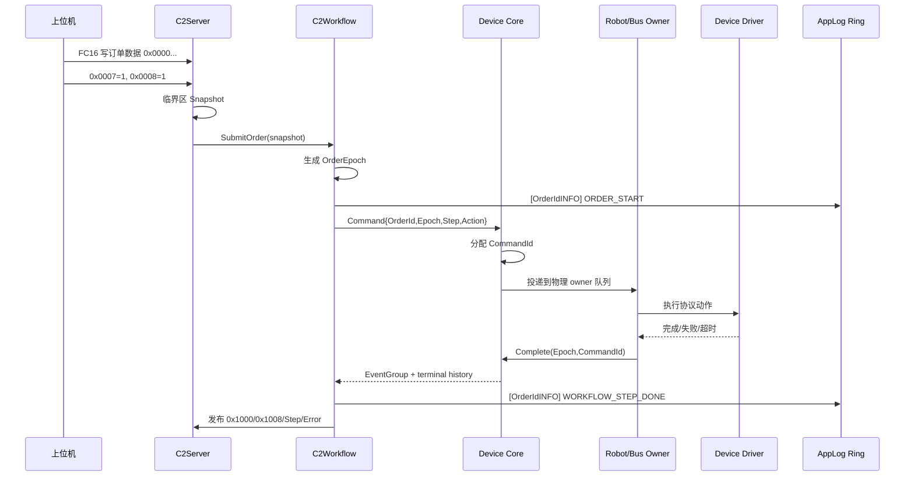
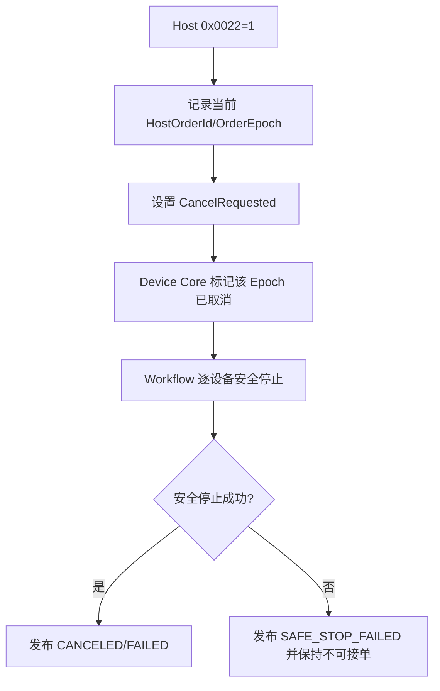

# Coffee 单订单订单号贯穿流程设计

## 1. 适用范围

本文同时说明：

- **Coffee2 当前工程的实际落地点**；
- **Coffee1 v2.7.23_ccram 的单订单语义参考**。

Coffee 产品保持单活动订单，不引入 MilkTea 双槽。Coffee1 参考其业务交互，Coffee2 采用现有 RTOS/Device/Route 架构实现。

## 2. 当前与目标的差异

当前 Coffee2 已有：

```text
Host 0x0000
 -> Order Snapshot
 -> WorkflowStatus.usCurrentOrderId
 -> Coffee2Command.ulOrderId
```

目标是补齐：

```text
Coffee2Command.ulOrderId
 -> Device/Robot/Bus/Driver 全部动作日志
 -> [OrderIdLEVEL] 前缀
```

并将所有维护命令统一赋值为 `F123`。

## 3. 单订单上下文

推荐在现有 `Coffee2Order_t` 和 `Coffee2WorkflowStatus_t` 基础上明确一个逻辑上下文，不需要新增动态对象：

```c
typedef struct
{
    uint16_t usHostOrderId;
    uint16_t usCurrentStep;
    uint32_t ulOrderEpoch;
    int32_t lResult;
    uint8_t ucCancelRequested;
    Coffee2WorkflowState_e xState;
    Coffee2Order_t xSnapshot;
} Coffee2OrderContext_t;
```

第一阶段可以不真的合并成这个结构，只需保证现有分散字段满足相同不变量。

## 4. 接单完整链路



## 5. 接单校验

最小校验规则：

1. `OrderId != 0x0000`；
2. `OrderId != 0xF123`；
3. `0x0007 == 1`；
4. `0x0008 == 1`；
5. 订单字段范围合法；
6. Snapshot 成功进入 Workflow 后才算接受。

Coffee2 当前支持“运行中收到新订单，取消当前订单并保留一笔最新 pending”的替换语义。这不是双订单并行：

```text
Active Order A
新订单 B 到达
 -> 请求取消 A
 -> 仅保留 B
 -> A 完成安全退出
 -> B 开始
```

日志必须分别使用 A、B 的真实订单号，不能在取消 A 时提前把全局 OrderId 改成 B。

## 6. 命令结构规则

订单命令：

```text
ulOrderId    = Host OrderId
ulOrderEpoch = 当前内部世代
ulCommandId  = Device Core 分配
usStepId     = Workflow 步骤
ucSource     = WORKFLOW
```

调试命令：

```text
ulOrderId    = 0xF123
ulOrderEpoch = 0，或独立 MaintenanceEpoch
ulCommandId  = Device Core 分配
usStepId     = 0
ucSource     = SERVER
```

后台刷新：

```text
ulOrderId = 0x0000
ucSource  = BACKGROUND
```

不允许 Route 或 Driver 读取全局当前订单号来补标签，因为命令可能在队列中等待，届时全局订单已经变化。订单号必须随命令值传递。

## 7. 完成与取消

设备完成匹配继续使用：

```text
OrderEpoch + CommandId
```

而不是：

```text
OrderId + StepId
```

取消时：



新订单的订单号不能覆盖正在取消的订单日志前缀。

## 8. 日志调用边界

公共 Logger 应保留原有无订单 API，并新增订单感知 API：

```c
xAppLogWriteOrder(orderId, level, source, event, result);
xAppLogWriteFieldOrder(orderId, level, source, event,
    result, field, value);
```

兼容规则：

- 原 `xAppLogWrite()` 默认 `orderId=0000`；
- Workflow/Device/Route 拥有命令上下文时调用 Order 版本；
- Coffee2 adapter 暴露同等的 `xCoffee2LogWriteOrder()`；
- 不使用任务局部全局变量隐式注入订单号。

## 9. 标准日志示例

```text
[0123INFO][C2Server:Order] ORDER_ACCEPTED result=0
[0123INFO][C2Workflow:Order] ORDER_START result=0 step=1
[0123INFO][C2Tcp1:Robot1] ACTION_START result=0 step=10 action=110
[0123INFO][C2Tcp1:Robot1] ACTION_ACCEPTED result=0 step=10
[0123INFO][C2Tcp1:Robot1] ACTION_COMPLETE result=0 step=10
[0123INFO][C2Bus2:Coffee] MAKE_START result=0 step=50 product=3
[0123ERROR][C2Bus2:Coffee] MAKE_TIMEOUT result=-4 step=50
[0123WARN][C2Workflow:Order] ORDER_CANCELING result=0 step=50
[0123INFO][C2Workflow:Order] ORDER_CANCELED result=-9 step=50

[F123INFO][C2Server:Maintenance] MANUAL_COMMAND_ACCEPTED result=0 action=114
[F123INFO][C2Tcp1:Robot1] ACTION_COMPLETE result=0 action=114

[0000WARN][C2Bus4:EnergyMeter] HEALTH_REFRESH_FAILED result=-4
```

## 10. Coffee1 参考边界

Coffee1 若后续也改日志格式，只做最小迁移：

1. 从 `ps_hold_register->current_order_number` 取得订单号；
2. 订单流程日志使用该订单号；
3. 手动入口使用 `F123`；
4. 系统轮询使用 `0000`；
5. 不为 Coffee1 引入双槽或 Front/Back Task；
6. 不照搬 Coffee1 的全局变量和阻塞设备调用到 Coffee2。

Coffee1 没有 `CommandId/Epoch`，所以它可以改善日志关联，但不能因此宣称具备 Coffee2 的陈旧完成防护。

## 11. Coffee2 实施顺序

1. 公共 `AppLogEntry_t` 增加 `usOrderId`，格式器切换新前缀；
2. 原日志 API 默认 `0000`，新增 order-aware API；
3. Coffee2 Workflow、Device、Robot、Bus 使用命令中的 `ulOrderId`；
4. Server 手动命令和手动制冰写入 `F123`；
5. Server 接单拒绝 `0000/F123`；
6. 用日志验证一笔订单的 Server→Workflow→Route→Driver→完成全链；
7. 再验证订单替换时 A/B 日志不会串号。

## 12. 验收场景

| 场景 | 预期 |
|---|---|
| 正常订单 `0123` | 所有业务动作日志均以 `[0123...]` 开头 |
| 调试机器人 | 全链路以 `[F123...]` 开头，不占正式订单 |
| 后台电表刷新 | `[0000...]` |
| 订单 A 执行中提交 B | A 的取消日志仍为 A；B 启动后才出现 B 的动作日志 |
| 同一步骤重试 | 标准日志保持同 Order/Step，深度诊断可输出 command_id |
| 旧完成晚到 | Epoch+CommandId 拒绝误唤醒新步骤 |
| Robot 断线恢复 | 恢复事务仍保留原 HostOrderId |

