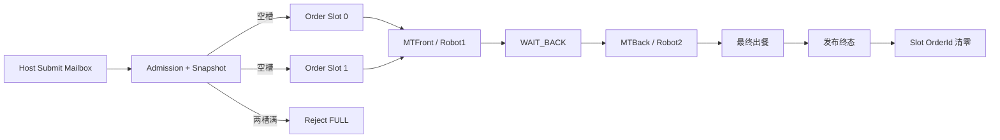
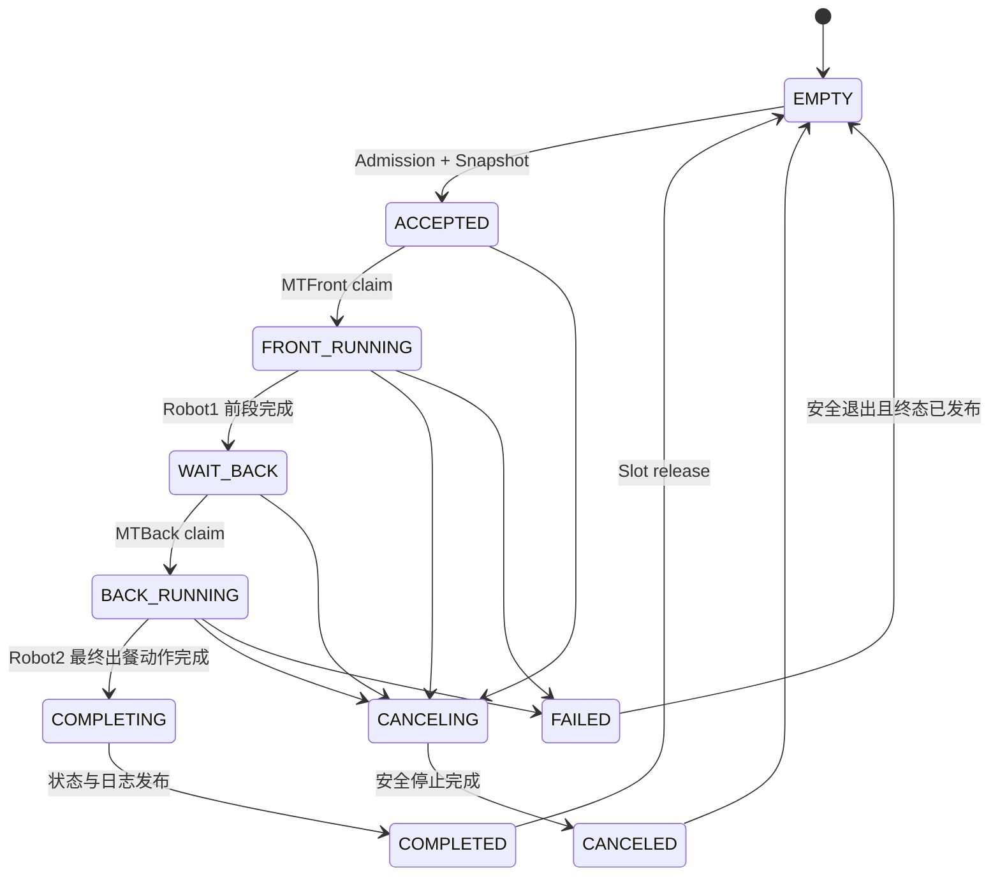
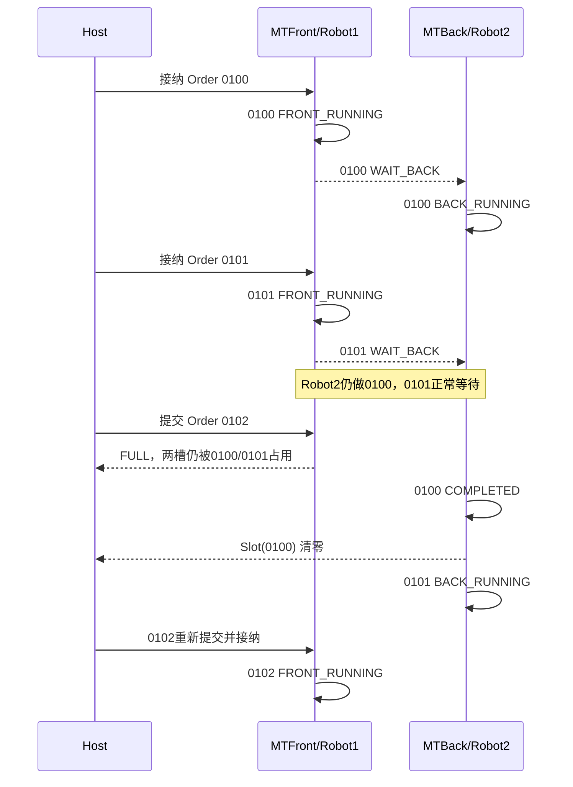

# MilkTea 双槽双机器人流水线流程设计

## 1. 目标

MilkTea 允许系统同时持有两笔未结束订单：

- Robot1 执行前段；
- Robot2 执行后段和最终出餐；
- Robot1 可在 Robot2 处理订单 A 时完成订单 B 的前段；
- B 到达交接点后停在 `WAIT_BACK`；
- Robot2 完成 A 后按接纳顺序承接 B；
- 两个槽都占用时拒绝第三笔订单；
- 槽位直到 Robot2 最终出餐或完成安全终止后才释放。

当前 MilkTea 源码尚无这些业务，本设计是后续重构蓝图。

## 2. 一页流程图



## 3. 最小静态数据模型

```c
#define MILKTEA_ORDER_SLOT_COUNT  2U

typedef struct
{
    uint16_t usOrderId;
    uint16_t usCurrentStep;
    uint32_t ulOrderEpoch;
    uint32_t ulAdmissionSequence;
    int32_t lResult;
    MilkTeaOrderState_e xState;
    MilkTeaOrderStage_e xStage;
    uint8_t ucCancelRequested;
    uint8_t ucOwner;
    MilkTeaOrderRequest_t xSnapshot;
} MilkTeaOrderContext_t;

static MilkTeaOrderContext_t s_axOrderSlot[2];
```

不需要：

- 动态内存；
- 每订单创建 Task；
- 历史订单链表；
- Slot 搬家；
- Flash 持久化订单运行态。

## 4. 订单状态机



`WAIT_BACK` 是正常背压状态，不是错误、超时或 Robot2 故障。

## 5. 为什么需要两个固定 Worker

MilkTea 必须允许 Front 和 Back 真正并行。如果只有一个类似 Coffee2 的阻塞 Workflow Task：

```text
等待 Robot2 完成订单 A
```

期间它无法推进 Robot1 的订单 B。

最小可维护方案：

- 将现有 MilkTea `app_workflow` 任务重构为 `MTFront`，复用原任务名额和栈；
- 新增一个固定 `MTBack` 任务；
- 两者共享两个静态 Slot；
- 用短临界区或一个静态 Mutex 完成 Claim/状态提交；
- 每个设备仍由自己的物理 Route owner 执行。

相比单任务全异步状态机，这只新增一个 Back task，逻辑明显更简单。相比“每订单两任务”，RAM 和生命周期都受控。

## 6. Worker 选择规则

不能按 `OrderId` 数值选择。每个 Worker 按 `ulAdmissionSequence` 选择最早符合状态的 Slot。

### MTFront

```text
选择最早 ACCEPTED
 -> 原子 Claim 为 FRONT_RUNNING
 -> Robot1 + 前段设备
 -> 完成交接准备
 -> 原子提交 WAIT_BACK
 -> 继续选择下一笔 ACCEPTED
```

### MTBack

```text
选择最早 WAIT_BACK
 -> 原子 Claim 为 BACK_RUNNING
 -> Robot2 + 后段设备
 -> 最终出餐
 -> 发布 COMPLETED
 -> 释放 Slot
 -> 继续选择下一笔 WAIT_BACK
```

如果未来 Back 阶段增加 Robot3/贴标机，它们仍属于 Back Workflow 编排，不改变订单槽模型。

## 7. 典型时间线



## 8. Admission 规则

建议固定以下返回值：

| 条件 | 结果 |
|---|---|
| `OrderId == 0000` | `INVALID_ID` |
| `OrderId == F123` | `RESERVED_ID` |
| 与任一活动 Slot 同号 | `DUPLICATE` |
| 两个 Slot 都占用 | `FULL` |
| 订单字段或校验错误 | `INVALID_DATA` |
| 有空槽且 Snapshot 成功 | `ACCEPTED` |

不要求新订单号大于活动订单号。FIFO 由接纳序号保证。

如果产品最终明确“同一来源订单号单调递增”，该规则可以作为上位机质量告警，但不应成为固件排序基础。

## 9. 上位机寄存器建议

MilkTea 地址尚未确定，文档只冻结语义，不虚构地址。

### 提交邮箱（Host 写）

| 字段 | 作用 |
|---|---|
| `SubmitOrderId` | 16 位真实订单号 |
| `OrderData...` | 饮品、杯型、配方、标签、出餐信息等 |
| `SubmitToken` | 单调变化或边沿触发，避免重复解析 |
| `CancelOrderId` | 指定取消哪一笔订单 |
| `CancelTrigger` | 取消提交边沿 |

### Active Slot（Host 读）

每槽最少：

| 字段 | 作用 |
|---|---|
| `OrderId` | `0=空槽` |
| `State` | EMPTY/FRONT/WAIT_BACK/BACK/... |
| `Stage` | FRONT/WAIT_BACK/BACK |
| `Step` | 当前业务步骤 |
| `Result` | 归一化结果/错误 |

状态寄存器应由下位机拥有，上位机不要直接修改 Active Slot。

## 10. 接纳原子性

推荐 Host 使用 FC16 一次写入订单数据，最后写 `SubmitToken`。Server 处理流程：

```text
检测 SubmitToken 变化
 -> 在短临界区复制完整提交区
 -> 退出临界区做字段校验
 -> 在短临界区检查重复/空槽并写入 Slot
 -> 发布 Slot 状态
```

不要把协议解析、日志打印或队列发送放在长临界区内。

## 11. 取消规则

MilkTea 不再使用无目标的全局 `Cancel=1`：

```text
CancelOrderId + CancelTrigger
```

取消步骤：

1. 按 `OrderId` 找到 Slot；
2. 设置 `ucCancelRequested`，状态改为 `CANCELING`；
3. 对当前 Front 或 Back owner 发送协作取消；
4. 对该 Slot 的 `OrderEpoch` 标记取消；
5. 完成机械安全停止；
6. 发布 `CANCELED` 和结果；
7. 最后释放 Slot。

取消一笔订单不能清除另一槽的命令、事件或设备终态。

## 12. Robot2 掉线与背压

Robot2 掉线时：

- `BACK_RUNNING` 的订单保持原 Slot、OrderId、Epoch 和设备事务；
- Robot2 owner 永久退避重连并恢复原动作；
- Robot1 可以完成另一订单的 Front；
- 第二笔到达 `WAIT_BACK` 后停止推进；
- 两槽满时继续拒绝第三笔；
- 不因掉线清 Slot 或把订单标记完成。

这正是活动槽按完整订单生命周期计数的价值。

## 13. 调试命令

调试命令：

```text
OrderId = F123
不进入 Slot
通过对应 Device/Route owner 队列
日志全链路标记 F123
```

若工程师在正式订单执行期间下发调试动作，设备 owner 的抢占/替换规则必须产生明确日志，正式订单仍保持自己的真实 OrderId，不能把 Slot 改成 F123。

## 14. 日志示例

```text
[0100INFO][MTServer:Order] ORDER_ACCEPTED result=0 slot=0
[0100INFO][MTFront:Order] FRONT_START result=0 step=10
[0100INFO][MTTcp1:Robot1] ACTION_COMPLETE result=0 step=18
[0100INFO][MTFront:Order] WAIT_BACK result=0 slot=0

[0101INFO][MTServer:Order] ORDER_ACCEPTED result=0 slot=1
[0101INFO][MTFront:Order] FRONT_START result=0 step=10
[0101INFO][MTFront:Order] WAIT_BACK result=0 slot=1

[0102WARN][MTServer:Order] ORDER_REJECTED result=-2 reason=FULL

[0100INFO][MTBack:Order] BACK_START result=0 step=50
[0100WARN][MTTcp2:Robot2] ACTION_RETRY result=-4 step=52 retry=1
[0100INFO][MTBack:Order] ORDER_COMPLETE result=0 slot=0
[0100INFO][MTBack:Order] ORDER_SLOT_RELEASED result=0 slot=0

[0101INFO][MTBack:Order] BACK_START result=0 step=50
```

## 15. RAM 预算原则

静态订单数据通常很小：

- 两份 32 寄存器 Snapshot：128 字节；
- 两份状态、epoch、接纳序号和结果：通常低于 128 字节；
- 一个静态同步对象：几十字节量级。

主要增量是一个 `MTBack` 任务栈。若初始给 512 words，在 Cortex-M4 上约 2048 字节，另有 TCB 开销。实施时应：

1. 复用现有 Workflow task 作为 Front；
2. Back 初始栈按实际调用深度分配；
3. 用 `uxTaskGetStackHighWaterMark()` 收集最差工况；
4. Debug/Release、GCC/ARMCC 都复核；
5. 不为两个订单各自创建任务。

## 16. 分阶段验收

### 阶段 A：仅订单槽模拟

- 接纳 100、101；
- 102 返回 FULL；
- 100 释放后 102 可进入；
- 同号返回 DUPLICATE；
- `0000/F123` 拒绝为正式订单；
- 两槽空后允许任意新的合法编号，不依赖历史最大值。

### 阶段 B：Front/Back 空动作

- 100：FRONT→WAIT_BACK→BACK→COMPLETE；
- 100 Back 时 101 Front；
- 101 WAIT_BACK 正常阻塞；
- Back 按 AdmissionSequence 取单。

### 阶段 C：真实 Robot

- Robot1/Robot2 分别只执行各自阶段；
- Robot2 掉线后 Slot 不释放；
- 重连后继续原订单动作；
- 日志可按订单号还原完整链路。

### 阶段 D：取消与故障

- 按 OrderId 精确取消；
- 一槽取消不影响另一槽；
- 安全停止未完成前不释放；
- 终态日志和 Slot 状态一致。

