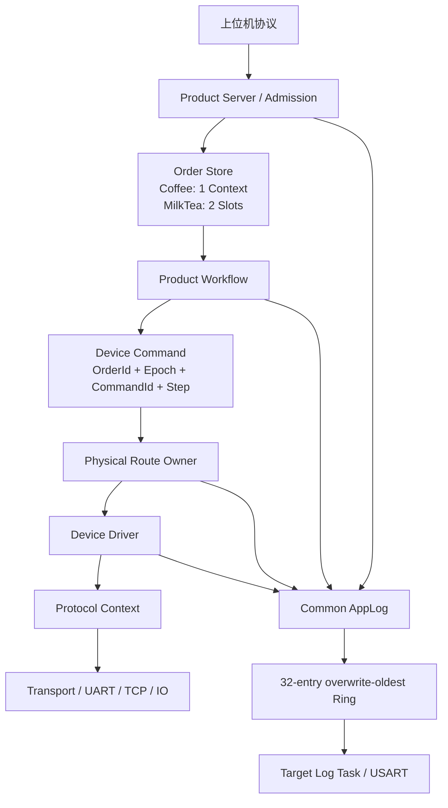

# 通用订单上下文与订单关联日志架构总结

## 1. 总体架构



## 2. 各层职责

| 层 | 负责 | 不负责 |
|---|---|---|
| Product Server | 协议解析、Snapshot、接纳、状态投影 | 执行设备帧 |
| Order Store | 活动订单身份、状态、阶段、取消 | 串口/TCP 通信 |
| Workflow | 产品步骤和多设备协作 | 寄存器地址细节 |
| Device Command | 携带订单/步骤/动作和内部事务身份 | 决定物理 Route 参数 |
| Route Owner | 独占 UART/TCP、队列、重试、连接 | 产品业务顺序 |
| Driver | 品牌/型号语义、动作映射、完成条件 | 创建业务任务 |
| Protocol | Modbus/私有协议字节与事务 | 订单状态 |
| Common Log | 静态 Ring、格式化、Transport 输出 | 猜测当前订单 |

## 3. 公共订单身份定义

建议公共头文件最终提供：

```c
typedef uint16_t AppOrderId_t;

#define APP_ORDER_ID_NONE    ((AppOrderId_t)0x0000U)
#define APP_ORDER_ID_DEBUG   ((AppOrderId_t)0xF123U)
```

产品层可以定义：

```c
typedef struct
{
    AppOrderId_t usHostOrderId;
    uint32_t ulOrderEpoch;
    uint32_t ulAdmissionSequence;
} AppOrderIdentity_t;
```

`AdmissionSequence` 只在多槽产品需要；Coffee2 可以不存该字段。

## 4. 公共 DeviceCommand 最小字段

现有 Coffee2 `Coffee2Command_t` 已接近目标，不建议为理论统一立即替换：

```c
typedef struct
{
    uint32_t ulCommandId;
    uint32_t ulOrderId;
    uint32_t ulOrderEpoch;
    uint32_t ulTimeoutMs;
    uint16_t usStepId;
    uint16_t usAction;
    uint16_t ausParameter[4];
    uint8_t ucDeviceId;
    uint8_t ucSource;
    uint8_t ucRetryLimit;
    uint8_t ucFlags;
} Coffee2Command_t;
```

后续公共化时只需把 `ulOrderId` 收紧为 `uint16_t usOrderId`，但不要在本次日志重构中同时改命令 ABI。渐进迁移风险更低。

## 5. 日志公共化设计

### 5.1 Entry

在公共 `AppLogEntry_t` 中加入：

```c
uint16_t usOrderId;
```

推荐放在 `xSource` 附近以利用结构对齐空洞。最终必须以编译器 `sizeof` 为准。

### 5.2 API

```c
AppLogResult_e xAppLogWriteOrder(AppOrderId_t usOrderId,
    AppLogLevel_e xLevel, AppLogSourceId_t xSource,
    const char *pcText, int32_t lResult);

AppLogResult_e xAppLogWriteFieldOrder(AppOrderId_t usOrderId,
    AppLogLevel_e xLevel, AppLogSourceId_t xSource,
    const char *pcText, int32_t lResult,
    const char *pcFieldName, int32_t lFieldValue);
```

旧 API 保留并内部转发 `APP_ORDER_ID_NONE`，避免一次修改所有系统日志。

### 5.3 格式

```text
[0123INFO][C2Workflow:Order] ORDER_START result=0 step=1
```

格式器需要新增固定四位大写十六进制输出函数，不使用 `sprintf`，保持现有无动态分配、固定长度的实现。

### 5.4 Target 适配

公共 Logger 不认识 Coffee2/MilkTea 名称。每个 Target 继续提供 const 来源表：

```c
{ "C2Bus4", "Scale" }
{ "MTTcp1", "Robot1" }
```

因此日志核心公用，不同 Target 只配置来源标签和输出 Transport。

## 6. 日志订单号选择矩阵

| 事件来源 | OrderId |
|---|---:|
| 启动、网络、OTA、后台刷新 | `0000` |
| 上位机单机调试命令 | `F123` |
| Workflow 订单步骤 | Host OrderId |
| Route 执行订单命令 | `command.usOrderId` |
| Device 完成/超时 | `command.usOrderId` |
| 订单取消安全动作 | 被取消订单的 Host OrderId |
| Robot 掉线恢复 | 活动事务的 Host OrderId；无事务时 `0000` |

## 7. 订单日志事件字典

### 订单层

```text
ORDER_ACCEPTED
ORDER_REJECTED
ORDER_START
ORDER_CANCEL_REQUEST
ORDER_CANCELING
ORDER_CANCELED
ORDER_FAILED
ORDER_COMPLETE
ORDER_SLOT_RELEASED
FRONT_START
WAIT_BACK
BACK_START
```

### 设备动作层

```text
COMMAND_QUEUED
ACTION_START
ACTION_PREPARED
ACTION_SENT
ACTION_ACCEPTED
ACTION_MOVING
ACTION_COMPLETE_SIGNAL
ACTION_RESULT_CLEARED
ACTION_COMPLETE
ACTION_RETRY
ACTION_TIMEOUT
ACTION_FAILED
```

### 链路层

```text
LINK_DOWN
RECONNECT_SCHEDULED
LINK_UP
TRANSACTION_RECONCILE
TRANSACTION_RESUMED
```

高频 Poll 不打印；状态不变不重复打印。

## 8. 并发与所有权

### Coffee2

- 一个活动 OrderContext；
- 一个 Workflow owner；
- 设备完成用 EventGroup + 终态历史；
- 运行中只允许一笔替换型 pending；
- 不新增订单任务。

### MilkTea

- 两个静态活动 Slot；
- Front 和 Back 各一个固定 owner；
- Slot Claim/状态提交使用短临界区或静态 Mutex；
- 两个 Worker 不直接修改对方已 Claim 的运行字段；
- 同一物理设备仍只有一个 Route owner；
- 取消按 OrderId 精确定位 Slot。

## 9. 与设备库的关系

订单架构与设备库正交：

```text
Order/Workflow 决定“做什么、为哪笔订单做”
Device Library 决定“这个设备动作如何实现”
Route 决定“由谁占用这条物理链路执行”
```

Driver、Protocol、Route 都不能生成或修改业务订单号，只能原样传递命令中的 OrderId 给日志。

## 10. 资源与奥卡姆剃刀约束

第一阶段只允许：

- 公共日志 Entry 增加一个 16 位字段；
- order-aware 日志 API；
- Coffee2 调用点传递现有 Command OrderId；
- MilkTea 两个静态 Slot；
- MilkTea 新增一个 Back Worker；
- 必要的一个静态同步对象。

第一阶段不做：

- Flash 订单恢复；
- 历史订单数据库；
- 动态任务；
- 每订单队列；
- JSON/运行时配置；
- 分布式事件总线；
- 为日志增加字符串拼接缓存；
- 因双槽而扩容公共日志 Ring。

## 11. 推荐实施阶段

### P1：Coffee2 OrderId 与日志贯穿

不改变产品流程，仅完成：

```text
Host OrderId -> Command -> Route -> Log
Debug -> F123
System -> 0000
```

### P2：Coffee2 异常场景验收

验证重试、超时、取消、替换订单、Robot 断线恢复不会串号。

### P3：MilkTea OrderStore[2]

只做接纳、重复、满槽、取消和状态投影模拟，不接真实设备。

### P4：MilkTea Front/Back Worker

用空动作验证流水线和背压，再接 Robot1/Robot2。

### P5：设备库接入

逐步把公共 Driver/Route 接到 MilkTea，不同时重写订单层和协议层。

## 12. 架构不变量

后续实现和评审必须持续满足：

1. 真实订单的 Host OrderId 从接纳到终态不变；
2. `F123` 永不进入正式订单槽；
3. 系统后台日志永不冒充当前订单；
4. Route/Driver 不读取全局订单号；
5. 设备完成只用 Epoch+CommandId 匹配；
6. MilkTea FIFO 只用 AdmissionSequence，不用订单号数值；
7. Slot 未完成安全终止前不能清零；
8. 两槽满时无论 Robot1 是否空闲都拒绝第三单；
9. 日志不可成为业务运行前置条件；
10. 不因订单数量动态创建 RTOS 资源。

