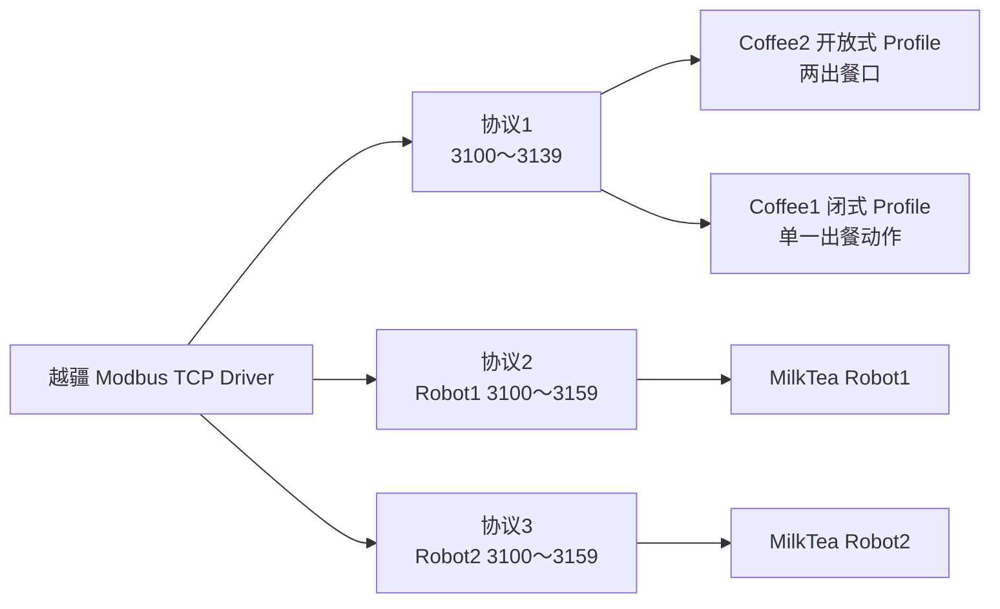
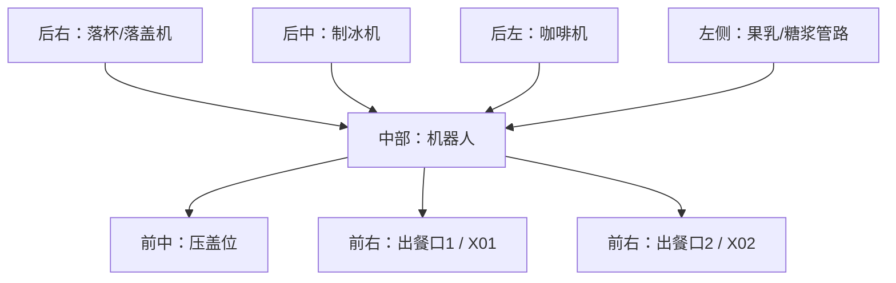

# Coffee2 设备库、机器人、电气与上位机协议重新审查报告

> 审查日期：2026-08-24  
> 本轮范围：只读审查源码、Coffee1 标准业务、上位机协议、设备协议、机器人 Excel、电气图和 3D 图；未修改程序源码。  
> Coffee1 参考基线：`C:\Users\13193\Desktop\coffee\coffee_close_v2.7.23_ccram`。

## 1. 审查结论

当前资料已足够支撑下一阶段的模块化程序修正。之前的主要问题不是协议不完整，而是审查时混淆了地址命名空间和产品语义 Profile。

| 结论 | 等级 | 说明 |
|---|---|---|
| Coffee2 机器人使用越疆协议1 | 🟢 确定 | 不使用奶茶机协议2/3，不为 Coffee2 新造 60 点表 |
| Coffee2 需要协议1的开放式产品 Profile | 🟢 确定 | Coffee1 标准工程已证明开放式出餐口1/2使用 3131/3132，当前 Coffee2 固定 3138 是闭式机语义残留 |
| 出餐口1/2由上位机指定 | 🟢 确定 | 网络订单使用 0x000A，现场订单使用 0x000C；Workflow 必须保留选口结果到 Robot Target |
| 3134/3114 是取压盖位 | 🟢 确定 | 当前 `TAKE_LID` 只是 Target 枚举命名不准，不需要新增机器人寄存器 |
| 冰量是落冰克重 | 🟢 确定 | Host 0x0005 单位 1 g，不是 temperature；为与现有上位机兼容，仍按 0=热饮、>0=冷饮执行 |
| STM32 不做机器人空夹爪安全互锁 | 🟢 确定 | 机械安全和空夹爪能力由越疆 PLC 程序管理；STM32 保留通信握手、完成位和日志 |
| 电能表改到 Bus3/Unit3/9600 | 🟢 确定 | 以用户最新决策为准，覆盖未更新的电气图；当前源码仍在 Bus4，待下一模块修改 |
| 当前公共设备库已覆盖 Coffee2 所选设备 | 🟡 部分完成 | RTU/私有串口设备驱动已存在；越疆协议2/3仍为源码占位，不影响 Coffee2，但不能称为 MilkTea 可用 |

## 2. 必须分开的两个地址命名空间

相同数值地址在不同 Modbus 端点和功能码中可以有完全不同的语义。所有新文档、日志和代码注释必须写成：

```text
端点 / Route / Unit / 功能码 / 地址 / 语义
```

| 数值地址 | Host TCP Server 寄存器语义 | Bus3/Unit1/FC01 晟枢线圈语义 |
|---:|---|---|
| 0x1008 | 制作状态 | 落杯1出口有杯 |
| 0x100D | 当前现场订单出餐口 | 落杯2出口有杯 |
| 0x1012 | 果乳通道5数量 | 落盖1出口有盖 |
| 0x1017 | 预留糖浆通道6 | 落盖2出口有盖 |

因此，“0x1008 是杯传感器”和“0x1008 是制作状态”单独看都不是完整陈述。只有加上端点和功能码才是可执行的工程事实。

## 3. 上位机订单与 Coffee1 兼容事实

### 3.1 落冰字段

- `Host TCP 0x0005` 是落冰克重，单位 1 g。
- Coffee1 内部变量名中有 `temperature` 历史遗留，不改变线上协议事实。
- Coffee2 当前 `usIceAmount * 10` 转换为 0.1 g 称重目标，这条链路与“落冰克重”一致。
- 现行协议明文用 0 区分热饮。所以当前兼容实现是 `0=热，>0=冷且数值为落冰克重`，但代码和文档不得再称其为温度。

### 3.2 两个出餐口

| 订单类型 | 上位机字段 | 意义 |
|---|---:|---|
| 网络订单 | 0x000A | 本订单指定的出餐口 |
| 现场订单 | 0x000C | 本订单指定的出餐口 |
| 当前位置上报 | 0x0033 | 机器人/流程使用的当前出餐口位置 |

Coffee1 开放式产品将出餐口1/2映射为两个独立机器人点：

| 出餐口 | 命令位 | 结果位 |
|---:|---:|---:|
| 1 | 3131 | 3111 |
| 2 | 3132 | 3112 |

Coffee2 当前已从 0x000A/0x000C 取出选口参数，但 Robot Target 将 `PUT_OUTPUT` 固定解析为 3138/3118，参数未参与选点。这是确定的待修正点。

## 4. 越疆机器人公共库审查

### 4.1 协议与产品 Profile 不是一件事



Coffee2 必须选择“协议1 + Coffee2 开放式 Profile”。协议2/3是奶茶机 Robot1/Robot2，不能因为地址更新就替代 Coffee2。

### 4.2 协议1 Coffee2 关键原子动作

| 结果 | 命令 | Target 语义 | 审查结论 |
|---:|---:|---|---|
| 3101 | 3121 | Home | 已实现 |
| 3107 | 3127 | 去制冰机 | 已实现 |
| 3108 | 3128 | 去咖啡机前 | 已实现 |
| 3109 | 3129 | 去咖啡机内 | 已实现 |
| 3111 | 3131 | 出餐口1 | 公共协议能力已有，Coffee2 Target 待改 |
| 3112 | 3132 | 出餐口2 | 公共协议能力已有，Coffee2 Target 待改 |
| 3113 | 3133 | 从咖啡机取杯 | 已实现 |
| 3114 | 3134 | 从压盖位取杯 | 地址已有，枚举名 `TAKE_LID` 待澄清 |
| 3115 | 3135 | 压盖 | 已实现 |

### 4.3 越疆本体命令和状态

公共库应增加有名 enum，Target 不再使用魔法下标。

| FC05/FC15 本体命令索引 | 命令 |
|---:|---|
| 0 | 开始 |
| 1 | 停止 |
| 2 | 暂停 |
| 3 | 上使能 |
| 4 | 下使能 |
| 5 | 清除报警 |
| 6 | 进入拖拽 |
| 7 | 退出拖拽 |
| 8 | 切换自动模式 |
| 9 | 切换手动模式 |

| FC02 本体状态索引 | 状态 |
|---:|---|
| 0～2 | 运行/停止/暂停 |
| 3～5 | 安全原点/安全皮肤暂停/空闲 |
| 6～8 | 上电/使能/报警 |
| 9～11 | 碰撞/拖拽/恢复模式 |

这些状态必须用于日志和诊断。但按产品要求，STM32 不把“空夹爪、碰撞或安全皮肤”扩展为新的业务互锁；实际机械安全行为由机器人 PLC 程序负责。

### 4.4 协议2/3 完整性

- Excel 已给出 Robot1 协议2和 Robot2 协议3的三组 10 状态 + 10 命令。
- 当前 `dobot_robot_device.c` 中协议2/3仍是协议1 40 点、单段清命令区的 placeholder。
- 下一步公共库应把协议2/3改为 60 点，并用三段静态 `const` 命令区描述。
- 3160 没有定义，保留但不读写。
- Robot3 节卡协议尚未提供，只能保留 `UNAVAILABLE`，不能做占位实现。

## 5. 公共设备库完整性盘点

| 设备 | 公共库 Driver | Coffee2 选择 | 当前结论 |
|---|---|---|---|
| 越疆机器人 | `Robot/Dobot` | 协议1 | Driver 可用；Coffee2 开放式出餐 Profile 待接线；协议2/3待完善 |
| 咖啡机 | F200 + O/X Modbus | F200 私有 UART | 已选驱动可用，未选 O/X 不进 Coffee2 最终链接 |
| 落杯/落盖 | ShengShu | 合体 Unit1 | 协议可用；Workflow 待接入四位置后置检测 |
| 糖浆机 | CurrentModbus | 4 路、Bus3 Unit2 | Driver 可用；业务配方/校准/状态机待完成 |
| 制冰机 | CurrentModbus | Bus4 Unit1 | Driver 可用；Workflow 使用称重闭环，冰量必须按克重命名 |
| 称重 | BSQ-DG-V2 | Bus4 Unit2 | Driver 可用 |
| 电能表 | DDSU666 | 目标 Bus3 Unit3 | Driver 可用；当前 Target 仍绑 Bus4，待迁移 |
| 数字 IO | ModbusDigitalIo | Bus5 Unit1/2 | Driver 可用；当前已有 FC05 写后 FC02/FC01 读回比对 |

未选的同类协议在 CMake/Keil Target 中使用源文件选择和 `IncludeInBuild`裁剪，不会因为文件存在 DeviceLibrary 就自动进入 Coffee2 固件。

## 6. 物理 Bus 目标配置

| Owner | 串口/网络参数 | 设备 | 协议/Unit |
|---|---|---|---|
| Robot Owner | 192.168.5.1:502 | 越疆机器人 | Modbus TCP Unit1，协议1开放式 Coffee2 Profile |
| Bus2 Owner | UART2 115200 8N1 | 咖博士 F200 | 私有 UART，不创建 Modbus RTU |
| Bus3 Owner | UART3 9600 8N1 | 合体落杯/落盖、糖浆、电能表 | Unit1、Unit2、Unit3 |
| Bus4 Owner | UART4 19200 8N1 | 制冰、称重 | Unit1、Unit2 |
| Bus5 Owner | UART5 38400 8N1 | 外部 DI、外部 DO | Unit1、Unit2 |

电能表迁移后，Bus3 不需要按设备切换波特率，Unit1/2/3 也无冲突。当前源码仍是 Route4/Unit3，日志源仍是 `C2Bus4:EnergyMeter`，程序实施时必须同步修改这两处。

## 7. 电气图、3D 图与当前程序匹配

### 7.1 物理空间模型



Coffee2 没有 Coffee1 闭式机的出餐门、升降台和出餐电机。因此 Workflow 应以“机器人放杯完成 + 出餐口传感器”作为业务后置条件，不复制 Coffee1 的门/升降电机步骤。

### 7.2 IO 图纸与程序枚举

| 电气图 | 物理语义 | 当前程序枚举 | 匹配 |
|---|---|---|---|
| 本地 DI5 | 热水上液位 | `COFFEE2_LOCAL_DI_HOT_WATER_HIGH=4` | 🟢 |
| 本地 DI6 | 热水下液位 | `COFFEE2_LOCAL_DI_HOT_WATER_LOW=5` | 🟢 |
| 本地 DO3 | 热水桶供水阀 | `COFFEE2_LOCAL_DO_HOT_WATER_SUPPLY_VALVE=2` | 🟢 |
| 外部 X01 | 前出餐口有杯 | `COFFEE2_EXTERNAL_DI_OUTPUT_FRONT_CUP=0` | 🟢 |
| 外部 X02 | 后出餐口有杯 | `COFFEE2_EXTERNAL_DI_OUTPUT_REAR_CUP=1` | 🟢 |
| 外部 X11 | 牛奶低液位 | `COFFEE2_EXTERNAL_DI_MILK_LOW=10` | 🟢 |
| 外部 X12/X13 | 果乳 A/B 低液位 | `FRUIT_MILK_A_LOW=11` / `B_LOW=12` | 🟢 |
| 外部 Y11 | 热水加热继电器 | `COFFEE2_EXTERNAL_DO_WATER_HEATER_RELAY=0` | 🟢 |
| 外部 Y14/Y15/Y16 | 奶/果乳A/果乳B阀 | 外部 DO 索引3/4/5 | 🟢 |
| 外部 Y20/Y21 | 果乳 A/B 泵 | 外部 DO 索引9/10 | 🟢 |
| 外部 Y22 | 助力泵 | 外部 DO 索引11 | 🟢 |

图纸与 `coffee2_io.h` 的索引映射一致。当前代码已有 IO 镜像和原子写/读回能力，但热水、果乳和上电残杯检查仍需在 Workflow 中完成业务状态机。

## 8. 上电协议清单日志设计

不把设备协议清单塞进 `prvCreateTaskLogged`。任务创建日志只能证明 RTOS 任务建立，不能证明具体 Driver 已被 Owner 接管。正确责任者是实际 Robot/Bus Owner，在链路初始化后逐设备打印。

```text
[0000INFO][C2Robot:MBTcpClient] DEVICE_PROTOCOL:DOBOT_P1_OPEN_C2 result=0 driver=1
[0000INFO][C2Robot:MBTcpClient] DEVICE_LINK:ROBOT_TCP result=0 unit=1
[0000INFO][C2Bus2:Coffee] DEVICE_PROTOCOL:F200_UART result=0 driver=12
[0000INFO][C2Bus2:Coffee] DEVICE_LINK:UART2_115200_8N1 result=0 route=2
[0000INFO][C2Bus3:Cup] DEVICE_PROTOCOL:SHENGSHU_COMBINED result=0 unit=1
[0000INFO][C2Bus3:Lid] DEVICE_PROTOCOL:SHENGSHU_COMBINED result=0 unit=1
[0000INFO][C2Bus3:Syrup] DEVICE_PROTOCOL:SYRUP_4CH_MODBUS result=0 unit=2
[0000INFO][C2Bus3:EnergyMeter] DEVICE_PROTOCOL:DDSU666 result=0 unit=3
[0000INFO][C2Bus3:MBRtu] DEVICE_LINK:UART3_9600_8N1 result=0 devices=4
[0000INFO][C2Bus4:Ice] DEVICE_PROTOCOL:ICE_CURRENT_MODBUS result=0 unit=1
[0000INFO][C2Bus4:Weigh] DEVICE_PROTOCOL:BSQ_DG_V2 result=0 unit=2
[0000INFO][C2Bus4:MBRtu] DEVICE_LINK:UART4_19200_8N1 result=0 devices=2
[0000INFO][C2Bus5:IoInput] DEVICE_PROTOCOL:MODBUS_DIGITAL_IO result=0 unit=1
[0000INFO][C2Bus5:IoOutput] DEVICE_PROTOCOL:MODBUS_DIGITAL_IO result=0 unit=2
[0000INFO][C2Bus5:MBRtu] DEVICE_LINK:UART5_38400_8N1 result=0 devices=2
```

协议名和绑定表使用 `static const`，字符串进 Flash。不增加任务、队列、动态内存或运行时注册表。

## 9. 下一阶段程序工作包

### R1：公共越疆库

1. 增加本体命令和状态有名 enum。
2. 将协议2/3从 40 点 placeholder 改为 Excel 的 60 点映射。
3. 用 `const` 三段命令区取代协议2/3的单一连续清区。
4. 节卡保持不可选。

### R2：Coffee2 Robot Target

1. 保持协议1。
2. 增加开放式 Coffee2 Point Table。
3. 让上位机出餐口参数选择 3131/3132。
4. 将 3134 语义明确为取压盖位。
5. 保留现有接单清命令位、完成位和断线恢复闭环；不新增机械安全互锁。

### B1：Bus 绑定

1. 将电能表从 Route4/Unit3 移到 Route3/Unit3。
2. 将电能表日志源从 `C2Bus4` 改为 `C2Bus3`。
3. Bus3 继续只有一个 9600 RTU Owner，不新建任务。

### L1：协议清单日志

1. 在 Robot、Bus2、Bus3、Bus4、Bus5 Owner 就绪后打印所选 Driver/协议/Unit/链路。
2. 不修改公共日志格式，不增加日志任务和队列。

### W1：Workflow 语义接线

1. 将 `0x0005` 统一命名为 `IceAmountG`。
2. 保留现行 `0=热，>0=冷` 兼容规则。
3. 将出餐口选择传入 Robot Target。
4. 设备命令完成后，由 Workflow 继续检查杯到位、冰重和出餐口传感器，Bus 不接管业务条件。

## 10. RAM 和复杂度影响

按奥卡姆剃刀原则，本方案不增加 Profile 管理器、运行时 registry、新任务、新队列或动态内存。

| 改动 | 可变 RAM 影响 |
|---|---:|
| Coffee2 协议1开放式点位表 | 0 B，`const` 进 Flash |
| 越疆本体 enum | 0 B |
| 协议2/3 60 点描述 | 表格 0 B 可变 RAM；未来 MilkTea 每实例镜像比 40 点多约 20 B |
| 电表 Route 迁移 | 0 B |
| 设备协议清单日志 | 0 B 常驻可变 RAM，文本进 Flash |

## 11. 本轮纠正的错误

1. 删除“Coffee2 必须切到60点新协议”的误判；Coffee2 使用协议1。
2. 删除“TAKE_LID 不能用于取压盖位、必须新增地址”的误判。
3. 删除“空夹爪操作必须由 STM32 新增安全审批”的误判。
4. 删除独立 `Temperature` 是当前协议已有字段的误判；0x0005 是落冰克重。
5. 纠正不带端点地将 0x1008/0x100D/0x1012/0x1017 统称为杯盖传感器的写法。
6. 纠正电能表 Bus4 绑定文档，目标是 Bus3/Unit3/9600。

## 12. 尚未明确的边界

当前与 Coffee2 机器人、出餐口、落冰克重、设备库和 Bus 绑定有关的程序设计已无未决架构问题。仅剩下以下实物验收或未供资料：

1. 节卡 Robot3 协议未提供，本轮不实现。
2. X01/X02 和 Bus3/Unit1/FC01 四个杯盖存在位的实机有效电平需逐点验收；产品映射按 X01=前/出餐口1、X02=后/出餐口2 执行。
3. 电能表迁移到 Bus3 后，电气图需回标，但这不再是软件决策阻塞。
4. 冷饮不加冰未被当前上位机协议独立表达。当前为兼容已开发上位机保持 `0=热，>0=冷`；若未来必须支持该配方，需上位机协议新增冷热字段。

除这四项外，本轮要求已具备进入 R1→R2→B1→L1 分模块编码和硬件验收的条件。
