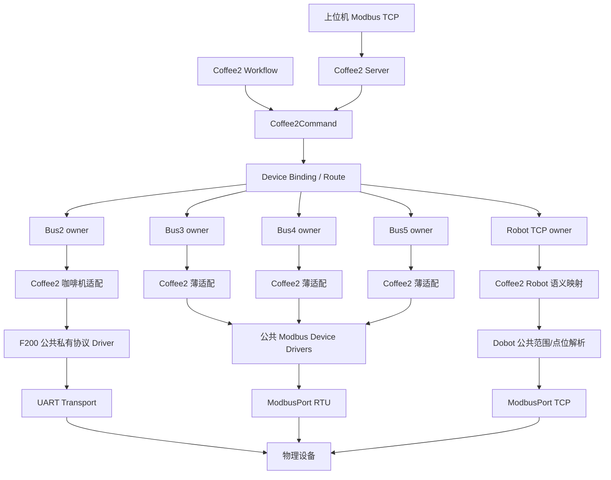
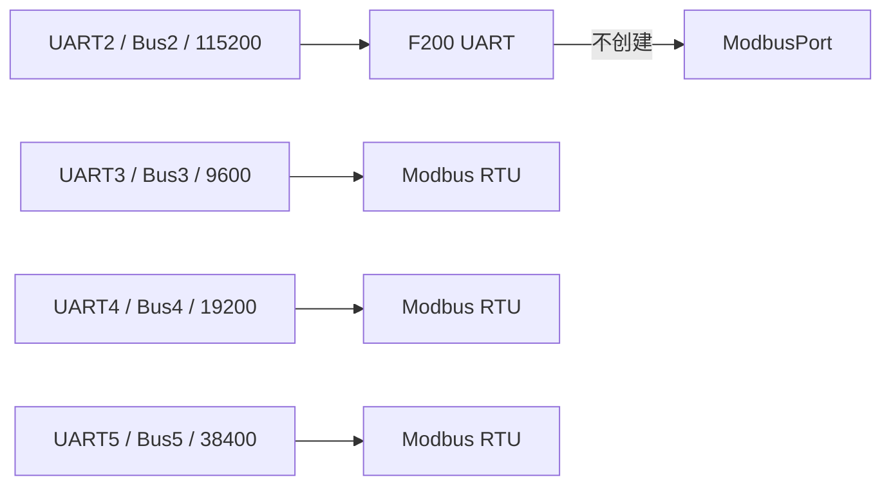

# 公共设备库完整迁移与 Coffee2 选型实施报告

> 实施日期：2026-08-21  
> 设计准则：先减少 RAM，再减少运行逻辑，最后保证扩展；不为未来假设增加管理层  
> 适用范围：当前公共 DeviceLibrary 与 Coffee2 Target；MilkTea 本轮不接入

## 1. 交付结论

本轮已把现有外部设备的可复用线协议完整迁入公共设备库，并让 Coffee2 通过编译期
配置选择实际型号。最终结构满足以下约束：

1. 公共库只实现设备帧、寄存器、原生动作、状态解析和协议闭环；
2. Coffee2 保留订单、上位机寄存器、产品 Action 和业务状态投影；
3. 每个物理 Bus 仍只有一个 owner task；一条 Bus 同一固件只选择一种协议模型；
4. 私有串口协议不创建 `ModbusPort`；
5. 不新增任务、队列、EventGroup、动态分配、运行时设备注册表或 Profile manager；
6. 同类未选协议由构建系统排除，不依靠“编译进去但运行时不用”；
7. 波特率由产品 Bus 决定，公共设备 Driver 不声明或切换波特率。

## 2. 最终架构



### 2.1 各层唯一职责

| 层 | 负责 | 禁止放入 |
| --- | --- | --- |
| DeviceLibrary | 设备原生协议、寄存器、帧、动作闭环、状态解析 | Coffee2Action、订单、上位机地址、物理 UART |
| Coffee2 Adapter | 产品 Action 到设备原生动作的转换、产品状态投影、产品日志 | 重复实现底层功能码/帧 |
| Device Binding | DeviceId、Route、Unit、DriverId、ProtocolId | 动态注册、波特率切换 |
| Bus owner | 串口独占、队列串行、最小帧间隔、Transport/Modbus context | 饮品配方、工位业务语义 |
| Workflow/Server | 订单步骤、维护命令、等待与错误策略 | 直接访问 UART 或 ModbusPort |

## 3. 公共设备库目录与能力

```text
Application/DeviceLibrary/
├─ Inc/device_library.h
├─ Robot/Dobot/
│  └─ dobot_robot_device.c/.h
├─ CoffeeMachine/
│  ├─ coffee_machine_modbus.c/.h
│  └─ coffee_machine_f200.c/.h
├─ CupLidController/ShengShu/
│  └─ cup_lid_shengshu.c/.h
├─ SyrupMachine/CurrentModbus/
│  └─ syrup_machine_modbus.c/.h
├─ IceMachine/CurrentModbus/
│  └─ ice_machine_modbus.c/.h
├─ Scale/BSQ_DG_V2/
│  └─ scale_bsq_dg_v2.c/.h
├─ PowerMeter/DDSU666/
│  └─ power_meter_ddsu666.c/.h
└─ IoModule/ModbusDigitalIo/
   └─ io_module_modbus_digital.c/.h
```

| Driver | 关键协议能力 |
| --- | --- |
| Dobot | 协议 1/2/3 元数据、角色限制、地址合法性、TargetId+selector 点位解析 |
| Kalerm O/X | FC03/FC06，制作、暂停、恢复、清洗、取消、复位及轮询 |
| Dr.Coffee F200 | 26 字节帧、校验、制作/查询/取消、状态/64 位告警/故障、取消回调 |
| ShengShu Cup/Lid | 任务寄存器 0～3、状态线圈区、写启动并轮询 2/3/4 |
| Syrup | Holding 0～14、通道 1～4、时间、清洗、余量、动作轮询 |
| Ice | Holding 1～13、故障掩码、供电/阀/泵 1/泵 3 控制 |
| BSQ-DG-V2 | Holding 0～2、单位/小数位换算、去皮/清皮/置零 |
| DDSU666 | FC04 读取 0x2000/0x4000，IEEE-754 电压、电流、功率、频率、电量 |
| Digital IO | FC02 输入、FC01 输出、FC05 单点写、完整输出镜像读回比对，最大 48 点 |

所有公共动作都由调用方传入 `ModbusPort` 或 `TransportChannel`、Unit、timeout 和调用方
镜像。公共库没有每台设备的全局状态副本，因此添加库文件本身不会增加常驻 RAM。

## 4. 机器人三个版本

### 4.1 当前边界

用户要求的版本命名统一为：协议 1、协议 2、协议 3，不在代码中使用“新旧产品”作为
长期标识。

| 版本 | 当前表状态 | 可用于什么 |
| --- | --- | --- |
| 协议 1 | 正式 3100～3139 | Coffee2 当前选择；Target 应使用开放式 Coffee2 语义 Profile |
| 协议 2 | Excel 已给出 Robot1 的 3100～3159 三组 10+10 正式需求；源码仍是 40 点占位 | 后续 MilkTea Robot1，完成库实现前不可选 |
| 协议 3 | Excel 已给出 Robot2 的 3100～3159 三组 10+10 正式需求；源码仍是 40 点占位 | 后续 MilkTea Robot2，完成库实现前不可选 |

公共容量按 3100～3159 共 60 点设计。用户提出“扩展到 3160”按地址边界解释；当前
Excel 最后定义到 3159，3160 没有正式语义，故代码把 3160 作为保留地址，不读取、
不写入、不虚构动作。

协议 2 仅允许 Robot1，协议 3 仅允许 Robot2。Coffee2 选择协议 1；后续 MilkTea 可创建
两个独立 Robot instance，并分别让 Robot1/Robot2 指向不同的 `const` 点位表。它们共享
驱动代码但各自拥有 TCP owner、队列、事务状态和连接状态，不能共享运行时事务对象。

### 4.2 同地址不同工位语义

“3127 在 Coffee2 表示去制冰机，在别的产品表示去奶茶机”不是线协议变化，而是产品
工位语义变化。因此：

```text
公共 Dobot Driver：只验证 3127 是否在选定协议范围内
Target const point table：定义 TargetId/selector -> 3127/3107
Workflow：把业务步骤命名为去制冰或去奶茶
```

不增加 ProfileId、运行时 registry 或虚函数表。每个 Robot instance 只保存一个指向
`const` 表的指针，点位表存 Flash。

## 5. Coffee2 当前编译期选型

### 5.1 Device Binding

| 逻辑设备 | Driver | Route | Unit |
| --- | --- | ---: | ---: |
| Robot | Dobot Protocol 1 | Robot TCP | 1 |
| Coffee | Dr.Coffee F200 | Bus2 | 无 Modbus Unit |
| Cup | ShengShu | Bus3 | 1 |
| Lid | ShengShu | Bus3 | 1 |
| Syrup | CurrentModbus | Bus3 | 2 |
| Ice | CurrentModbus | Bus4 | 1 |
| Scale | BSQ-DG-V2 | Bus4 | 2 |
| Power | DDSU666 | 当前 Bus4；目标 Bus3 | 3 |
| IO Input | ModbusDigitalIo | Bus5 | 1 |
| IO Output | ModbusDigitalIo | Bus5 | 2 |

### 5.2 物理 Bus 选择



`COFFEE2_MODBUS_BUS_COUNT` 由 Bus2～Bus5 的四个协议宏计算。当前结果是 3，因此静态只
分配三份 `ModbusPort_t`。Bus task 根据自身在配置表中的位置计算紧凑 Modbus 索引，不
再写死 Bus3=0、Bus4=1、Bus5=2。将来任一路改成明确的私有协议，只需调整产品配置和
对应 Driver 选择，该路不会初始化 Modbus。

### 5.3 杯盖拓扑

合体式和分体式共用同一 Driver：

```text
合体：Cup Bus3/Unit1 + Lid Bus3/Unit1
分体：Cup Bus3/Unit1 + Lid Bus3/Unit3
```

寄存器地址分别为 0～1 和 2～3，线圈区分别从 0x1004 和 0x100E 起，不冲突。Bus3
唯一 owner 保证同一站号的两种逻辑动作仍是串行事务。

## 6. 电气图 IO 装配

### 6.1 板载 GPIO

第 13 页的 8 入 8 出是 STM32 本地 GPIO，使用 PE0～PE7 输入、PE8～PE15 输出。已为
明确标题建立产品枚举：DI5 热水高液位、DI6 热水低液位、DO3 热水补水阀。

### 6.2 外部模块

第 14/15 页为外部 16 点输入/输出模块。公共 Driver 仍支持协议手册的最大 48 点；
Coffee2 通过 `COFFEE2_EXTERNAL_IO_POINT_COUNT=16` 限定本机。

```text
Bus5 Unit1：FC02 读取输入 0..15
Bus5 Unit2：FC01 读取输出 0..15
写输出：FC05 点写 -> FC01 读取 0..15 -> 目标点比较
```

电气图标题已固化为 Coffee2 产品枚举，公共 IO Driver 不知道“牛奶阀”或“出餐杯检测”
等产品含义。这样同一模块在另一 Target 可使用不同的点位语义，不需要复制协议。

## 7. 未选设备协议是否编译

### 7.1 Coffee2 当前答案

是，未选中的咖啡机协议被排除：

- GCC `device_library` 源清单包含 `coffee_machine_f200.c`，不包含
  `coffee_machine_modbus.c`；
- Keil 的 F200 位于启用的 `Application/DeviceLibrary` 组；
- Kalerm O/X 源位于 `Application/DeviceLibrary/Unselected`，组级
  `IncludeInBuild=0`；
- 最终 ELF 有 F200、杯盖、糖浆、冰机、称重、电表、IO 的执行符号，没有
  `xCoffeeMachineModbusExecute` 或 `g_xCoffeeMachineKalerm*` 符号。

### 7.2 为什么 O/X 和 Robot1/2/3 不拆成大量文件

O/X 共用完全相同的执行状态机，只差少量只读配置；Dobot 三版本也共用地址校验和
点位解析。把每个配置拆成独立状态机源文件只会复制逻辑。当前策略是：

1. 帧格式不同的协议按 `.c/.h` 源文件排除；
2. 同一算法的型号差异使用 `const` 配置；
3. 未被引用的 `const` 数据由 `--gc-sections`/Keil unused section elimination 清除；
4. 若以后某型号出现独立帧格式，再拆独立 Driver 源，而不是提前设计。

因此“库目录保存全部协议”不等于“每个固件包含全部协议”。

## 8. 新增设备或新协议的标准流程

### 8.1 新增同类新协议

1. 在 `Application/DeviceLibrary/<Category>/<Model>/` 新增独立 `.c/.h`；
2. 在 `device_library.h` 分配稳定的 DriverId 和 ProtocolId；
3. API 只接收原生参数、timeout、调用方镜像及可选取消回调；
4. 不引用 Coffee2/MilkTea 头文件，不创建任务/队列，不保存 UART/Unit/波特率；
5. 在目标 CMake/Keil 源清单二选一；
6. Target Adapter 将产品 Action 转成设备动作；
7. Device Binding 选择 Route、Unit、Role、DriverId、ProtocolId；
8. 做符号排除、双工具链和硬件抓包验收。

### 8.2 新增同协议新型号

先判断差异是否只有寄存器数量、命令值或能力位。若是，增加一份 `const` 配置；若帧
布局、校验、状态机或错误语义变了，才新建 Driver。不得因为型号名称不同就复制一套
状态机。

### 8.3 一条 Bus 更换协议

1. 修改该 Target 的 Bus protocol 宏；
2. 该路所有 Binding 的 `ProtocolId` 必须一致；
3. Modbus 路创建一个紧凑 `ModbusPort`；私有路只使用 Transport；
4. 一条 Bus 禁止同时创建 RTU 和私有协议 owner；
5. 同一路所有设备使用同一 UART 参数，Driver 手册值只作现场配置参考。

## 9. 资源结果

| Target | RAM | CCMRAM | FLASH |
| --- | ---: | ---: | ---: |
| Coffee2-Debug | 101,304 B / 128 KiB | 40,744 B / 64 KiB | 167,888 B / 208 KiB |
| Coffee2-Release | 101,336 B / 128 KiB | 40,744 B / 64 KiB | 201,832 B / 208 KiB |
| MilkTea-Debug | 104,848 B / 128 KiB | 32,768 B / 64 KiB | 169,068 B / 512 KiB |
| MilkTea-Release | 104,896 B / 128 KiB | 32,768 B / 64 KiB | 147,396 B / 512 KiB |

相对迁移前 Coffee2 Release（RAM 102,024 B、CCM 40,872 B、FLASH 199,116 B）：

- 普通 RAM 减少 688 B；
- CCM 减少 128 B；
- FLASH 增加 2,716 B；
- Release 应用分区剩余 11,160 B；
- 未新增 RTOS 对象或动态内存。

所以设备库扩充没有导致“所有协议各占一份 RAM”。当前主要约束仍是 Coffee2 OTA
应用 Flash 分区余量，不是 RAM。以后每增加一个被 Coffee2 选中的协议都必须复测
Release 分区；只把未选协议文件放进库目录不会改变固件大小。

## 10. 验证结果与边界

### 10.1 已完成

- Coffee2 Debug/Release、MilkTea Debug/Release 四个 GCC preset 全部 fresh build 成功；
- Coffee2 Release 编译命令和 Ninja link 清单不含 Kalerm Modbus 源；
- ELF 符号包含当前选中的八类公共执行器，不含未选 Kalerm 执行器；
- Keil `.uvprojx` XML 解析通过，Coffee2 源组和 include 路径已更新；
- MilkTea 的 CMake 目标不链接 DeviceLibrary，本轮没有配置或重构 MilkTea；
- 新公共驱动没有 `malloc`、`pvPortMalloc`、`xTaskCreate`、新队列或 C++ 风格注释。

### 10.2 尚未完成的硬件证据

- 当前环境没有找到 `UV4.exe`，所以本轮没有执行 ARMCC V5.06 Rebuild；
- F200、DDSU666、BSQ-DG-V2、杯盖、糖浆、冰机和 IO 仍需逐台抓包/日志验收；
- DDSU666 已由产品决策指定迁移到 Bus3/Unit3/9600，电气图尚未回标；IO Unit1/2、F200 UART2 接线仍需现场确认；
- 越疆协议 2/3 映射已由《奶茶机机器人寄存器整理.xlsx》提供，但当前公共库仍是 40 点占位，未实现前不能宣传为可用；
- 节卡 Robot3 只有预留身份，没有实现，不能选择。

## 11. 架构评价

### 优点

- 真正把设备协议与 Coffee2 订单语义分开，后续 Target 能复用；
- Bus owner 和协议 owner 一一对应，避免双协议抢串口；
- 编译期裁剪、无运行时注册和无动态内存，RAM 成本低且故障面小；
- 合体/分体、同协议不同语义均用 `const` 配置和 Binding 解决，没有复制状态机；
- 原 Coffee2 Server/Workflow ABI 基本不变，迁移风险集中在薄适配器和硬件验证。

### 缺点与下一步

- 现有文件/API 仍保留 `coffee2_rtu_bus` 旧命名，实际已能承载私有 UART；为避免大规模
  重命名风险本轮没有改名，后续只在独立清理版本处理；
- Coffee2 Release Flash 已达 94.76%，新功能必须受 208 KiB 分区硬限制；
- 公共 Driver 目前没有独立 host 单元测试工程，主要依赖编译、静态审计和硬件验收；
- 机器人完整 TCP owner/重连/事务恢复仍在 Coffee2 产品层；等 MilkTea 双机器人需求
  真正落地后，再把可实例化 Runtime 抽成公共组件，当前不提前增加复杂度。

这个结果符合奥卡姆剃刀：先迁移确定存在的重复协议，保留一个 owner、一套动作状态机
和一份产品镜像；不为未交付的机器人表、节卡协议或 MilkTea 重构预先创建运行时框架。
