好，这一版继续完全沿用我们刚刚确定的 **“主干 → 分支 → 叶子 → 函数速查”** 学习方式。

这次不要把 `ModbusPort` 理解成“又包了一层 nanoMODBUS”。真正理解以后会发现，它恰恰是这套工程里最值得学习的一个架构层，因为：

> **nanoMODBUS 是通用第三方协议库，Transport 是通用字节通道，而 ModbusPort 是把两者变成“本项目可稳定使用的 Modbus 服务”的工程边界。**

源码文件本身也直接把它定义为“Bind nanoMODBUS to the project Transport abstraction”。

------

# ModbusPort 架构知识图谱

> 基于当前工程：
>
> `modbus_port.h`
> `modbus_port.c`
> `modbus_port_config.h`
>
> 并结合已经分析过的 `nanoMODBUS` 与当前 `Transport` 接口理解其上下边界。

------

# 0. 这份文档应该怎么读

读 `ModbusPort` 最大的误区，是打开 `modbus_port.c` 后按照：

```text
prvRead
prvWrite
prvFlush
prvInit
prvBegin
prvFinish
...
```

一个一个往下看。

这样最终虽然每个函数都认识，却很容易错过这个文件最重要的东西：

> **ModbusPort 本质上是在管理“一笔 Modbus 事务”。**

所以这份文档先建立下面这个模型：

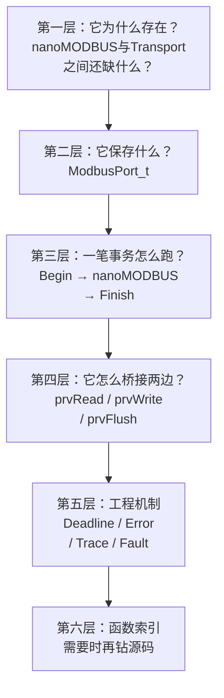

也就是说：

```text
先理解为什么需要 ModbusPort
          ↓
再理解 ModbusPort_t
          ↓
再走一笔完整 FC03
          ↓
再研究 Read/Write Adapter
          ↓
最后研究 Timeout / Error / Trace
```

不要反过来。

------

# 1. 30 秒理解 ModbusPort

先只看这一张。

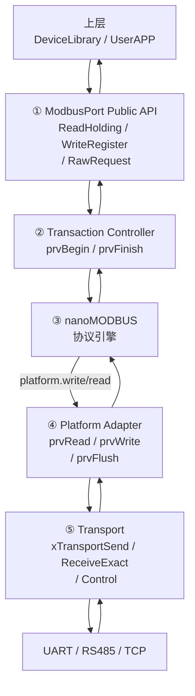

这里最关键的现象是：

```text
ModbusPort
    ↓
调用 nanoMODBUS

nanoMODBUS
    ↓
又回调 ModbusPort
```

第一次看很容易觉得：

> “为什么绕回来了？”

实际上这是整个设计最漂亮的地方。

------

# 2. ModbusPort 的六根主干

后面的全部内容围绕六根主干展开：


如果这六件事真正理解了，`modbus_port.c` 基本就不会再显得复杂。

------

# 第一主干：为什么已经有 nanoMODBUS，还需要 ModbusPort？

# 3. nanoMODBUS 和 Transport 之间缺了一层什么

上一章已经知道：

```text
nanoMODBUS
=
Modbus协议专家
```

而下一章我们会看到：

```text
Transport
=
字节传输专家
```

理论上可以：

```text
nanoMODBUS
      ↓
 Transport
```

直接连接。

但工程里仍然存在很多 nanoMODBUS 不应该负责的问题：

```text
这一笔事务总共允许多久？

nano的错误怎么转换成项目错误？

Transport BUSY 怎么处理？

Transport NOT_OPEN 怎么处理？

一笔请求的TX/RX怎么记录？

底层HAL/LwIP错误怎么保留下来？

RTU两帧之间的3.5字符静默谁负责？

bool[]怎么转换成nano的bitfield？

上层到底应该看到nano的API，
还是看到项目自己的稳定API？
```

这些都不是 Modbus 协议本身。

于是出现：

```text
ModbusPort
```

------

# 4. ModbusPort 的真正定位

可以把它定义为：

> **nanoMODBUS 与项目 Transport 之间的事务适配与工程策略边界。**

它同时扮演至少四个角色：

```text
Adapter
    +
Facade
    +
Transaction Controller
    +
Diagnostic / Error Boundary
```

这四个概念后面会逐个看到。

------

## 4.1 Adapter

把：

```text
nanoMODBUS read/write contract
```

转换成：

```text
Transport API
```

------

## 4.2 Facade

上层不需要直接学习：

```c
nmbs_bitfield
nmbs_error
nmbs_set_destination_rtu_address
nmbs_set_read_timeout
...
```

而只需要：

```c
xModbusPortReadHolding(...)
xModbusPortWriteRegister(...)
```

------

## 4.3 Transaction Controller

它给每笔操作统一套：

```text
prvBegin
   ↓
nanoMODBUS
   ↓
prvFinish
```

------

## 4.4 Diagnostic Boundary

它把：

```text
nanoMODBUS错误
Transport错误
HAL/LwIP/native错误
Exception Code
TX/RX帧
```

集中保留下来。

------

# 5. 三层职责不要混

最终应该形成这样的认知：

```text
nanoMODBUS
────────────────────
“Modbus该怎么说”

FC03格式是什么？
CRC怎么验证？
异常帧是什么？


ModbusPort
────────────────────
“这一笔Modbus事务
在本工程里怎么执行”

总超时？
错误映射？
Trace？
RTU静默？


Transport
────────────────────
“字节到底怎么移动”

UART DMA？
StreamBuffer？
Socket？
Netconn？
```

这就是三层存在的原因。

------

# 第二主干：核心对象 `ModbusPort_t`

# 6. `ModbusPort_t` 是什么

如果 nanoMODBUS 的核心对象是：

```c
nmbs_t
```

那么 ModbusPort 的核心就是：

```c
ModbusPort_t
```

源码明确说明它保存一个 nanoMODBUS 实例及其工程集成状态，同时明确警告：

> 同一时间只能有一个 owner 在该对象上执行事务。

整体结构：

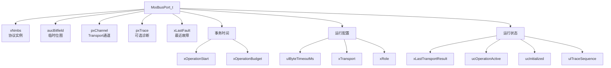

------

# 7. `ModbusPort_t` 最重要的思想：Composition

注意：

```c
nmbs_t xNmbs;
```

不是：

```c
nmbs_t *pxNmbs;
```

也就是说：

> **nanoMODBUS 实例直接嵌在 ModbusPort 里面。**

关系是：

```text
ModbusPort_t
┌────────────────────────────┐
│                            │
│  nmbs_t xNmbs              │
│  ┌──────────────────────┐  │
│  │ nanoMODBUS context   │  │
│  └──────────────────────┘  │
│                            │
│  Deadline                  │
│  Error                     │
│  Trace                     │
│  Transport pointer         │
│                            │
└────────────────────────────┘
```

这是典型的：

> **Composition / 组合。**

ModbusPort：

```text
“拥有一个 nanoMODBUS 实例”
```

而不是继承 nanoMODBUS。

------

# 8. `pxChannel` 又不一样

```c
TransportChannel_t *pxChannel;
```

这里保存的是指针。

所以关系是：

```text
ModbusPort
   │
   │ 引用
   ▼
TransportChannel
```

而不是拥有 Transport Channel 的存储。

头文件也明确要求传入的 `TransportChannel_t` 生命周期必须覆盖 `ModbusPort_t`。

所以这里出现一个非常重要的 C 设计概念：

```text
xNmbs
=
Owned / Embedded

pxChannel
=
Referenced / Borrowed
```

------

# 9. `pxTrace` 同样是外部拥有

```c
ModbusPortTrace_t *pxTrace;
```

Trace 对象由调用者提供。

ModbusPort 只保存：

```text
地址
```

因此生命周期关系：

```text
ModbusPort_t
   │
   ├── owns xNmbs
   ├── owns aucBitfield
   ├── owns xLastFault
   │
   ├── references TransportChannel_t
   │
   └── references ModbusPortTrace_t
```

这张图以后分析任何 C 库都非常值得画。

------

# 10. `aucBitfield` 为什么存在

```c
nmbs_bitfield aucBitfield;
```

它不是业务状态。

它只是：

> **ModbusPort 为 coil/discrete API 准备的格式转换 scratch buffer。**

因为上层 API 使用：

```c
bool *pbValues
```

而 nanoMODBUS 使用：

```c
nmbs_bitfield
```

所以读线圈时：

```text
nano bitfield
      ↓
aucBitfield
      ↓
逐bit读取
      ↓
bool[]
```

源码的 `xModbusPortReadCoils()` 就是这样转换的。

写线圈则反过来：

```text
bool[]
   ↓
aucBitfield
   ↓
nmbs_write_multiple_coils
```


这说明 ModbusPort 还是一个：

> **数据形态适配器。**

------

# 第三主干：ModbusPort 怎么把 nanoMODBUS 和 Transport 接起来

这是整个文件最关键的一部分。

# 11. 初始化时发生了什么

Client 初始化入口：

```c
xModbusPortClientInit()
```

核心过程：

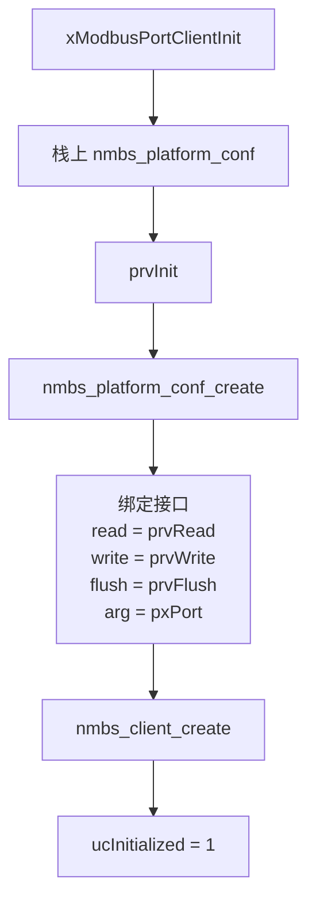

源码就是先通过 `prvInit()` 填充 Port 和 platform，然后调用 `nmbs_client_create()`，最后才把 `ucInitialized` 置 1。

------

# 12. 真正发生绑定的是这四句

```c
pxPlatform->read  = prvRead;
pxPlatform->write = prvWrite;
pxPlatform->flush = prvFlush;
pxPlatform->arg   = pxPort;
```

源码的 `prvInit()` 就在这里完成 nanoMODBUS 与项目 Port 的绑定。

这四句是整个 ModbusPort 的“灵魂”。

------

# 13. 为什么 `arg = pxPort`

nanoMODBUS 后面调用：

```c
platform.read(..., platform.arg);
```

此时：

```text
platform.arg
=
pxPort
```

所以进入：

```c
prvRead(..., void *pvArgument)
```

后：

```c
pxPort = (ModbusPort_t *)pvArgument;
```

于是：

```text
nanoMODBUS
   │
   │ 不知道 ModbusPort 类型
   │
   ▼
void *arg
   │
   ▼
prvRead()
   │
   ▼
重新拿回 ModbusPort_t
```

这就是典型的：

> **C Context Pointer 模式。**

------

# 14. 为什么 `xPlatform` 可以是栈变量

Client Init 里面：

```c
nmbs_platform_conf xPlatform;
```

是局部变量。

然后：

```c
nmbs_client_create(&pxPort->xNmbs, &xPlatform);
```

看起来函数退出后 `xPlatform` 就死了。

为什么安全？

因为前面 nanoMODBUS 已经分析过：

```c
nmbs->platform = *platform_conf;
```

是结构体按值复制。

nanoMODBUS 的公开接口也明确说明传入的 `platform_conf` 在创建之后可以丢弃。

所以：

```text
xPlatform
   │
   │ copy
   ▼
pxPort->xNmbs.platform
```

不是保存：

```text
&xPlatform
```

------

# 15. 初始化之后最终形成什么关系

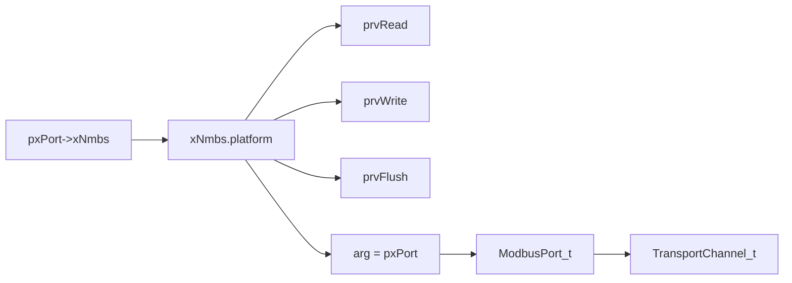

所以 nanoMODBUS 最终获得了一条通向 Transport 的路。

------

# 第四主干：一笔 Client 事务怎么运行

# 16. Client API 的统一模板

绝大多数公开 API 都可以压缩成：

```c
xResult = prvBegin(...);

if (xResult != OK)
    return xResult;

xError = nmbs_xxx(...);

return prvFinish(pxPort, xError);
```

例如 FC03：

```text
xModbusPortReadHolding()
        ↓
prvBegin()
        ↓
nmbs_read_holding_registers()
        ↓
prvFinish()
```

源码中的 FC03 wrapper 就是这个结构。

因此整个 ModbusPort Client 可以理解成：

```text
        ┌───────────────┐
        │    Begin      │
        └───────┬───────┘
                │
        ┌───────▼───────┐
        │ nanoMODBUS API│
        └───────┬───────┘
                │
        ┌───────▼───────┐
        │    Finish     │
        └───────────────┘
```

------

# 17. `prvBegin()` 是“事务入口”

它不是普通初始化函数。

它是：

> **一笔 Client Modbus Transaction 的统一前置控制器。**

源码做：

```text
检查 Port
检查 Initialized
检查 Client Role
检查 Timeout
        ↓
等待 RTU 帧间静默
        ↓
记录事务开始 Tick
        ↓
建立总 Budget
        ↓
operationActive = 1
        ↓
清 Transport 上次结果
        ↓
设置 nano read timeout
        ↓
设置 nano byte timeout
        ↓
设置 Unit ID
        ↓
Reset Trace
```

源码顺序就是如此。

------

# 18. `prvFinish()` 是“事务出口”

它做的则不是通信。

它负责：

```text
结束 Deadline
      ↓
nano错误 → 工程错误
      ↓
判断 RX 是否有效
      ↓
记录 Fault
      ↓
返回 ModbusPortResult
```

源码中：

```c
pxPort->ucOperationActive = 0U;
xResult = prvMapError(...);
...
prvUpdateFaultDetail(...);
return xResult;
```


所以：

```text
Begin
=
创建工程事务环境

Finish
=
收束工程事务结果
```

------

# 19. FC03 完整三层调用链

现在把 nanoMODBUS 章节和 ModbusPort 接起来。

```text
DeviceLibrary / User
        │
        ▼
xModbusPortReadHolding()
        │
        ▼
prvBegin()
        │
        ├── RTU silence
        ├── deadline
        ├── Unit ID
        ├── timeout
        └── trace reset
        │
        ▼
nmbs_read_holding_registers()
        │
        ▼
nanoMODBUS内部
read_registers()
        │
        ├── 构造FC03
        │
        ▼
send_msg()
        │
        ▼
platform.write()
        │
        ▼
prvWrite()
        │
        ▼
xTransportSend()
        │
        ▼
UART / TCP
```

响应回来：

```text
UART / TCP
    │
    ▼
Transport
    │
    ▼
xTransportReceiveExact()
    │
    ▼
prvRead()
    │
    ▼
platform.read()
    │
    ▼
nanoMODBUS recv()
    │
    ▼
recv_res_header()
    │
    ▼
recv_read_registers_res()
    │
    ▼
nmbs_read_holding_registers()
    │
    ▼
prvFinish()
    │
    ├── error map
    ├── trace
    └── fault
    │
    ▼
DeviceLibrary / User
```

这条链就是三个知识图最终连接的主骨架。

------

# 20. 用时序图看会更清楚

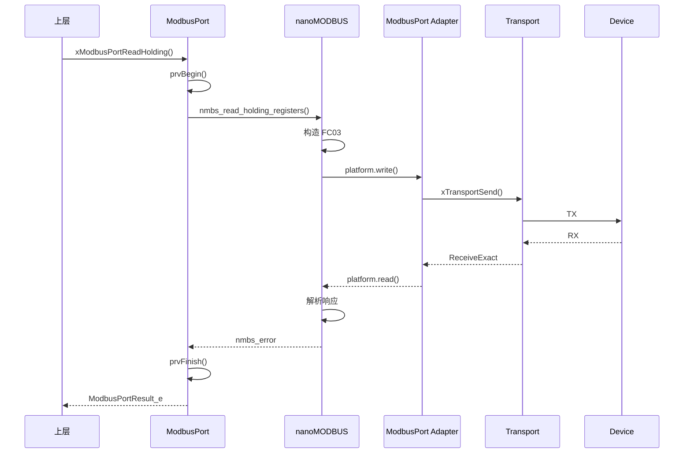

------

# 第五主干：`prvRead / prvWrite / prvFlush`

这三个函数是 ModbusPort 最重要的 Adapter。

# 21. `prvRead()`：nanoMODBUS → Transport Receive

nanoMODBUS 要求的接口：

```text
read(buffer, count, timeout, arg)
```

Transport 提供：

```text
xTransportReceiveExact(
    channel,
    buffer,
    count,
    &received,
    timeout)
```

于是：

```c
prvRead()
```

负责把两个世界接起来。

------

# 22. `prvRead()` 完整路径

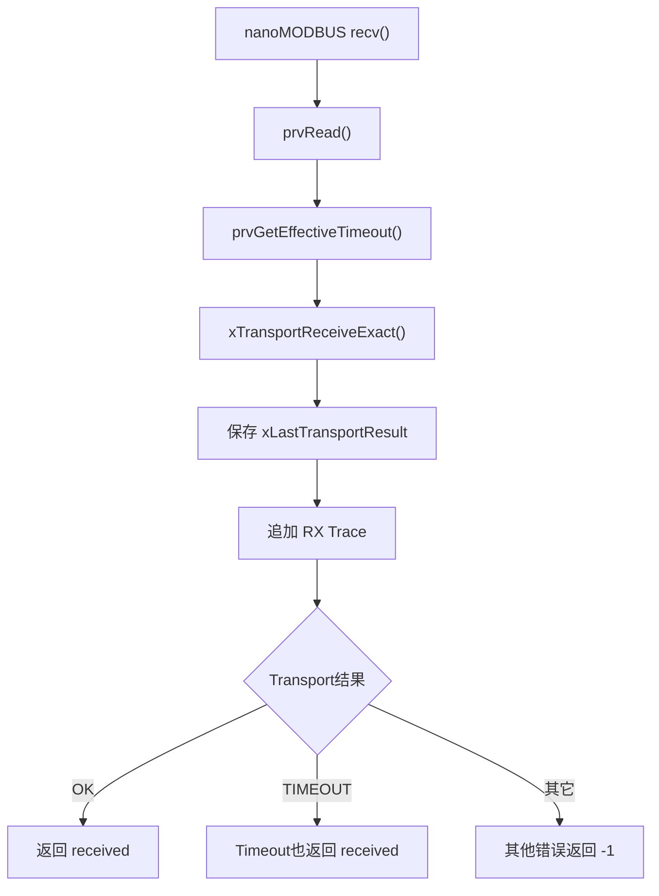

源码明确如此实现。

------

# 23. 为什么 Timeout 不能直接返回 `-1`

这个设计非常漂亮。

Transport：

```text
请求 10 bytes
实际收到 4 bytes
然后超时
```

返回：

```text
TRANSPORT_RESULT_TIMEOUT
received = 4
```

`prvRead()` 不返回：

```text
-1
```

而返回：

```text
4
```

nanoMODBUS 的 contract 是：

```text
ret == count
→ Success

0 <= ret < count
→ Timeout

ret < 0
→ Transport Error
```

因此：

```text
Transport TIMEOUT + partial bytes
       ↓
prvRead返回实际数量
       ↓
nanoMODBUS识别为 TIMEOUT
```

它成功保存了：

> **“超时”和“真正底层IO失败”之间的区别。**

------

# 24. `prvWrite()`：nanoMODBUS → Transport Send

发送路径：

```text
nano send()
      ↓
platform.write()
      ↓
prvWrite()
      ↓
有效剩余Timeout
      ↓
Trace TX
      ↓
xTransportSend()
      ↓
TransportResult
      ↓
返回 count / 0 / -1
```

源码中成功时返回完整 `usCount`；Transport timeout 返回 0；其他错误返回 `-1`。

------

# 25. 为什么 `prvWrite()` 发送前检查 `xLastTransportResult`

源码：

```c
if (pxPort->xLastTransportResult != TRANSPORT_RESULT_OK) {
    return -1;
}
```

意思是：

> 如果这一笔事务前面的 Transport 阶段已经失败，就不要继续把后续发送动作当成正常操作。

这是一种事务内故障传播。

------

# 26. `prvFlush()` 为什么只对 RTU 做

代码：

```text
RTU
→ TRANSPORT_CTRL_RX_FLUSH

TCP
→ return
```


原因不是说 TCP 永远不需要连接管理，而是：

> **这个 callback 的工程用途是为 RTU 新请求前清理串口残留字节。**

TCP 的 framing 与连接接收缓存由 TCP/Transport 的另一套机制处理。

------

# 27. 所以三个 Adapter 分别是什么

```text
prvRead
=
读字节适配器

prvWrite
=
写字节适配器

prvFlush
=
RTU输入缓存控制适配器
```

它们完全不理解：

```text
FC03
Register 40001
Coffee machine
```

这是非常好的边界。

------

# 第六主干：Deadline —— ModbusPort 比 nanoMODBUS 多出来的核心能力

# 28. Timeout 和 Deadline 不是一回事

这是 ModbusPort 非常值得学习的设计。

假设调用：

```c
xModbusPortReadHolding(..., 1000);
```

意思应该是：

> **整笔事务最多允许 1000 ms。**

而不能是：

```text
发数据最多1000ms
+
等Header最多1000ms
+
等Payload最多1000ms
+
等CRC最多1000ms
```

否则所谓：

```text
timeout = 1000ms
```

最后可能跑数秒。

------

# 29. ModbusPort 建立了总预算

`prvBegin()`：

```c
xOperationStart = xTaskGetTickCount();
xOperationBudget = prvMsToTicks(ulTimeoutMs);
ucOperationActive = 1;
```


因此事务有：

```text
Start
+
Budget
=
Deadline
```

------

# 30. 每次 read/write 都重新算“还剩多少”

核心两个函数：

```text
prvGetRemainingMs
prvGetEffectiveTimeout
```

逻辑：

```text
总 Budget
  -
已经过去的 Tick
  =
Remaining
```

然后：

```text
Effective Timeout
=
min(
    nanoMODBUS 当前阶段请求时间,
    整笔事务剩余时间
)
```

源码中如果 nano 请求的是负数 timeout，则直接使用事务剩余时间；否则取 requested 和 remaining 的较小值。

------

# 31. Deadline 图


每个阶段都不能突破总 deadline。

这比简单阶段 timeout 高一个架构层次。

------

# 32. 这是可以迁移到大量嵌入式代码中的思想

以后你写：

```text
I2C Transaction
MQTT Request
HTTP
OTA Download
机械执行流程
设备初始化
```

都可以思考：

```text
“我要一个阶段timeout，
还是整件事情deadline？”
```

这就是为什么 ModbusPort 比单纯包装 API 更有学习价值。

------

# 33. 一个非常值得注意的实现细节：RTU Silence 不在事务 Budget 里面

源码顺序：

```c
prvWaitFrameSilence(pxPort);

pxPort->xOperationStart = xTaskGetTickCount();
pxPort->xOperationBudget = ...
```

也就是：

```text
先等待帧间静默
        ↓
然后才开始计事务 timeout
```


因此：

> 公开 API 的 `ulTimeoutMs` 是 nanoMODBUS/Transport 事务预算，但实际函数墙钟耗时还可能额外包含前面的 RTU 帧间静默。

这不是猜测，是当前源码顺序直接决定的。

------

# 第七主干：为什么 ModbusPort 自己处理 RTU 帧间静默

# 34. `prvWaitFrameSilence()`

这个函数只对：

```text
MODBUS_PORT_TRANSPORT_RTU
```

生效。

流程：

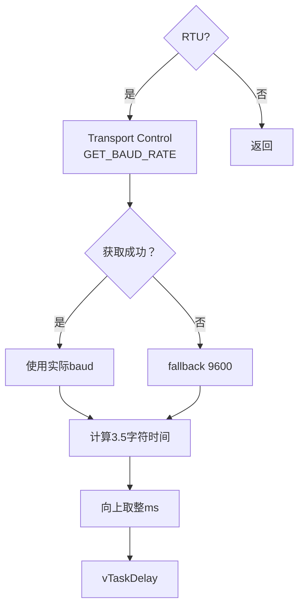

------

# 35. 为什么它向 Transport 问 Baud Rate

ModbusPort 不应该知道：

```text
USART1
huart3
HAL UART寄存器
```

所以它不能：

```c
huart->Init.BaudRate
```

它通过：

```c
xTransportControl(
    channel,
    TRANSPORT_CTRL_GET_BAUD_RATE,
    &baud);
```

取得波特率。

这体现：

> **上层通过抽象能力询问下层，而不是穿透抽象层偷看底层结构。**

------

# 36. 3.5 字符是怎么算的

当前代码假定：

```text
8N1
=
1 start
+ 8 data
+ 1 stop
=
10 bits / character
```

所以：

```text
3.5 chars
=
35 bits
```

时间：

```text
35 / baud 秒
```

换成微秒：

```text
35,000,000 / baud
```

源码就是这样计算，再向上取整到毫秒等待。获取波特率失败时使用 9600 作为保守 fallback。

------

# 第八主干：Error Translation Boundary

这是 ModbusPort 第二个非常漂亮的部分。

# 37. 为什么不能让上层直接看到 `nmbs_error`

nanoMODBUS 返回：

```text
NMBS_ERROR_TRANSPORT
NMBS_ERROR_TIMEOUT
NMBS_ERROR_CRC
NMBS_EXCEPTION_ILLEGAL_DATA_ADDRESS
...
```

Transport 又有：

```text
TRANSPORT_RESULT_BUSY
TRANSPORT_RESULT_NOT_OPEN
TRANSPORT_RESULT_NOT_READY
...
```

如果 DeviceLibrary 全部认识这些东西：

```text
DeviceLibrary
   ↓
知道nano错误
   ↓
知道Transport错误
   ↓
知道LwIP/HAL错误
```

整个工程就耦死了。

------

# 38. 所以 ModbusPort 定义自己的稳定错误域

```text
OK
INVALID_ARG
NOT_READY
BUSY
TIMEOUT
TRANSPORT
PROTOCOL
EXCEPTION
NOT_SUPPORTED
CANCELED
```

这是 `modbus_port.h` 对上暴露的正式结果体系。

------

# 39. Error Mapping 主图

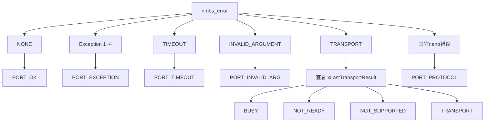

`prvMapError()` 就实现了这套映射策略。

------

# 40. 为什么 `NMBS_ERROR_TRANSPORT` 还要继续看 TransportResult

因为 nanoMODBUS 只能知道：

```text
底层失败
```

但是项目知道更具体的：

```text
BUSY
NOT_OPEN
NOT_READY
NOT_SUPPORTED
TIMEOUT
IO_ERROR
...
```

所以：

```text
nanoMODBUS
负责粗粒度协议抽象

ModbusPort
负责恢复工程语义
```

这是非常典型的：

> **Error Translation Boundary。**

------

# 41. Exception 为什么单独存在

假设收到：

```text
83 02
```

这意味着：

```text
Transport成功
帧完整
CRC正确
Unit正确
FC逻辑正确

但是设备回答：
Illegal Data Address
```

所以它不是：

```text
TRANSPORT
PROTOCOL
```

而是：

```text
MODBUS_PORT_RESULT_EXCEPTION
```

这非常重要。

------

# 42. 什么被认为是“链路故障”

源码还专门提供：

```c
ucModbusPortResultIsLinkFailure()
```

当前策略：

```text
TIMEOUT
TRANSPORT
PROTOCOL
→ Link Failure = true
```

其他结果：

```text
→ false
```

源码明确这样分类。

所以：

```text
EXCEPTION
```

不会自动被认为：

```text
连接坏了
```

这是正确的工程区分。

------

# 第九主干：Trace —— 让通信过程可观察

# 43. 为什么 ModbusPort 要有 Trace

协议问题经常不是：

```text
“函数返回-6”
```

就能调出来的。

实际调试经常需要知道：

```text
到底发了什么？
到底收了什么？
收到几字节？
完整帧多长？
是不是发成功了？
是不是收到有效响应？
```

因此定义：

```c
ModbusPortTrace_t
```

包含：

```text
Last TX
Last RX
TxSucceeded
RxSucceeded
```

结构体定义就是如此。

------

# 44. `ModbusPortFrame_t`

每一个 TX / RX Frame 保存：

```text
Sequence
总观察长度
实际保存长度
最多260字节Data
```

为什么同时有：

```text
usLength
usCapturedLength
```

？

因为：

```text
实际流过的数据
可能比诊断buffer大
```

所以：

```text
usLength
=
真正看到了多少

usCapturedLength
=
真正保存了多少
```

------

# 45. Trace 生命周期

每笔事务：

```text
prvBegin
   ↓
prvResetTrace
   ↓
Sequence++
   ↓
TX/RX清零
```

`prvResetTrace()` 会清空 trace，并给 TX/RX 写入同一个递增 sequence。

所以：

```text
TX sequence = 17
RX sequence = 17
```

就知道它们属于同一笔事务。

------

# 46. 数据是怎么追加进去的

`prvRead()`：

```text
实际收到N字节
      ↓
prvAppendFrame(RX)
```

`prvWrite()`：

```text
准备发送N字节
      ↓
prvAppendFrame(TX)
```

注意 TX 是**发送前**记录的：

```text
append trace
      ↓
xTransportSend
```

因此：

> `xLastTx` 保存的是“这笔事务打算/尝试发出的字节”，并不单独证明这些字节已经物理发送成功。

真正成功还要看：

```c
ucTxSucceeded
```

Transport 返回 OK 后才会置 1。

这是诊断语义里非常重要的区别。

------

# 47. RX Trace 又不同

`prvRead()` 使用：

```text
usReceived
```

追加。

所以即使：

```text
Transport Timeout
```

但之前已经收到：

```text
4 bytes
```

Trace 仍然可以保留这 4 bytes。

这对：

```text
半包
超时
粘包
从机只发了一部分
```

的诊断非常有价值。

------

# 第十主干：Fault —— 结果和诊断细节分离

# 48. 为什么已经有 Result，还需要 Fault

正常业务代码需要：

```c
if (xResult != MODBUS_PORT_RESULT_OK)
```

就够了。

但调试可能需要：

```text
Port result是什么？
Transport result是什么？
nano错误是什么？
Exception Code是什么？
HAL/LwIP错误是什么？
```

如果所有 API 都返回一个巨大 struct，使用非常麻烦。

所以分成：

```text
主返回值
=
ModbusPortResult_e

旁路诊断
=
ModbusPortFault_t
```

------

# 49. Fault 保存五层信息

```c
typedef struct {
    ModbusPortResult_e xResult;
    TransportResult_e xTransportResult;
    int32_t lProtocolCode;
    int32_t lNativeError;
    uint8_t ucExceptionCode;
} ModbusPortFault_t;
```


可以理解成：

```text
xResult
=
“项目怎么看这个错误”

xTransportResult
=
“字节层发生了什么”

lProtocolCode
=
“nanoMODBUS原始结果是什么”

lNativeError
=
“HAL / LwIP / Socket原始错误是什么”

ucExceptionCode
=
“对端返回哪个Modbus Exception”
```

------

# 50. Fault 数据从哪里来

`prvUpdateFaultDetail()`：

```text
ModbusPort Result
      ↓
xResult

nanoMODBUS result
      ↓
lProtocolCode

Exception?
      ↓
ucExceptionCode

Transport失败?
      ↓
xTransportGetStatus()
      ↓
native HAL/LwIP error
```

源码确实会在最后 Transport 结果非 OK 时读取 Transport status，并把 backend native error 保留下来。

于是：

```text
业务看到简单错误
工程师仍然可以向下追到底层
```

这是非常成熟的诊断边界设计。

------

# 第十一主干：Server 模式

虽然 ModbusPort 最常见的是 Client Wrapper，但当前源码也支持 Server。

# 51. Server 初始化

```text
xModbusPortServerInit
      ↓
prvInit
      ↓
创建 platform bridge
      ↓
nmbs_server_create
      ↓
保存Role = SERVER
      ↓
Initialized
```

源码中 Client 和 Server 共用 `prvInit()`，区别只在最后调用不同的 nanoMODBUS create。

这是：

> **复用基础设施，只分裂角色逻辑。**

------

# 52. Server Poll 主流程

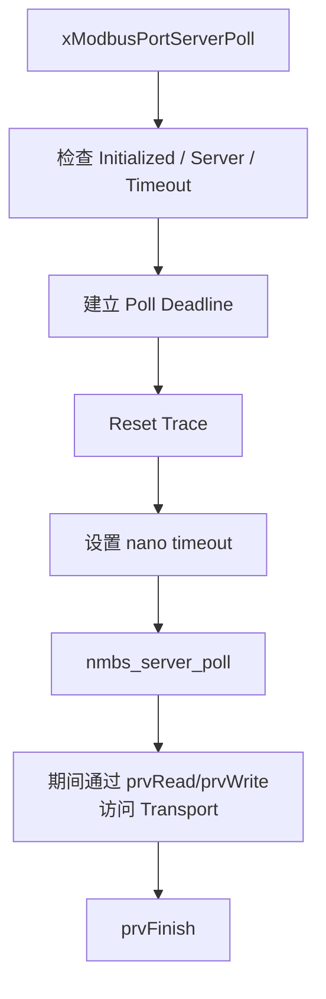

源码在每次 Poll 时同样建立 operation budget，再调用 nanoMODBUS Server poll，最终通过 `prvFinish()` 收束结果。

所以：

> Client 和 Server 共用同一套 IO / Deadline / Trace / Fault 基础设施。

这是很好的复用。

------

# 第十二主干：Public API 为什么还要再包一次 nano API

# 53. Public API 不是简单转发

表面：

```text
xModbusPortReadHolding
        ↓
nmbs_read_holding_registers
```

好像只是换个名字。

实际前后多了：

```text
参数检查
Deadline
Unit ID配置
RTU silence
Trace reset
Transport state
Error Mapping
Fault
```

所以：

```text
Wrapper
≠
无意义转发
```

它在提供：

> **工程契约。**

------

# 54. Client API 知识树

```text
ModbusPort Client
│
├─ Bit
│  ├─ xModbusPortReadCoils           FC01
│  ├─ xModbusPortReadDiscreteInputs  FC02
│  └─ xModbusPortWriteCoils          FC15
│
├─ Register
│  ├─ xModbusPortReadHolding         FC03
│  ├─ xModbusPortReadInputRegisters  FC04
│  ├─ xModbusPortWriteCoil           FC05
│  ├─ xModbusPortWriteRegister       FC06
│  └─ xModbusPortWriteRegisters      FC16
│
├─ File Record
│  ├─ xModbusPortReadFileRecord      FC20
│  └─ xModbusPortWriteFileRecord     FC21
│
├─ Composite
│  └─ xModbusPortReadWriteRegisters  FC23
│
├─ Device Identification
│  ├─ Basic
│  ├─ Regular
│  ├─ Extended
│  └─ Single
│
└─ Extension
   └─ xModbusPortRawRequest
```

这些公共接口都定义在 `modbus_port.h` 中。

------

# 55. RawRequest 为什么值得单独理解

```c
xModbusPortRawRequest(...)
```

是一个很好的“逃生口”。

它让调用者自己负责：

```text
Function Code
PDU Payload
字节序
功能码特定验证
```

头文件明确警告 caller 自己负责 byte order 和 function-specific validation。

但 ModbusPort 仍然替你保留：

```text
prvBegin
Deadline
RTU/TCP framing
CRC / MBAP
Transport
Trace
Fault
Error Mapping
prvFinish
```

也就是说：

> **扩展协议能力，但不绕开基础设施。**

这是很漂亮的扩展设计。

------

# 56. RawRequest 完整结构

```text
xModbusPortRawRequest
        ↓
prvBegin
        ↓
nmbs_send_raw_pdu
        ↓
不是RTU Broadcast？
        ↓
nmbs_receive_raw_pdu_response
        ↓
prvFinish
```

源码就是这样实现的。

------

# 第十三主干：配置层

# 57. `modbus_port_config.h`

当前配置只有两个真正核心值：

```c
#define MODBUS_PORT_TRACE_LENGTH 260U
#define MODBUS_PORT_TIMEOUT_MAX_MS 60000U
```

并要求：

```c
NANOMODBUS_CFG_CLIENT_ENABLED == 1
```

否则编译直接报错。

------

# 58. 为什么 Timeout 设置上限

Public API 最大：

```text
60000 ms
```

这种做法属于：

> **在模块边界主动限制极端输入。**

避免：

```text
错误参数
极端等待
毫秒→Tick换算失控
```

一路传到更底层。

------

# 59. 为什么 Trace 长度也是 260

因为目标就是保存完整 Modbus ADU 级诊断数据。

它也与 nanoMODBUS 的：

```text
msg.buf[260]
```

保持一致。

------

# 第十四主干：并发与所有权

# 60. ModbusPort 本身不是多事务并发对象

头文件已经明确警告：

> One owner may execute a transaction on this object at a time.

原因现在非常容易看出来。

一次事务会修改：

```text
xNmbs.msg
aucBitfield
xOperationStart
xOperationBudget
xLastTransportResult
pxTrace
xLastFault
```

如果两个 Task 同时：

```text
Task A
→ ReadHolding

Task B
→ WriteRegister
```

共享同一个 `ModbusPort_t`，两者就会争用同一个：

```text
nano context
buffer
deadline
trace
scratch
```

------

# 61. `ucOperationActive` 不是 mutex

虽然有：

```c
ucOperationActive
```

但当前 `prvBegin()` 并没有：

```c
if (ucOperationActive)
    return BUSY;
```

它主要被：

```text
prvGetRemainingMs
```

用于判断 deadline 是否有效。

所以当前设计本质仍然是：

> **调用者负责串行化同一个 ModbusPort 实例。**

而不是 ModbusPort 内部加锁。

这是非常重要的使用约束。

------

# 62. 为什么内部不一定应该直接加 mutex

因为 ModbusPort 不知道项目想采用：

```text
专用Modbus Task + Queue

还是

外部Mutex

还是

Single owner workflow

还是

每个连接独立Port
```

如果底层库自己强制 mutex：

```text
调度策略
```

就开始侵入协议适配层。

所以当前选择是：

```text
明确 single-owner contract
```

把调度策略留给更高层。

------

# 第十五主干：从设计模式角度重新看 ModbusPort

# 63. Adapter Pattern

最直接：

```text
nanoMODBUS interface
     │
prvRead / prvWrite / prvFlush
     │
Transport interface
```

------

# 64. Facade Pattern

上层只看到：

```text
xModbusPortReadHolding
xModbusPortWriteRegister
...
```

而不用知道 nano 内部：

```text
bitfield
platform_conf
nmbs_error
destination address setup
```

------

# 65. Dependency Inversion

ModbusPort 不直接依赖：

```text
HAL_UART
LwIP socket
Netconn
```

而依赖：

```text
TransportChannel_t
xTransportSend
xTransportReceiveExact
xTransportControl
```

所以以后 Transport backend 换掉：

```text
ModbusPort不需要理解新硬件。
```

------

# 66. Anti-Corruption Layer

这是很适合形容 Error Mapping 的一个概念。

nanoMODBUS 有自己的语言：

```text
NMBS_ERROR_...
```

Transport 有自己的语言：

```text
TRANSPORT_RESULT_...
```

项目有自己的语言：

```text
MODBUS_PORT_RESULT_...
```

ModbusPort 阻止第三方错误域一路渗透上层。

------

# 67. Transaction Script / Template

每个 Client API 都遵循：

```text
Validate
   ↓
Begin
   ↓
nano operation
   ↓
Finish
```

这实际上已经是一种很明显的事务模板。

------

# 68. Observability Boundary

```text
Trace
Fault
Native Error
Protocol Code
```

全部集中在这一层。

协议库不需要懂项目日志系统，上层也不必直接知道 HAL error。

------

# 69. Data Adapter

例如：

```text
bool[]
 ↕
nmbs_bitfield
```

说明 Adapter 不只是函数签名转换，也包括数据表示转换。

------

# 70. 函数知识树

现在再看整个 `.c`，就可以用功能而不是源码顺序分类。

```text
ModbusPort
│
├─ IO Adapter
│  ├─ prvRead
│  ├─ prvWrite
│  └─ prvFlush
│
├─ Initialization
│  ├─ prvInit
│  ├─ xModbusPortClientInit
│  └─ xModbusPortServerInit
│
├─ Transaction
│  ├─ prvBegin
│  └─ prvFinish
│
├─ Time
│  ├─ prvWaitFrameSilence
│  ├─ prvGetEffectiveTimeout
│  ├─ prvGetRemainingMs
│  ├─ prvMsToTicks
│  └─ prvTicksToMsCeil
│
├─ Error
│  ├─ prvMapError
│  ├─ prvUpdateFaultDetail
│  ├─ vModbusPortGetLastFault
│  └─ ucModbusPortResultIsLinkFailure
│
├─ Trace
│  ├─ vModbusPortSetTrace
│  ├─ prvResetTrace
│  └─ prvAppendFrame
│
├─ Server
│  └─ xModbusPortServerPoll
│
└─ Client API
   ├─ Read...
   ├─ Write...
   ├─ Device Identification...
   └─ RawRequest
```

------

# 71. 函数级速查表

| 函数                              | 分类        | 作用                                 |
| --------------------------------- | ----------- | ------------------------------------ |
| `prvRead`                         | Adapter     | nano read → `xTransportReceiveExact` |
| `prvWrite`                        | Adapter     | nano write → `xTransportSend`        |
| `prvFlush`                        | Adapter     | nano flush → RTU Transport RX flush  |
| `prvInit`                         | Init        | 初始化 Port + 构造 nano platform     |
| `prvBegin`                        | Transaction | 开始 Client 事务                     |
| `prvFinish`                       | Transaction | 完成事务、错误映射、诊断             |
| `prvMapError`                     | Error       | `nmbs_error → ModbusPortResult`      |
| `prvGetEffectiveTimeout`          | Time        | Stage timeout 与剩余 budget 取较小值 |
| `prvGetRemainingMs`               | Time        | 计算事务剩余时间                     |
| `prvMsToTicks`                    | Time        | ms → FreeRTOS Tick                   |
| `prvTicksToMsCeil`                | Time        | Tick → ms 向上取整                   |
| `prvWaitFrameSilence`             | RTU         | 等待 3.5 char 间隔                   |
| `prvResetTrace`                   | Trace       | 新事务清空 Trace + sequence++        |
| `prvAppendFrame`                  | Trace       | 追加有限长度帧诊断                   |
| `prvUpdateFaultDetail`            | Fault       | 保存 Port/nano/Transport/native错误  |
| `xModbusPortClientInit`           | Public      | 创建 Client                          |
| `xModbusPortServerInit`           | Public      | 创建 Server                          |
| `xModbusPortServerPoll`           | Public      | 执行 Server Poll                     |
| `vModbusPortSetTrace`             | Public      | Attach/Detach Trace                  |
| `vModbusPortGetLastFault`         | Public      | 获取最近详细故障                     |
| `ucModbusPortResultIsLinkFailure` | Public      | 判断是否属于链路类错误               |

------

# 72. 最终总脑图

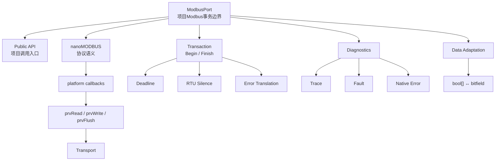

------

# 73. 一句话概括 ModbusPort

现在可以给它一个比较准确的定义：

> **ModbusPort 以 `ModbusPort_t` 为事务上下文，将 nanoMODBUS 作为内嵌协议引擎，通过 `prvRead/prvWrite/prvFlush` 把 nanoMODBUS 的 platform 接口适配到 Transport；同时统一负责事务 Deadline、RTU 帧间静默、项目级错误映射、TX/RX Trace、Native Fault 诊断以及部分数据表示转换，从而把第三方协议库和项目底层 Transport 隔离开。**

再压缩成架构语言就是：

```text
ModbusPort
=
Protocol Adapter
+
Transaction Controller
+
Error Boundary
+
Diagnostic Boundary
+
Project Facade
```

------

# 74. 到这里，前两棵树已经能连接起来

我们现在已经完成：

```text
nanoMODBUS
│
│ 负责：
│ Modbus协议语义
│ RTU/TCP Frame
│ FC处理
│ CRC/MBAP
│ Exception
│
▼
ModbusPort
│
│ 负责：
│ 事务管理
│ 平台适配
│ Deadline
│ Error Mapping
│ Trace/Fault
│
▼
Transport
│
│ 下一章：
│ Channel
│ Ops函数指针表
│ Registry
│ ReceiveExact
│ UART Backend
│ TCP Backend
│ ISR / RTOS
│
▼
UART / RS485 / LwIP
```

下一份 `Transport` 会比前两份更有意思，因为你上传的当前源码已经不仅仅是一个抽象接口：它包含了 **通用 `TransportChannel + Ops` 多态层、通道 Registry、统一 Status/Fault、UART+FreeRTOS/ISR 后端，以及 LwIP Netconn/Socket TCP 后端**。例如 `transport.h` 已经明确把后端无关的生命周期、受限 IO、诊断、Control 和可选 ISR 事件转发作为这一层的职责。

这意味着下一张树会非常适合讲你之前想学习的 **“C 语言函数指针表到底怎样真正实现接口/多态，以及为什么后端 Context 和 Channel 要分开”**。