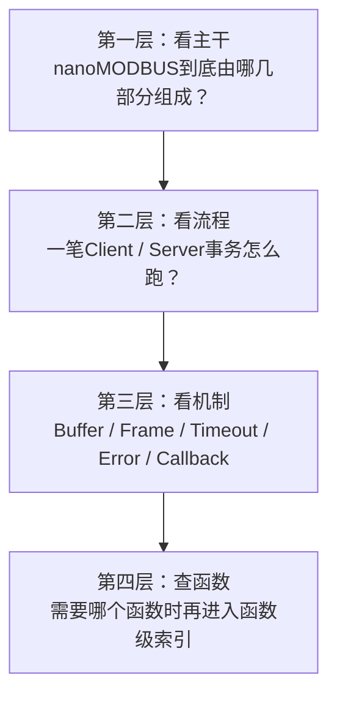
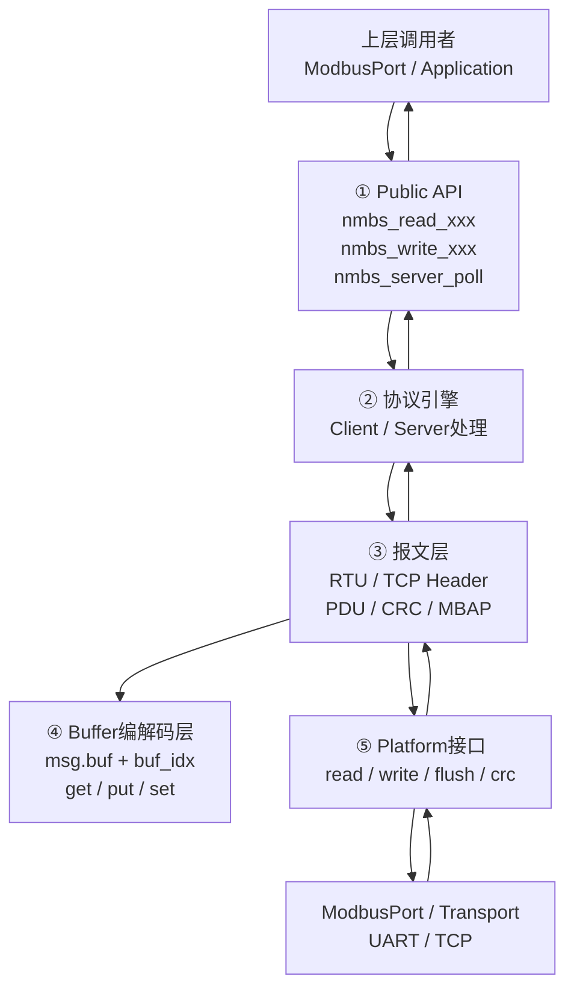
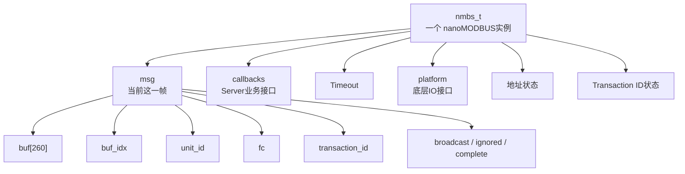
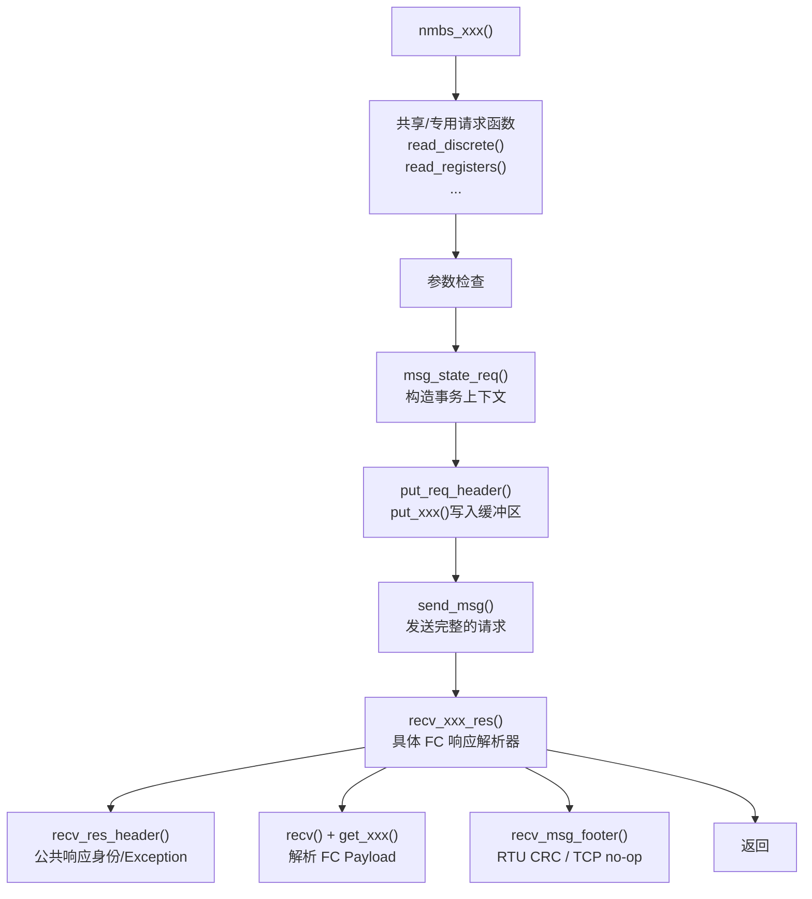
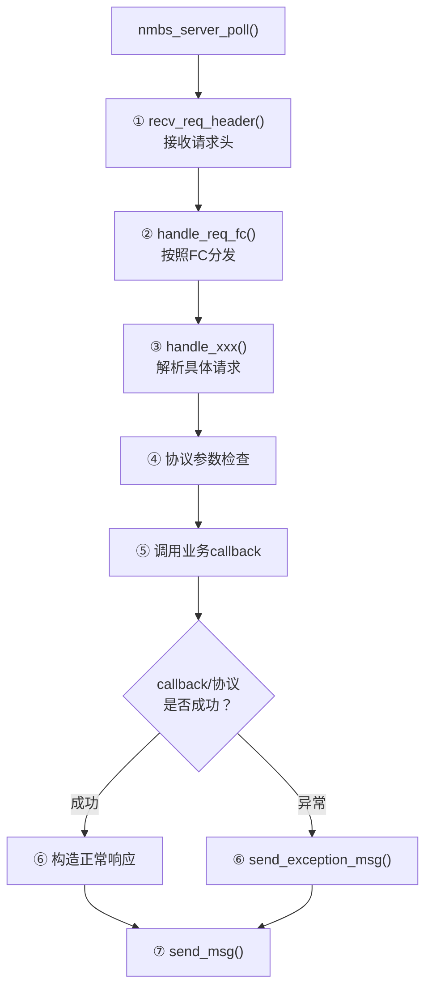
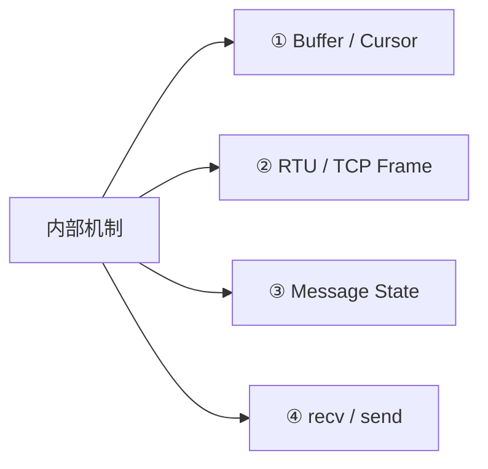
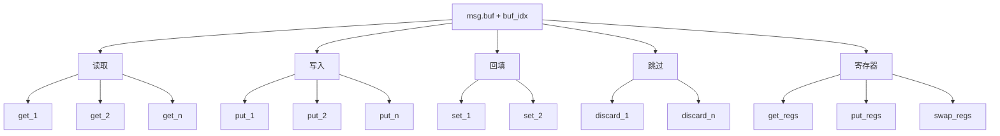
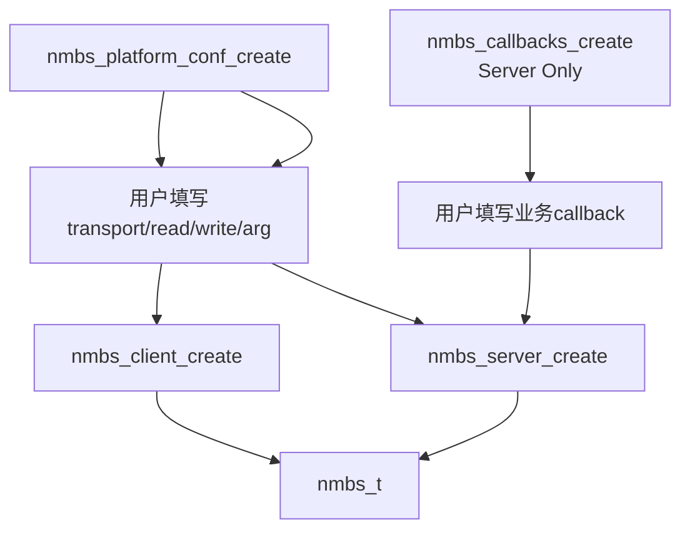
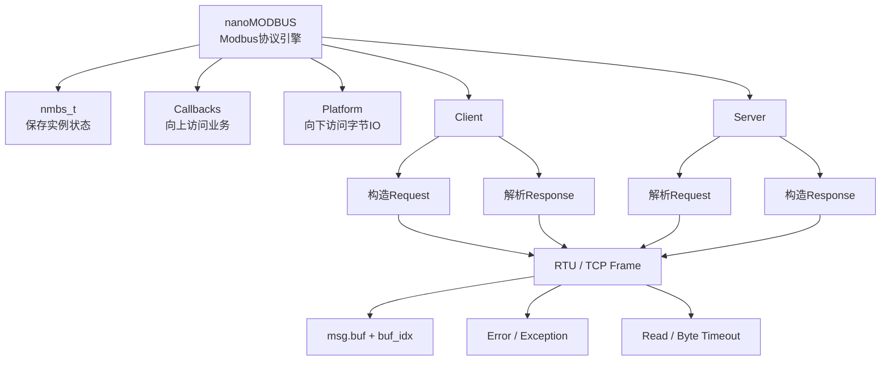

对，这个调整很关键。上一版更像“**把源码分类整理好了**”，但还不是最适合人学习的知识地图。人的阅读通常不是一上来就看 `nmbs_error → bitfield → struct → API`，而是先回答：

> **这东西到底是什么？我要看哪几部分？一笔 Modbus 通信怎么跑起来？然后我才需要知道这些结构体和函数为什么存在。**

所以这一版我把结构彻底换成 **“主干 → 分支 → 叶子”**：

```text
先建立整体模型
        ↓
知道 nanoMODBUS 有哪几根主干
        ↓
沿 Client / Server 两条主流程走一遍
        ↓
再拆 Buffer / Frame / Platform / Callback / Error / Timeout
        ↓
最后进入函数级索引
```

这样以后 `ModbusPort` 和 `Transport` 也可以完全沿用这个模板。

------

# nanoMODBUS 架构知识图谱

> 基于当前工程中的 `nanomodbus.h`、`nanomodbus.c`、`nanomodbus_config.h`

------

# 0. 这份文档应该怎么读

不要从 `nanomodbus.c` 第一行开始往下读。

nanoMODBUS 源码有两千多行，如果按照源码顺序阅读，很容易陷入：

```text
get_1()
put_1()
get_2()
recv()
msg_state_reset()
recv_msg_header()
...
```

每个函数都懂，但过几天以后仍然不知道：

> **它们为什么存在，它们之间是什么关系。**

正确的阅读方式应该分成三层。



因此这份文档不按照 `.h/.c` 的源码顺序组织，而按照**人的理解顺序**组织。

------

# 1. 30 秒理解 nanoMODBUS

第一次打开本文，只需要先理解下面这张图。



看到这里，只需要先记住一句话：

> **nanoMODBUS 是一个协议引擎：上层告诉它“我要执行 FC03”，它负责把这个意图变成 Modbus 字节流；底层给它字节流，它再负责把字节流还原成协议结果。**

它自己并不负责 UART、DMA、socket。

------

# 2. 学习主干：整个 nanoMODBUS 只需要先抓住 6 件事

后面所有章节都围绕下面六根主干展开。


推荐阅读顺序就是：

```text
① 定位
   ↓
② 核心对象
   ↓
③ 输入输出边界
   ↓
④ Client / Server主流程
   ↓
⑤ 内部协议机制
   ↓
⑥ Error / Timeout
   ↓
最后再查全部函数
```

如果只是想快速理解架构，读到第 6 部分左右就已经够了。

如果准备修改 nanoMODBUS 或做协议问题排查，再继续深入后面的枝叶。

------

# 第一主干：nanoMODBUS 到底是谁

# 3. nanoMODBUS 的职责边界

nanoMODBUS 的目标在头文件中就写得很明确：它是一个面向微控制器、实现 Modbus RTU/TCP 的紧凑 C 库。

它主要负责四件事情：

```text
业务请求
   ↓
Modbus协议语义
   ↓
PDU / ADU编码
   ↓
RTU / TCP帧
```

反向：

```text
收到字节
   ↓
RTU / TCP帧校验
   ↓
PDU解析
   ↓
功能码语义
   ↓
结果
```

------

## 3.1 nanoMODBUS 做什么

它知道：

```text
FC01是什么
FC03是什么
FC16怎么编码
寄存器是16位大端
RTU CRC怎么放
TCP MBAP是什么
异常响应是什么
Quantity是否合法
Byte Count是否正确
```

------

## 3.2 nanoMODBUS 不知道什么

它不知道：

```text
UART1还是UART3
DMA还是轮询
RS485 DE脚在哪里
FreeRTOS StreamBuffer
LwIP socket
设备A的40001代表什么
咖啡机当前状态是什么
```

这些不是协议层职责。

------

## 3.3 三层系统中的位置

等我们后面完成另外两张图以后，三层关系最终会变成：

```text
┌───────────────────────────┐
│ nanoMODBUS                │
│                           │
│ “Modbus协议应该怎么说话” │
└─────────────┬─────────────┘
              │
              │ read / write
              ▼
┌───────────────────────────┐
│ ModbusPort                │
│                           │
│ “怎么接进这个工程”       │
└─────────────┬─────────────┘
              │
              │ Transport API
              ▼
┌───────────────────────────┐
│ Transport                 │
│                           │
│ “字节怎么真正移动”       │
└───────────────────────────┘
```

所以 nanoMODBUS 是：

> **协议语义层。**

------

# 第二主干：整个库围绕哪个核心对象工作

# 4. `nmbs_t`：理解 nanoMODBUS 最重要的结构体

如果只能理解一个结构体，就理解：

```c
nmbs_t
```

因为 nanoMODBUS 的绝大多数函数最终都围绕它工作。

头文件明确把它描述为 client/server instance，并说明这些字段应视为库内部私有成员。

整体结构：



它可以理解成 C++：

```cpp
class ModbusInstance
{
private:
    Message msg;
    Callbacks callbacks;
    Timeout timeout;
    Platform platform;
    Address address;
    TransactionId tid;
};
```

C 没有 class，所以作者用：

```c
struct nmbs_t
```

保存全部实例状态。

------

# 5. `nmbs_t` 中要先区分两种状态

这是读这个结构时非常重要的一步。

一类是：

## 长期实例状态

例如：

```text
platform
callbacks
byte_timeout_ms
read_timeout_ms
address_rtu
dest_address_rtu
current_tid
```

它们不会随着解析一个字段就不断变化。

------

另一类是：

## 当前报文状态

全部集中在：

```c
nmbs->msg
```

例如：

```text
buf
buf_idx
unit_id
fc
transaction_id
broadcast
ignored
complete
```

所以：

```text
nmbs_t
│
├─ 实例长期状态
│
└─ msg
   └─ 当前这一帧的临时状态
```

这个区分以后理解：

```c
msg_state_reset()
msg_state_req()
```

会非常容易。

------

# 6. nanoMODBUS 的“心脏”：`msg.buf + buf_idx`

整个库真正的数据中心其实不是某个复杂对象，而是：

```c
uint8_t buf[260];
uint16_t buf_idx;
```

可以理解为：

```text
buf
↓
┌────┬────┬────┬────┬────┬────┬────┐
│ 01 │ 03 │ 00 │ 64 │ 00 │ 02 │ ...│
└────┴────┴────┴────┴────┴────┴────┘
                 ↑
              buf_idx
```

几乎所有报文构造与解析都围绕这个游标进行。

所以后面看到：

```c
get_1()
get_2()
put_1()
put_2()
```

不要把它们看成四个零散函数。

它们其实共同构成一个：

> **二进制流解析器 / Serializer + Parser。**

------

# 第三主干：nanoMODBUS 怎么连接外面的世界

nanoMODBUS 有两个完全不同方向的接口。


理解这两个结构体，基本就理解了 nanoMODBUS 的架构思想。

------

# 7. 向下接口：`nmbs_platform_conf`

它回答一个问题：

> **nanoMODBUS 怎么获得字节？又怎么把字节发出去？**

核心成员：

```text
transport
read()
write()
crc_calc()
flush()
arg
```

源码中的 platform 结构确实把这些能力作为函数指针保存，并额外携带 `void *arg` 上下文。

------

## 7.1 这是 C 版接口

可以把它理解成：

```text
             nanoMODBUS
                  │
        ┌─────────┴─────────┐
        │                   │
      read()              write()
        │                   │
        └─────────┬─────────┘
                  │
             由用户实现
```

nanoMODBUS 不知道真正执行者是谁。

这就是：

> **依赖倒置。**

------

## 7.2 `void *arg` 是什么

它解决：

> “同一个 read() 怎么知道当前是哪一个实例？”

例如：

```c
platform.read = prvRead;
platform.arg  = pxPort;
```

调用：

```c
read(..., arg);
```

进入：

```c
ModbusPort_t *pxPort = (ModbusPort_t *)arg;
```

所以：

```text
函数指针
+
void *arg
=
C语言版“成员函数 + this”
```

------

# 8. 向上接口：`nmbs_callbacks`

这个结构只在 Server 角色下特别重要。

它回答：

> **收到 FC03 以后，真正的寄存器值去哪拿？**

nanoMODBUS 不自己保存业务寄存器表。

它只：

```text
收到FC03
   ↓
解析地址/数量
   ↓
检查协议合法
   ↓
调用 read_holding_registers()
   ↓
业务层填数据
   ↓
nanoMODBUS组响应
```

`nmbs_callbacks` 中确实提供了读线圈、读离散输入、读/写寄存器、文件记录以及设备标识等一组 Server 回调。

------

# 9. platform 与 callbacks 千万不要混

这是整个库非常漂亮的一点。

```text
                    上层业务
                       ▲
                       │
                  callbacks
                       │
                       │
                 nanoMODBUS
                       │
                       │
                   platform
                       ▼
                  底层字节IO
```

因此：

```text
callbacks
=
“业务数据在哪里？”

platform
=
“字节怎么出去？”
```

它们分别把：

- **业务变化**
- **硬件变化**

隔离开了。

------

# 第四主干：真正理解一笔事务怎么跑

到这里暂时不要继续钻 `get_1()`。

应该先把两条主流程搞明白：

```text
Client 主流程
Server 主流程
```

所有细节函数最终都挂在这两根枝条上。

------

# 10. Client 主流程

Client 的核心模式其实非常统一：



这张图是 Client 侧最重要的主干。

以后无论看到：

```c
nmbs_read_coils()
nmbs_read_holding_registers()
nmbs_write_multiple_registers()
```

都应该先把它们放回这条流水线。

------

# 11. FC03 作为 Client 的完整调用链

FC03 是理解 nanoMODBUS 最合适的例子。

入口：

```c
nmbs_read_holding_registers()
```

完整调用关系：

```text
nmbs_read_holding_registers()
        │
        ▼
read_registers(fc = 3)
        │
        ├── 参数检查
        │
        ▼
msg_state_req()
        │
        ├── current_tid++
        ├── platform.flush()
        ├── msg_state_reset()
        ├── unit_id = dest_address
        ├── fc = 3
        └── transaction_id = current_tid
        │
        ▼
put_req_header()
        │
        ▼
put_msg_header()
        │
        ├── RTU header
        └── TCP MBAP header
        │
        ▼
put_2(address)
put_2(quantity)
        │
        ▼
send_msg()
        │
        ├── RTU → CRC
        │
        ▼
send()
        │
        ▼
platform.write()
        │
       线路
        │
        ▼
platform.read()
        ▲
        │
recv()
        ▲
        │
recv_msg_header()
        ▲
        │
recv_res_header()
        │
        ▼
recv_read_registers_res()
        │
        ├── Byte Count
        ├── get_2() × quantity
        └── recv_msg_footer()
        │
        ▼
registers_out[]
```

如果能把这条链记住，那么 nanoMODBUS 的 Client 已经理解了一半。

------

# 12. Client API 其实只是不同“模板参数”

例如：

```text
FC01 / FC02
    ↓
read_discrete()

FC03 / FC04
    ↓
read_registers()
```

作者并没有重复写：

```text
FC01完整一套
FC02完整一套
FC03完整一套
FC04完整一套
```

而是把相似协议结构提取成通用内部函数。

这是一个很重要的代码设计思想：

> **抽象协议结构，而不是只抽象语法重复。**

------

# 13. Server 主流程

Server 是另一条非常清晰的主干：



------

# 14. FC03 作为 Server 的完整调用链

```text
nmbs_server_poll()
       │
       ▼
msg_state_reset()
       │
       ▼
recv_req_header()
       │
       └── recv_msg_header()
                │
                ├── RTU: Unit + FC
                └── TCP: MBAP + FC
       │
       ▼
handle_req_fc()
       │
       ▼
case 3
       │
       ▼
handle_read_holding_registers()
       │
       ▼
handle_read_registers()
       │
       ├── recv(4)
       ├── get_2(address)
       ├── get_2(quantity)
       ├── recv_msg_footer()
       │
       ├── quantity合法？
       ├── address合法？
       │
       ▼
callbacks.read_holding_registers()
       │
       │ 业务层填 regs[]
       ▼
put_res_header()
       │
put_1(byte_count)
       │
put_2(reg0)
put_2(reg1)
...
       │
       ▼
send_msg()
       │
       ▼
platform.write()
```

这就是完整 Server 数据链。

------

# 15. Server 为什么需要 `handle_req_fc`

它是一个非常经典的 Dispatcher：

```text
FC01 → handle_read_coils
FC02 → handle_read_discrete_inputs
FC03 → handle_read_holding_registers
FC04 → handle_read_input_registers
FC05 → handle_write_single_coil
FC06 → handle_write_single_register
FC15 → handle_write_multiple_coils
FC16 → handle_write_multiple_registers
FC20 → handle_read_file_record
FC21 → handle_write_file_record
FC23 → handle_read_write_registers
FC43 → handle_read_device_identification
```

未知功能码：

```text
→ Illegal Function
```

这可以理解成：

> **Function Code Router。**

------

# 第五主干：现在才进入内部机制

前面知道：

```text
对象是谁
接口在哪
Client怎么跑
Server怎么跑
```

到这里再深入底层，就不会迷路了。

内部机制主要有四大枝叶：



------

# 16. Buffer / Cursor 子系统

这一层解决的问题非常简单：

> **怎么把 C 变量变成 Modbus 字节，又怎么把 Modbus 字节变回 C 变量？**

------

## 16.1 顺序读取

```text
get_1
get_2
get_n
get_regs
```

共同特点：

```text
从 buf_idx 开始
       ↓
取得数据
       ↓
推进 buf_idx
```

------

## 16.2 顺序写入

```text
put_1
put_2
put_n
put_regs
```

共同特点：

```text
从 buf_idx 开始
       ↓
写入数据
       ↓
推进 buf_idx
```

------

## 16.3 定点修改

```text
set_1
set_2
```

特点：

```text
直接访问固定 index
不动 buf_idx
```

适合：

> 后续回填之前未知的字段。

例如 TCP 长度。

------

## 16.4 游标操作

```text
discard_1
discard_n
```

本质：

> “我知道这些字节存在，但我不需要它们，只推进解析位置。”

------

# 17. Buffer 函数族谱



你之前逐个学习的函数，到这里终于有了“家”。

它们不是独立工具，而是：

> **nanoMODBUS 序列化系统。**

------

# 18. RTU / TCP 帧子系统

这一层解决：

> **同一个 Modbus PDU 怎么适配 RTU 和 TCP 两种外壳？**

源码中的 `recv_msg_header()` 和 `put_msg_header()` 正是 RTU/TCP 的主要分叉点；TCP 会解析 TID、Protocol ID、Length、Unit ID，而 RTU 直接处理 Unit ID 和 FC。

------

## 18.1 RTU

```text
┌─────────┬────┬───────────────┬─────────┐
│ Unit ID │ FC │     Data      │   CRC   │
└─────────┴────┴───────────────┴─────────┘
```

负责函数：

```text
put_msg_header
send_msg
recv_msg_header
recv_msg_footer
nmbs_crc_calc
```

------

## 18.2 TCP

```text
┌─────┬─────┬────────┬──────┬────┬───────────────┐
│ TID │ PID │ Length │ Unit │ FC │     Data      │
└─────┴─────┴────────┴──────┴────┴───────────────┘
```

TCP 没有 CRC。

TCP 额外需要：

```text
Transaction ID
Protocol ID
Length
```

------

# 19. 为什么 RTU / TCP 能共享绝大多数代码

因为作者把差异限制在：

```text
Frame 层
```

而不是让每个 FC 写：

```c
if (RTU) {
   ...
}
else {
   ...
}
```

所以：

```text
FC03语义
地址校验
数量校验
寄存器解析
异常处理
```

都可以共享。

这是很值得学习的：

> **把变化集中到最小边界。**

------

# 20. Message State 子系统

三个核心函数：

```text
msg_buf_reset
msg_state_reset
msg_state_req
```

------

## 20.1 `msg_buf_reset`

只做：

```text
buf_idx = 0
```

意思：

> 从头重新操作同一块 buffer。

------

## 20.2 `msg_state_reset`

做的是：

```text
清游标
清unit
清fc
清TID
清broadcast
清ignored
清complete
```

意思：

> 上一帧结束，开始处理新的帧状态。

------

## 20.3 `msg_state_req`

Client 请求开始之前做：

```text
current_tid++
       ↓
platform.flush()
       ↓
msg_state_reset()
       ↓
设置目标Unit
       ↓
设置FC
       ↓
设置Transaction ID
       ↓
判断是否broadcast
```

因此它可以理解成：

> **Client Transaction Constructor。**

------

# 21. `recv()` / `send()`：真正的外界边界

这是 nanoMODBUS 和外部系统真正交界的地方。


------

## 21.1 `recv()` 做什么

它：

```text
检查buffer空间
       ↓
platform.read()
       ↓
分析返回字节数
       ↓
转成 nmbs_error
```

很重要的一点：

> `recv()` 负责把字节“放进 buffer”，但它自己不负责把 `buf_idx` 向前解析。

所以：

```text
recv
=
获得字节

get_xxx
=
消费字节
```

这个边界很漂亮。

------

## 21.2 `send()` 做什么

它只是：

```text
msg.buf
   ↓
platform.write()
   ↓
根据返回数量
   ↓
NONE / TIMEOUT / TRANSPORT
```

它不关心：

```text
FC是什么
CRC是什么
RTU还是TCP
```

这些已经在更高一层处理好了。

------

# 第六主干：Timeout 与 Error

这是最后一根主干。

理解完以后，整个 nanoMODBUS 基本闭环。

------

# 22. 两套 Timeout

头文件公开了：

```c
read_timeout_ms
byte_timeout_ms
```

并提供：

```c
nmbs_set_read_timeout()
nmbs_set_byte_timeout()
```

头文件对两者也有明确区分：read timeout 用于 request/response 等待，而 byte timeout 是连续字节收发之间的 timeout。

------

## 22.1 `read_timeout_ms`

回答：

> “这一帧什么时候开始来？”

Client：

```text
请求已经发送
↓
最多等多久收到响应第一个字节？
```

Server：

```text
server_poll()
↓
最多等多久收到新请求？
```

------

## 22.2 `byte_timeout_ms`

回答：

> “既然已经开始来了，下一个字节最多还能等多久？”

例如：

```text
01
↓
等待
03
↓
等待
04
↓
...
```

------

## 22.3 为什么不能只有一个 timeout

因为这两个物理场景完全不同。

```text
第一字节迟迟不来
=
设备还没响应

已经来了半帧突然停止
=
帧传输中断
```

如果都使用同一个时间参数，实际通信体验可能很差。

------

# 23. `nmbs_error`：错误模型的主干

nanoMODBUS 做了一个很有特点的设计：

```text
负数
=
库 / 通信 / 协议错误

0
=
成功

正数
=
Modbus Exception
```

源码中枚举就是这样定义的。

------

## 23.1 三个错误世界

```text
             nmbs_error
                 │
       ┌─────────┼─────────┐
       │         │         │
     < 0        = 0       > 0
       │         │         │
       ▼         ▼         ▼
   本地错误      成功    对端Exception
```

------

## 23.2 本地错误

例如：

```text
TIMEOUT
TRANSPORT
CRC
INVALID_RESPONSE
INVALID_TCP_MBAP
INVALID_UNIT_ID
```

表示：

> Client/Server 自己发现了问题。

------

## 23.3 Modbus Exception

例如：

```text
1 Illegal Function
2 Illegal Data Address
3 Illegal Data Value
4 Server Device Failure
```

表示：

> 对端正常发来了一帧合法的“失败响应”。

这和：

```text
CRC错误
```

完全不是一个概念。

------

# 24. 异常响应在两条主干中的位置

这点我们之前讨论得很多，现在放回整个架构里就很清楚了。

Server：

```text
handle_xxx()
    ↓
发现请求语义错误
    ↓
send_exception_msg()
    ↓
FC += 0x80
    ↓
发送 Exception Code
```

Client：

```text
recv_res_header()
    ↓
发现 response_fc = request_fc + 0x80
    ↓
读取 Exception Code
    ↓
返回 nmbs_error 正数
```

因此：

```text
send_exception_msg
=
异常生产者

recv_res_header
=
异常识别者
```

------

# 25. `recv_res_header()` 不是整个响应检查器

这点值得在知识图谱里单独标出来。

它主要检查：

```text
是不是当前请求的响应？
TID对不对？
Unit对不对？
FC对不对？
是不是Exception？
```

但例如 FC03：

```text
Byte Count对不对？
寄存器数量对不对？
```

不是它管。

这些由：

```c
recv_read_registers_res()
```

继续负责。

因此响应验证是分层的：

```text
recv_msg_header
    ↓
帧头合法？

recv_res_header
    ↓
响应身份合法？

recv_xxx_res
    ↓
功能码数据合法？

recv_msg_footer
    ↓
CRC合法？
```

这个模型非常重要。

------

# 26. Server 的错误处理同样是分层的

例如 FC16：

```text
帧能不能收完整？
        ↓
recv()

字段能不能解析？
        ↓
get_xxx()

Quantity是否合法？
ByteCount是否合法？
地址范围是否合法？
        ↓
handle_write_multiple_registers()

设备业务能不能执行？
        ↓
callback

最终该返回哪种Exception？
        ↓
send_exception_msg()
```

不是某一个函数承担所有错误判断。

------

# 27. Broadcast / ignored / complete 三个 flag

这三个变量很容易看起来杂乱，其实分别解决三个完全不同的问题。

------

## 27.1 `broadcast`

回答：

> RTU 这帧是不是广播？

特点：

```text
可以执行
但不能响应
```

------

## 27.2 `ignored`

回答：

> Server 收到的这帧是不是给别人的？

例如本机：

```text
address = 1
```

收到：

```text
Unit = 2
```

那么：

```text
ignored = true
```

这不是协议错误。

因为 RS485 总线上所有设备都可能听到这帧。

------

## 27.3 `complete`

主要服务 TCP：

> TCP MBAP 已经告诉我后续报文长度，所以整帧已经一次收完。

之后解析函数虽然还会调用：

```c
recv()
```

但发现：

```c
complete == true
```

就无需继续真正访问底层。

这相当于是：

```text
recv()
在 TCP 完整缓存之后
变成“逻辑读取许可”
```

而不再真正去 socket 读。

------

# 28. 初始化体系

现在再来看之前讨论的：

```text
为什么有多个create？
```

就容易理解了。

------

## 28.1 平台配置初始化

```c
nmbs_platform_conf_create()
```

创建：

```text
“怎么访问底层”
```

------

## 28.2 Server Callback 初始化

```c
nmbs_callbacks_create()
```

创建：

```text
“业务数据怎么访问”
```

------

## 28.3 实例初始化

```text
nmbs_client_create
nmbs_server_create
```

创建：

```text
“真正工作的协议实例”
```

因此不是重复初始化：

```text
Platform Config
      │
      ▼
Protocol Instance
      ▲
      │
Server Callbacks
```

而是先准备依赖，再构造协议对象。

------

# 29. nanoMODBUS 的创建关系



------

# 30. 编译期裁剪

nanoMODBUS 还存在另一条不参与运行时流程、但很重要的架构枝叶：

```text
Compile-time Configuration
```

例如：

```text
NMBS_CLIENT_DISABLED
NMBS_SERVER_DISABLED

NMBS_SERVER_READ_COILS_DISABLED
NMBS_SERVER_WRITE_SINGLE_REGISTER_DISABLED
...
```

这意味着：

> 不需要的协议能力可以在编译期直接消失。

这对 MCU 很重要：

```text
减少Flash
减少无用代码
减少攻击面
减少维护范围
```

而当前工程配置中 Client 和 Server 两端都被开启。

------

# 31. Client API 知识树

到这里再给完整 API 树，读者就不会觉得是一堆函数名了。

```text
Client
│
├─ 读取Bit
│  ├─ nmbs_read_coils                 FC01
│  └─ nmbs_read_discrete_inputs       FC02
│
├─ 读取Register
│  ├─ nmbs_read_holding_registers      FC03
│  └─ nmbs_read_input_registers        FC04
│
├─ 单写
│  ├─ nmbs_write_single_coil           FC05
│  └─ nmbs_write_single_register       FC06
│
├─ 多写
│  ├─ nmbs_write_multiple_coils        FC15
│  └─ nmbs_write_multiple_registers    FC16
│
├─ File Record
│  ├─ nmbs_read_file_record            FC20
│  └─ nmbs_write_file_record           FC21
│
├─ 复合操作
│  └─ nmbs_read_write_registers        FC23
│
├─ Device Identification
│  ├─ basic
│  ├─ regular
│  ├─ extended
│  └─ single object
│
└─ Raw
   ├─ nmbs_send_raw_pdu
   └─ nmbs_receive_raw_pdu_response
```

头文件确实把这些 Client API 作为公共接口暴露，包括 FC01～FC23、设备标识以及 raw PDU。

------

# 32. Server Handler 知识树

```text
handle_req_fc
│
├─ FC01 → handle_read_coils
│          └─ handle_read_discrete
│
├─ FC02 → handle_read_discrete_inputs
│          └─ handle_read_discrete
│
├─ FC03 → handle_read_holding_registers
│          └─ handle_read_registers
│
├─ FC04 → handle_read_input_registers
│          └─ handle_read_registers
│
├─ FC05 → handle_write_single_coil
│
├─ FC06 → handle_write_single_register
│
├─ FC15 → handle_write_multiple_coils
│
├─ FC16 → handle_write_multiple_registers
│
├─ FC20 → handle_read_file_record
│
├─ FC21 → handle_write_file_record
│
├─ FC23 → handle_read_write_registers
│
└─ FC43 → handle_read_device_identification
```

这里还能看出作者第二层复用：

```text
FC01 / FC02
→ 一个通用 bit read handler

FC03 / FC04
→ 一个通用 register read handler
```

------

# 33. 全部内部函数应该怎么分类，而不是怎么背

以后查源码时，建议只认前缀。

```text
get_xxx / put_xxx / set_xxx
↓
Buffer Codec

msg_xxx
↓
报文状态

recv_msg_xxx / put_msg_xxx / send_msg
↓
Frame

recv_xxx_res
↓
Client Response Parser

handle_xxx
↓
Server Request Handler

nmbs_xxx
↓
Public API
```

这样看到一个函数名字，首先就知道它属于哪里。

------

# 34. 函数级速查表

## Buffer / Codec

| 函数        | 角色                 |
| ----------- | -------------------- |
| `get_1`     | 顺序读取 1 byte      |
| `put_1`     | 顺序写入 1 byte      |
| `discard_1` | 跳过 1 byte          |
| `discard_n` | 跳过 n byte          |
| `get_2`     | 大端读取 `uint16_t`  |
| `put_2`     | 大端写入 `uint16_t`  |
| `set_1`     | 固定位置回写 1 byte  |
| `set_2`     | 固定位置回写 2 byte  |
| `get_n`     | 获取连续内部数据地址 |
| `put_n`     | 批量写字节           |
| `get_regs`  | 批量寄存器解析       |
| `put_regs`  | 批量寄存器编码       |
| `swap_regs` | 批量高低字节交换     |

## IO / State

| 函数              | 角色                   |
| ----------------- | ---------------------- |
| `recv`            | platform.read 适配     |
| `send`            | platform.write 适配    |
| `flush`           | 默认输入清理           |
| `msg_buf_reset`   | 重置游标               |
| `msg_state_reset` | 重置报文状态           |
| `msg_state_req`   | 初始化 Client 请求状态 |

## Frame

| 函数                  | 角色                     |
| --------------------- | ------------------------ |
| `recv_msg_header`     | 解析 RTU/TCP Header      |
| `recv_msg_footer`     | RTU CRC Footer           |
| `put_msg_header`      | 构造 RTU/TCP Header      |
| `set_msg_header_size` | 回填 TCP Length          |
| `send_msg`            | 完成帧并发送             |
| `recv_req_header`     | Server 请求头            |
| `put_req_header`      | Client 请求头            |
| `put_res_header`      | Server 响应头            |
| `recv_res_header`     | Client 响应身份/异常识别 |
| `send_exception_msg`  | Server 异常响应          |

## Client Response Parser

```text
recv_read_discrete_res
recv_read_registers_res
recv_write_single_coil_res
recv_write_single_register_res
recv_write_multiple_coils_res
recv_write_multiple_registers_res
recv_read_file_record_res
recv_write_file_record_res
recv_read_device_identification_res
```

## Server Handler

```text
handle_read_discrete
handle_read_registers
handle_read_coils
handle_read_discrete_inputs
handle_read_holding_registers
handle_read_input_registers
handle_write_single_coil
handle_write_single_register
handle_write_multiple_coils
handle_write_multiple_registers
handle_read_file_record
handle_write_file_record
handle_read_write_registers
handle_read_device_identification
handle_req_fc
```

## Public Infrastructure

```text
nmbs_create
nmbs_platform_conf_create
nmbs_callbacks_create
nmbs_client_create
nmbs_server_create
nmbs_server_poll

nmbs_set_read_timeout
nmbs_set_byte_timeout
nmbs_set_destination_rtu_address
nmbs_set_platform_arg
nmbs_set_callbacks_arg

nmbs_crc_calc
nmbs_strerror
```

------

# 35. 最终脑图：读完本文应该留下什么



------

# 36. 用一句完整的话概括 nanoMODBUS

现在可以比上一版更准确地总结：

> **nanoMODBUS 以 `nmbs_t` 作为协议上下文，以 `msg.buf + buf_idx` 作为报文工作区，通过 `nmbs_platform_conf` 向下取得字节传输能力，通过 `nmbs_callbacks` 向上取得 Server 业务数据能力；Client 侧执行“构造请求 → 发送 → 接收 → 校验响应”，Server 侧执行“接收请求 → 功能码分发 → 业务回调 → 正常/异常响应”，并把 RTU/TCP 差异集中封装在 Frame 层。**

这句话实际上就是整个 nanoMODBUS 的主干。

------

# 37. 推荐实际使用本文的方法

以后碰到问题，不需要重新从头看。

例如：

### “FC03 到底怎么发送？”

走：

```text
Client
→ FC03完整调用链
→ Frame
→ Buffer
```

### “为什么 UART 最后跑到 `prvRead`？”

走：

```text
Platform
→ read()
→ 后续 ModbusPort知识图
```

### “Server 为什么返回 83 02？”

走：

```text
Server
→ handle_xxx
→ send_exception_msg
→ Error / Exception
```

### “这个 `buf_idx` 到底哪里改变？”

走：

```text
Buffer / Cursor
→ get / put / discard
```

### “为什么一个函数会等很久？”

走：

```text
Timeout
→ recv_msg_header
→ read_timeout / byte_timeout
```

这就是这份知识图谱最终要达到的效果：

> **不是把源码内容复制到 Markdown，而是让使用者知道“遇到问题应该沿哪根树枝往下找”。**

------

我建议这个版本作为后续三份文档的**统一模板**。也就是说下一份 `ModbusPort` 不再直接从枚举、结构体开始，而会同样按照：

```text
0. 怎么读
1. 30秒速览
2. 六根主干
3. 它是谁
4. 核心对象
5. 上下边界
6. 一笔事务主流程
7. 内部机制
8. Error / Timeout / Diagnostic
9. 全函数索引
```

来展开。

这样等三个模块全部完成以后，`nanoMODBUS → ModbusPort → Transport` 三棵树本身又能组成一棵更大的系统知识树。