很好，这次继续沿用我们前面已经确定下来的 **“主干 → 分支 → 叶子 → 函数索引”** 方式。

而且 `Transport` 比前两个模块更适合用这种方法，因为它本身其实不是一个简单的 `.c/.h`：

```text
Transport
│
├── transport.h / transport.c
│   └── 通用抽象层
│
├── transport_uart.h / transport_uart.c
│   └── UART / RS485 后端
│
└── transport_tcp.h / transport_tcp.c
    ├── LwIP Netconn 后端
    └── LwIP Socket 会话后端
```

如果直接按照源码文件顺序看，很容易陷进 HAL、FreeRTOS、LwIP 的细节里，反而看不到作者真正搭出来的 **C 语言“接口 + 对象 + 多态 + 调度 + IO + 诊断”框架**。

---

# Transport 架构知识图谱

> 基于当前工程中的：
>
> `transport.h`
> `transport.c`
> `transport_uart.h`
> `transport_uart.c`
> `transport_tcp.h`
> `transport_tcp.c`

---

# 0. 这份文档应该怎么读

Transport 不应该从：

```c
xTransportOpen()
xTransportSend()
xTransportReceive()
```

逐个函数开始学。

正确顺序应该是：

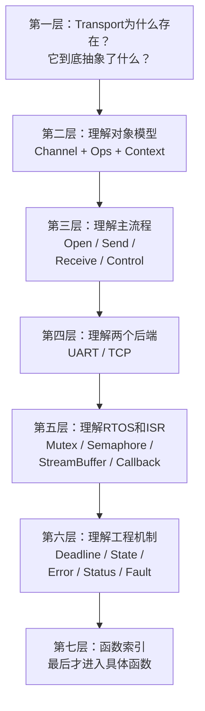

这里最重要的学习顺序是：

> **先理解“接口为什么这样设计”，然后再去理解 UART DMA、StreamBuffer、Netconn、Socket。**

否则很容易学成：

```text
Transport = UART函数 + TCP函数
```

实际上完全不是。

---

# 1. 30 秒理解 Transport

首先只看下面这张图。

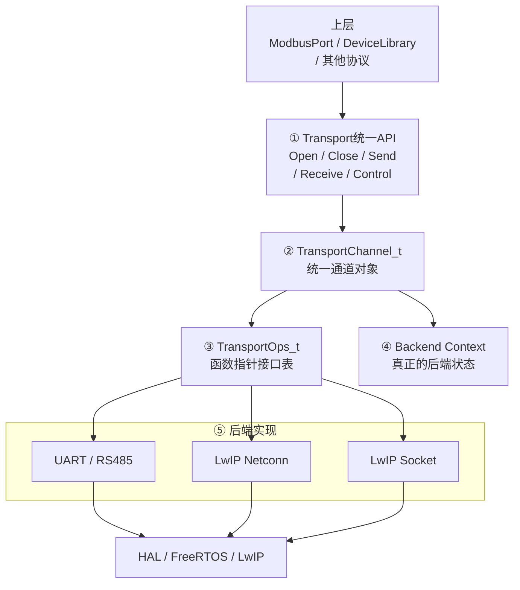

看到这里，先只记一句：

> **Transport 的任务是把 UART、RS485、TCP Netconn、Socket 等完全不同的字节通道，统一成同一套 Open / Close / Send / Receive / Control 接口。**

头文件本身对这一层的定位就是“backend-neutral byte transport abstraction”，并提供注册通道、生命周期、受限 IO、诊断、控制以及可选 ISR 事件转发。

---

# 2. Transport 的七根主干

整套 Transport 可以先压缩成七件事：


后面所有 UART、TCP 细节，其实都只是挂在这七根主干下面的枝叶。

---

# 第一主干：Transport 为什么存在

# 3. Transport 解决的根本问题

假设没有 Transport。

那么 Modbus RTU 可能直接写：

```c
HAL_UART_Transmit(...)
HAL_UART_Receive(...)
```

Modbus TCP 又写：

```c
netconn_write(...)
netconn_recv(...)
```

Socket Server 又写：

```c
lwip_send(...)
lwip_recv(...)
```

于是上层就会变成：

```text
协议代码
│
├── if UART
│      HAL_UART_xxx
│
├── if Netconn
│      netconn_xxx
│
└── if Socket
       lwip_xxx
```

这意味着：

> **物理传输方式开始污染协议层。**

---

# 4. Transport 做的是“把变化推到边界”

Transport 希望上层永远只看到：

```c
xTransportOpen()
xTransportClose()

xTransportSend()
xTransportReceive()
xTransportReceiveExact()

xTransportControl()
xTransportGetState()
xTransportGetStatus()
```

这些 API 在 `transport.h` 中就是统一的 backend-neutral 公共接口。

因此上层逻辑可以保持：

```text
我要打开一个通道
我要发N字节
我要收N字节
我要查询状态
```

而不关心：

```text
UART DMA？
UART polling？
RS485 DE？
Netconn？
Socket？
```

这就是 Transport 的第一个核心设计哲学：

> **统一能力，而不是统一硬件。**

---

# 5. Transport 不应该知道 Modbus

Transport 只认识：

```text
byte[]
length
timeout
state
control
```

它不知道：

```text
Unit ID
Function Code
CRC
MBAP
寄存器地址
Exception Code
```

所以：

```text
nanoMODBUS
=
协议含义

ModbusPort
=
事务工程策略

Transport
=
字节传输机制
```

Transport 越“不懂 Modbus”，架构反而越干净。

---

# 第二主干：真正理解 Transport 的核心对象模型

# 6. 三个对象必须一起看

Transport 最重要的不是某个函数。

而是三个东西：

```text
TransportChannel_t

TransportOps_t

Backend Context
```

这三个组合起来，实际上已经是一套非常完整的 C 对象模型。

---

# 7. `TransportChannel_t`：统一的“通道对象”

核心结构：

```c
typedef struct TransportChannel {
    const char *pcName;
    const TransportOps_t *pxOps;
    void *pvContext;

    volatile TransportState_e xState;
    TransportStatus_t xStatus;

    TransportEventCallback_t pxEventCallback;
    void *pvEventContext;
} TransportChannel_t;
```

源码就是这样把名称、操作表、私有 context、公共状态、诊断以及事件回调全部组合到一个 Channel 中。

---

# 8. `TransportChannel_t` 可以先画成这样

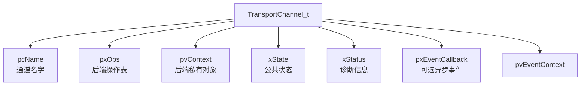

例如一个真实 UART 通道可能是：

```text
TransportChannel_t
│
├── pcName = "ModbusUart"
│
├── pxOps = &s_xUartOps
│
└── pvContext = &xUartContext
```

TCP：

```text
TransportChannel_t
│
├── pcName = "RobotTcp"
│
├── pxOps = &s_xTcpOps
│
└── pvContext = &xTcpContext
```

上层看到的仍然都是：

```c
TransportChannel_t *
```

---

# 9. 这里已经出现“类型擦除”

注意：

```c
void *pvContext;
```

它可能真正指向：

```c
TransportUartContext_t
```

也可能指向：

```c
TransportTcpContext_t
```

或者：

```c
TransportTcpSocketContext_t
```

但是公共 Transport 层并不知道。

这是一种很经典的 C 技巧：

> **Type Erasure / 类型擦除。**

公共层只保存：

```text
void *
```

真正的 backend 函数进去以后，再转换回具体类型。

UART：

```c
TransportUartContext_t *pxContext =
    (TransportUartContext_t *)pvContext;
```

TCP：

```c
TransportTcpContext_t *pxContext =
    (TransportTcpContext_t *)pvContext;
```

---

# 第三主干：`TransportOps_t` —— C 语言函数指针表真正的价值

# 10. `TransportOps_t`

这是 Transport 架构的灵魂：

```c
typedef struct {
    TransportResult_e (*xOpen)(void *pvContext);
    TransportResult_e (*xClose)(void *pvContext);

    TransportResult_e (*xSend)(
        void *pvContext,
        const uint8_t *pucData,
        uint16_t usDataLen,
        uint16_t *pusSentLen,
        uint32_t ulTimeoutMs);

    TransportResult_e (*xReceive)(
        void *pvContext,
        uint8_t *pucData,
        uint16_t usMaxLen,
        uint16_t *pusReceivedLen,
        uint32_t ulTimeoutMs);

    TransportResult_e (*xControl)(...);

    TransportState_e (*xGetState)(...);

    int32_t (*lGetNativeError)(...);

} TransportOps_t;
```

源码明确把它定义为“每个 Transport backend 实现的 operation table”。

---

# 11. 这就是 C 语言版 interface / vtable

如果改成 C++，非常像：

```cpp
class ITransport
{
public:
    virtual Result open() = 0;
    virtual Result close() = 0;

    virtual Result send(...) = 0;
    virtual Result receive(...) = 0;

    virtual Result control(...) = 0;

    virtual State getState() = 0;
    virtual int getNativeError() = 0;
};
```

C 没有：

```cpp
virtual
this
```

所以用：

```text
TransportOps_t
=
virtual functions

void *pvContext
=
this
```

---

# 12. 一个函数调用到底怎么找到 UART / TCP

假设上层：

```c
xTransportSend(pxChannel, data, len, timeout);
```

公共 Transport 里面：

```c
pxChannel->pxOps->xSend(
    pxChannel->pvContext,
    ...
);
```


如果：

```text
pxOps = &s_xUartOps
```

就进入：

```text
UART::prvSend
```

如果：

```text
pxOps = &s_xTcpOps
```

就进入：

```text
TCP::prvSend
```

如果：

```text
pxOps = &s_xTcpSocketOps
```

就进入：

```text
Socket::prvSocketSend
```

所以实际流程：

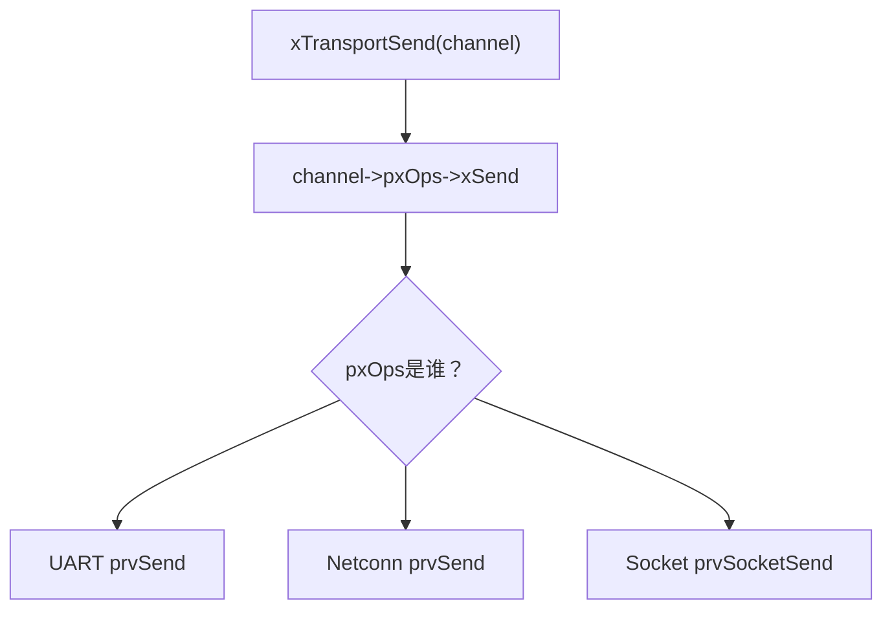

这就是：

> **Runtime Polymorphism / 运行时多态。**

---

# 13. 三个后端真的就是三张不同的函数表

UART：

```c
static const TransportOps_t s_xUartOps = {
    prvOpen,
    prvClose,
    prvSend,
    prvReceive,
    prvControl,
    prvGetState,
    prvGetNativeError
};
```


Netconn TCP：

```c
static const TransportOps_t s_xTcpOps = {
    prvOpen,
    prvClose,
    prvSend,
    prvReceive,
    prvControl,
    prvGetState,
    prvGetNativeError
};
```

Socket：

```c
static const TransportOps_t s_xTcpSocketOps = {
    prvSocketOpen,
    prvSocketClose,
    prvSocketSend,
    prvSocketReceive,
    prvSocketControl,
    prvSocketGetState,
    prvSocketGetNativeError
};
```


名字看起来一样：

```text
Open
Close
Send
Receive
Control
State
Error
```

实际实现完全不同。

这就是抽象最真实的意义：

> **统一的是行为契约，不是实现方式。**

---

# 第四主干：`Context` 为什么必须独立存在

# 14. Channel 和 Context 为什么不合成一个大结构体

因为不同后端需要保存完全不同的东西。

---

## UART Context

里面有：

```text
UART Handle
RS485方向脚

TX Mutex
TX Done Semaphore
RX StreamBuffer

DMA TX Buffer
RX Buffer

当前RX byte

Open
Paused
TX Active
TX Error

Drop Count
HAL Error
```

这些都属于 UART 私有实现。`TransportUartContext_t` 确实集中保存这些 FreeRTOS、HAL、buffer 和 ISR 状态。

---

## TCP Context

又完全不同：

```text
Remote IP
Port
Mode

Netconn Listener
Netconn Connection

netbuf
netbuf offset

Connection state
LwIP native error
```


---

## Socket Context

更小：

```text
TransportChannel *
State
errno
socket descriptor
```


---

# 15. 所以对象关系应该这样看

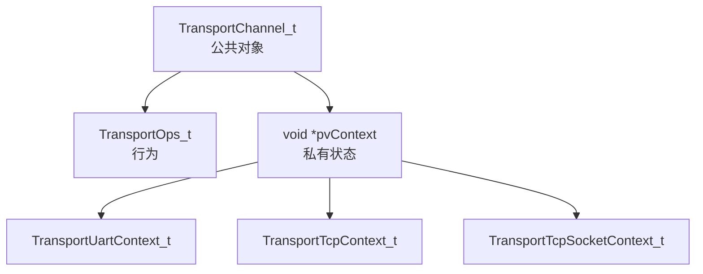

这是很标准的：

> **Interface Object + Private Context**

模式。

---

# 16. 为什么这种设计比 union 好

理论上也可以写：

```c
struct Transport {
    enum type;

    union {
        UartContext uart;
        TcpContext tcp;
        SocketContext socket;
    };
};
```

但这样公共层必须知道：

```text
UART是什么
TCP是什么
Socket是什么
```

增加新后端还要修改 `transport.h`。

现在则是：

```text
Transport核心
根本不知道Context是什么
```

所以以后甚至可以新增：

```text
USB CDC
CAN
BLE
SPI tunnel
Mock Transport
```

而核心 `transport.c` 很可能不用改。

这就是：

> **Open/Closed Principle。**

---

# 第五主干：Transport Channel Registry

# 17. 为什么还有 Registry

Transport 还有一个：

```c
static TransportChannel_t *
s_apxChannels[TRANSPORT_MAX_CHANNELS];
```

最大：

```c
#define TRANSPORT_MAX_CHANNELS 10U
```


它构成一个简单的：

> **Channel Registry / 通道注册表。**

---

# 18. Registry 解决什么问题

可以提前创建：

```text
"ModbusUart1"
"RobotTcp"
"DebugTcp"
"BoardUart2"
```

然后其他模块：

```c
pxTransportFind("ModbusUart1");
```

得到：

```c
TransportChannel_t *
```

不用知道：

```text
它到底UART还是TCP。
```

---

# 19. Registry 主流程

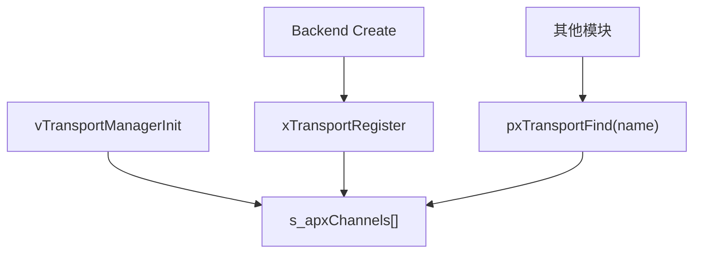

---

# 20. `xTransportRegister()`

它负责：

```text
检查：
channel
name
ops
context

        ↓

检查重复名称

        ↓

检查容量

        ↓

保存指针

        ↓

设置 CLOSED

        ↓

清 Status
```

源码同时用 FreeRTOS critical section 保护注册表写入。

注意：

> Registry 保存的是 `TransportChannel_t *`。

它**不拥有 Channel 内存**。

源码注释也直接写的是：

```text
caller-owned channels
```


---

# 21. Registry 本质更像轻量 Service Locator

你可以把：

```c
pxTransportFind("RobotTcp");
```

理解成：

> “给我名字叫 RobotTcp 的通道服务。”

但当前实现非常克制：

* 固定数组
* 最多 10 个
* 不 malloc
* 线性查找

这非常符合 MCU 工程。

---

# 第六主干：生命周期

# 22. Transport 有自己的 State Machine

统一状态：

```text
UNINITIALIZED
CLOSED
OPEN
BUSY
ERROR
```


可以粗略理解成：

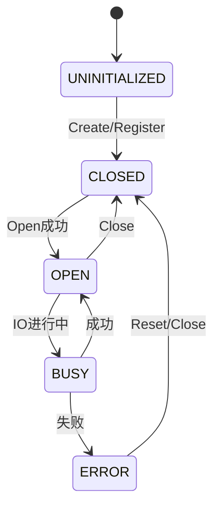

并不是所有 backend 都严格完全按照同一条状态轨迹走，但公共语义统一为这几种状态。

---

# 23. `xTransportOpen()`

公共层只做：

```text
检查 xOpen 是否存在
       ↓
pxOps->xOpen(context)
       ↓
更新公共 xState
       ↓
记录诊断
```


也就是说它并不自己：

```text
打开UART
连接TCP
监听端口
```

这些留给 backend。

---

# 24. `xTransportClose()`

同理：

```text
Transport
      ↓
backend xClose()
      ↓
成功后 CLOSED
      ↓
Record Operation
```


所以公共 Transport 更像：

> **Dispatcher + Policy Wrapper。**

---

# 第七主干：Send / Receive 语义

这是 Transport 真正服务 ModbusPort 的核心。

---

# 25. Send 的契约非常严格

Transport 头文件明确要求：

> `xTransportSend()` 返回 OK 时，必须保证整个请求都发送完成。


因此：

```text
Send 100 bytes

不能：
发了30 bytes
→ OK
```

应该：

```text
发100 bytes
→ OK
```

或者：

```text
只发30
→ Timeout / IO_ERROR / ...
```

---

# 26. 公共层还会再检查一次

即使 Backend 返回：

```text
OK
```

Transport 仍然检查：

```c
usSentLen == usDataLen
```

否则强制转换：

```c
TRANSPORT_RESULT_IO_ERROR
```


这就是一种：

> **Contract Enforcement。**

公共层不完全信任后端。

---

# 27. Receive 与 Send 不一样

普通：

```c
xTransportReceive()
```

语义是：

> **最多收 `usMaxLen`，允许部分接收。**

头文件甚至明确说明：

> partial receive 可以返回 `TRANSPORT_RESULT_OK`。

例如：

```text
buffer capacity = 100

实际当前只收到 = 17
```

可以：

```text
result = OK
received = 17
```

这是流式 IO 很正常的行为。

---

# 28. 为什么还需要 `ReceiveExact`

Modbus / 协议解析经常需要：

```text
我现在明确需要 2 bytes
```

或者：

```text
我明确需要接下来 7 bytes
```

所以 Transport 又提供：

```c
xTransportReceiveExact()
```

语义：

> **在一个总 Deadline 内不断累计，直到恰好收到 N 个字节。**

头文件明确强调：

```text
Intermediate receives reuse the original absolute deadline.
```


---

# 29. `ReceiveExact()` 是非常重要的工程函数

例如要求：

```text
10 bytes
```

底层每次可能返回：

```text
第1次：3
第2次：2
第3次：4
第4次：1
```

Transport 自动拼成：

```text
3 + 2 + 4 + 1 = 10
```

上层不需要自己循环。

---

# 30. ReceiveExact 总 Deadline

非常重要的一点：

它不会：

```text
每一次receive都重新获得1000ms
```

而是：

```text
总预算1000ms

第一次花200
剩800

第二次花300
剩500

第三次只能最多500
```

源码保存：

```c
xStart
xBudget
xElapsed
xRemaining
```

并不断计算剩余时间。

这和前面 `ModbusPort` 的 Deadline 思维是一致的。

---

# 31. 为什么 Transport 和 ModbusPort 都有 Deadline

看起来像重复，其实控制范围不同。

```text
ModbusPort Deadline
=
整个 Modbus Transaction

Transport ReceiveExact Deadline
=
一次具体 Transport ReceiveExact 操作
```

例如：

```text
Modbus Transaction 1000ms
       │
       ├─ Send最多剩余900
       │
       ├─ Read Header最多剩余700
       │
       └─ Read Data最多剩余400
```

而每个 Read 内：

```text
ReceiveExact(7 bytes, 400ms)
       │
       ├─ receive 2
       ├─ receive 3
       └─ receive 2
```

所以是：

> **上层 Deadline 套下层 Deadline。**

---

# 32. 为什么 intermediate timeout 还能继续

源码专门解释：

> 某些 nonblocking socket 后端可能暂时“无数据”，即使总 deadline 尚未耗尽。

所以：

```text
backend timeout
```

不一定意味着：

```text
整个 ReceiveExact 超时
```

如果总预算还没到，它会继续尝试。

这点对 Socket 后端尤其重要。

---

# 第八主干：Control —— 为什么不把所有特殊能力都做成公共 API

# 33. `TransportControl_e`

当前公共控制命令：

```text
RX_PAUSE
RX_RESUME
RX_FLUSH
GET_BAUD_RATE
CONNECTION_RESET
```


你会发现这些能力不属于所有 Backend。

例如：

```text
GET_BAUD_RATE
```

UART 有意义。

TCP 没意义。

而：

```text
CONNECTION_RESET
```

TCP 有意义。

UART 不一定有意义。

---

# 34. 所以设计成 `Control`

类似 POSIX：

```c
ioctl()
```

思想：

```text
公共核心保持小
        ↓
特殊能力走 Control Command
```

而不是不断往 `TransportOps_t` 塞：

```c
xGetBaud()
xFlushUart()
xReconnectTcp()
xPauseRx()
...
```

否则 Ops 表会越来越臃肿。

---

# 35. 不支持怎么办

Backend 直接：

```c
TRANSPORT_RESULT_NOT_SUPPORTED
```

这也是为什么结果枚举里专门有：

```c
TRANSPORT_RESULT_NOT_SUPPORTED
```


---

# 第九主干：Transport 的统一错误模型

# 36. `TransportResult_e`

它把 UART、HAL、LwIP、errno 全部统一成：

```text
OK
INVALID_ARG
NOT_FOUND
BUSY
TIMEOUT
IO_ERROR
NO_RESOURCE
NOT_OPEN
NOT_SUPPORTED
NOT_READY
DISCONNECTED
```


---

# 37. 为什么需要统一错误域

UART 可能返回：

```text
HAL_OK
HAL_BUSY
HAL_TIMEOUT
HAL_ERROR
```

LwIP Netconn：

```text
ERR_OK
ERR_TIMEOUT
ERR_MEM
ERR_RST
ERR_CONN
...
```

Socket：

```text
EAGAIN
ECONNRESET
ENETDOWN
ENOMEM
...
```

如果上层直接看到这些：

```text
ModbusPort
必须同时理解：
HAL
LwIP err_t
errno
```

所以 Transport 做：

```text
Native Error
      ↓
TransportResult_e
```

再把 native error 保存到诊断信息里。

---

# 38. TCP 的错误映射

例如 Socket：

```text
EWOULDBLOCK / EAGAIN / ETIMEDOUT
→ TIMEOUT

ECONNRESET / ECONNABORTED / ENOTCONN / EPIPE
→ DISCONNECTED

ENOMEM / ENOBUFS
→ NO_RESOURCE

ENETDOWN / ENETUNREACH / EHOSTUNREACH
→ NOT_READY

其他
→ IO_ERROR
```


LwIP `err_t` 也被映射到相同 TransportResult：timeout、resource、busy、disconnected、not-ready 等。

这就是：

> **不同后端，不同 native error，同一个工程语义。**

---

# 第十主干：Status / Fault —— Transport 自己也是可观察的

# 39. `TransportFault_t`

保存：

```text
哪个操作失败
统一结果
Native Error
发生时间
请求多少字节
实际完成多少字节
```

对应结构体字段：

```c
xOperation
xResult
lNativeError
xTimestamp
usRequestedLength
usTransferredLength
```


---

# 40. `TransportStatus_t`

又进一步保存：

```text
当前状态

最近Fault

最近Open时间
最近TX时间
最近RX时间

Open次数
TX操作次数
RX操作次数

TX总字节数
RX总字节数

Error Count

最近TX请求/完成长度
最近RX容量/完成长度
```


这说明 Transport 不只是：

> “帮你发字节。”

它还承担：

> **链路级 Observability。**

---

# 41. `prvRecordOperation()` 是诊断中心

几乎所有：

```text
Open
Close
Send
Receive
Control
```

执行之后都会来到：

```c
prvRecordOperation()
```

它统一更新：

```text
State
Counter
Byte Count
Last Fault
Timestamp
Native Error
```

源码集中在这里做所有状态和故障快照更新。

这是很好的：

> **Single Diagnostic Boundary。**

---

# 42. Operation 也被单独分类

```text
NONE
OPEN
CLOSE
SEND
RECEIVE
CONTROL
```


所以 Fault 不只是：

```text
IO_ERROR
```

还能告诉你：

```text
到底是Send失败
还是Open失败
还是Receive失败
```

这对现场诊断很重要。

---

# 第十一主干：异步事件机制

# 43. Transport 不只有同步 API

还有：

```c
TransportEventCallback_t
```

事件：

```text
RX_DATA
TX_COMPLETE
ERROR
RX_OVERFLOW
```


---

# 44. Callback 签名为什么有这么多参数

```text
Channel
Event
Data
DataLen
HigherPriorityTaskWoken
User Context
```

因为它允许事件直接来自：

```text
ISR
```

头文件明确警告：

> ISR-originated callbacks must not block. 

---

# 45. 同步 IO 和异步事件同时存在的原因

Transport 面对两类使用者：

```text
Protocol
↓
同步 read/write

以及

设备/驱动事件
↓
ISR callback
```

所以提供：

```text
Polling/Synchronous Path
+
Event Path
```

这也是比较成熟的底层框架设计。

---

# 第十二主干：UART Backend

到这里再进入 UART，读者就不会把它当成 Transport 本体。

---

# 46. UART Backend 总览

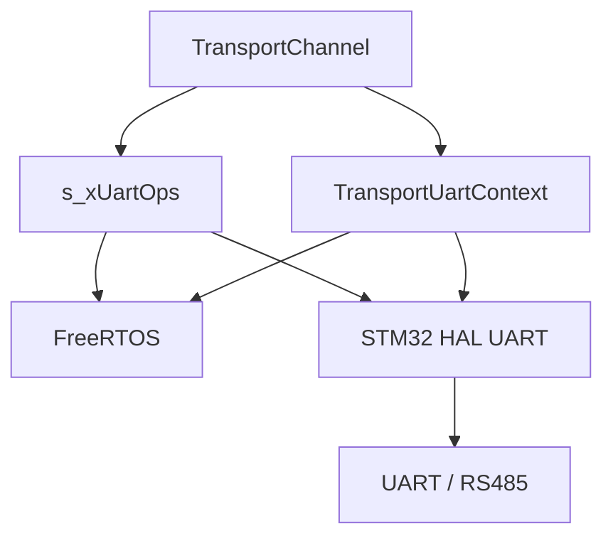

---

# 47. UART Context 是一个很好的嵌入式 C 设计案例

它里面同时包含：

```text
硬件配置
+
同步对象
+
Buffer
+
ISR状态
+
Runtime状态
+
诊断
```

但这些东西全部只属于：

```c
TransportUartContext_t
```

不会污染：

```c
TransportChannel_t
```

---

# 48. UART 使用了哪些 FreeRTOS 原语

这是非常值得学习的一点。

UART 并不是“什么都用 Queue”。

而是根据数据语义分别选择：

```text
TX并发互斥
→ Mutex

等待DMA发送完成
→ Binary Semaphore

ISR → Task 字节流
→ StreamBuffer
```

源码 Context 中分别就是 `xTxMutex`、`xTxDone` 和 `xRxStream`。

这是一种非常成熟的 RTOS 使用哲学：

> **不同同步原语解决不同问题。**

---

# 49. 为什么 RX 用 StreamBuffer 而不是 Queue

UART RX 是：

```text
连续 byte stream
```

不是：

```text
一条一条业务 Message
```

所以 StreamBuffer 更自然：

```text
ISR:
A B C D E
    ↓
StreamBuffer
    ↓
Task:
Receive N bytes
```

如果使用 Queue，每个 byte 都作为一个 item 排队，语义和开销都没那么自然。

---

# 50. UART Create 过程

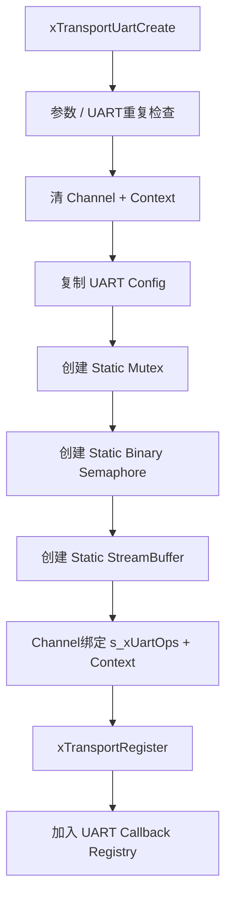

代码确实完全使用 context 内部的静态 RTOS storage 来创建 mutex、binary semaphore 和 StreamBuffer，然后再注册通道。

---

# 51. 为什么没有 malloc

因为：

```text
Mutex storage
Semaphore storage
StreamBuffer metadata
StreamBuffer bytes
DMA TX Buffer
```

都存在：

```c
TransportUartContext_t
```

里。

也就是：

> **Caller-Owned + Static RTOS Allocation。**

这非常适合长期运行 MCU。

---

# 52. UART Open

```text
xTransportOpen
       ↓
s_xUartOps.xOpen
       ↓
prvOpen
       ↓
ucIsOpen = 1
       ↓
如果启用RX
       ↓
HAL_UART_Receive_IT(..., 1 byte)
```

源码的 UART `prvOpen()` 就是启动一个 1 字节中断接收链。

---

# 53. 为什么一次只让 HAL 收 1 byte

当前设计采用：

```text
HAL UART Receive IT
      ↓
1 byte
      ↓
ISR
      ↓
StreamBuffer
      ↓
重新arm下一个byte
```

这是一种：

> **Interrupt → Software Stream Buffer**

模式。

它不是最高吞吐量的唯一方案，但结构清晰，非常适合 Modbus RTU / 中低速串口。

---

# 54. UART RX 完整路径

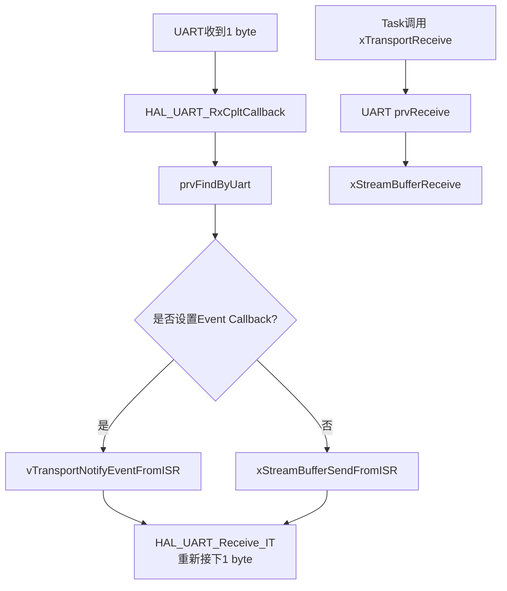

UART RX callback 的源码就是在 callback 和 StreamBuffer 两条路径中二选一，然后重新 arm 下一字节。

---

# 55. 一个很重要的细节：Event Callback 与 StreamBuffer 模式

当前源码：

```c
if (pxChannel->pxEventCallback != NULL) {
    vTransportNotifyEventFromISR(...);
}
else {
    xStreamBufferSendFromISR(...);
}
```

也就是说：

> **设置异步 RX Event Callback 后，该字节会走事件回调，不再同时放入默认 StreamBuffer。**

这是一个重要使用语义。

因此当前 UART RX 实际有两种模式：

```text
默认同步模式
ISR → StreamBuffer → xTransportReceive

异步事件模式
ISR → EventCallback
```

不是同时复制到两个消费者。

---

# 56. RX Overflow

如果：

```text
StreamBuffer满
```

那么：

```text
ulRxDropCount++
       ↓
TRANSPORT_EVENT_RX_OVERFLOW
```


这说明作者没有假定：

> “软件 buffer 永远不会满。”

而是明确保留了溢出诊断。

---

# 57. UART Send 有两个世界

发送时首先判断：

```text
FreeRTOS Scheduler启动了吗？
```

然后分成：

```text
Scheduler未启动
→ Polling

Scheduler运行中
→ Runtime模式
```

源码明确这样选择。

---

# 58. 为什么 Scheduler 前不能走正常 DMA Semaphore 路径

因为正常 Runtime DMA 路径需要：

```text
Task等待 Semaphore
```

Scheduler 都没启动：

```text
Task根本不能阻塞等待
```

所以使用：

```c
HAL_UART_Transmit()
```

同步发送。

这是非常实用的 Boot 阶段兼容设计。

---

# 59. Runtime TX 先拿 Mutex

Runtime：

```text
xSemaphoreTake(xTxMutex)
```

所以：

> 同一个 UART 可以被多个 Task 调用 Send，但实际发送被串行化。


这和前面的 ModbusPort “同一 Port 单 owner”不矛盾。

它们管理的是不同层次：

```text
ModbusPort
保护协议事务完整性

UART Mutex
保护物理UART发送资源
```

---

# 60. RS485 / Half-Duplex 发送流程

Runtime Send：

```text
获得TX Mutex
      ↓
必要时暂停RX
      ↓
切换TX方向
      ↓
发送
      ↓
切回RX方向
      ↓
恢复UART RX
      ↓
释放Mutex
```

代码中会在 half-duplex 或配置了方向 GPIO 时停止 RX、切换方向、发送后再恢复接收。

这就是 Transport 把：

```text
RS485 DE
Half Duplex
HAL AbortReceive
Receive rearm
```

全部封装掉的价值。

ModbusPort 完全不用知道。

---

# 61. DMA 是否启用不是调用者决定

当前实现检查：

```c
pxUart->hdmatx
```

是否有效。

有 DMA：

```text
DMA path
```

没有：

```text
HAL polling transmit
```


上层 API 完全不变：

```c
xTransportSend(...)
```

这是另一层：

> **实现策略隐藏。**

---

# 62. 为什么还有 TX staging buffer

DMA 路径先：

```c
memcpy(
    pxContext->aucTxStorage,
    pucData,
    usDataLen);
```

然后 DMA 从：

```text
aucTxStorage
```

发送。

这样做的重要意义是：

> DMA 使用的是 Context 自己拥有、生命周期稳定的存储，而不是直接依赖调用者 buffer 在异步发送期间继续有效。

这是很重要的异步内存所有权设计。

---

# 63. 大于 256 byte 怎么办

当前：

```c
TRANSPORT_UART_TX_BUFFER_SIZE = 256
```

所以发送更大的数据时：

```text
分 Chunk
       ↓
每Chunk复制到TX staging
       ↓
DMA发送
       ↓
继续下一块
```

源码在 `prvTransmitRuntime()` 里循环切成最大 256 字节 chunk。

---

# 64. TX DMA 完成路径

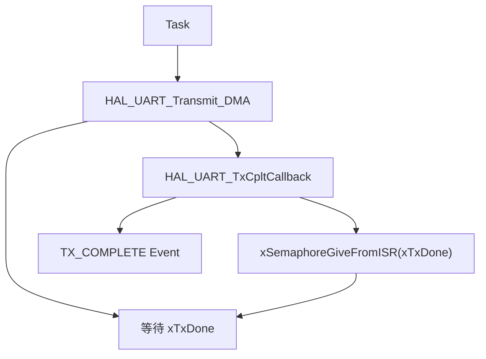

这是一种经典：

> **ISR 通知 Task 完成异步硬件操作**

模式。

---

# 65. UART Control

当前支持：

```text
RX_PAUSE
RX_RESUME
RX_FLUSH
GET_BAUD_RATE
```

例如：

```text
ModbusPort
想计算3.5字符时间
       ↓
xTransportControl(GET_BAUD_RATE)
       ↓
UART Context
       ↓
HAL UART Init.BaudRate
```

UART 的 `prvControl()` 就负责这些命令。

---

# 第十三主干：TCP Backend

TCP 比 UART 更复杂，因为当前实际上存在：

```text
两套TCP Backend
```

---

# 66. TCP 总览

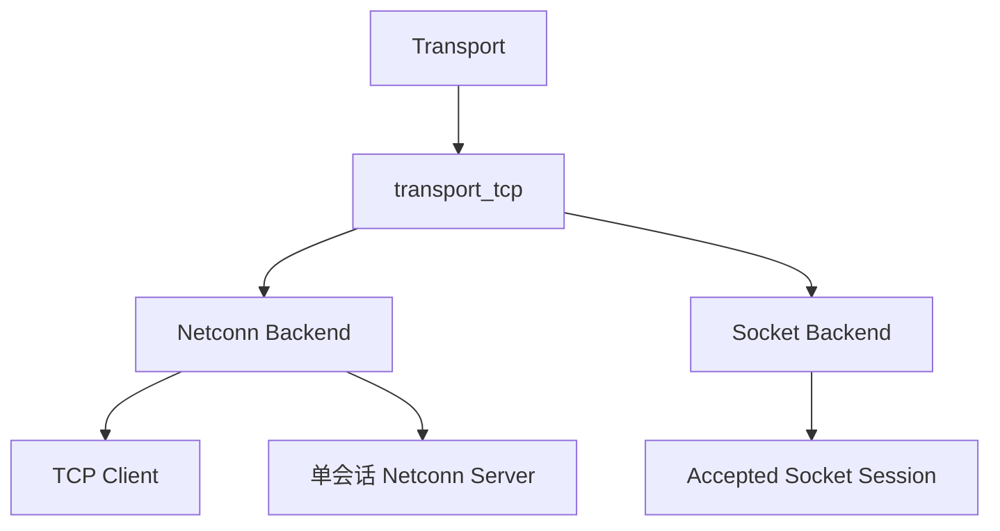

---

# 67. 为什么会有 Netconn 和 Socket 两套

从源码结构看：

### Netconn Context

适合：

```text
主动连接Client
或者
单Listener + 单活动Connection Server
```

它自己拥有：

```text
Listener
Connection
netbuf
```

### Socket Context

适合：

```text
外部Listener已经accept了socket
      ↓
把 accepted fd
挂到一个可复用TransportChannel
```

头文件明确把 Socket API 定义成“accepted nonblocking socket session”。

---

# 68. Netconn Context

核心：

```text
Config

Remote Address

Listener
Connection

Rx netbuf
Rx Offset

Optional local-port allocator

State
Last Native Error
```


其中：

```c
pxRxBuffer
usRxOffset
```

非常值得注意。

后面会解释。

---

# 69. TCP Create 和 UART Create 的架构其实完全一样

```text
清Context
清Channel
       ↓
保存Backend配置
       ↓
Channel.name = name
Channel.ops = TCP Ops
Channel.context = TCP Context
       ↓
xTransportRegister()
```

TCP Create 就是这套结构。

所以：

> UART 和 TCP 虽然底层完全不一样，但“接入 Transport 框架的方式完全一致”。

这就是抽象成功的标志。

---

# 70. TCP Client Open

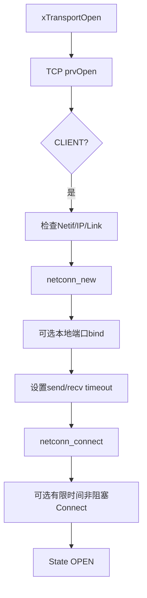

Client 打开时首先确认 default netif 已 up、link up 且有 IPv4 地址，然后创建 netconn、可选 bind 本地端口，并执行连接。

---

# 71. 为什么连接前检查 Netif

如果：

```text
网卡未UP
Link断
没有IP
```

直接 connect 往往只会得到更晦涩的底层错误。

所以代码提前返回：

```c
TRANSPORT_RESULT_NOT_READY
```

这叫：

> **Fail Fast。**

---

# 72. Connect 也使用 Deadline

如果：

```c
ulConnectTimeoutMs != 0
```

会切成 nonblocking connect，并循环检查连接状态直到：

```text
成功
错误
Timeout
```


因此 Deadline 这个设计哲学在：

```text
ModbusPort
Transport
UART
TCP
```

反复出现。

这不是偶然。

---

# 73. TCP Server Open

Server：

```text
netconn_new
     ↓
bind
     ↓
listen
     ↓
State OPEN
```


注意：

> `Open()` 只建立 Listener。

并没有立即：

```text
accept()
```

---

# 74. Server Accept 在什么时候发生

在：

```c
prvReceive()
```

里。

如果：

```text
Server模式
且当前没有Connection
```

则：

```text
prvAcceptClient()
```


所以 Server 行为是：

```text
Open
→ Listener准备好

Receive
→ 如果没客户端
   先Accept
→ 再收数据
```

---

# 75. TCP Send

Netconn send 不是：

```text
netconn_write一次就假设全发完
```

而是：

```text
while 总写入 < 请求长度
       ↓
计算剩余timeout
       ↓
netconn_write_partly
       ↓
累加实际发送
```


因此同样遵守 Transport 的契约：

> `OK == 全部发送完成`

---

# 76. TCP Receive 最值得学习的是 `netbuf + offset`

TCP 是字节流。

但 LwIP `netconn_recv()` 返回：

```text
netbuf
```

一次 netbuf 里可能比上层这次需要的数据更多。

例如：

```text
netbuf:
20 bytes

上层现在只要:
7 bytes
```

不能把剩下 13 bytes 丢掉。

所以：

```c
pxRxBuffer
usRxOffset
```

保存：

```text
当前netbuf
已经读到哪里
```

---

# 77. TCP RX 图

```text
netbuf:

┌──────────────────────────────┐
│ A B C D E F G H I J K L ... │
└──────────────────────────────┘
              ↑
          usRxOffset
```

当前调用只需要：

```text
4 bytes
```

就：

```text
copy 4
offset += 4
```

下次 `Receive()`：

> 从原来的 offset 继续。

只有整块 netbuf 被消费完才：

```c
netbuf_delete()
```

源码就是这样计算 available、copyLen 和 offset。

---

# 78. 这个设计解决的是“Packet API → Stream API”

LwIP 给你的可能是：

```text
netbuf
```

而 Transport 对上要提供：

```text
连续字节流
```

所以：

```text
Netbuf
+
Cursor
=
Stream Adapter
```

它和 nanoMODBUS：

```text
buf
+
buf_idx
```

其实有一种非常有意思的相似性。

都是：

> **Buffer + Cursor。**

只是解决的问题不同。

---

# 第十四主干：Socket Backend

# 79. Socket Context 为什么这么小

```c
TransportTcpSocketContext_t
```

只有：

```text
Channel
State
Native Error
Socket fd
```

因为 socket 本身已经包含大量连接状态。

Transport 不需要复制一整套 Netconn 资源管理。

---

# 80. Create 与 Attach 分开

先：

```c
xTransportTcpSocketCreate()
```

创建固定：

```text
Channel + Context
```

但：

```text
lSocket = -1
```

等外部 Listener：

```text
accept()
```

得到 descriptor 后：

```c
xTransportTcpSocketAttach(...)
```

再把 descriptor 所有权交给 Context。

头文件明确写了：

> Attach 成功后 descriptor ownership 转移给 context。

---

# 81. 为什么固定 Channel 和动态 Socket 分开

这种设计非常适合：

```text
Server预先准备固定Session Slot
```

例如：

```text
ClientSlot0
ClientSlot1
ClientSlot2
```

Channel 和 Context 固定存在。

真正连接来了：

```text
Attach fd
```

断开：

```text
Close fd
```

Channel 本身不用反复 malloc/free。

这是很典型的：

> **Fixed Object Pool 思维。**

当前源码没有在这里实现一个完整的 session pool 管理器，但 Socket Channel 设计明显允许这种用法。

---

# 82. Socket Send

使用：

```c
lwip_send(... MSG_DONTWAIT)
```

如果：

```text
send > 0
```

继续累计。

如果：

```text
EWOULDBLOCK / EAGAIN
```

则：

```text
检查总timeout
vTaskDelay(1)
继续
```

直到全发完或超时。

---

# 83. Socket Receive 故意是非阻塞的

```c
lwip_recv(..., MSG_DONTWAIT);
```

无数据：

```text
EWOULDBLOCK / EAGAIN
→ TRANSPORT_RESULT_TIMEOUT
```


然后上面的：

```c
xTransportReceiveExact()
```

会继续按照总 deadline 重试。

所以：

```text
Socket Backend
=
尽量简单的一次非阻塞Receive

Generic Transport
=
负责Exact + Deadline
```

这是很漂亮的职责分离。

---

# 第十五主干：三种 Receive 后端如何被统一

现在对比最能看出 Transport 的价值。

```text
UART
────────────────
StreamBufferReceive()


Netconn
────────────────
netconn_recv()
+
netbuf cursor


Socket
────────────────
lwip_recv(MSG_DONTWAIT)
```

完全不同。

但上层统一调用：

```c
xTransportReceive(...)
```

甚至 ModbusPort 统一调用：

```c
xTransportReceiveExact(...)
```

这就是：

> **把异构 IO 模型转换成统一的字节流契约。**

---

# 第十六主干：ISR 与 Task 的边界

# 84. Transport 很好地展示了 ISR / Task 分工

以 UART 为例：

ISR 做：

```text
读取已经到达的byte
投递StreamBuffer
Give Semaphore
更新轻量状态
通知Event
重新arm RX
```

Task 做：

```text
等待
Send
Receive
Deadline
业务协议处理
```

这遵循一个非常重要的嵌入式原则：

> **ISR 尽量短，把真正的工作推回 Task。**

---

# 85. TX 的 ISR / Task 分工

Task：

```text
启动DMA
       ↓
等Semaphore
```

ISR：

```text
DMA完成
       ↓
GiveFromISR
       ↓
唤醒Task
```

---

# 86. RX 的 ISR / Task 分工

ISR：

```text
收到1byte
       ↓
StreamBufferSendFromISR
```

Task：

```text
xStreamBufferReceive()
```

所以 StreamBuffer 其实是：

> **ISR 与 Task 之间的字节桥梁。**

---

# 87. 为什么不在 ISR 里解析 Modbus

因为那会导致：

```text
ISR过长
回调里运行协议
可能调用业务
可能等待
抢占延迟不可控
```

Transport 只负责搬运字节。

nanoMODBUS 在 Task Context 再解析。

这是非常正确的分层。

---

# 第十七主干：Ownership / 生命周期

# 88. Transport 的内存所有权图

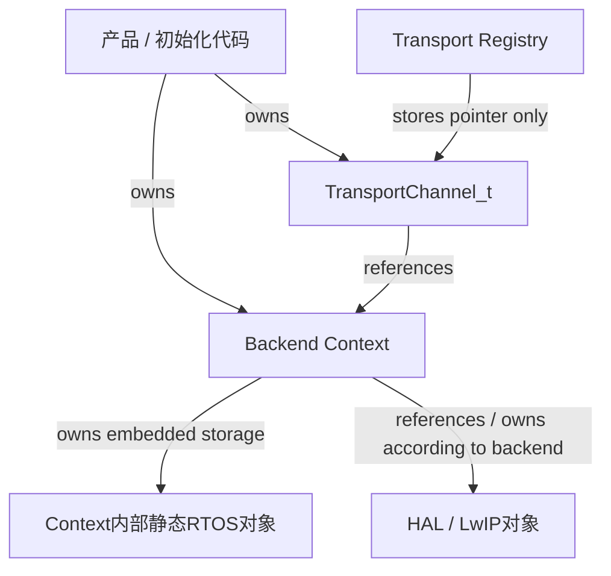

---

# 89. Channel 和 Context 都是 Caller-Owned

UART Create 文档明确要求：

```text
pxChannel caller-owned
pxContext persistent caller-owned
```


TCP 同样如此。

所以不能：

```c
void Init(void)
{
    TransportChannel_t channel;
    TransportUartContext_t ctx;

    xTransportUartCreate(&channel, &ctx, ...);
}
```

然后函数退出。

因为：

```text
Registry
仍然保存 &channel

Channel
仍然保存 &ctx
```

它们必须持续存在。

---

# 90. Socket fd 又是一种所有权转移

Attach 成功后：

```text
fd
↓
Context接管
```

之后：

```c
prvSocketClose()
```

负责：

```text
shutdown
close
```

这和：

```text
borrowed pointer
```

不同。

这是：

> **Ownership Transfer。**

---

# 第十八主干：这套 Transport 到底用了哪些经典设计模式

现在回头看，会发现很多 C/C++ 设计思想都在这里。

---

# 91. Strategy Pattern

```c
TransportOps_t
```

不同 Backend 选择不同实现。

---

# 92. Bridge Pattern

可以把：

```text
TransportChannel
```

理解成 abstraction。

而：

```text
UART/TCP Backend
```

是 implementation。

两者通过 Ops + Context 解耦。

---

# 93. C Virtual Table

```text
pxOps
```

就是很典型的手工 vtable。

---

# 94. Context Object

```text
TransportUartContext_t
TransportTcpContext_t
TransportTcpSocketContext_t
```

分别保存一个实例的所有 backend 状态。

---

# 95. Service Registry

```text
xTransportRegister
pxTransportFind
```

提供按名称找到稳定服务对象的能力。

---

# 96. Adapter

UART：

```text
HAL API
↓
TransportResult / Send / Receive
```

TCP：

```text
LwIP API
↓
Transport contract
```

---

# 97. Error Translation Boundary

```text
HAL_StatusTypeDef
LwIP err_t
errno
       ↓
TransportResult_e
```

---

# 98. Deadline Pattern

反复使用：

```text
Start
Budget
Elapsed
Remaining
```

而不是每次 IO 重新获得一个完整 timeout。

---

# 99. Static Allocation

UART RTOS 对象和 buffer 都嵌在 Context。

避免动态内存。

---

# 100. Producer / Consumer

UART：

```text
ISR
=
Producer

StreamBuffer
=
Channel

Task Receive
=
Consumer
```

---

# 101. Completion Signal

UART TX：

```text
DMA
→ ISR
→ Binary Semaphore
→ Task
```

Semaphore 在这里不是“保护资源”。

它表达：

> **异步操作完成事件。**

---

# 102. Mutual Exclusion

```c
xTxMutex
```

则完全不同。

它表达：

> **同一时间只有一个 Task 使用 UART TX。**

所以：

```text
Mutex
≠
Binary Semaphore
```

虽然两者看起来都能“take/give”。

Transport UART 正好是理解这一点的优秀案例。

---

# 103. Stream Buffer

表达：

> **字节流。**

不是锁，也不是完成事件，也不是业务消息。

这就是 RTOS 原语与问题类型匹配的典型范例。

---

# 第十九主干：Transport 与 ModbusPort 的连接

现在终于把三个知识树接起来。

---

# 104. ModbusPort 向 Transport 使用哪些能力

主要是：

```text
xTransportSend

xTransportReceiveExact

xTransportControl

xTransportGetStatus
```

所以 ModbusPort 根本不需要知道：

```text
UART Mutex
DMA
Netconn
Socket
StreamBuffer
```

---

# 105. 完整 FC03 RTU 路径

```text
DeviceLibrary
        │
        ▼
ModbusPort
        │
        ▼
nanoMODBUS
        │
        │ platform.write
        ▼
ModbusPort::prvWrite
        │
        ▼
xTransportSend
        │
        ▼
TransportChannel
        │
        ▼
s_xUartOps.xSend
        │
        ▼
UART Backend
        │
        ├─ Mutex
        ├─ RS485 Direction
        ├─ DMA / Polling
        └─ Semaphore
        │
        ▼
STM32 HAL
        │
        ▼
UART / RS485
```

响应：

```text
UART RX IRQ
        │
        ▼
HAL_UART_RxCpltCallback
        │
        ▼
StreamBuffer
        │
        ▼
UART prvReceive
        │
        ▼
xTransportReceiveExact
        │
        ▼
ModbusPort::prvRead
        │
        ▼
nanoMODBUS recv()
        │
        ▼
FC03解析
```

---

# 106. 完整 FC03 TCP 路径

```text
nanoMODBUS
    │
platform.write
    ▼
ModbusPort
    │
xTransportSend
    ▼
TransportChannel
    │
s_xTcpOps.xSend
    ▼
Netconn Backend
    │
netconn_write_partly
    ▼
TCP/IP Stack
```

响应：

```text
TCP packet
    │
    ▼
LwIP
    │
    ▼
netconn_recv
    │
    ▼
netbuf
    │
    ▼
pxRxBuffer + usRxOffset
    │
    ▼
Transport Receive
    │
    ▼
ReceiveExact
    │
    ▼
ModbusPort
    │
    ▼
nanoMODBUS
```

---

# 第二十主干：三个模块终于形成完整架构

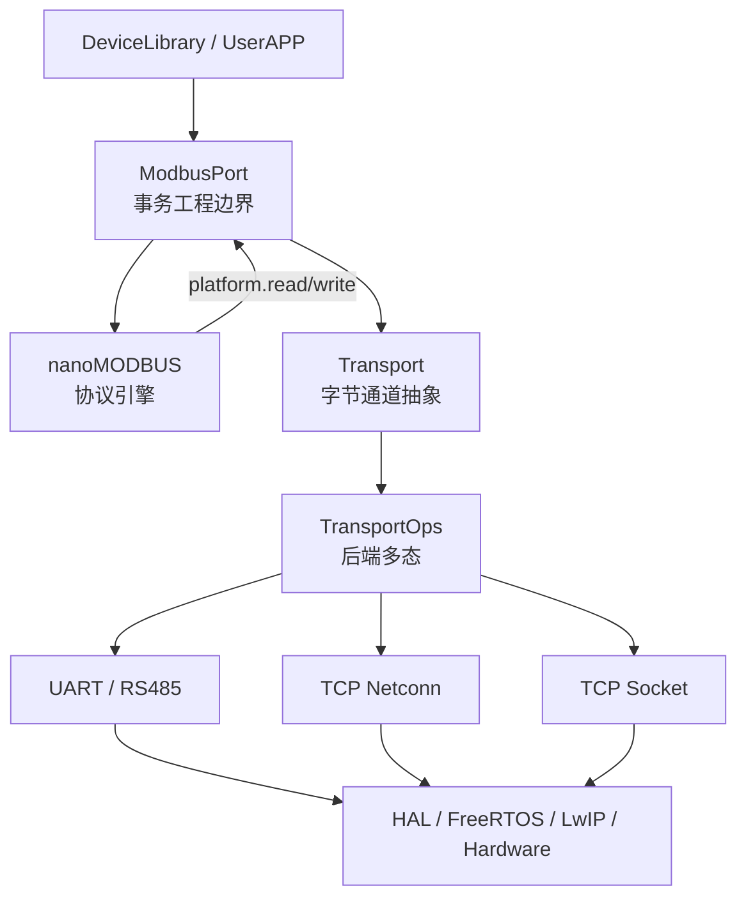

---

# 107. 三层设计哲学最终总结

现在可以非常清楚地看到：

```text
nanoMODBUS
────────────────────────
协议多样性

解决：
Modbus RTU/TCP
FC
PDU
CRC
Exception


ModbusPort
────────────────────────
项目事务多样性

解决：
Deadline
Error Mapping
Trace
Fault
Protocol ↔ Transport Adapter


Transport
────────────────────────
物理链路多样性

解决：
UART
RS485
TCP
Socket
RTOS
ISR
HAL
LwIP
```

每一层都在隔离一种不同的“变化”。

这个才是整个工程最值得学习的架构思想。

---

# 108. Transport 全函数知识树

```text
Transport Core
│
├─ Manager / Registry
│  ├─ vTransportManagerInit
│  ├─ xTransportRegister
│  └─ pxTransportFind
│
├─ Lifecycle
│  ├─ xTransportOpen
│  └─ xTransportClose
│
├─ IO
│  ├─ xTransportSend
│  ├─ xTransportReceive
│  ├─ xTransportReceiveExact
│  └─ prvReceiveOnce
│
├─ Control
│  └─ xTransportControl
│
├─ Status
│  ├─ xTransportGetState
│  ├─ xTransportGetStatus
│  ├─ prvGetNativeError
│  └─ prvRecordOperation
│
├─ Event
│  ├─ vTransportSetEventCallback
│  └─ vTransportNotifyEventFromISR
│
└─ Time
   ├─ prvMsToTicks
   └─ prvTicksToMsCeil
```

---

# 109. UART Backend 函数树

```text
UART Backend
│
├─ Create
│  └─ xTransportUartCreate
│
├─ Ops
│  ├─ prvOpen
│  ├─ prvClose
│  ├─ prvSend
│  ├─ prvReceive
│  ├─ prvControl
│  ├─ prvGetState
│  └─ prvGetNativeError
│
├─ TX
│  ├─ prvSendBeforeScheduler
│  ├─ prvSendRuntime
│  ├─ prvTransmitRuntime
│  └─ prvTransmitDmaChunk
│
├─ Utility
│  ├─ prvFindByUart
│  ├─ prvMsToTicks
│  ├─ prvGetRemainingTicks
│  ├─ prvTicksToMs
│  └─ prvSetDirection
│
├─ HAL ISR
│  ├─ HAL_UART_TxCpltCallback
│  ├─ HAL_UART_RxCpltCallback
│  ├─ HAL_UART_ErrorCallback
│  └─ HAL_UART_AbortReceiveCpltCallback
│
└─ Weak extension
   ├─ vTransportUartUnclaimedTxCallback
   ├─ vTransportUartUnclaimedRxCallback
   └─ vTransportUartUnclaimedErrorCallback
```

---

# 110. TCP Backend 函数树

```text
TCP
│
├─ Utility
│  ├─ ucTransportTcpFormatIpv4Endpoint
│  └─ prvAppendUnsignedDecimal
│
├─ Netconn Create
│  └─ xTransportTcpCreate
│
├─ Netconn Ops
│  ├─ prvOpen
│  ├─ prvClose
│  ├─ prvSend
│  ├─ prvReceive
│  ├─ prvControl
│  ├─ prvGetState
│  └─ prvGetNativeError
│
├─ Client
│  ├─ prvOpenClient
│  ├─ prvWaitClientConnect
│  └─ prvCheckClientConnectInCore
│
├─ Server
│  ├─ prvOpenServer
│  └─ prvAcceptClient
│
├─ Receive Buffer
│  ├─ prvCloseConnection
│  └─ prvDeleteNetbuf
│
├─ Socket Channel
│  ├─ xTransportTcpSocketCreate
│  ├─ xTransportTcpSocketAttach
│  ├─ prvSocketOpen
│  ├─ prvSocketClose
│  ├─ prvSocketSend
│  ├─ prvSocketReceive
│  ├─ prvSocketControl
│  ├─ prvSocketGetState
│  └─ prvSocketGetNativeError
│
└─ Error Mapping
   ├─ prvMapLwipError
   └─ prvMapSocketError
```

---

# 111. 函数级速查表

| 函数                             | 层        | 核心作用                                 |
| ------------------------------ | -------- | ------------------------------------ |
| `vTransportManagerInit`        | Core     | 清空 Channel Registry                  |
| `xTransportRegister`           | Core     | 注册 caller-owned channel              |
| `pxTransportFind`              | Core     | 按名称查 Channel                         |
| `xTransportOpen`               | Core     | Dispatch backend open                |
| `xTransportClose`              | Core     | Dispatch backend close               |
| `xTransportSend`               | Core     | 完整发送并强制 full-send contract           |
| `xTransportReceive`            | Core     | 一次部分/上限接收                            |
| `xTransportReceiveExact`       | Core     | 在一个 Deadline 内累计到精确长度                |
| `xTransportControl`            | Core     | Dispatch backend-specific control    |
| `xTransportGetState`           | Core     | 获取实际 Backend 状态                      |
| `xTransportGetStatus`          | Core     | 获取通道统计和最近 Fault                      |
| `vTransportSetEventCallback`   | Core     | 安装可选异步 callback                      |
| `vTransportNotifyEventFromISR` | Core     | ISR 转发通道事件                           |
| `prvRecordOperation`           | Core     | 统一更新诊断                               |
| `xTransportUartCreate`         | UART     | 创建 UART Channel + Context            |
| UART `prvOpen`                 | UART     | 启动 UART / RX interrupt               |
| UART `prvSend`                 | UART     | 根据 scheduler 状态选 TX 路径               |
| `prvSendRuntime`               | UART     | Mutex + half-duplex + TX             |
| `prvTransmitRuntime`           | UART     | DMA / Polling 策略选择                   |
| `prvTransmitDmaChunk`          | UART     | staging + DMA + completion semaphore |
| UART `prvReceive`              | UART     | 从 StreamBuffer 取字节                   |
| UART `prvControl`              | UART     | Pause/Resume/Flush/Baud              |
| `HAL_UART_RxCpltCallback`      | UART ISR | ISR → Stream/Event                   |
| `HAL_UART_TxCpltCallback`      | UART ISR | DMA完成 → Semaphore                    |
| `HAL_UART_ErrorCallback`       | UART ISR | 错误记录与唤醒                              |
| `xTransportTcpCreate`          | TCP      | 创建 Netconn Channel                   |
| TCP `prvOpenClient`            | TCP      | 建立 Netconn client                    |
| TCP `prvOpenServer`            | TCP      | 建立 listener                          |
| TCP `prvSend`                  | TCP      | Deadline 下完整写入                       |
| TCP `prvReceive`               | TCP      | Netbuf + Cursor 接收                   |
| `prvAcceptClient`              | TCP      | Server 接受单连接                         |
| `xTransportTcpSocketCreate`    | Socket   | 创建固定 Socket Channel                  |
| `xTransportTcpSocketAttach`    | Socket   | Attach accepted descriptor           |
| `prvSocketSend`                | Socket   | Nonblocking full-send                |
| `prvSocketReceive`             | Socket   | Nonblocking receive                  |
| `prvMapLwipError`              | TCP      | `err_t → TransportResult`            |
| `prvMapSocketError`            | Socket   | `errno → TransportResult`            |

---

# 112. 最终脑图

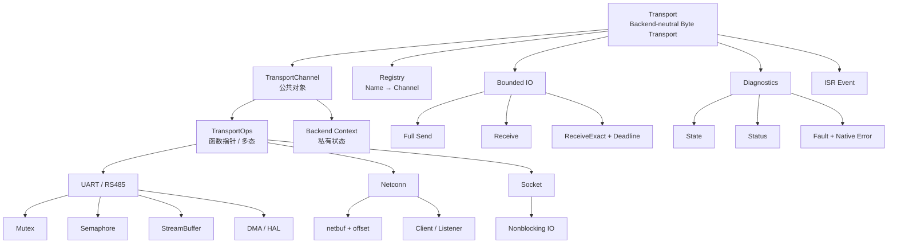

---

# 113. 一句话完整概括 Transport

现在可以给它一个比较完整的定义：

> **Transport 以 `TransportChannel_t` 作为协议侧统一通道对象，以 `TransportOps_t` 函数指针表实现运行时后端多态，以 `void *pvContext` 隔离各后端私有状态；公共层统一提供 Channel Registry、生命周期、完整发送、普通接收、Deadline 型精确接收、Control、State、Status、Fault 和 ISR Event，而 UART/RS485、LwIP Netconn 与 Socket 后端分别负责把 HAL、FreeRTOS 和 LwIP 的实际 IO 行为适配成这一统一契约。**

如果再浓缩：

```text
Transport
=
Interface
+
Runtime Polymorphism
+
Backend Adapter
+
Byte Stream Contract
+
Deadline
+
Lifecycle
+
Diagnostics
+
ISR / RTOS Boundary
```

---

# 114. 三份知识图到这里已经真正闭环

现在这三份不是三个互相独立的文档，而是一条完整主干：

```text
nanoMODBUS
│
│ “协议怎么表达”
│
├─ PDU
├─ FC
├─ RTU/TCP
├─ CRC
└─ Exception
│
▼
ModbusPort
│
│ “一笔协议事务怎么在工程中执行”
│
├─ Begin / Finish
├─ Deadline
├─ Error Mapping
├─ Trace
└─ Fault
│
▼
Transport
│
│ “字节到底怎么到物理世界”
│
├─ Channel
├─ Ops
├─ Context
├─ UART
├─ TCP
├─ RTOS
└─ ISR
│
▼
STM32 HAL / FreeRTOS / LwIP / Hardware
```

从学习角度看，这三层其实刚好对应三个非常核心的问题：

```text
nanoMODBUS：
“协议是什么？”

ModbusPort：
“事务是什么？”

Transport：
“IO抽象是什么？”
```

而 `Transport` 这一章尤其值得反复看，因为这里已经把很多嵌入式 C 的核心设计哲学集中到一个相对小的工程里了：

**函数指针表不是为了炫技，而是为多后端服务；`void *Context` 不是因为 C 没类型，而是为了让公共接口不依赖具体类型；Mutex、Semaphore、StreamBuffer 并不是“FreeRTOS 三件套”，而是分别对应互斥、完成通知、字节流；Registry 解决命名和引用，Context 解决实例状态，Ops 解决行为，Channel 则把它们组合成一个真正可被上层使用的 C 对象。**

这也是为什么从这三个文件体系往后再看 FreeRTOS、FreeModbus、lwIP、FatFs、USB Stack，会越来越容易：**库名字变了，但这些设计原语一直在重复出现。**
