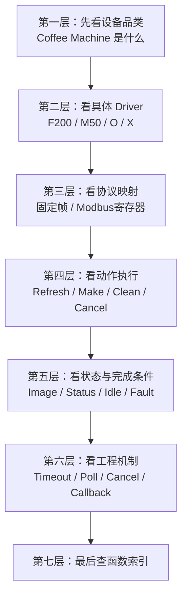
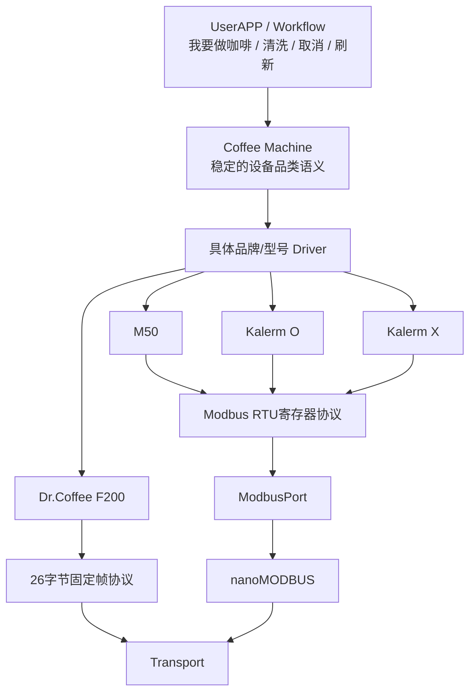
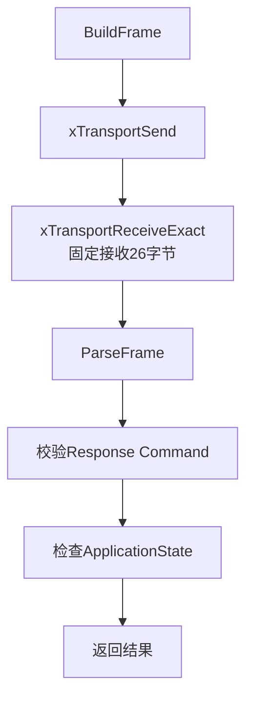
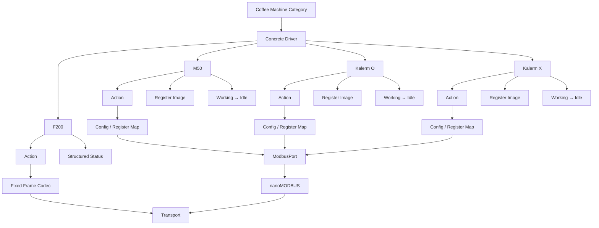

# 咖啡机设备库架构知识图谱

> 基于当前开放的咖啡机设备驱动源码：
>
> - `coffee_machine_f200.c / .h`
> - `coffee_machine_m50.c / .h`
> - `coffee_machine_O.c / .h`
> - `coffee_machine_X.c / .h`
>
> 本文只描述这些源码已经支持的内容。
>
> 当前未包含 `device_library.c/.h` 的完整实现，因此“统一设备注册、统一咖啡机门面、运行时驱动选择”等更上层机制，如果不在这些文件中出现，本文不会假定它已经存在。

---

# 0. 这份文档应该怎么读

不要按照：

```text
coffee_machine_f200.c
coffee_machine_m50.c
coffee_machine_O.c
coffee_machine_X.c
```

逐个文件从第一行读到最后一行。

这样最后很容易变成：

```text
知道 F200 有 BuildFrame
知道 M50 有 prvWaitForIdle
知道 O 有 Reset
知道 X 有 PowerRestart
```

但仍然没有形成真正的“设备库”认知。

这层最重要的不是某个函数，而是下面这个问题：

> **同样都是“咖啡机”，为什么可以挂不同品牌、不同型号、甚至完全不同的通信协议，而上层业务仍然可以保持“做咖啡 / 清洗 / 取消 / 刷新”等稳定语义？**

所以推荐阅读顺序是：



---

# 1. 30 秒理解咖啡机设备库

先只看这一张图。



最重要的一句话：

> **咖啡机设备库稳定的是“设备业务语义”，变化的是“品牌/型号如何把这些业务动作翻译成自己的协议”。**

因此：

```text
Coffee Machine
=
设备品类

F200 / M50 / O / X
=
具体 Driver

F200固定帧 / Modbus寄存器
=
协议实现细节
```

---

# 2. 当前咖啡机设备库的七根主干


后面的所有代码都可以挂回这七根主干。

---

# 第一主干：设备品类与 Driver

# 3. “咖啡机”与“具体协议”必须分开

当前四个驱动都属于同一个设备品类：

```text
DEVICE_CATEGORY_COFFEE_MACHINE
```

但 Driver 和 Protocol 不一样。

| 型号 | Driver 标识 | Category | Protocol |
|---|---|---|---|
| Dr.Coffee F200 | `DEVICE_DRIVER_COFFEE_DRCOFFEE_F200` | Coffee Machine | `DEVICE_PROTOCOL_COFFEE_F200_UART` |
| M50 | `DEVICE_DRIVER_COFFEE_M50_MODBUS` | Coffee Machine | `DEVICE_PROTOCOL_MODBUS_RTU` |
| Kalerm O | `DEVICE_DRIVER_COFFEE_KALERM_O_MODBUS` | Coffee Machine | `DEVICE_PROTOCOL_MODBUS_RTU` |
| Kalerm X | `DEVICE_DRIVER_COFFEE_KALERM_X_MODBUS` | Coffee Machine | `DEVICE_PROTOCOL_MODBUS_RTU` |

这说明当前源码已经表达出三个不同层级：

```text
Category
   ↓
Coffee Machine

Driver
   ↓
F200 / M50 / O / X

Protocol
   ↓
F200 UART fixed-frame
或
Modbus RTU
```

所以：

> **设备品类不是协议，Driver 也不等于协议。**

同一个 Protocol 下面仍然可以存在多个 Driver。

例如：

```text
M50
O
X
```

都使用 Modbus RTU，但寄存器表、状态容量、动作语义和完成流程仍然不同。

---

# 4. 为什么“更换品牌”应该替换 Driver，而不是修改 UserAPP

目标关系应该理解成：

```text
UserAPP / Workflow
        │
        │ 稳定业务意图
        ▼
Coffee Machine
        │
        │ 选择具体型号实现
        ▼
Concrete Driver
        │
        │ 厂商协议
        ▼
Communication
```

例如上层业务只关心：

```text
做一杯咖啡
刷新状态
取消当前动作
执行清洗
```

具体到底是：

```text
发送 26 字节固定帧
```

还是：

```text
写 0x2000 Modbus Register
```

应该留在具体 Driver 内部。

---

# 5. 当前源码已经做到哪一步

当前四组源码已经完成：

```text
每个型号拥有独立：

Action enum
Config
Status/Image
Execute入口
协议映射
状态判断
错误返回
```

但是当前这些文件中仍然直接暴露：

```c
xCoffeeMachineF200Execute(...)
xCoffeeMachineM50Execute(...)
xCoffeeMachineOExecute(...)
xCoffeeMachineXExecute(...)
```

也就是说：

> **仅从当前八个文件，还不能证明上层已经拥有一个统一的 `xCoffeeMachineExecute()` 运行时分发接口。**

这个统一分发如果存在，应当位于更高层的 DeviceLibrary / registry / manager 中。

本文不会假定它已经存在。

---

# 第二主干：四个 Driver 的整体对比

# 6. 四个型号先不要钻源码，先做一张总表

| 项目 | F200 | M50 | Kalerm O | Kalerm X |
|---|---|---|---|---|
| 下层 | Transport | ModbusPort | ModbusPort | ModbusPort |
| 协议 | 26字节固定帧 | Modbus RTU | Modbus RTU | Modbus RTU |
| 状态模型 | 结构化 `Status_t` | 16寄存器 Image | 16寄存器 Image | 24寄存器 Image |
| MAKE 前检查 | QUERY + Idle检查 | Refresh + Idle检查 | 无独立预检查 | 无独立预检查 |
| MAKE 后等待完成 | 无 | 有 | 有 | 有 |
| 完成判定 | Exchange成功 | 观察 Working → Idle | 观察 Working → Idle | 观察 Working → Idle |
| 状态失败重试 | 无 | 有，连续 miss 上限 | 无 | 无 |
| 状态 callback | 无 | 有 | 无 | 无 |
| CancelCheck | 有 | 有 | 有 | 有 |
| Pause/Resume | 无 | 无 | 有 | 有 |
| Fault Ack/Reset | 无独立 FaultAck | Fault Ack | Reset | Reset |
| Power 控制 | 无 | 无 | 有 | 有 |

这张表非常重要，因为它说明：

> **同一个“咖啡机品类”，不同品牌不仅协议不同，连动作完成策略也可能不同。**

所以具体 Driver 不只是“编码器”，它还包含：

```text
厂商状态机规则
+
协议映射
+
完成判定
+
错误翻译
```

---

# 第三主干：F200 Driver

# 7. F200 的定位

F200 不是 Modbus Driver。

它直接实现一个固定长度的厂商串口协议。

链路：

```text
CoffeeMachine F200
        ↓
BuildFrame / ParseFrame
        ↓
Transport
        ↓
UART
```

因此它绕过：

```text
ModbusPort
nanoMODBUS
```

这正好证明 DeviceLibrary 并不依赖某一种协议。

---

# 8. F200 的 26 字节帧

当前源码固定：

```text
COFFEE_MACHINE_F200_FRAME_LENGTH = 26
```

关键索引：

```text
0   HEAD
1   LENGTH
2   WARNING开始
10  FAULT开始
18  MACHINE STATE
19  COMMAND
20  APPLICATION STATE
21  DRINK ID
22  APPLICATION ID
23  RESERVED
24  CHECKSUM
25  TAIL
```

帧常量：

```text
HEAD   = 0x7E
LENGTH = 0x1A
TAIL   = 0x7E
```

可以画成：

```text
Byte
0       1       2........9    10.......17   18   19   20   21   22   23   24   25
┌───────┬───────┬───────────┬────────────┬────┬────┬────┬────┬────┬────┬────┬────┐
│ 0x7E  │ 0x1A  │ Warning64 │ Fault64    │Mach│Cmd │App │Drink│AppID│Res │Chk │0x7E│
└───────┴───────┴───────────┴────────────┴────┴────┴────┴────┴────┴────┴────┴────┘
```

---

# 9. F200 Checksum

```c
ucCoffeeMachineF200Checksum()
```

计算区间：

```text
Byte 1
到
Byte 23
```

也就是：

```text
LENGTH ... RESERVED
```

求和后：

```text
sum & 0xFF
```

注意：

```text
HEAD
CHECKSUM自身
TAIL
```

不参与这个求和区间。

---

# 10. F200 BuildFrame

```c
xCoffeeMachineF200BuildFrame()
```

主流程：

```text
检查输出buffer和capacity
        ↓
检查Command是否支持
        ↓
清零26字节
        ↓
HEAD = 0x7E
LENGTH = 0x1A
COMMAND = xCommand
        ↓
如果 MAKE
DRINK = ucDrinkId
        ↓
计算Checksum
        ↓
TAIL = 0x7E
```

对于 MAKE：

```text
ucDrinkId
```

才会写进 `F200_DRINK_INDEX`。

---

# 11. F200 Recipe 映射

```c
xCoffeeMachineF200MapRecipe()
```

逻辑配方：

```text
0-based
```

F200 Drink ID：

```text
1-based
```

所以：

```text
logical recipe 0 → drink 1
logical recipe 1 → drink 2
...
```

最大允许逻辑值：

```text
0x0021
```

---

# 12. F200 ParseFrame

```c
xCoffeeMachineF200ParseFrame()
```

先验证：

```text
Length == 26
HEAD == 0x7E
LENGTH == 0x1A
TAIL == 0x7E
CHECKSUM正确
```

再解析：

```text
Warning  → uint64_t little endian
Fault    → uint64_t little endian
Machine State
Command
Application State
Drink ID
Application ID
```

输出进入：

```c
CoffeeMachineF200Status_t
```

结构：

```text
CoffeeMachineF200Status_t
│
├── ullWarning
├── ullFault
├── ucMachineState
├── ucCommand
├── ucApplicationState
├── ucDrinkId
└── ucApplicationId
```

这不是“原始帧缓存”，而是：

> **把厂商固定帧翻译成结构化设备状态。**

---

# 13. F200 Exchange 是真正的单次事务

```c
xCoffeeMachineF200Exchange()
```

完整主链：



它拥有两个局部数组：

```c
uint8_t aucTx[26];
uint8_t aucRx[26];
```

这两个数组：

```text
只属于当前Exchange调用
函数返回后生命周期结束
```

Transport 只在同步 Send / ReceiveExact 调用期间使用这些 buffer。

---

# 14. F200 Error 映射

Transport：

```text
TRANSPORT_RESULT_TIMEOUT
        ↓
COFFEE_MACHINE_F200_RESULT_TIMEOUT
```

其他 Transport 错误：

```text
        ↓
COFFEE_MACHINE_F200_RESULT_TRANSPORT
```

帧格式、Checksum、Command不匹配：

```text
        ↓
COFFEE_MACHINE_F200_RESULT_PROTOCOL
```

非 QUERY 命令返回：

```text
ApplicationState == 0x04
```

则：

```text
COFFEE_MACHINE_F200_RESULT_REJECTED
```

---

# 15. F200 Execute：把 Action 翻译成厂商 Command

```c
xCoffeeMachineF200Execute()
```

支持：

```text
REFRESH
MAKE
CANCEL
CLEAN
```

总流程：

```text
检查参数
   ↓
单次IO timeout = min(ulTimeoutMs, 1000ms)
   ↓
非CANCEL时先检查CancelCheck
   ↓
Action分发
```

---

# 16. F200 REFRESH

```text
REFRESH
   ↓
COMMAND_QUERY
   ↓
Exchange
```

也就是说 F200 的“刷新状态”不是被动读取本地缓存，而是一次真实厂商协议事务。

---

# 17. F200 CANCEL

```text
CANCEL
   ↓
COMMAND_CANCEL
   ↓
Exchange
```

源码明确让 CANCEL 自己不被预先的 CancelCheck 阻止。

这很合理：

```text
“我要取消当前动作”
```

本身不应该因为“系统已进入取消状态”而被跳过。

---

# 18. F200 MAKE 的完整调用链

```text
xCoffeeMachineF200Execute(MAKE)
        ↓
QUERY
        ↓
xCoffeeMachineF200Exchange()
        ↓
BuildFrame(QUERY)
        ↓
Transport Send/Receive
        ↓
Parse Status
        ↓
MachineState == 0x02 ?
        ↓ Yes
再次CancelCheck
        ↓
Exchange(MAKE, drinkId)
```

这里：

```text
0x02
```

就是源码中使用的 Idle 状态常量。

所以 F200 的 MAKE 是：

> **先确认 Idle，再发送 MAKE。**

但当前 F200 Execute 在 MAKE Exchange 成功后就返回。

它没有像 M50/O/X 那样继续轮询直到观察到：

```text
Working → Idle
```

因此：

> **F200 的 Execute 成功更接近“命令交换成功/设备接受”，不是由当前代码证明的“整杯咖啡制作完成”。**

---

# 19. F200 CLEAN 的一个重要实现细节

CLEAN 分支中：

```text
ucDrinkId
```

被重新解释为：

```text
CoffeeMachineF200Command_e
```

然后检查该命令是否属于支持集合。

也就是说当前 API 参数：

```c
uint8_t ucDrinkId
```

在：

```text
MAKE
```

时代表 Drink ID，

但在：

```text
CLEAN
```

时代表清洗 Command Code。

这是当前源码真实存在的参数复用语义。

---

# 第四主干：M50 Driver

# 20. M50 的定位

M50 是标准 Modbus RTU 咖啡机 Driver。

它本身不处理：

```text
CRC
RTU frame
UART
```

而是直接依赖：

```text
ModbusPort
```

链路：

```text
M50 Driver
    ↓
ModbusPort
    ↓
nanoMODBUS
    ↓
Transport
```

---

# 21. M50 Config 就是“厂商寄存器协议映射表”

```c
CoffeeMachineM50Config_t
```

字段：

```text
usStatusStart
usStatusCount
usMakeRegister
usCleanRegister
usFaultAckRegister
usCancelRegister
usIdleValue
```

默认配置：

```text
Status Start   = 0x1000
Status Count   = 16
Make           = 0x2000
Clean          = 0x200C
Fault Ack      = 0x200D
Cancel         = 0x200E
Idle           = 0x00FF
```

这就是一个很典型的：

> **Table-driven protocol mapping。**

协议地址没有散落在 Execute 各分支里，而是集中在 Config。

---

# 22. M50 Image

```c
CoffeeMachineM50Image_t
```

只有：

```c
uint16_t ausStatus[16];
```

这意味着 Driver 当前没有把 16 个寄存器进一步转成结构化字段。

它保存的是：

> **设备状态寄存器镜像。**

所以：

```text
Image
≠
业务最终状态对象
```

更准确是：

```text
Device Register Image
```

---

# 23. M50 Refresh

```c
prvRefresh()
```

本质只有：

```text
xModbusPortReadHolding()
```

即：

```text
FC03
StatusStart
StatusCount
   ↓
ausStatus[]
```

M50 的设备状态读取完全委托给 ModbusPort。

---

# 24. M50 对“暂时性状态读取失败”有专门策略

```c
prvTransientStatusFailure()
```

把下面三种 ModbusPort Result 当成可重试状态读取故障：

```text
TIMEOUT
TRANSPORT
PROTOCOL
```

其它错误：

```text
不重试
直接返回
```

这是 M50 与 O/X 的一个非常重要差异。

---

# 25. M50 Status Callback

M50 独有：

```c
CoffeeMachineM50StatusCallback_t
```

回调参数包含：

```text
Image
Result
Consecutive Misses
Context
```

这是典型：

```text
function pointer
+
void *context
```

模式。

调用方可以通过它得到：

```text
最新状态镜像
本次刷新结果
连续丢失次数
```

Driver 自己不拥有 `pvStatusContext` 指向的对象。

该对象必须在可能触发 callback 的整个 Execute 期间保持有效。

---

# 26. M50 MAKE 前状态读取

```c
prvReadMakeStatus()
```

它不是“一次读失败就结束”。

逻辑：

```text
CancelCheck
   ↓
Refresh
   ↓
成功？ ── Yes → callback → return OK
   │
   No
   ↓
属于 transient failure？
   │
   No → return
   │
   Yes
   ↓
misses++
callback
   ↓
misses >= limit ?
   │
   No
   ↓
Delay 500ms
   ↓
重新 Refresh
```

连续 miss 上限：

```text
3
```

所以 M50 的 MAKE 前状态确认具备一定抗瞬时链路抖动能力。

---

# 27. M50 MAKE 完整流程

```text
xCoffeeMachineM50Execute(MAKE)
        ↓
prvReadMakeStatus()
        ↓
读取Status Image
        ↓
ausStatus[0] == Idle(0x00FF) ?
        │
        No → BUSY
        │
        Yes
        ↓
xModbusPortWriteRegister(
    usMakeRegister,
    usParameter)
        ↓
prvWaitForIdle()
```

和 F200 相比：

```text
F200
QUERY → Idle → MAKE → return

M50
Refresh → Idle → WRITE MAKE
              ↓
       持续轮询到完成
```

---

# 28. M50 为什么一定要“观察到工作过”才允许 Idle 成功

`prvWaitForIdle()` 使用：

```text
ucObservedWorking
```

逻辑：

```text
一开始设备可能还是 Idle
        ↓
如果立刻看到 Idle
不能直接认为命令已经完成
        ↓
必须先观察到：
status[0] != Idle
        ↓
ucObservedWorking = 1
        ↓
之后再次看到 Idle
        ↓
才判定完成
```

完整状态：

```text
Idle
  ↓
发送MAKE
  ↓
Working
  ↓
Idle
  ↓
Success
```

这避免：

```text
命令刚写入
设备还没来得及改变状态
第一次Poll仍然是Idle
```

而被误判成“已经完成”。

这是非常值得保留的设备状态机设计。

---

# 29. M50 WaitForIdle 的总 Deadline

M50：

```text
ulTimeoutMs
```

是整个等待完成过程的总时间预算。

内部每次 Modbus transaction：

```text
最多 1000ms
```

但如果总预算剩余不到 1000ms：

```text
使用剩余时间
```

也就是：

```text
Transaction timeout
=
min(remaining overall timeout, 1000ms)
```

这形成两级时间模型：

```text
Device operation deadline
        ↓
单次 Modbus transaction deadline
```

---

# 30. M50 WaitForIdle 对暂时性读取错误仍然允许恢复

与 MAKE 前状态读取相似：

```text
TIMEOUT / TRANSPORT / PROTOCOL
```

会增加：

```text
ucMisses
```

但不立即判失败。

成功刷新一次后：

```text
ucMisses = 0
```

即：

> **统计的是连续 miss，而不是累计 miss。**

---

# 31. M50 其它动作

CLEAN：

```text
Write usCleanRegister = usParameter
```

FAULT_ACK：

```text
Write usFaultAckRegister = usParameter
```

CANCEL：

```text
Write usCancelRegister = 0
```

这些动作当前源码都属于：

```text
单次 Modbus 写寄存器
```

没有后续完成等待。

---

# 第五主干：Kalerm O Driver

# 32. Kalerm O Config

默认映射：

```text
Status Start = 0x1000
Status Count = 16
Make         = 0x2000
Pause        = 0x2001
Clean        = 0x200C
Reset        = 0x200D
Cancel       = 0x200E
Power        = 0x200B
Idle         = 0x00FF
Pause Value  = 1
Resume Value = 2
```

支持 Action：

```text
REFRESH
MAKE
PAUSE
RESUME
CLEAN
CANCEL
RESET
POWER_OFF
POWER_RESTART
```

---

# 33. O Image

```c
uint16_t ausStatus[16];
```

同样是状态寄存器镜像。

但 O 的 `prvRefresh()` 比 M50 多一步：

```text
读取 Holding Registers
        ↓
检查 status[1] ~ status[8]
        ↓
任何一个非0
        ↓
返回 MODBUS_PORT_RESULT_PROTOCOL
```

所以当前实现把：

```text
设备 fault registers 非零
```

映射为了：

```text
MODBUS_PORT_RESULT_PROTOCOL
```

这是当前源码的具体策略。

不要把它理解成 Modbus 协议本身要求如此。

---

# 34. O MAKE

O 的 MAKE：

```text
Write Make Register
        ↓
prvWaitForIdle()
```

和 M50 的区别：

```text
O 没有在 MAKE 前单独刷新并确认 Idle
```

即：

```text
M50
Refresh / Idle check
        ↓
Write Make

O
Write Make
        ↓
WaitForIdle
```

---

# 35. O WaitForIdle

逻辑同样要求：

```text
先观察 Working
再观察 Idle
```

但和 M50 不同：

```text
任意一次 xModbusPortReadHolding() 失败
        ↓
立即返回
```

没有：

```text
Transient Failure Retry
Consecutive Misses
Status Callback
```

---

# 36. O Pause / Resume

两者共用：

```text
usPauseRegister
```

根据动作选择 Value：

```text
PAUSE  → usPauseValue = 1
RESUME → usResumeValue = 2
```

然后：

```text
xModbusPortWriteRegister()
```

---

# 37. O Power

同一个 Power Register：

```text
POWER_OFF     → 1
POWER_RESTART → 2
```

因此这里是典型：

```text
同一寄存器
+
不同命令值
```

---

# 38. O Reset

Reset 不直接使用固定值。

它扫描：

```text
Image status[1] ~ status[8]
```

找到第一个非零 Fault：

```text
usValue = fault index
```

然后：

```text
Write usResetRegister = fault index
```

如果：

```text
1..8 全部为 0
```

则直接：

```text
return OK
```

注意：

> Reset 使用的是调用方当前传入 `pxImage` 中已有的数据，它不会在 Reset 分支内部先执行一次 Refresh。

因此调用 Reset 前 Image 是否新鲜，是上层需要理解的语义。

---

# 第六主干：Kalerm X Driver

# 39. Kalerm X 与 O 的关系

X 与 O 的整体代码骨架非常接近。

它们共同支持：

```text
REFRESH
MAKE
PAUSE
RESUME
CLEAN
CANCEL
RESET
POWER_OFF
POWER_RESTART
```

而且控制寄存器默认值也基本一致。

主要当前可见差异：

```text
O Status Count = 16
X Status Count = 24
```

以及：

```text
O Resume Value = 2
X Resume Value = 0
```

所以：

> **即使都是 Kalerm、都是 Modbus、甚至控制寄存器布局高度相似，仍然需要保留型号级 Driver/Config 差异。**

---

# 40. X Config

```text
Status Start = 0x1000
Status Count = 24
Make         = 0x2000
Pause        = 0x2001
Clean        = 0x200C
Reset        = 0x200D
Cancel       = 0x200E
Power        = 0x200B
Idle         = 0x00FF
Pause Value  = 1
Resume Value = 0
```

---

# 41. X Image

```c
uint16_t ausStatus[24];
```

X 状态空间比 O 多 8 个寄存器。

当前 `prvRefresh()` 的 fault 检查仍然只扫描：

```text
status[1] ~ status[8]
```

因此：

```text
Image Capacity = 24
```

并不意味着：

```text
所有24个寄存器都被当前Driver赋予了业务含义
```

当前可确认的是：

```text
0号用于Idle/Working判断
1~8用于fault检查/reset选择
```

其它位置需要更完整协议资料或上层代码才能进一步解释。

---

# 42. X MAKE / Wait / Reset

流程与 O 基本相同：

```text
MAKE
  ↓
Write Make Register
  ↓
WaitForIdle
  ↓
Working observed
  ↓
Idle
  ↓
Success
```

RESET：

```text
扫描 Image 1..8
   ↓
找到第一个非0索引
   ↓
写 Reset Register
```

---

# 第七主干：四个 Driver 的 Action 模型

# 43. Action 不是厂商 Command

这一层一定要分清。

例如：

```text
CoffeeMachineF200Action_e
```

和：

```text
CoffeeMachineF200Command_e
```

是两层东西。

Action：

```text
设备库暴露的操作语义
```

Command：

```text
厂商协议字节值
```

关系：

```text
Action
  ↓
Driver翻译
  ↓
Vendor Command / Register
```

例如：

```text
F200 ACTION_MAKE
       ↓
COMMAND_MAKE = 0x01
```

M50：

```text
ACTION_MAKE
    ↓
usMakeRegister = 0x2000
```

这是 Device Driver 最核心的价值：

> **把设备业务动作翻译成厂商协议动作。**

---

# 44. 当前四个 Driver 的 Action 能力矩阵

| Action | F200 | M50 | O | X |
|---|---:|---:|---:|---:|
| Refresh | ✓ | ✓ | ✓ | ✓ |
| Make | ✓ | ✓ | ✓ | ✓ |
| Cancel | ✓ | ✓ | ✓ | ✓ |
| Clean | ✓ | ✓ | ✓ | ✓ |
| Pause | - | - | ✓ | ✓ |
| Resume | - | - | ✓ | ✓ |
| Fault Ack | - | ✓ | - | - |
| Reset | - | - | ✓ | ✓ |
| Power Off | - | - | ✓ | ✓ |
| Power Restart | - | - | ✓ | ✓ |

因此如果未来建立统一 CoffeeMachine Capability 层，必须允许：

```text
不同 Driver 的能力集合不完全相同
```

当前源码已经清楚显示这种差异。

---

# 第八主干：状态模型

# 45. 两种完全不同的状态表示方式

当前源码有两类状态模型。

F200：

```text
协议帧
  ↓
Parse
  ↓
结构化 Status
```

M50/O/X：

```text
Modbus Holding Registers
  ↓
直接读入
  ↓
Register Image
```

所以：

```text
F200 Status
=
语义化状态

M50/O/X Image
=
寄存器镜像
```

这两个概念不能混。

---

# 46. 为什么 Image 很有价值

例如：

```c
CoffeeMachineOImage_t
```

保存一整块状态寄存器快照。

好处：

```text
一次FC03读取
    ↓
完整Snapshot
    ↓
后续本地判断
```

例如：

```text
status[0] → Idle/Working
status[1..8] → Fault
```

可以避免每判断一个状态都发一次 Modbus 请求。

---

# 47. 但 Image 也带来“新鲜度”问题

Image 是：

```text
某一个时刻的设备快照
```

不是设备本体。

例如 O/X Reset：

```text
直接扫描 pxImage
```

没有内部 Refresh。

所以必须记住：

> **Image 的生命周期和设备状态的新鲜度是两件不同的事情。**

`pxImage` 指针可以有效，但内容仍可能已经过时。

---

# 第九主干：Timeout

# 48. F200 Timeout 模型

F200 Execute：

```text
ulIoTimeoutMs
=
min(ulTimeoutMs, 1000ms)
```

每一个 Exchange 使用这个 I/O timeout。

MAKE 会执行：

```text
QUERY Exchange
+
MAKE Exchange
```

所以当前 `ulTimeoutMs` 在 F200 中不是一个由 Driver 自己维护的严格“整个 Execute Deadline”。

它主要用于限制单次 Exchange 的 I/O timeout，且每次最多 1000ms。

因此两次 Exchange 的总墙钟时间可能大于一次 `ulIoTimeoutMs`。

这是当前实现的实际时间语义。

---

# 49. M50 Timeout 模型

M50 最完整。

MAKE 等待完成阶段维护：

```text
Overall Operation Timeout
```

内部每次 Modbus Transaction：

```text
<= 1000ms
```

可以理解为：

```text
Device Deadline
    │
    ├── Modbus Transaction 1
    ├── Poll Delay
    ├── Modbus Transaction 2
    ├── Poll Delay
    └── ...
```

这是当前四个 Driver 中最明确的 Device-level Deadline 模型。

---

# 50. O/X Timeout 模型

O/X `prvWaitForIdle()`：

```text
记录xStart
```

并在循环中检查：

```text
elapsed >= ulTimeoutMs
```

但每次：

```c
xModbusPortReadHolding(..., ulTimeoutMs)
```

仍然传完整的 `ulTimeoutMs`。

它不像 M50 那样计算：

```text
remaining timeout
```

所以：

> **O/X 有外层 elapsed 检查，但单次 Modbus transaction 没有按剩余总预算收紧。**

这意味着在边界情况下实际墙钟时间可能超过名义 `ulTimeoutMs`。

这是当前源码真实体现出的时间模型差异。

---

# 第十主干：Cooperative Cancellation

# 51. `DeviceCancelCheck_t` 的角色

四个 Driver 都出现了：

```text
CancelCheck function pointer
+
CancelContext
```

模式：

```text
Driver
  ↓
pxCancelCheck(pvCancelContext)
  ↓
上层告诉Driver：
“是否应该放弃当前操作”
```

这不是硬中断。

它是：

> **Cooperative Cancellation / 协作式取消。**

Driver 只有运行到检查点时才会响应取消。

---

# 52. Cancel Action 与 CancelCheck 不是一回事

非常容易混淆。

```text
CancelCheck
=
上层要求本地流程尽快退出
```

而：

```text
ACTION_CANCEL
=
向物理咖啡机发送“取消当前工作”的设备命令
```

两者完全不同。

例如 F200：

```text
CancelCheck返回真
→ Execute本地返回 CANCELED

ACTION_CANCEL
→ 真正发送 COMMAND_CANCEL
```

所以一个是：

```text
软件控制流
```

另一个是：

```text
设备协议动作
```

---

# 53. 为什么 CANCEL Action 通常不被 CancelCheck 阻断

F200/M50 都明确让：

```text
ACTION_CANCEL
```

跳过最前面的“已取消？”判断。

否则会出现：

```text
上层已经请求取消
      ↓
Driver看到CancelCheck=true
      ↓
直接退出
      ↓
真正的设备CANCEL命令反而没发出去
```

所以：

> **本地流程取消与设备取消命令必须分离。**

---

# 第十一主干：Callback / Context / Lifetime

# 54. M50 Status Callback

M50：

```c
CoffeeMachineM50StatusCallback_t
```

属于：

```text
Function Pointer
+
Context Pointer
```

调用时：

```text
pxStatusCallback(
    pxImage,
    xResult,
    ucMisses,
    pvStatusContext)
```

其中：

```text
pxStatusCallback
```

通常是程序生命周期内的函数地址。

真正需要注意生命周期的是：

```text
pvStatusContext
```

它指向的对象必须至少活到 Execute 不再可能触发 Callback 为止。

---

# 55. Cancel Context 同理

```text
pxCancelCheck
+
pvCancelContext
```

`pvCancelContext`：

```text
Driver不拥有
只借用
```

因此属于：

```text
Referenced / Borrowed
```

如果 Context 在 Execute 还运行时先失效，就会产生悬空指针风险。

---

# 56. `pxConfig` / `pxPort` / `pxImage` 的 Ownership

以 M50 为例：

```c
xCoffeeMachineM50Execute(
    const CoffeeMachineM50Config_t *pxConfig,
    ModbusPort_t *pxPort,
    ...
    CoffeeMachineM50Image_t *pxImage,
    ...)
```

当前函数都只是：

```text
接收地址
使用对象
```

没有复制或接管对象。

所以在 Execute 调用期间：

```text
pxConfig目标
pxPort目标
pxImage目标
Status Context
Cancel Context
```

都必须保持有效。

因为这些 Execute 当前都是同步函数，所以最基本要求是：

```text
生命周期覆盖函数调用期间
```

如果上层在其他 Task 并发销毁或修改这些对象，则还需要额外同步策略。

---

# 第十二主干：Error Boundary

# 57. F200 有独立错误域

```text
CoffeeMachineF200Result_e
```

包含：

```text
OK
INVALID_ARG
TIMEOUT
TRANSPORT
PROTOCOL
REJECTED
CANCELED
```

它把 Transport 错误翻译到了 F200 Driver 自己的错误域。

所以：

```text
TransportResult
      ↓
F200 Result
```

这里存在明显的 Driver Error Boundary。

---

# 58. M50/O/X 直接复用 ModbusPortResult

三个 Modbus Driver：

```text
M50
O
X
```

API 直接返回：

```text
ModbusPortResult_e
```

所以它们没有再建立独立：

```text
CoffeeMachineResult_e
```

当前错误传播：

```text
Transport
   ↓
nanoMODBUS
   ↓
ModbusPortResult_e
   ↓
Coffee Machine Driver
   ↓
上层
```

这意味着当前错误域统一程度在不同 Driver 之间并不完全一致：

```text
F200 → 自己的 Result
M50/O/X → ModbusPort Result
```

如果未来要建立完全统一的 CoffeeMachine Facade，这会是需要处理的一处边界。

---

# 59. O/X 把设备 Fault 映射成 PROTOCOL 的含义

O/X Refresh：

```text
status[1..8] != 0
        ↓
MODBUS_PORT_RESULT_PROTOCOL
```

因此上层看到 `PROTOCOL` 时，在 O/X Driver 语境下：

```text
不一定只是 Modbus帧解析错误
```

它还可能代表：

```text
设备状态寄存器报告Fault
```

这是一个非常重要的当前实现语义。

---

# 第十三主干：完整纵向调用链

# 60. F200 MAKE 完整纵向链

```text
User / Workflow
      ↓
xCoffeeMachineF200Execute(MAKE)
      ↓
QUERY Exchange
      ↓
BuildFrame
      ↓
xTransportSend
      ↓
UART backend
      ↓
Coffee Machine
      ↓
UART backend
      ↓
xTransportReceiveExact
      ↓
ParseFrame
      ↓
Idle?
      ↓
MAKE Exchange
      ↓
Transport
      ↓
Coffee Machine
```

F200 自己承担：

```text
协议帧编码/解码
```

Transport 只负责：

```text
字节移动
```

---

# 61. M50 MAKE 完整纵向链

```text
User / Workflow
      ↓
xCoffeeMachineM50Execute(MAKE)
      ↓
prvReadMakeStatus
      ↓
xModbusPortReadHolding
      ↓
ModbusPort Begin
      ↓
nanoMODBUS FC03
      ↓
Transport
      ↓
M50
      ↓
Status Image
      ↓
Idle?
      ↓
xModbusPortWriteRegister
      ↓
nanoMODBUS FC06
      ↓
M50
      ↓
prvWaitForIdle
      ↓
FC03 poll
      ↓
Working observed
      ↓
Idle
      ↓
Success
```

---

# 62. O/X MAKE 完整纵向链

```text
xCoffeeMachineO/XExecute(MAKE)
      ↓
xModbusPortWriteRegister(MakeRegister)
      ↓
nanoMODBUS FC06
      ↓
设备开始工作
      ↓
prvWaitForIdle
      ↓
xModbusPortReadHolding
      ↓
nanoMODBUS FC03
      ↓
Working observed
      ↓
Idle
      ↓
Success
```

和 M50 相比少了：

```text
MAKE前独立Refresh + Idle检查
```

---

# 第十四主干：品牌替换边界

# 63. 更换品牌时真正应该替换什么

不是：

```text
整个UserAPP
```

也不是：

```text
整个Transport
```

而是：

```text
Concrete Coffee Machine Driver
```

Driver 内部负责替换：

```text
厂商 Action mapping
厂商 Command / Register
Status interpretation
Completion rule
Error mapping
Protocol encoding
下层依赖类型
```

---

# 64. F200 → M50 的替换说明了什么

F200：

```text
MAKE
  ↓
26-byte fixed frame
  ↓
Transport
```

M50：

```text
MAKE
  ↓
0x2000 Register
  ↓
ModbusPort
```

如果上层真正只依赖统一 Coffee Machine 能力，那么：

```text
上层“做咖啡”的意图
```

不应该因为下面从：

```text
fixed frame
```

换成：

```text
Modbus RTU
```

而重写业务流程。

---

# 65. O → X 的替换说明了什么

O 与 X：

```text
协议类型相同
寄存器布局高度相似
Action高度相似
```

但仍存在：

```text
Status Count不同
Resume Value不同
```

所以：

> **“相同协议”也不能直接等同于“相同 Driver”。**

Driver 的真正边界是：

```text
品牌/型号设备语义
+
协议映射
```

---

# 第十五主干：当前代码的公共模式

# 66. 四个 Driver 都在做什么

虽然协议不同，但都可以抽象成：

```text
Action
  ↓
Validate
  ↓
Optional CancelCheck
  ↓
Vendor-specific precondition
  ↓
Encode / Register mapping
  ↓
I/O
  ↓
Decode / Image update
  ↓
Completion / Error decision
  ↓
Return
```

这就是咖啡机 Driver 的共同骨架。

---

# 67. 但“共同骨架”不等于“所有流程必须一样”

F200：

```text
命令交换式
```

M50：

```text
预检查 + 写命令 + 容错轮询完成
```

O/X：

```text
写命令 + 简单轮询完成
```

因此如果未来做统一抽象，不应该强迫：

```text
所有 Driver 都使用完全一样的内部步骤
```

真正应该统一的是：

```text
能力契约
输入语义
结果语义
```

内部实现仍然应该允许不同。

---

# 第十六主干：当前源码能确认与不能确认的边界

# 68. 当前源码可以确认

可以确认：

```text
咖啡机品类下存在多个Driver

每个Driver拥有独立Protocol/Config/Action/State实现

F200直接使用Transport

M50/O/X使用ModbusPort

M50/O/X虽然协议相同，型号行为仍独立

CancelCheck是协作式取消

M50存在Status Callback

O/X使用Register Image做fault/reset判断
```

---

# 69. 当前源码不能确认

仅凭当前八个文件，不能确认：

```text
DeviceLibrary如何统一注册这些Driver

上层如何根据Driver ID选择实现

是否存在统一CoffeeMachineAction

是否存在统一CoffeeMachineStatus

是否存在统一CoffeeMachineResult

是否支持运行时切换Driver

DriverDescriptor_t具体字段定义与注册行为

UserAPP是否直接调用型号Execute
还是经过更高层Facade
```

这些需要后续开放：

```text
device_library.h/.c
registry/manager
设备实例创建/绑定代码
UserAPP调用入口
```

以后再补进这一份文档即可。

---

# 第十七主干：设计思想

# 70. Device Driver 是“业务语义到厂商协议”的 Adapter

可以把 Driver 看成：

```text
Coffee Machine Action
        ↓
Adapter
        ↓
Vendor Protocol
```

F200 Adapter：

```text
Action
  ↓
Command byte / Drink ID
```

M50/O/X Adapter：

```text
Action
  ↓
Register + Value
```

---

# 71. Config 是“变化数据”与“执行逻辑”的分离

M50/O/X 都把寄存器地址放进：

```text
Config struct
```

而不是全部写死在 Execute 逻辑里。

这意味着：

```text
控制算法
```

与：

```text
寄存器地址表
```

被部分分离。

这种设计非常适合：

```text
同协议家族
多个型号
少量寄存器差异
```

---

# 72. Image 是设备协议状态与上层业务状态之间的中间层

M50/O/X：

```text
Modbus Registers
      ↓
Image
      ↓
Driver判断
```

它不是最终业务状态，但避免上层直接处理：

```text
0x1000
0x1001
0x1002
```

这样的裸协议数据。

---

# 73. Completion Detection 是 Driver 的职责之一

M50/O/X 的 `prvWaitForIdle()` 证明：

> **“写命令成功”不一定等于“设备动作完成”。**

Driver 必须理解设备自己的状态机。

所以一个完整设备 Driver 不只是：

```text
Serialize / Deserialize
```

还可能负责：

```text
命令前置条件
动作完成判定
状态轮询策略
取消检查
故障判断
```

---

# 74. DeviceLibrary 的理想边界

当前这些 Driver 最适合被理解为：

```text
UserAPP
   │
   │ 业务流程
   ▼
DeviceLibrary
   │
   │ 设备语义
   ▼
Concrete Device Driver
   │
   │ 厂商协议
   ▼
ModbusPort / Transport
```

也就是：

```text
UserAPP
不应该理解寄存器

Device Driver
不应该承载订单/MQTT/业务流程

ModbusPort
不应该理解“做咖啡”

Transport
不应该理解任何设备语义
```

这才是各层边界。

---

# 第十八主干：函数索引

# 75. F200 函数树

```text
F200
│
├── Protocol Codec
│   ├── ucCoffeeMachineF200Checksum
│   ├── xCoffeeMachineF200BuildFrame
│   └── xCoffeeMachineF200ParseFrame
│
├── Mapping
│   └── xCoffeeMachineF200MapRecipe
│
├── Transaction
│   └── xCoffeeMachineF200Exchange
│
└── Device Action
    └── xCoffeeMachineF200Execute
```

内部 helper：

```text
prvCommandSupported
prvReadLittleEndian64
```

---

# 76. M50 函数树

```text
M50
│
├── Status
│   ├── prvRefresh
│   ├── prvTransientStatusFailure
│   └── prvReadMakeStatus
│
├── Completion
│   └── prvWaitForIdle
│
└── Action
    └── xCoffeeMachineM50Execute
```

---

# 77. O 函数树

```text
Kalerm O
│
├── Status
│   └── prvRefresh
│
├── Completion
│   └── prvWaitForIdle
│
└── Action
    └── xCoffeeMachineOExecute
```

---

# 78. X 函数树

```text
Kalerm X
│
├── Status
│   └── prvRefresh
│
├── Completion
│   └── prvWaitForIdle
│
└── Action
    └── xCoffeeMachineXExecute
```

---

# 79. 函数级速查表

| 函数 | 型号 | 角色 | 下层 | 是否修改状态 |
|---|---|---|---|---|
| `ucCoffeeMachineF200Checksum` | F200 | 校验码 | 无 | 否 |
| `xCoffeeMachineF200BuildFrame` | F200 | 请求编码 | 无 | 写调用者frame |
| `xCoffeeMachineF200ParseFrame` | F200 | 响应解析 | 无 | 写 `Status_t` |
| `xCoffeeMachineF200MapRecipe` | F200 | Recipe映射 | 无 | 写 Drink ID |
| `xCoffeeMachineF200Exchange` | F200 | 单次协议事务 | Transport | 写 `Status_t` |
| `xCoffeeMachineF200Execute` | F200 | 设备动作入口 | Exchange | 写 `Status_t` |
| `prvRefresh` | M50 | 读状态 | ModbusPort | 写 Image |
| `prvReadMakeStatus` | M50 | MAKE前状态确认 | ModbusPort | 写 Image |
| `prvWaitForIdle` | M50 | 完成检测 | ModbusPort | 写 Image |
| `xCoffeeMachineM50Execute` | M50 | 设备动作入口 | ModbusPort | 写 Image |
| `prvRefresh` | O | 状态/故障读取 | ModbusPort | 写 Image |
| `prvWaitForIdle` | O | 完成检测 | ModbusPort | 写 Image |
| `xCoffeeMachineOExecute` | O | 设备动作入口 | ModbusPort | 写 Image |
| `prvRefresh` | X | 状态/故障读取 | ModbusPort | 写 Image |
| `prvWaitForIdle` | X | 完成检测 | ModbusPort | 写 Image |
| `xCoffeeMachineXExecute` | X | 设备动作入口 | ModbusPort | 写 Image |

---

# 80. 最终总脑图



---

# 81. 最后只记住十句话

```text
1. Coffee Machine 是设备品类，不是协议。

2. F200 / M50 / O / X 是具体品牌/型号 Driver。

3. Driver 的职责是把设备业务动作翻译成厂商协议。

4. F200 直接使用 Transport，不经过 ModbusPort。

5. M50/O/X 使用 ModbusPort，因此不自己处理 Modbus帧细节。

6. 相同 Modbus 协议不代表 Driver 可以完全共用；型号状态机仍可能不同。

7. F200 使用结构化 Status；M50/O/X 使用 Register Image。

8. 写命令成功不等于设备动作完成，M50/O/X 都有 Working→Idle 完成检测。

9. CancelCheck 是本地协作式取消；ACTION_CANCEL 是发给真实设备的取消命令。

10. 更换咖啡机品牌时，真正应该替换的是 Concrete Driver / Protocol Mapping，而不是让 UserAPP 理解新的寄存器或私有帧。
```

---

# 82. 下一阶段补图建议

当后续开放：

```text
device_library.h/.c
设备registry
设备instance
UserAPP调用入口
```

这份文档建议继续补三块：

```text
① Coffee Machine统一Facade是否存在
② DriverDescriptor如何参与运行时选择
③ UserAPP → DeviceLibrary → Concrete Driver的真正调用链
```

届时这份“咖啡机设备库知识图谱”就可以从“Driver层完整”继续补成“整个咖啡机设备子系统完整”。
