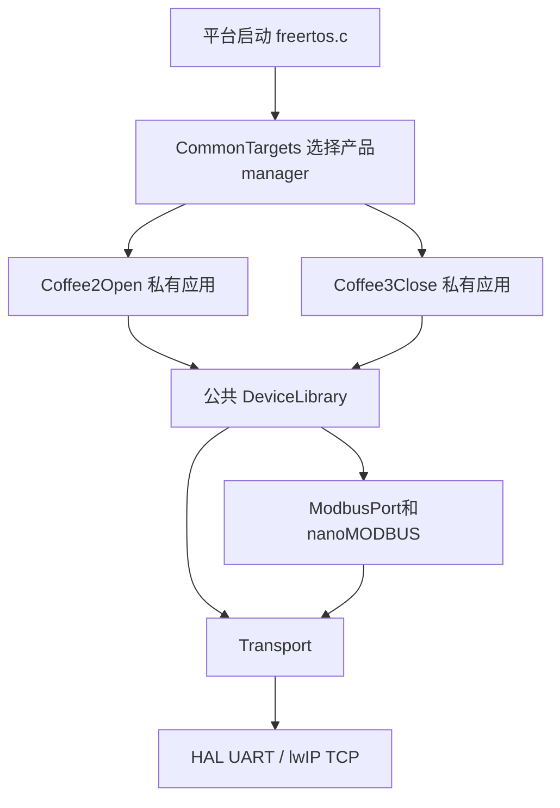

# 01 工程目录、公共私有边界与Target组合

日期：2026-09-08。先读 [CommonTargets.h](../../../../Application/Common/CommonTargets.h)、[Application CMake](../../../../Application/CMakeLists.txt)，再沿本篇跳到具体模块。

## 从一台咖啡机命令看四个层次

Coffee3业务需要制作一杯指定配方：Workflow决定何时做；Device消息说明设备2和action200；RTU Bus2把它翻译成M50动作；M50设备库构造寄存器访问；ModbusPort/nanoMODBUS构帧校验；Transport UART发送字节；HAL与中断完成硬件收发。

这里业务动作200不是M50寄存器地址，设备2不是从站2，Bus2不是一个公共设备库枚举。每一个编号只在它所属的边界内有意义。

这是可用依赖关系图；同一次固件只选择一个Target，不会同时启动C和D。F200走设备库到Transport的边，M50走ModbusPort边。

## 文件夹如何对应职责

| 目录 | 拥有的数据/逻辑 | 不在这里决定的内容 |
| --- | --- | --- |
| Common | 日志环、崩溃上下文、OTA引擎、TCP会话状态 | 产品订单/出餐语义 |
| Transport | 字节通道、收发操作表、后端状态 | 哪个寄存器表示咖啡完成 |
| ProtocolStack/ModbusPort | 协议事务、回调、错误映射 | 某产品使用哪个从站/配方 |
| New_Party/nanoMODBUS | 标准Modbus编解码 | Coffee3储位/出餐门 |
| DeviceLibrary | 设备原生寄存器、帧、解析与动作API | Coffee2业务步骤编号 |
| UserAPP/Coffee2OpenApp | F200、出口、私有绑定、状态投影、Server语义 | 定义公共Modbus协议 |
| UserAPP/Coffee3CloseApp | M50、储位、门、水路、私有绑定和Server语义 | 修改公共库为只服务Coffee3 |

DeviceProtocol没有作为独立层恢复。自有协议不等于私有业务：F200帧格式可给任意Target复用；coffee2_device_image里的全局实例、上位机投影是Coffee2所有。

## CommonTargets为何位于Common却包含私有头文件

头文件先包含compiler_compat、Log、OTA、TcpClientSession等公共声明；缺省USE_COFFEE2/USE_COFFEE3设0，再分别条件包含manager。它不创建对象，也不注册运行时插件。实际组合入口是平台freertos.c。普通设备库不应包含它来获得产品业务API。

两套manager使用相同 `xAppTaskManagerCreateTasks` 等符号名，依靠构建选择避免重复定义；这不是两个Target运行时互相调用。同理每套产品提供自己的崩溃输出强实现。

## 一个设备共享多个逻辑角色

Cup和Lid在Bus3/unit1，是同一物理控制器的不同角色。Binding.ucRole传入公共ShengShu接口后选择寄存器区域。若把每个逻辑设备编号都当unit，就会给错误地址发帧。

设备ID10明确是16路输出模块；Binding把它送Bus5/unit2。上位机看外部DO第1组，但私有数组名为MB2YPin。名称相似不表示这三个空间数字必须一致。

## 如何从一个定义往两边读

打开 `Coffee3Command_t` → 找 `xCoffee3CommandSubmit` 写入ID和复制队列 → 找RTU任务取队列 → 找 `prvExecute` 的device/action switch → 打开公共M50接口 → 回到 `vCoffee3DeviceCommandCompleted` → 找WorkflowWaitCommand。用第22册定位，不从目录树猜。

下一篇核对哪些文件真的进入Keil/GCC；有声明的库不一定被产品选择，有选择的对象节也不一定最终留在固件。
