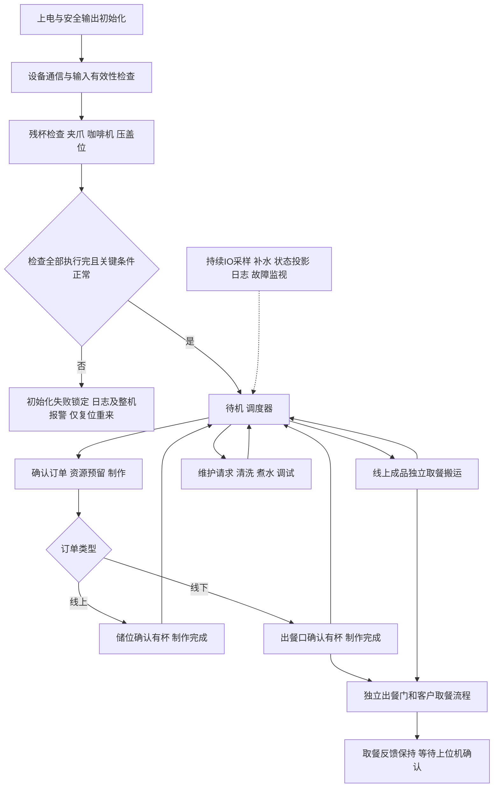
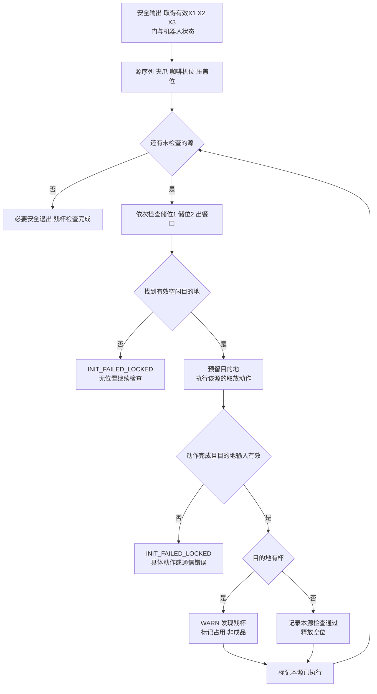
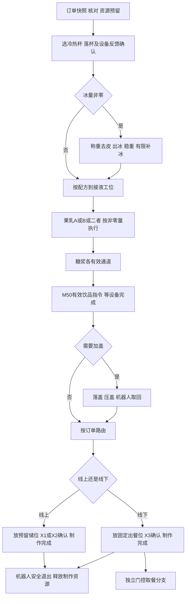
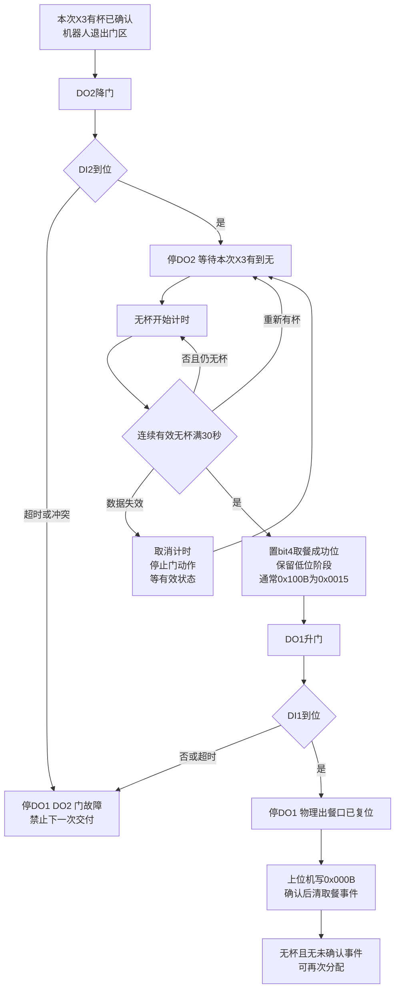
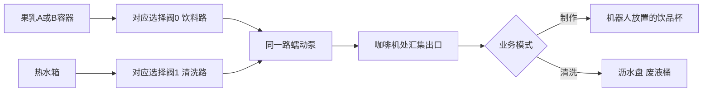
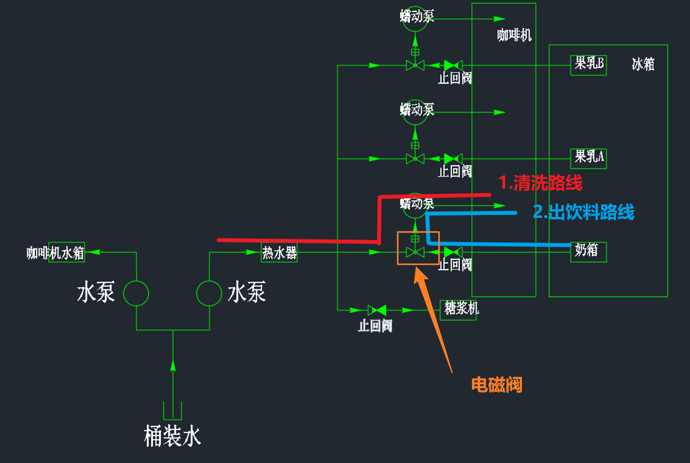
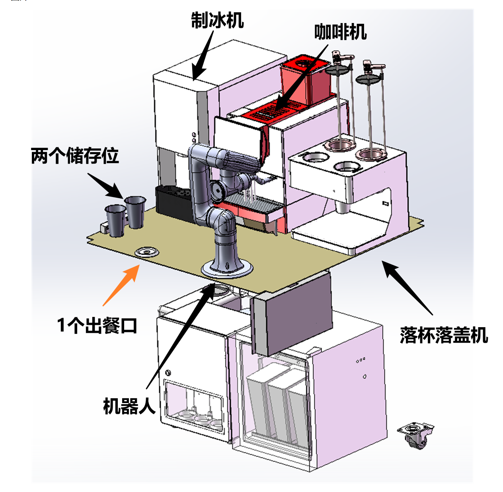
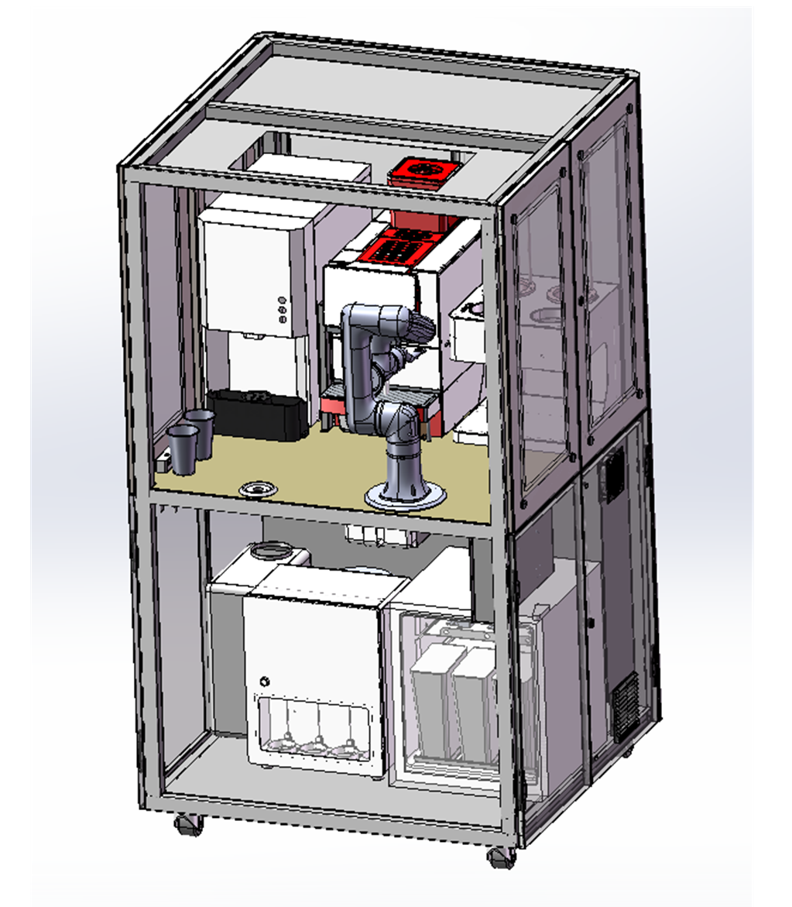

# Coffee3Close 第三版详细业务流程设计

> 版本：V3.0；日期：2026-09-03；状态：THIRD_DRAFT / 待用户审核。
> 本文是业务设计，不是已实现功能或硬件验收报告。只定义 Coffee3Close，不改变 Coffee2。
> 本轮用户修正优先于第二阶段修订稿、配置文件中残留的旧描述。原稿保留，不覆盖用户批注。

## 1. 本版结论与阅读导航

本机只有两个固定储杯位、一个固定出餐放杯位和一扇上下运动的门，**没有承载杯子的升降台**。
机械手放杯后，门下降供客户取餐；X3 从有杯变为无杯并连续保持无杯 30 秒后，门上升关闭。
线上订单放到储位即制作完成，线下订单放到出餐口即制作完成；顾客取走、门复位、上位机确认是另一条独立流程。

| 本版重点 | 章节 |
| --- | --- |
| 物理模型、所有 IO 与新宏名 | §3、§4 |
| 总流程、残杯检查、制作、取餐、清洗流程图 | §5 |
| 全部业务任务及入口/完成/异常细节 | §6—§9 |
| 上位机协议与完成反馈 | §10 |
| 并行、取消、断线、报警及时间参数 | §11—§13 |
| 验收场景、待审决策、证据 | §14—§16 |

状态标识：CONFIRMED=用户明确规则或当前资料直接支持；PROPOSED=本版供审核的设计决定；CONFLICT=资料冲突；UNKNOWN=缺少现场或协议证据；HISTORICAL=旧流程参考。

### 1.1 必须保留、最小设计、后置与删除

- 必须保留：残杯转移检查、线上/线下分流、独立取餐反馈、30秒连续空杯、原协议联动、全部现有设备/IO职责。
- 最小设计：一个制作上下文、两个储位记录、一个出餐口上下文、一个维护请求集合；业务子状态不等于新增 RTOS 任务。
- 后置：机器人制作间隙插入取餐、更多 IO 模组、打印硬件、运行时多协议插件；没有验证依据不增加。
- 从本版流程删除：杯托升降动作、第二出餐口、发现一只残杯就初始化失败、等待客户取走才结束制作、循环重做初始化。
- X8 安全光栅本版仅占位：可采样/显示，不参与准入、门控、初始化或报警判定。不能宣称本机已具备防夹或人员安全保护。

## 2. 相对第二版的业务修正

| 项目 | 旧稿问题 | V3 唯一有效规则 |
| --- | --- | --- |
| 出餐机构 | 门和升降机构混写 | 杯不升降；仅门下降开、上升关，DO2/DO1分别控制 |
| 制作完成 | 线下可能等到顾客取走才完成 | 线上储位确认有杯、线下出餐口确认有杯时完成 |
| 取餐结束 | 无杯就复位，和安全光栅耦合 | 本次有杯→无杯，连续无杯30秒；再升门，光栅不参与 |
| 残杯发现 | 检测到杯即失败 | 搬出杯只记 WARN 和占位，继续下一源位置 |
| 残杯目的地 | 顺序混乱或预先要求全部空 | 每步按储位1→储位2→出餐口选一个当前可用空位 |
| 检查完成 | 最终要求三个位置全部空 | 三个无传感器源位置均执行完即可；残杯可留在目的地 |
| IO编号 | X01、Y11(N01)与新编号混用 | 外部 X1—X16、Y1—Y16；本机始终叫 DI/DO |
| 果乳 B | 一处误写 X3 | 果乳 B=X13、Y6、Y11；X3只表示出餐口有杯 |
| 果乳阀 | 正常出液位置不明确 | 阀0选饮料，阀1选清洗；先选路、再启动泵 |
| 上位机断线 | 可能停止订单 | 已确认订单继续执行；重连查询，不重做订单 |

## 3. 物理对象与设备职责

### 3.1 空间模型

| 对象 | 检测依据 | 业务含义 |
| --- | --- | --- |
| 夹爪 | 无杯传感器 | 上电先假设有杯；不能先开爪或随意回原点丢杯 |
| 咖啡机接液位 | 无杯传感器 | M50原生出口与果乳A/B额外管路汇集；搬运间接检查 |
| 压盖位 | 无杯传感器 | 由机器人执行取杯及放杯检查，不能编造有杯输入 |
| 储位1/前 | X1 | 线上成品或残杯/废杯；占位不等于可售成品 |
| 储位2/后 | X2 | 同上，优先级低于储位1 |
| 固定出餐位 | X3 | 单一交付位；杯静止，门运动 |
| 出餐门 | DI1上限、DI2下限 | 上限=门升起关闭，下限=门降下打开 |
| 落杯/落盖设备 | 设备原生状态 | 合体式同一站号；不是两个独立RTU设备 |
| 制冰/称重位置 | 制冰机、秤状态 | 杯放置方式、称重稳定条件须点位/实机确认 |

未知杯位不能伪装为空。目的地可用至少要求：输入有效且新鲜、无杯、未被其他业务预留；出餐口还要求门和取餐上下文允许机器人放杯。
图片提供空间和水路认知，不提供电气极性、机器人坐标、动作完成位或安全认证。

### 3.2 固定设备组合

| 设备/功能 | 通道与配置 | 业务职责 |
| --- | --- | --- |
| 越疆机器人 | Modbus TCP，IP/端口/点位待配置核验 | 抓放杯、移位、压盖动作；只接受一个动作所有者 |
| 日志 | UART1 / 115200 | 人类可读英文日志、IO宏名、故障上下文 |
| M50 | UART2 / 115200 / Unit1 | 原生饮品、奶/水、清洗、设备状态；不负责整机订单 |
| 合体落杯落盖机 | UART3 / 9600 / Unit1 | 冷热杯/盖通道执行和状态 |
| 糖浆机 | UART3 / 9600 / Unit2 | 各通道定量出液、清洗 |
| 电能表 | UART3 / 9600 / Unit3 | 电量/运行信息采集，不能驱动业务步骤 |
| 制冰机 | UART4 / 19200 / Unit1 | 出冰及停止 |
| 称重模块 | UART4 / 19200 / Unit2 | 去皮、重量/稳定性反馈 |
| 16DI模组 | UART5 / 38400 / Unit1 | FC02读取外部输入 |
| 16DO模组 | UART5 / 38400 / Unit2 | 输出控制与FC01回读；成功写入不等于机构实际完成 |
| 本机8DI/8DO | PE0—PE15 | 门、水箱、补水泵 |

上述串口参数来自 Coffee3Close 配置说明。公共设备库只提供设备能力；设备选择、命令编排、IO名称、订单/寄存器语义留在 Coffee3Close 私有层。不恢复 DeviceProtocol 层，不让公共模块引用任何 target。

## 4. IO 映射、宏名与使用规则

### 4.1 编号与电平原则

- 本机输入 DI1—DI8，本机输出 DO1—DO8；外部输入 X1—X16，外部输出 Y1—Y16。即使协议页面把本机也写成 X/Y，日志仍使用 DI/DO区分。
- 每组点号 n 对应 bit(n-1)，不是十六进制半字节编号。Y10=bit9=0x0200，Y11=bit10=0x0400。
- 本机DI按既有代码低电平有效归一化：GPIO_RESET→逻辑1。本文输出逻辑1只表示激活，不直接指定GPIO电平；当前Coffee2 DO镜像按ODR高位发布1，不能宣称现有DO代码也已低有效。输出端驱动/继电器实际极性须核验后由Coffee3适配，不能只改镜像而不改驱动。板卡连线见当前 `coffee2_io.c:33` 与 `:46`，Coffee3接线仍需实物核对。
- 外部输入不因本机低有效而统一取反，采用模组返回值并逐点核对。当前配置只写X4“低液位信号”，没有定义电平；旧《Coffee3Close设计初稿.txt:26》写“无信号报警”。本版暂按后者提出X4=1水源可用、0不可用的业务假设，标为PROPOSED；实际极性UNKNOWN。以下X4准入/停机条件均依赖这一假设，现场确认前不得批准自动抽水；不能把“低液位”名称直接翻译成有效状态。批复:X4是水桶低信号告警,不能继续抽水动作,每次订单制作开始需要检查这个X4,有信号才能工作,如果无信号就进行告警,参见Coffee1的处理方式以及server协议对应内容,如果是订单制作过程中无需停止制作,因为对应的水箱仍有储备水用,但是制作完该订单需要进行告警和订单制作失败的回复
- 原始位、逻辑意义、有效性是三个概念。失联/过期不能被解释成“无杯”。输出回读只能证明控制位，不能证明水真的流出、阀芯切换或门已到位。

### 4.2 本机输入（0x10F0，bit0—7）

| 点/引脚/bit | 英文宏名 | 有效含义与消费者 |
| --- | --- | --- |
| DI1 / PE0 / 0 | `DI1_OUTLET_DOOR_UPPER_LIMIT` | 门升起关闭到位；初始化、出餐门、手动 |
| DI2 / PE1 / 1 | `DI2_OUTLET_DOOR_LOWER_LIMIT` | 门下降打开到位；出餐门、手动 |
| DI3 / PE2 / 2 | `DI3_COFFEE_WATER_TANK_HIGH_LEVEL` | 咖啡水箱高位，停止DO4 |
| DI4 / PE3 / 3 | `DI4_COFFEE_WATER_TANK_LOW_LEVEL` | 咖啡水箱需要补水，启动一次补水周期 |
| DI5 / PE4 / 4 | `DI5_HOT_WATER_TANK_HIGH_LEVEL` | 热水桶上限/溢出报警，停止DO3和加热 |
| DI6 / PE5 / 5 | `DI6_HOT_WATER_TANK_LOW_LEVEL` | 热水桶注水目标到位；加热水位条件需极性核验 |
| DI7 / PE6 / 6 | `DI7_RESERVED` | 备用，显示实际电平，不参与业务 |
| DI8 / PE7 / 7 | `DI8_RESERVED` | 同上 |

### 4.3 本机输出（0x10F8，bit0—7）

| 点/引脚/bit | 英文宏名 | 动作和停止条件 |
| --- | --- | --- |
| DO1 / PE8 / 0 | `DO1_OUTLET_DOOR_UP` | 升门关闭；DI1到位/超时/取消时停止；与DO2互斥 |
| DO2 / PE9 / 1 | `DO2_OUTLET_DOOR_DOWN` | 降门打开；DI2到位/超时/取消时停止；与DO1互斥 |
| DO3 / PE10 / 2 | `DO3_HOT_WATER_TANK_SUPPLY_PUMP` | 热水桶供水；DI6目标/DI5报警/超时停止 |
| DO4 / PE11 / 3 | `DO4_COFFEE_WATER_TANK_SUPPLY_PUMP` | M50水箱补水；DI3或20秒停止 |
| DO5 / PE12 / 4 | `DO5_RESERVED` | 备用，自动业务不驱动 |
| DO6 / PE13 / 5 | `DO6_RESERVED` | 同上 |
| DO7 / PE14 / 6 | `DO7_RESERVED` | 同上 |
| DO8 / PE15 / 7 | `DO8_RESERVED` | 同上 |

### 4.4 外部16DI（0x10F2，Unit1，输入起始0）

| 点/bit | 英文宏名 | 逻辑用途 |
| --- | --- | --- |
| X1 / 0 | `X1_CUP_Storage_1` | 储位1有杯：残杯、成品暂存、取餐 |
| X2 / 1 | `X2_CUP_Storage_2` | 储位2有杯：同上 |
| X3 / 2 | `X3_OUTLET_CUP` | 出餐口有杯：放杯确认、有→无及30秒判断 |
| X4 / 3 | `X4_PURE_WATER_BUCKET1_LOW_LEVEL` | 暂拟0无水停机/禁止抽水；实际极性待确认，见§4.1 |
| X5 / 4 | `X5_WASTE_RESIDUE_BIN` | 1有废渣箱，0报警停机 |
| X6 / 5 | `X6_WASTE_LIQUID_BUCKET` | 1有废液桶，0报警停机/停止清洗 |
| X7 / 6 | `X7_WASTE_LIQUID_HIGH_LEVEL` | 1废液满，报警停机/停止清洗 |
| X8 / 7 | `X8_OUTLET_SAFETY_LIGHT_CURTAIN` | 光栅占位，仅显示；本版无安全联动 |
| X9 / 8 | `X9_RESERVED` | 备用 |
| X10 / 9 | `X10_RESERVED` | 备用 |
| X11 / 10 | `X11_MILK_BOX_R1_LEVEL` | 奶料可用性，仅含奶订单/相关维护需要 |
| X12 / 11 | `X12_FRUIT_DRINK_A_R2_LEVEL` | 果乳A料位 |
| X13 / 12 | `X13_FRUIT_DRINK_B_R3_LEVEL` | 果乳B料位，不是X3 |
| X14 / 13 | `X14_RESERVED` | 备用 |
| X15 / 14 | `X15_RESERVED` | 备用 |
| X16 / 15 | `X16_RESERVED` | 备用 |

### 4.5 外部16DO（0x10FA，Unit2，线圈起始0）

| 点/bit | 英文宏名 | 使用 |
| --- | --- | --- |
| Y1 / 0 | `Y1_WATER_HEATER_RELAY` | 热水桶加热继电器 |
| Y2 / 1 | `Y2_RESERVED` | 备用 |
| Y3 / 2 | `Y3_RESERVED` | 备用 |
| Y4 / 3 | `Y4_MILK_BOX_R1_SOLENOID_VALVE` | 奶路选择阀；正常奶路0，清洗1为拟定，须确认M50外奶管配合 |
| Y5 / 4 | `Y5_FRUIT_DRINK_A_R2_SOLENOID_VALVE` | 果乳A：0饮料、1清洗水 |
| Y6 / 5 | `Y6_FRUIT_DRINK_B_R3_SOLENOID_VALVE` | 果乳B：0饮料、1清洗水 |
| Y7 / 6 | `Y7_RESERVED` | 备用 |
| Y8 / 7 | `Y8_RESERVED` | 备用 |
| Y9 / 8 | `Y9_RESERVED` | 备用 |
| Y10 / 9 | `Y10_FRUIT_DRINK_A_PERISTALTIC_PUMP` | 果乳A动力；饮料与清洗共用 |
| Y11 / 10 | `Y11_FRUIT_DRINK_B_PERISTALTIC_PUMP` | 果乳B动力；饮料与清洗共用 |
| Y12 / 11 | `Y12_RESERVED` | 备用；不沿用Coffee2助力泵业务 |
| Y13 / 12 | `Y13_RESERVED` | 备用 |
| Y14 / 13 | `Y14_RESERVED` | 备用 |
| Y15 / 14 | `Y15_RESERVED` | 备用 |
| Y16 / 15 | `Y16_RESERVED` | 备用 |

只在迁移对照中保留旧名称：旧Y11(N01)→Y1、旧Y14→Y4、旧Y15→Y5、旧Y16→Y6、旧Y20→Y10、旧Y21→Y11。不能全局把所有“Y11”替换成Y1，因为新Y11已经表示果乳B泵。
配置中“Y2-Y13备用”与逐点设备条目冲突，本版以明确点位条目为准：仅Y2/Y3、Y7—Y9、Y12—Y16备用。

### 4.6 上位机32路兼容页面

| FC03地址 | 当前发布 | 未安装通道处理 |
| --- | --- | --- |
| 0x10F0 / 4336 | 本机DI1—8→bit0—7 | bit8—15=0 |
| 0x10F1 / 4337 | 本机输入17—32 | 全0 |
| 0x10F2 / 4338 | 外部输入模组1 X1—16 | 实时采集 |
| 0x10F3 / 4339 | 模组1输入17—32 | 全0 |
| 0x10F4—0x10F7 / 4340—4343 | 未安装输入模组2/3 | 全0 |
| 0x10F8 / 4344 | 本机DO1—8→bit0—7 | bit8—15=0 |
| 0x10F9 / 4345 | 本机输出17—32 | 全0 |
| 0x10FA / 4346 | 外部输出模组1 Y1—16 | 实际输出回读 |
| 0x10FB / 4347 | 模组1输出17—32 | 全0 |
| 0x10FC—0x10FF / 4348—4351 | 未安装输出模组2/3 | 全0 |

整个0x10F0—0x10FF持续可读；预留通道零与“已安装模组失联”不同。失联保留最后值并发布在线异常，业务判断必须拒绝过期快照。不得伪造为全0、空杯或已关输出。

## 5. 业务流程图

图中名称为业务状态，不要求按节点新增函数、文件或线程。

### 5.1 整机主流程与并行分支



“回到调度器”不等于可立即移动机器人：上一放杯的安全退出动作未完成时机器人仍占用。客户等待不占制作锁，但占出餐口。

### 5.2 上电残杯转移检查



### 5.3 制作流程



非必需成分直接跳过；图不是“每单所有设备都动作”。糖浆实际接液点与果乳/M50出口是否相同仍需确认，不能让机器人停在错误工位出液。

### 5.4 出餐门与取餐反馈



“30秒”解释为**由有杯转为无杯后，连续保持无杯满30秒**，不是放杯后30秒内必须拿走，也不是等待30秒就强行关门。出现有效有杯即清零计时；采样失效期间不累计。
图中的取餐完成在连续无杯确认时锁存，门上升完成单独记录；门随后卡住不能把已取走改写成“客户没有取走”。这个反馈时点为本版PROPOSED，见§15。

### 5.5 清洗与出饮料水路



阀为选路，泵为动力。清洗结束先停泵确认，再恢复阀。M50内部奶泵由M50控制，不新增不存在的外部奶泵IO。

## 6. 全部业务任务清单

这里“任务”指业务职责，可以是同一Workflow的步骤/并行子状态；**不是要求创建26个FreeRTOS线程**。

| ID | 业务任务 | 触发 | 主要设备/IO | 详细说明 |
| --- | --- | --- | --- | --- |
| T01 | 平台和设备初始化 | 上电 | 所有通道、必要设备 | §7.1 |
| T02 | 残杯转移检查 | T01完成 | Robot、X1/X2/X3、门 | §7.2 |
| T03 | IO采样、状态投影、变化日志 | 周期 | 全部DI/DO/X/Y | §7.3 |
| T04 | 关键条件与故障监视 | 周期/设备事件 | X4—7、液位、必要设备 | §7.4 |
| T05 | 订单握手、准入与资源预留 | 0x0007/0x0008 | Server、目标位 | §8.1 |
| T06 | 冷热杯准备 | 制作步骤 | Robot、合体杯盖机 | §8.2 |
| T07 | 出冰、称重、补冰 | 非零冰量 | Robot、Ice、Scale | §8.3 |
| T08 | 果乳A/B定量 | 非零果乳量 | X12/X13、Y5/Y6、Y10/Y11 | §8.4 |
| T09 | 糖浆定量 | 非零糖浆量 | Syrup、Robot | §8.5 |
| T10 | M50饮品/奶/水 | 配方需要 | M50、X11、DI3/DI4 | §8.6 |
| T11 | 落盖压盖 | 加盖选择 | 合体杯盖机、Robot | §8.7 |
| T12 | 线上成品入库 | 线上制作末尾 | Robot、X1/X2 | §8.8 |
| T13 | 线下成品直出 | 线下制作末尾 | Robot、X3 | §8.9 |
| T14 | 已存成品独立取餐搬运 | 0x0009/0x000A | Robot、X1/X2/X3 | §8.10 |
| T15 | 出餐门与客户取走监视 | 放杯确认 | X3、DI1/DI2、DO1/DO2 | §8.11 |
| T16 | M50水箱自动补水 | DI4补水需求 | X4、DI3/DI4、DO4 | §9.1 |
| T17 | 热水桶注水与定时加热 | 0x0080 | X4、DI5/DI6、DO3、Y1 | §9.2 |
| T18 | 清洗请求调度 | 各清洗命令 | 制作/水路/排水资源 | §9.3 |
| T19 | M50咖啡系统清洗 | 清洗类型 | M50、X6/X7 | §9.4 |
| T20 | M50奶系统清洗 | 0x0083或具体类型 | M50、Y4、X6/X7 | §9.5 |
| T21 | 果乳A/B单路或多路清洗 | 0x00A3/0x00A4 | Y5/Y6、Y10/Y11、X6/X7 | §9.6 |
| T22 | 糖浆系统清洗 | 0x0082/0x0063 | Syrup、水源、排水 | §9.7 |
| T23 | 手动设备和IO调试 | 专用调试寄存器 | 被选设备/输出 | §9.8 |
| T24 | 取消、安全收尾、废杯回收 | 取消/业务失败 | 当前设备、Robot、空储位 | §11.3 |
| T25 | 通信、结果保持、版本/升级维护 | 请求/断线/重连 | Server、日志、OTA | §10、§11.4 |
| T26 | 电能与非关键设备监测 | 低频轮询 | 电能表 | §9.9 |

## 7. 启动、残杯与基础监视详细逻辑

### 7.1 T01 平台和设备初始化

1. 上电设置本机可控危险输出为停止；远程输出必须取得通信后发安全目标并回读，不因本地变量为0就宣称继电器关闭。
2. 初始化日志、Server、Robot通信和UART2—5总线所有者；每条物理总线只一个事务所有者。
3. 收集有效IO、机器人、M50及杯盖设备状态，区分“通信可用”和“设备业务准备好”。设备上电加热不等于通信失败。
   软件实施前必须完成X4及各液位输入的实物有料/缺料真值核验；未确认极性不能仅凭“通信有效”批准自动补水、出液或加热。
4. 检查门DI1/DI2，禁止双方向同时输出。门安全初始化不得让未知夹爪/门区状态下的机器人先开爪或盲目运动。
5. 进入T02；必要设备失败/状态无法确认按具体原因锁定，0x1020=0x0004，日志每个失败事件只记一次。非必要电能表失联单独WARN。

初始化安全路径、持杯从当前位置到首个储位的机器人程序必须由点位工程验证；未知上电姿态不能靠软件猜测坐标。
PROPOSED门初始处理：DI1有效则保持升起关闭且双输出停；只有DI2有效或两限位都无效时，只有已确认机器人退出门区、允许门单独复位的条件下才执行升门至DI1。当前无此可证明条件时锁定并要求人工复位姿态，不盲动门。该预置动作不是杯托回原点，更不能先打开可能持杯的夹爪。

### 7.2 T02 残杯检查——三个源、动态目的地

**源顺序固定：夹爪 → 咖啡机接液位 → 压盖位。** 可检测的储位/出餐口先只采样占用，不自动清空，也不因为已有杯直接失败。

每个源执行相同规则：

1. 先看是否还有源未完成；没有则结束检查，不再为下一次不存在的动作寻找空位。
2. 使用新鲜输入依次查储位1(X1)、储位2(X2)、出餐口(X3)。有杯就跳过该目的地，必要时打印一次该位置有杯的WARN。空位预留后再次确认，禁止覆盖已有杯。
3. 没有可用目的地：立即 `INIT_FAILED_LOCKED`，原因“未完成某源残杯检查，三个目的地都不可用”，同时给出每位占用/无效/不可达原因。
4. 夹爪源不再抓取，直接按持杯安全路线放到目标；咖啡机源、压盖源分别执行其既定取杯→放到目标动作，即使实际无杯也完成整套动作。
5. 必须确认本次机器人动作完成，再等待目的地传感器稳定，不能用上一动作完成位或写请求ACK替代。
6. 目的地为0：本源检查通过，目标仍空；下一个源可继续使用它。前提是动作和传感器均可信，不能把通信丢失当成无杯。
7. 目的地为1：本源检查已执行完成，WARN“从哪个源移出的残杯现放在哪”；目标标为残杯占用，不计制作成功、不绑定可售订单。
8. 转下一个源。最终必要安全退出完成后，残杯检查完成；关键业务条件通过再待机。

**重要边界：** 若最后一个源完成后刚好把第三个目的地填满，残杯检查仍然完成，不倒退成“未完成检查”。但三位满会触发容量不可用报警、禁止新制作，不能宣称可以接单。
若第二个源完成后三位已满而压盖位尚未检查，则是初始化失败。此差异必须写入测试。

容量不足与设备安全故障分开处理：检查已完成后的容量报警只禁止无法预留目的地的新制作，不能反过来封死合法的成品取餐或已在运行的门口取餐分支。已有残杯/废杯仍需人工处理，不能用“容量报警解除”把它们改成成品。真正INIT_FAILED_LOCKED仍只允许人工处理后复位。

残杯/废杯保留在目的地：本版建议不自动当正常订单向客户交付；出餐口残杯的人工取走不生成消费者订单取餐成功。如何安全开放门给维护人员见§15，不凭空关联订单。
锁定后不自动重试、不接受清报警跳过；人工处理后复位从头检查。发现残杯的WARN与导致锁定的ERROR是两类不同事件。

### 7.3 T03 采样与投影

- 本机建议50ms采样；外部16DI/16DO建议先沿用每200ms各取得一次快照的预算，Bus5串行执行，真实刷新率待总线测量。30秒计时以时钟差值而非轮询次数实现。
- 每份样本带内部有效性和更新时间；无效时阻断依赖它的搬杯/关门/液位判定。
- 首次有效采样建基线，之后仅变化时打印点名、0→1/1→0及作用；恢复在线另记一次。X8可显示但不驱动安全分支。
- IO页面发布同一归一化状态；读寄存器不能投递调试动作。实际存在的备用输入照实显示；不存在的32路高半区/扩展模块返回0。

### 7.4 T04 运行条件与报警

- 暂按§4.1待核验真值假设，X4=0、X5=0、X6=0或X7=1：报警停机，停止受影响的抽水/出液/清洗，制作进入T24，不直接断电让机器人失去持杯能力。X4极性未确认前不能将这一表达直接投入实机运行。
- X11/X12/X13缺料：对应奶/A/B订单或当前通道失败；不误报为“所有饮品均无法制作”。全局是否禁售由配方依赖决定。
- DI1与DI2同时有效：门故障，停止DO1/DO2。门未到位时不发布出餐口可分配。
- 必要IO失联：依赖步骤失败；电能表故障只降级监测。
- 初始化失败锁定和普通运行故障分开：普通故障清除须条件恢复、输出停止、杯位明确；不自动重做已出液动作。
- 不依赖X8停机；防夹能力缺口明确保留为实机/投产审查项。

## 8. 订单与取餐任务详细逻辑

### 8.1 T05 接收、准入、预留

1. 按协议0x0000等写入配方，0x0007=1及0x0008=1作为提交/核对条件。冻结全部使用字段，而非只复制0—6漏掉果乳/糖浆扩展量。
2. 同一个确认事务只执行一次，保持本次订单号和版本；重复写/重连不重复出杯。协议没有全局永久唯一订单ID，不能简单把历史同号永久拒绝。
3. 高位0x0NNN线上、0xDNNN线下；0订单号与空值冲突，首版建议拒绝0并列入主机协议核验。
4. 检查初始化、关键输入、配方必需设备、打印等硬件支持、可用目的地。无奶的配方不强制检查X11；当前没有打印配置，打印选择非零明确拒绝，不默默跳过。
5. 线上预留储位1否则储位2；线下预留唯一出餐口。出餐口有杯、门未关闭复位或上次取餐反馈未确认，不能预留给线下单。
6. 无目的地则准入失败并报告容量原因，不先落杯再赌客户会拿走。已做出的废杯/残杯占位同样参与容量计算。
7. 当前制作未释放时不接受另一份活动制作快照；协议仅有一个制作结果槽，不新增暗中排队。完成后仍遵守0x0007清零再提交下一单的握手。

新订单可在客户等待分支运行期间接收制作，**前提是它所需目的地可预留且机器人已安全退出上一动作**。例如线下A已到出餐口，线上B可用空储位开始；线下B不能向仍被A占用的出餐口制作直出。

### 8.2 T06 冷热杯准备

- 根据冰量/杯型映射选择通道，机器人到已验证接杯位置，调用合体杯盖设备单次动作。
- 优先使用设备原生杯到位/缺杯/动作反馈；未核实有该传感器前，不写“STM32已直接看到杯”。落杯位置已有异常残留应失败，不能直接拿来当新订单杯。
- 完成条件是该动作的终态及可用反馈满足；超时停止推进，禁止对不确定是否已落杯的命令自动无限重发。

### 8.3 T07 出冰和称重

- 冰量0跳过；非零时到制冰接料位，确认秤在线、去皮完成和读数可信，按目标量执行出冰。
- 停冰后取得稳定重量；不足才在配置允许次数/总时长内补冰，超重不反复“补偿”。最大补冰次数、误差、稳定窗口尚未冻结。
- 任何秤失联、重量异常、停止失败都不能继续向未知杯内加料，转T24。无硬件检测的“有杯”不能仅由清零秤值推断。

### 8.4 T08 果乳A/B

- A使用X12/Y5/Y10；B使用X13/Y6/Y11。有效量为0的通道跳过，两个有效时首版A后B串行。
- 杯必须在汇集出口；先停对应泵，设选择阀=0，等输出事务成功及必要切换时间，再启动泵。
- 以已标定的流量系数把ml转成有上限的运行时间。使用宽类型计算、防溢出，系数无效拒绝执行；参数尚不能冒充已校准。
- 达量/时间→停泵→确认输出回读为0→结束。出液中缺料、通信失败或取消同样优先停泵，不直接切阀带压换路。
- 清洗阀不能因为订单量寄存器为1就打开；设备写ACK不表示液量已实际达到。

### 8.5 T09 糖浆

- 依据最终确认的订单字段转换各通道0.1ml用量，逐路执行；零量跳过，未安装通道非零必须拒绝。
- 机器人先到糖浆接液点，原生指令反馈结束后才能离开。与糖浆清洗互斥。
- 失败保留通道、用量、是否已出液及设备异常码；不把一次超时自动重试成双份糖浆。

### 8.6 T10 M50咖啡/奶/水

- M50是产品固定设备型号，不以Coffee2的F200动作表替代。菜单号来自现场M50 UI/协议映射，不把“配方0”当无饮品，因为0也是有效菜单。
- 确认杯位动作完成、M50可控空闲、所需水/奶条件满足后发送命令；本版按用户配置由M50完成奶/咖啡/水控制，不用外部阀冒充奶量控制。
- 等待与本次命令关联的设备运行/结束状态，不能看到空闲就认定刚发的命令已完成；明确指令接受、运行、结束或拒绝。
- M50完成后才取杯。当前M50做饮品时首版不穿插机器人去取其他订单，避免陌生点位与握手相互干扰；0x0043插入取餐窗口后置。
- 超时/设备报警转T24，记录M50原始状态/错误ID；无确认不重发饮品指令。

### 8.7 T11 落盖压盖

- 不加盖跳过；加盖按冷热杯和配置选择合体设备盖通道。
- 落盖反馈满足→机器人执行对应取盖/压盖/取回动作；未配置到位检测的压盖位用机器人动作终态判断，不编造杯信号。
- 夹杯/压盖动作失败停止自动搬运，无法确认杯位置时要求人工处理，不强行回Home。

### 8.8 T12 线上成品入库

- 复核预留储位仍为空且传感器新鲜；机器人放杯完成并稳定读到X1或X2=1后，绑定订单与储位，标为可售成品。
- **此时制作完成：0x1008=2、0x100A=1或2。** 不等客户扫码、不自动把成品转到出餐口。
- 机器人继续完成安全退出，释放机器人后才调度下一个使用者。制作完成反馈不应被后续Home故障改成“饮品未制作”，另报机器人故障。
- 放杯后未感应到杯属于制作交付失败，与残杯检查“无杯为通过”规则相反。

### 8.9 T13 线下成品直出

- 目的地只能是固定出餐口，不把线下单绕到储位。门应处于已验证的机器人放杯位置（本版采用升门关闭到位，待点位核验）。
- 机器人放杯动作完成且X3=1→0x1008=2、0x1009=1、0x100D=1、0x100B=5，建立出餐口关联上下文。
- 安全退出门区后由T15降门；顾客等待独立运行。下一个有资源的订单可开始，无需等30秒或客户拿杯。
- 新制作订单不能清掉上一单的出餐口上下文/取餐反馈；当前制作订单号与门口等待的订单号可以不同。

### 8.10 T14 线上成品独立取餐搬运

- 根据0x0009储位号、0x000A出餐口号，支持储位1/2、出餐口1；其他位置拒绝，不默认替换为1。
- 原协议要求0x0007=0；首版在制作动作释放后调度，不抢断正在出液/持杯动作。读取两字段组成完整请求，重复电平只消费一次。
- 确认源是有绑定关系的成品、源有杯、目的地空且可用，预留源和目的地，0x100B=2。
- 机器人取源杯→源传感器变0→放出餐口→X3变1；只有两端反馈满足才释放源储位、将杯和订单关联迁入出餐口，0x100B=5。
- 源取走后目的地未检测到杯：不能同时宣布成功和清掉订单记录，标明杯可能在途，取餐搬运失败=3并停机处理。
- 不再次改写该线上单的制作完成为制作中；它早在入库时完成制作。后续由T15完成客户取走。

### 8.11 T15 门控、连续空杯与确认

1. 本次放杯确认有杯后，且机器人已退出门区，停止DO1，再驱动DO2降门；DI2到位停DO2。超时/双限位立即停两个方向并记录门故障。
2. 开放期间持续监视X3。只有“本次曾确认有杯”的上下文才能由1→0启动30秒计时；上电空口不能产生取餐成功。
3. 30秒内重新有杯，立即清计时并继续等；失联/快照过期取消计时。恢复有效无杯后从0重新累计，禁止把断线期间算作客户取走。
4. 连续有效无杯满30秒：置本次取餐成功bit4=0x0010，保留阶段低位（正常组合0x0015，PROPOSED时点），启动DO1升门。上位机确认不能跳过这30秒或强迫门动作。
5. DI1到位停DO1。升门期间重新有杯，建议停门并报异常，不自动撞杯或来回反转；这不是防夹安全功能。
6. 主机0x000B=1确认仅清本次待确认成功高位，正常0x0015→0x0005，随后消费确认命令；不清制作结果。提前确认不得当作客户拿走、不得锁存给未来一次成功。建议主机观察确认复位与新状态，避免迟到重复ACK清错事件。
7. 取餐物理完成、门复位、主机确认各自独立；只有无杯+门复位+旧反馈已确认才重新分配出餐口。主机长期断线不妨碍当前关门，但单个反馈寄存器不能容纳无限次新交付，首版禁止覆盖旧事件。
8. 顾客一直不取杯：保持门开放和占位，不在30秒后自动关门/回收。是否设置“长时间未取”的提示阈值待审；可以提示超时但不能捏造成功。

## 9. 补水、维护和调试任务详细逻辑

### 9.1 T16 M50水箱补水

- DI4=1且DI3=0、水源X4有效可用（暂按§4.1假设，极性核验后启用）、无相关停机条件时启动DO4；DI3=1立即停，否则单次20秒到停。
- 20秒到仍无高位时记录补水异常，使用已有0x1029=1；不在DI4持续为1时无休止每周期重开20秒。恢复/再次触发规则须显式重新武装。
- DI3与DI4同时有效按疑似矛盾停止补水并诊断，最终依现场传感器组合确认；低需求和高到位不能靠名称猜极性。
- 可作为背景维护与制作并行，但水源/电源容量不允许两个水泵并行时由同一调度者串行。水源丢失立即停泵，不等20秒。

### 9.2 T17 热水桶注水与加热

- 0x0080=1请求，冻结0x0081时间；协议明确单位是分钟，不是秒，时间换算必须防溢出。0分钟建议拒绝，范围按0—255表格核对。
- 先停Y1；X4有水且输入有效，若DI6未到则开DO3，DI6到位即停。DI5高位是溢出报警，立即停DO3/Y1；注水超时用0x1029=2。
- 注水完成后才允许Y1加热，时间到停Y1，发布0x1082对应状态。没有温度反馈不能把“加热到时”写成“水温已沸腾”。
- 加热中失去可信水位、溢出、取消、停机条件立即关闭；干烧/过温应有独立硬件保护，本文件不认定软件可替代。
- 首版建议先完成注水加热，再用热水清洗；加热与消耗同一箱水并行后置。水量不足不得仅靠计时继续加热。

### 9.3 T18 清洗调度与资源约束

- 制作过程中收到清洗命令，保存一次待执行请求，**不打断当前制作**；重复命令合并，不无限堆积。
- 制作杯已离开所有接液/清洗工位、机器人完成安全退出、水路和废液条件满足后，先执行已等待的清洗再接下一单，避免永远饿死维护。
- 清洗需要的杯位是咖啡/糖浆排液位置，不是固定出餐口；门外客户等待本身不阻止清洗，但机械路径和排液不得影响客户。
- 果乳A/B允许多路并行；M50奶/咖啡和糖浆首版依现有设备互斥串行，未经流量/排水验证不默认所有清洗同时开始。
- 每种清洗完成/失败要返回到请求状态并清执行标记，不靠地址持续为1每轮重新启动。

### 9.4 T19 M50咖啡系统清洗

- 0x0042具体清洗类型等指令按M50已支持的映射执行；确认M50空闲、无杯接液、废液桶存在且未满。
- 不随意打开奶/果乳阀。咖啡清洗的内部水路由M50原生程序控制，不能把示意图解读为所有水路一定用同一外部阀。
- 等本次清洗程序真实结束；拒绝/超时/取消发协议支持的停止并等待可确认状态，不能把写入成功当完成。

### 9.5 T20 奶系统清洗

- 0x0083自动奶路清洗与0x0042各奶系统清洗类型需明确对应M50支持程序，不能假定全部同义。
- 按图提出：先Y4=1选清洗水，确认阀输出和切换等待，再启动M50外奶管相关清洗；由M50内部动力抽水。
- 结束/取消时先让M50相关泵停止且状态可确认，再恢复Y4=0；未知设备仍运行时不直接切回饮用奶。
- Y4实际阀型、M50哪种清洗会使用该外部管路仍为UNKNOWN，不能仅凭图批准该动作自动执行。

### 9.6 T21 果乳清洗（支持A/B同时）

1. 检查无饮品杯接液、热水准备好、X6=1且X7=0、输出模组在线；选择要清洗的A/B通道。
2. 对所选通道先确保泵关，写选路阀=1；A为Y5、B为Y6。两路可合并同一阶段的设置。
3. 等待该阶段全部写成功、回读一致及必要阀切换时间，再打开Y10/Y11。禁止一包同时打开阀和泵而声称“先阀后泵”已满足。
4. 多路可共用启动时点但各自计时；结束或取消先关闭全部相关泵，确认后恢复对应阀0。
5. 任一阀设置失败：不启动泵；泵停止无法确认：标明控制结果未知并报警，不宣称清洗安全结束。物理输出失控需要硬件处理。
6. 异常/废液满立即执行停止路径；清洗耗时、热水容量、并行排水能力待标定。

上位机FC16“写多个寄存器”与下游IO的线圈命令是两层协议。当前可复用逐点FC05；只有确认模组和公共驱动支持FC15/对应寄存器批写后，才合并同阶段输出。即使支持批写，选阀阶段与开泵阶段仍须分开确认。

### 9.7 T22 糖浆清洗

- 0x0082自动清洗、0x0063手动清洗复用同一糖浆设备流程，要求糖浆出液空闲、清洗水和废液条件满足。
- 原生设备完成状态为依据；不操作不属于糖浆机的Y5/Y6作为替代。实际糖浆清洗进水接法按管路验收。
- 失败保存具体通道/设备码，停止设备；不能无休止重发清洗命令。

### 9.8 T23 手动调试

| 调试项 | 已有协议入口 | 处理规则 |
| --- | --- | --- |
| Robot使能/停/暂停/拖拽/点位 | 0x0030—0x0033 | 点位映射核准；与自动机器人动作互斥 |
| M50饮品/冲洗/取消 | 0x0040、0x0042、0x0047 | 沿用单次设备动作；不生成正常客户订单 |
| 冷热杯/盖 | 0x0050 | 合体设备同一Unit1，参数按通道映射 |
| 糖浆 | 0x0060—0x0063 | 数量、通道、停止路径检查 |
| 制冰 | 0x0070、0x0071 | 单位与当前文档冲突需核定；设置上限 |
| 果乳/清洗 | 0x00A1—0x00A4 | 只A/B安装通道；模式选路先于泵 |
| 本机输出位图 | 0x0208 | 本版沿用用户已定低8位0x01—0x80，多点可同时写；协议旧高字节写法见§15 |
| 外部输出位图 | 0x0209 | bit0—15；保留自动任务所有权，不能覆盖其阀泵 |
| 门开/关/停 | 0x0092、0x009D拟映射 | 开=DO2下降，关=DO1上升；0x0091旧杯托升降不偷偷映射成第二套门动作 |
| 注水加热 | 0x0080/0x0081 | 同T17互锁、超时 |

单次请求只投递一次，有一个Modbus响应；FC06/FC16支持合法多寄存器、多点控制，不人为限制为数量1。但要预校验整个请求与资源归属：DO1/DO2双向同开必须拒绝，不能“多点支持”就越过互锁。
Modbus正常写响应表示请求接收/按约定提交，不保证异步外部IO已执行成功；执行失败用现有状态和日志反馈。DO回读用真实输出镜像，不先写期望值伪造成功。
自动运行期间拒绝冲突调试；维护模式动作需最大时长和停止入口。初始化锁定不得通过调试偷偷恢复生产；仅经明确许可的维护停止/安全操作保留，任意机器人动作不默认放行。

### 9.9 T26 电能监测

低频读取并发布0x101A/0x101B。通信失败保留最后数据并明确在线异常，WARN一次/恢复一次；不把电能表异常误写为“落盖初始化失败”，不驱动机器人重做检查。

## 10. 上位机协议与三类完成语义

依据当前DOCX寄存器表（§3写入、§4读取；证据§16）。下面是Coffee3拟定投影，不宣称当前target代码已经实现。

| 事件/字段 | 寄存器 | Coffee3语义 |
| --- | --- | --- |
| 当前制作订单 | 0x1000及配方回显 | 当前制作事务；不是出餐口等待事务 |
| 制作状态 | 0x1008 | 0默认、1制作中、2制作完成、3失败 |
| 线上成品放置 | 0x100A | 放储位成功后填1/2 |
| 线下成品放置 | 0x1009、0x100D | 唯一出餐口1 |
| 独立取餐请求 | 0x0009、0x000A | 储位1/2、出餐口1，按协议须0x0007=0 |
| 出餐口1状态 | 0x100B | 低半字节：2机器人搬运、5放杯完成、3失败、4超时；bit4=取餐成功待确认；正常成功组合0x0015 |
| 取餐反馈ACK | 0x000B=1 | 仅确认口1已发布的成功事件，不是“命令门关闭” |
| 出餐口2状态 | 0x100C | 未安装，保持默认，不产生口2事件 |
| 门/出餐口资源状态 | 0x1090 | 低半字节：1待机、2忙碌、3报警；依赖输入失联时0；无口2，高半字节0 |
| 口1传感器 | 0x1091 | bit0=X3，bit3=DI2开门到位，bit4=DI1关门到位；不存在的杯托升降bit1/2=0；bit5显示X8但不参与控制 |
| 口2传感器 | 0x1092 | 未安装，全0；不复制口1数据 |
| 整机状态 | 0x1020 | 1待机、2初始化、3忙碌、4报警；报警优先 |
| 储杯占用 | 0x1027 | bit0=X1、bit1=X2；不承诺区分废杯与成品 |
| 补水异常 | 0x1029 | 1咖啡水箱抽水异常、2热水抽水异常；不擅自扩错误码 |
| 果乳料位/运行 | 0x10A1/0x10A2、0x10A8/0x10A9 | A/B有料；停止/清洗/出液 |
| IO完整位图 | 0x10F0—0x10FF | §4.6，全部有效可读 |

### 10.1 三个不能混同的完成

1. **制作完成**：杯已放到订单规定目的地且该处有杯确认。立即可发布0x1008=2。
2. **客户取餐完成**：本次出餐口有杯后，连续有效无杯30秒确认。在0x100B置bit4（或0x0010），保留低半字节阶段，正常由0x0005→0x0015；不是制作再次完成。
3. **出餐口可再分配**：客户取走、门上限到位、旧成功事件已被上位机确认、无新杯或故障。

PROPOSED：0x1020反映当前是否有制作/维护占用或报警；单纯等待顾客且仍有其他可用资源不一律报整机忙碌。主机还需结合0x100B、储位占用和握手判断，不从一个整机状态猜所有资源空闲。
0x1090/0x1091按当前协议保留“门”和“杯托升降”两个不同语义字段：本机不存在杯托，不能为了填满旧页面而把DI1/DI2同时复制到杯托限位。旧主机若强依赖杯托限位，须对Coffee3页面做机型适配。

### 10.2 结果保持与并发示例

```text
线下A放到口1：制作结果A=完成；口1绑定A、等待客户。
主机读A结果并清0x0007；线上B预留空储位，开始制作。
A被拿走且持续无杯30秒：口1成功事件属于A，不改B制作结果。
门升起到位；主机确认口1成功；口1才可分配给后续线下单或线上取餐。
B放到储位：制作结果B=完成；B仍在储位，未生成客户取走事件。
```

现有取餐寄存器没有订单号/序列号字段，单口只允许一个未确认交付事件，主机依据已下发的交付请求关联。若需要未ACK也不断交付或乱序多事件，则需要协议扩展，本版不擅自增加。
初始化失败已有整机报警可反馈；详细残杯源/目的地原因无现成专用字段时必须写日志，不乱占0x1029。储位被残杯占用可通过0x1027和IO页看到，但“残杯类别”当前协议未定义。

### 10.3 Coffee1联动的位域兼容——不能整字覆盖

当前DOCX把0x0010称为取餐成功，但Coffee1实际是“阶段低4位 + 成功待确认bit4”组合，而不是互斥枚举：

```text
机器人搬运       0x0002
放杯完成         0x0005
客户取走已确认   0x0015 = 0x0005 | 0x0010
主机写0x000B=1  → 高4位清除，通常保留0x0005
门已复位且ACK已消费 → 允许新交付，新阶段再更新低4位
```

Coffee3保留该联动形式，只把“置bit4”的业务条件更新为本次有效无杯连续30秒。门故障后若要在低位标失败，须保留已经产生的bit4，不能抹掉客户已拿走事实。主机应按掩码读取，不以整字`==0x0010`判断成功。
0x000B是消费反馈的ACK，不是杯传感器；门可再用不能仅根据ACK后的低位5判断，还要检查门资源状态和实际X3。
由于原协议没有ACK序列号，本版只能按当前单口待确认事件关联；延迟重放跨事件的严格幂等无法仅靠这两个寄存器证明，须主机顺序握手或后续协议扩展。

## 11. 调度、取消与恢复

### 11.1 并行矩阵

| 组合 | 首版策略 | 原因 |
| --- | --- | --- |
| 等客户取走/30秒计时 + 线上制作 | 允许，有储位且机器人离开门区 | 客户等待不占制作资源 |
| 等客户取走 + 下一线下制作 | 不启动；可待用户重新提交 | 出餐口无法预留，不借储位绕行 |
| 制作 + 独立机器人取餐搬运 | 首版串行 | 单机器人，暂不复制Coffee1制作间隙抢占 |
| 制作 + 清洗 | 延后清洗，制作安全退出后执行 | 共享出液口/管路 |
| 果乳A清洗 + B清洗 | 允许经审查的双路并行 | 相同模式，两阶段阀泵确认，容量需足够 |
| 制作 + M50水箱补水 | 有条件允许 | 独立DO4但共享水源，异常仍联动停机 |
| 加热 + 热水箱放水清洗 | 首版串行 | 防止消耗水时加热失去水位保障 |
| 任意自动业务 + 冲突手动写IO | 拒绝调试请求 | 单一输出所有权 |

PROPOSED调度优先级：安全停止 > 已持杯动作的安全收尾 > 当前活动任务 > 已等待维护请求 > 合法取餐搬运 > 新制作。取餐/维护之间的运营优先级可审改，不新增多队列以求形式统一。

### 11.2 位置记录只保存必要事实

两个储位各保存占用类别（空/线上成品/残杯废杯/未知）和必要订单关联；出餐口保存来源、订单关联、阶段、曾有杯、空杯计时、待确认事件。当前制作有独立的订单/动作身份。
这些是逻辑信息需求，优先扩展已有私有结构，不要求创建通用仓储框架。占用分类与输入矛盾时转未知，不直接抹掉订单。

### 11.3 T24 取消和失败收尾

| 阶段 | 第一动作 | 杯与结果处理 |
| --- | --- | --- |
| 未落杯 | 停本次动作/释放预留 | 失败/取消，不创建残杯记录 |
| 夹爪或明确可达工位已有杯 | 停出液/制冰、确认安全 | 允许搬到空储位1否则2，标废杯；无位则报警停机人工处理 |
| M50运行中 | 下发支持的停止并确认 | 未确认停机或杯位不明不强取杯 |
| 压盖/机器人动作异常 | 停推进并保留持杯条件 | 未知位置不盲目Home，不假定回收成功 |
| 线上已入库成功 | 不重写已完成制作 | 单独处理订单取消/报废政策，杯仍占位 |
| 线下已放口成功 | 不取消客户取餐监视 | 制作已完成，门分支继续或单独报警 |

运行失败回收只使用明确空储位，本版不默认把废杯自动送客户口；上电残杯检查才允许以出餐口作为第三检测目的地。
每次失败必须指明设备、动作、订单、杯可能在哪、是否停止已确认；若停止命令也失败，记录“输出状态未知”，不能宣称已关闭。
0x0022取消与0x0021清报警不能解除 `INIT_FAILED_LOCKED`，也不能重新启动已完成的出液。

### 11.4 T25 上位机断线、设备断线、复位/OTA

- 主机TCP断线：已确认订单继续，完成结果保留；本次门流程继续采样、计时、关门；无ACK则保持成功事件，不偷偷清除。
- Robot断线：动作结果未知，禁止自动重发；重新通信后核对本次动作和物理状态，不能用旧完成位跳步。
- RTU断线：停止依赖步骤并尝试关闭相关输出；模组失联时不能保证远程继电器已关，必须单独报警和硬件处置。
- 复位/掉电：不恢复未完成订单动作；启动重新执行残杯检查，原有物理杯不当新成品。断电订单对账由主机处理，不从三个位图重建订单身份。
- 版本查询可随时读取；OTA及软件重启仅在明确维护条件、机器人/泵阀/加热停止并完成风险检查后执行。本文不安排烧录，也不改公共OTA布局。

## 12. 日志规则

沿用当前可读文本日志接口与ASCII英文点名，中文含义在本文对照。不固定必须采用EVENT/result模板；关键是开发者一次读懂。

```text
[0000WARN][C3Workflow:Init] Residual cup moved from gripper to storage 1 (X1_FINISHED_FRONT_CUP).
[0000ERROR][C3Workflow:Init] Initialization locked: press-position check not run; storage 1, storage 2 and outlet are occupied. Remove cups and reset.
[D123INFO][C3Workflow:Order] Production completed at outlet 1; customer pickup continues independently.
[D123INFO][C3Workflow:Outlet] Cup absent; starting 30 s continuous-empty check.
[D123INFO][C3Workflow:Outlet] Cup detected again; empty timer reset.
[D123INFO][C3Workflow:Outlet] Customer pickup confirmed; raising door; host acknowledgment pending.
[0000ERROR][C3IO:Door] Door UP timed out: DI1=0 DI2=0; DO1/DO2 stopped. Check upper limit and drive.
```

初始化每个源/目的地发现杯记WARN一次，锁定原因记ERROR一次；轮询刷新不刷“步骤失败”。IO变化、设备离线/恢复、动作开始/完成/失败记录边沿。日志中的D123属于出餐口绑定订单，不能误拿正在制作的B订单号。
持续故障不周期重发初始化，仅保留状态；新的独立故障可以另记。动作成功区分“命令接收”“设备完成”“杯到位”，不只输出一个无法定位的result=-4。

## 13. 时间参数与可确认范围

| 参数 | 本版定义/来源 | 未达条件时 |
| --- | --- | --- |
| 取餐连续无杯 | 固定30秒，最新用户要求 | 有杯清零；数据失效取消，恢复后重计 |
| M50水箱单次补水 | 20秒或DI3到位，设计初稿及第二阶段修订稿 | 停泵、必要时抽水异常，禁止连续重启循环 |
| 热水加热 | 0x0081分钟；表格范围至255 | 仅时间到，不保证温度 |
| 门行程超时 | UNKNOWN，实测并核对Coffee1相关门型 | 停双方向、独立门故障 |
| 热水注水超时 | UNKNOWN，不能用M50的20秒自动套用 | 停DO3/Y1，异常2 |
| IO去抖/新鲜度 | PROPOSED，本机50ms/外部200ms采样预算；阈值待测 | 拒绝不可信位置判断 |
| 机器人/M50/杯盖完成等待 | 按对应设备动作定义，待点位及现场时长验证 | 不无限重发、不用统一超时掩盖差异 |
| 制冰容差/补冰次数 | UNKNOWN，需称重/出冰标定 | 不盲补、不跳过秤失败 |
| 果乳泵系数、阀切换时间、清洗时间 | UNKNOWN，需水路标定 | 参数未定不批准自动出液/清洗 |
| 顾客长期未取提示 | PROPOSED待审，不等于30秒无杯判断 | 提示不强关门、不丢订单 |

已确认的30秒规则覆盖Coffee1旧延时；其他旧常数只作对照，不未经机构验证搬来当新机硬件安全参数。

## 14. 审核/后续实现验收场景

| 编号 | 场景 | 必须结果 |
| --- | --- | --- |
| A01 | 三个源均无杯，储位1空 | 三次可复用储位1；所有动作完成→检查完成 |
| A02 | 夹爪有杯，另两源空 | 储位1置残杯WARN；后两源用下一空位，不锁初始化 |
| A03 | 上电储位1已有杯 | 跳储位1，从储位2选；既有杯不直接算初始化失败 |
| A04 | 尚有源未查而三目的地满 | 立即锁初始化，0x1020=4，具体源和位置日志一次 |
| A05 | 最后源放下后刚好三位满 | 残杯检查完成；容量报警阻止生产，不声称检查未完成 |
| A06 | 残杯动作ACK成功但未完成/反馈过期 | 不通过、不把过期0当空位 |
| A07 | 初始化锁定后清报警 | 不恢复；复位后重跑全流程 |
| B01 | 线上成品存储确认有杯 | 制作完成，门不动作；等待独立取餐指令 |
| B02 | 线下成品到X3，客户不拿 | 立即制作完成；降门后等待；可制作有空储位的线上单 |
| B03 | B02期间提交第二线下单 | 无出餐资源不启动，不放储位代替 |
| B04 | X3空29秒后又有杯 | 不升门；重置连续无杯计时 |
| B05 | X3空满30秒 | 锁存取餐成功，升门；门到位和主机ACK分别处理 |
| B06 | 上电X3一直空 | 不产生取餐完成事件 |
| B07 | 计时20秒后IO掉线 | 不补计掉线时长，不升门；恢复可信输入后重新计时 |
| B08 | 门升降卡住/双限位 | 停双输出；不重新改写已完成订单，不发布口可用 |
| B09 | X8触发 | 可显示变化，不触发本版门控/停机；标明无防夹验收 |
| B10 | 上一线下A取走时线上B制作中 | A取餐反馈与B制作反馈独立、日志订单正确 |
| B11 | 主机断线 | 已确认制作和门控继续，结果保持，不重复订单 |
| B12 | 主机提前ACK/重复写取餐命令 | 不伪造成功、不重复搬杯、不清未来事件 |
| B13 | 正常取餐及ACK位域 | 0x0002→0x0005→0x0015；写0x000B=1后保留0x0005；不清新制作订单结果 |
| B14 | 两储位成品全满、出餐口可用 | 新线上制作容量不足，但合法取餐可搬杯释放储位，避免容量报警自锁 |
| C01 | 果乳A正常出液 | Y5=0确认后Y10开；B映射X13/Y6/Y11正确 |
| C02 | A/B同时清洗 | Y5/Y6=1阶段全部成功后才开Y10/Y11 |
| C03 | 阀写失败/泵停失败 | 前者不启泵；后者报警未知状态，不声称安全关闭 |
| C04 | 制作中请求清洗 | 等制作杯离开接液位并安全退出再清洗 |
| C05 | 热水DI5高位/废液桶丢失 | 停相关泵与加热/清洗，明确报警 |
| C06 | X11缺料但纯水配方 | 不因奶料位误拒绝；含奶单拒绝 |
| D01 | FC03读完整16个IO寄存器 | 全地址有效，安装位实时、未安装位0 |
| D02 | 0x0208写0x0005 | 位图语义DO1+DO3；仅维护准入通过后执行，非旧高8位 |
| D03 | 0x0208同时写DO1与DO2 | 拒绝危险组合，不因支持多点写放行 |
| D04 | 取消在制杯且两个储位满 | 停出液并报警人工处理，不把废杯当成品交付 |

以上是待执行的验收清单，不是已通过测试。本轮未改源码、未构建、未烧录、未实机联调。

## 15. 待审决策与资料冲突

以下不影响本版业务框架，但进入实现前必须处理，不能隐藏为“协议已经完全一致”。

| 项目 | 本版处理/建议 | 状态 |
| --- | --- | --- |
| 取餐成功反馈时点 | 连续无杯30秒确认时发布，升门完成独立记录；若主机必须等门到位需统一协议时点 **审核:**通过 | PROPOSED |
| 上次取餐ACK与下一交付 | 一个未ACK事件占用反馈槽，禁止覆盖；仍可做有储位的线上单 审核:什么意思,详细说明白 | PROPOSED |
| 残杯放出餐口后的人工取走 | 不当客户订单，不自动报取餐成功；维护开门如何授权需确认 审核:通过 | UNKNOWN |
| 门放杯姿态、机器人安全退出 | 本版采用门升起关闭时放杯、机器人退出后降门；须验证实际碰撞范围 审核:机器人独立管控,主控只要求业务逻辑,如有碰撞,机器人会进行反馈 | UNKNOWN |
| 光栅暂不参与 | 严格按用户要求占位；不能靠杯传感器证明没有手或异物 | CONFIRMED边界/安全缺口 |
| 0x1008完成值 | 外部《咖啡售卖机下位机-通信协议.docx》§4寄存器主表=2，但该DOCX的§5.2“订单完成确认”示例=1（不是本文§5.2）；采用主表2作为方案，主机联调核实 审核:当前完成值可做一个状态机管理 基于订单状态的枚举值 | CONFLICT |
| 0x100B取餐状态值域/组合 | 主表未说明组合且范围列只写0—3；Coffee1源码是低阶段+高成功位，V3按§10.3兼容，常见0x0015 审核:按照Coffee1处理逻辑来 | CONFLICT，已有源码依据 |
| 0x0208位图 | DOCX仍为0x0100—0x8000，用户已要求工程用0x01—0x80；本版采用低8位，不修改DOCX 审核:采用低8位,dox我已同步修改 | CONFLICT |
| 门调试地址 | 原协议分别有0x0091升降和0x0092开关门；建议仅0x0092映射本机门，0x0091不支持 审核:通过 | PROPOSED |
| 门页面旧杯托限位 | 0x1091仅填有杯、开/关门到位与光栅显示；杯托升降位保持0；主机不得把不存在的杯托未到位视为门故障 审核:只使用0x1091因为只有一个出餐口,通过 | PROPOSED/主机适配 |
| 果乳/糖浆订单字段 | DOCX同格混有“通道量”与“种类+量”；建议新通道量布局，需与实际主机最终确定后冻结 审核:和Coffee1一致 按照它的逻辑来 | CONFLICT |
| 奶路Y4 | 图证实选路用途但不证明全部M50清洗程序均需该阀；程序映射待确认 审核:和Coffee1一致 按照它的逻辑来 | UNKNOWN |
| 本机DO实际电平 | 本机DI低有效已在源码确认；DO现有ODR镜像高位为1，与历史“输入输出均低有效”说法需实物裁决 审核:当前的说法按照Coffee2来,已进行实物验证 | CONFLICT/UNKNOWN |
| X4水源及液位真值 | 当前配置未定义极性；旧设计初稿“无信号报警”仅作为本版暂拟依据；现场确认前禁止按假设启用自动水路 审核:延续无信号报警逻辑,按照Coffee1处理逻辑来 | UNKNOWN，实施前阻断项 |
| 暂存/废杯占用分类 | 现有协议只有占用位，内部分类和日志可实现；需要主机显示类别须另定协议 审核:此项跟Coffee1一致 按照Coffee1的逻辑来 | PROPOSED |
| 设备/点位/耗时 | M50菜单、杯盖通道、糖浆位置、机器人动作编号和完成位、各超时待现场资料 审核:当前落杯落盖机时一体的,根据协议来;糖浆机按需根据协议来 业务细节可参考Coffee1 | UNKNOWN |
| 打印、紫外灯、多水桶、多出餐口 | 当前BOM无对应配置，非零请求应明确不支持，不静默执行空步骤 审核:事实确认,不支持 | OUT_OF_SCOPE |

生产流程中不因“打印选择”字段存在就创建打印机或机器人打印点；设备类型寄存器也不能允许远程把固定Coffee3变成另一种物理机型。

## 16. 证据、版本和文档边界

### 16.1 本次读取的直接资料

- 最新用户消息（2026-09-03）：仅门升降、放置即制作完成、连续无杯30秒、光栅占位、残杯源及目的地优先级、新IO编号。它是本版冲突裁决依据。
- [第二阶段修订稿](Coffee3Close第二阶段详细业务流程说明修订.md)：§4.3批注、§11清洗批注、§16已确认项；保留原文。SHA256：`B04F849F5BA046CDF21DF4DE05D0584B537FFA57A66AC40EF6FAE77CBB4AA561`。
- [Coffee3Close配置说明](../../01_项目资料/Coffee3Close配置说明.txt)：串口/站号及IO逐点表；没有给出X4电平定义。
- [Coffee3Close设计初稿](Coffee3Close设计初稿.txt)：补水20秒、热水流程与“X4无信号报警”的历史业务假设；旧残杯顺序和旧Y编号不再采用，极性仍需现场核实。
- [上位机通信协议](../../01_项目资料/上位机对接下位机协议/咖啡售卖机下位机-通信协议.docx)：读取磁盘保存版本的`word/document.xml`，§3/§4表格及§5—6握手。文档被编辑器打开，本轮用共享只读方式读取，不获取未保存内容。SHA256：`94AC7301115DFA366EDB196F12EE5BEF4DCDC6099B11EB4BB3E51DF0999B32F0`。
- [Coffee1完整业务逻辑](D:/Project_Items/Coffee1/Coffee1完整业务逻辑.md)：HISTORICAL业务参考；新门和30秒规则不受旧机机构限制。
- [当前公共私有边界](../../00_README/当前工程架构与公共私有边界.md)：仅用于约束依赖，不用架构文档代替业务条件。
- [本机IO映射源码](../../../Application/UserAPP/Coffee2App/IO_State/coffee2_io.c)：本机GPIO映射与低有效的参考；Coffee2产品语义不作为Coffee3业务结论。

### 16.2 Coffee1源码核对（HISTORICAL，不复制实现）

此次细节回溯使用`coffee_close_v2.7.23_ccram_IOPage`版本，必要处对照`coffee_close_v2.8.29_IOPage`；不把两个版本行号混用。

| 证据路径/符号 | 当前读取到的历史行为 | Coffee3取舍 |
| --- | --- | --- |
| [v2.7 control_flow.c:50](D:/Project_Items/Coffee1/coffee_close_v2.7.23_ccram_IOPage/ControlFlow/control_flow.c:50)，`FLOW_SHOULD_GOTO_PICKUP` | v2高位D现场直出，其余入库 | 保留线上/线下分流，不复制其他机型分支 |
| [v2.7 control_flow.c:4793](D:/Project_Items/Coffee1/coffee_close_v2.7.23_ccram_IOPage/ControlFlow/control_flow.c:4793)，`E_FLOW_COVER_LID_FINISH` | 部分直出分支放杯前即置制作完成 | V3严格延后到规定目的地动作完成且有杯确认 |
| [v2.7 control_flow.c:5229](D:/Project_Items/Coffee1/coffee_close_v2.7.23_ccram_IOPage/ControlFlow/control_flow.c:5229)，`E_FLOW_FOOD_PICKUP_WAIT` | 放杯后设置取餐状态低4位5，制作/取餐请求分别收尾 | 保留制作与交付分开 |
| [v2.7 io_output.c:1352](D:/Project_Items/Coffee1/coffee_close_v2.7.23_ccram_IOPage/modbus/io_output.c:1352)，口1出餐case8 | 无杯且光栅正常后`take_food_stat1 |= 0x10`，再关门/升降 | 保留成功bit4；改为连续无杯30秒；无杯托动作、光栅仅占位 |
| [v2.7 control_flow.c:3085](D:/Project_Items/Coffee1/coffee_close_v2.7.23_ccram_IOPage/ControlFlow/control_flow.c:3085)，`food_pickup_finish`处理 | 主机ACK清高4位，低位5保留；失败3有额外清理 | 采用位域而非整字=0x10；门故障不得靠ACK清除物理原因 |
| [v2.8 io_output.c:1265](D:/Project_Items/Coffee1/coffee_close_v2.8.29_IOPage/modbus/io_output.c:1265)与[control_flow.c:3296](D:/Project_Items/Coffee1/coffee_close_v2.8.29_IOPage/ControlFlow/control_flow.c:3296) | 同样高位成功/ACK清高位 | 联动机制两版本一致，V3无需另造新反馈寄存器 |
| [v2.7 control_flow.c:5700](D:/Project_Items/Coffee1/coffee_close_v2.7.23_ccram_IOPage/ControlFlow/control_flow.c:5700)，`water_valve_ctrl` | 咖啡补水20秒、热水注水120秒故障分支 | 20秒与Coffee3设计初稿一致；120秒仅历史候选，不冒充新水箱已验收参数 |
| [v2.7 control_flow.c:6109](D:/Project_Items/Coffee1/coffee_close_v2.7.23_ccram_IOPage/ControlFlow/control_flow.c:6109)，`milk_pipeline_clean_control` | 选择奶路阀、M50清洗、32秒后停止再恢复阀 | 保留先选路后动力原则，旧阀号/重复发送次数/32秒不直接复制 |
| [v2.7 control_flow.c:6242](D:/Project_Items/Coffee1/coffee_close_v2.7.23_ccram_IOPage/ControlFlow/control_flow.c:6242)，`fruit_milk_clean_control` | 维护状态、非空闲时收尾/延迟，历史A/B互斥、15秒计时 | 按用户本版要求支持A/B清洗并行，但分阶段确认阀泵；15秒待实测 |

### 16.3 物理参考图

下列现有图片与本次三张附图逐一SHA256相同；本轮不改图，不从图推导未给出的阀极性和动作时长。







本版供业务审查；未冻结的数字、机器人程序及协议冲突须在实施前闭合。后续代码优先复用公共设备库和日志/总线基础，不为文档每个任务新建一层封装。

### 16.4 本轮文档交付检查

- 26个业务任务均有对应详细章节；48个实际IO点均有映射；5个Mermaid业务流程图。
- 新增文档及本轮更新的缓存/审查入口/CHANGES通过UTF-8与末尾换行检查；本稿相对/绝对链接目标存在性通过。
- 第二阶段修订稿与DOCX读取前后哈希一致，未覆盖用户批注；三张现有配图与本次附件哈希逐一一致。
- 只做文本结构与一致性静态检查，未运行Mermaid图形渲染器；阅读器需支持Mermaid才能显示流程图。
- 独立业务审查指出的0x100B位域误读、X4极性证据归属问题已修正；物理极性和其余UNKNOWN仍需用户/现场审核，不作为已验证硬件事实。
- 未改任何固件源码、Keil/GCC工程或生成配置；未编译、烧录、硬件联调。文档仍为待审核V3，不是冻结实施规范。
