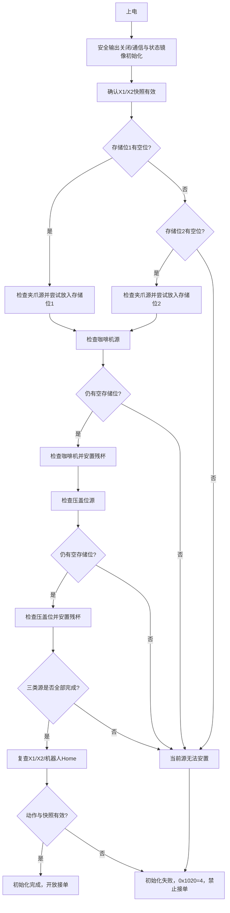
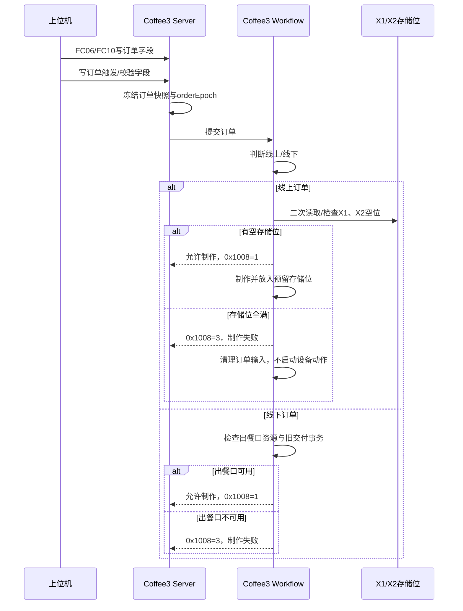

# Coffee3Close 第六版详细业务流程设计

> 版本：V6.0  
> 日期：2026-09-07  
> 状态：DESIGN_BASELINE / 待业务审核，尚未进入 Coffee3 源码实施。  
> 输入：Coffee2 工程锐评与 Coffee3 落地建议审批版、Coffee3Close V5、Coffee1
> `coffee_close_v2.8.29_IOPage` 业务事实、Coffee2 当前实现状态以及用户本次审批意见。  
> 适用边界：本文只定义 Coffee3Close 的业务和工程落地方案；不修改 Coffee2、
> Coffee1、公共设备库、协议 DOCX 或 CubeMX 配置。

## 1. V6 定稿变化

V6 继承 V5 已通过的 Coffee1 业务时序，同时修正残杯检查和线上订单二次拦截：

1. **残杯检查只使用两个存储位**。检查源仍是机械手夹爪、咖啡机工位和压盖位，
   目的地只能按 `存储位1 → 存储位2` 选择。出餐口不再参与残杯检查，也不能作为
   “第三个临时位置”。
2. **第三个残杯没有位置时初始化失败**。下位机置整机初始化失败/报警状态，向
   上位机报告；人工取走残杯后必须重启下位机，从完整残杯检查起点重新开始。
3. **残杯检查完成即可启动接单**。如果三类源都完成检查且最多两个残杯已被放入两个
   存储位，系统进入待机并开放订单。发现残杯本身输出告警并占用对应储位，不因此
   把“检查流程完成”误报为失败。
4. **线上订单增加下位机二次拦截**。上位机可先检查存储位，但下位机收到线上订单
   后必须再次确认存储位有空位；空位不足时不得开始制作，直接发布 `0x1008=3`
   制作失败并完成输入收尾。
5. **线下订单不使用存储位作为准入条件**。线下订单只检查出餐口交付资源；残杯占满
   两个存储位不能阻止线下订单制作，避免因为残杯检查占位导致整机无法制作线下单。
6. **协议读写事实固化**。订单/控制寄存器由上位机使用 FC06 或 FC10 写入，状态
   由上位机使用 FC03 读取；Coffee1 的已验证状态所有权用于解释清零、完成和 ACK，
   不再把这些已确认的读写路径标为未决冲突。
7. **Coffee2 修正列为后续工程任务**。本版只定义 Coffee3 目标架构和业务闭环，
   不把审批通过的 Coffee2 修正提前混入当前 Coffee2 源码。

## 2. 产品物理模型和不可变事实

Coffee3Close 是封闭式单出餐口设备，包含：

- 一个机器人；
- 一个咖啡机/F200 或项目确认的咖啡机设备；
- 制冰、称重、果乳 A/B、糖浆、落杯、落盖/压盖等设备；
- 两个线上成品存储位；
- 一个出餐口和一个出餐门升降机构；
- 板载 DI/DO、16 路输入模组、16 路输出模组；
- X8 安全光栅本版只保留采样/显示占位，不参与门控。

两个存储位是“线上成品”和“残杯检查占位”的资源；出餐口是“线下交付”和“线上
取餐搬运”的资源。两类资源不能混为一个容量池。

## 3. 业务状态模型

### 3.1 业务事务完成层级

| 层级 | 完成条件 | 可推进内容 |
| --- | --- | --- |
| 设备事务完成 | 协议帧匹配、回显/状态匹配、结果正常 | 只推进当前设备步骤 |
| 物理后置条件完成 | 杯位、重量、门限位、IO 或机器人目标条件满足 | 推进下一业务步骤 |
| 饮品内容完成 | 所有配方、出液、制冰、咖啡/奶、可选压盖完成 | 线下发布制作成功后放口1；线上继续入储位 |
| 最终放置完成 | 机器人完成放储位或放出餐口，且目标状态确认 | 发布对应制作/出餐状态 |
| 客户取餐完成 | X3 有杯后变无杯，并连续有效无杯 30 秒 | 置出餐口取餐完成位、升门 |
| 事务释放完成 | 客户 ACK 被消费或失败收尾完成，资源状态明确 | 释放出餐口/储位/制作资源 |

任何 TCP 发送成功、Modbus 应答成功或设备返回“完成”都不能直接替代物理后置条件。

### 3.2 Coffee3 私有阶段

```text
SYSTEM_INIT
RESIDUAL_CHECK
READY
ORDER_ACCEPTED
ORDER_MAKING
CONTENT_COMPLETE
FINAL_PLACING
ONLINE_STORED
OUTLET_DELIVERED
WAIT_CUSTOMER_TAKE
CUSTOMER_TAKE_WAIT_ACK
DELIVERY_RELEASED
ORDER_FAILED
SAFE_STOP
```

这些阶段属于 Coffee3 私有上下文，不新增协议寄存器。公共寄存器仍使用协议定义的
兼容值，私有阶段通过日志和内部状态观察。

## 4. 上电、残杯检查和初始化失败

### 4.1 残杯检查资源规则

残杯源没有可靠的自身杯传感器：

1. 机械手夹爪可能带杯；
2. 咖啡机工位可能留杯；
3. 压盖位可能留杯。

可验证的残杯目的地只有两个存储位：

| 优先级 | 目的地 | 传感器 | 用途 |
| ---: | --- | --- | --- |
| 1 | 存储位 1 | `X1_FINISHED_FRONT_CUP` | 第一优先残杯放置位/线上成品位 |
| 2 | 存储位 2 | `X2_FINISHED_REAR_CUP` | 第二优先残杯放置位/线上成品位 |

`X3_OUTLET_CUP` 不参与残杯检查目的地选择。它只服务出餐口交付和客户取餐检测。

### 4.2 残杯检查流程



### 4.3 具体判定

每个源都执行完整的“假设手上有杯→机器人放入空存储位→读取目标传感器”动作：

- 目标传感器由无杯变有杯：说明发现残杯，输出 `WARN`，该存储位标记为残杯占用，
  检查流程继续；
- 目标传感器保持无杯：说明该源没有发现杯，输出基线/完成日志，继续下一个源；
- 动作失败、目标状态未知、两个存储位都已占用且仍有未检查源：初始化失败；
- 三个源全部完成且所有必要状态有效：初始化成功，即使一个或两个存储位被残杯占用，
  也可以进入待机；
- 第三个残杯无法安置：初始化失败，不能把出餐口当作临时容量，也不能开放线下单。

初始化失败的处理是：

1. `0x1020=4` 或协议定义的初始化失败状态；
2. 禁止接收新订单和机器人自动制作；
3. 输出一次明确日志，包含源、存储位、动作和失败原因；
4. 上位机读取报警和 IO 页面进行提示/拦截；
5. 人工取走残杯或处理设备故障；
6. 人工复位/重启下位机；
7. 从完整残杯检查重新开始，不从失败步骤继续。

## 5. 订单接收和二次拦截

### 5.1 接收顺序



### 5.2 线上订单二次拦截规则

线上订单识别成功后，Workflow 必须按以下顺序处理：

1. 冻结订单字段、订单号和 `orderEpoch`；
2. 再次读取/确认 `X1`、`X2` 的有效性和占用状态；
3. 以 `X1 → X2` 选择第一个可用储位，并立即写入私有预留状态；
4. 两个存储位都满、状态未知或传感器失联时，拒绝本单；
5. 拒绝时不投递落杯、制冰、咖啡、糖浆或机器人动作；
6. 将 `0x1008` 置为 `0x0003`，记录失败原因 `ONLINE_STORAGE_FULL` 或
   `ONLINE_STORAGE_UNKNOWN`；
7. 按 Coffee1 收尾规则清理订单触发输入，释放本次快照；
8. 不清除残杯报警或设备离线报警，不把失败伪装成取消。

上位机的预检查只是优化，不是安全保证。即使上位机刚刚报告有空位，下位机也必须
在真正启动制作前再次检查；两个检查之间被其他事务占用时，以 Workflow 的二次检查
结果为准。

### 5.3 线下订单规则

线下订单不因两个存储位都被残杯或线上成品占用而失败。它只需要：

- 出餐口没有未完成的客户交付事务；
- 出餐门处于可动作状态；
- 机器人没有持有其他杯或未完成动作；
- 必要设备和 IO 条件满足。

内容制作成功后，按 Coffee1 规则先发布 `0x1008=2`，再让机器人把杯放到出餐口。
机器人放杯完成后写 `0x100B` 低位 5，立即启动门下降，不等待上位机制作 ACK。

## 6. 线上、线下制作和交付流程

### 6.1 线上订单

1. 二次确认储位并预留；
2. `0x1008=1`，进入制作；
3. 执行冷热杯、制冰/称重、果乳、糖浆、咖啡/奶、落盖压盖等需要的步骤；
4. 每个步骤必须经过命令发送、设备事务完成、物理后置条件确认；
5. 机器人把成品放入预留存储位；
6. 确认对应 `X1/X2` 有杯后更新储位状态和 `0x1027`；
7. 置 `0x1008=2`，清理订单触发输入，释放制作资源；
8. 不启动出餐门，不产生出餐口客户取餐事件；
9. 后续上位机通过线上取餐命令请求机器人把储位杯搬到出餐口。

### 6.2 线上取餐

1. 上位机通过 FC06/FC10 写入储位选择和取餐请求；
2. Workflow 检查源储位有杯、出餐口空闲、门状态有效；
3. 机器人从储位取杯并放到出餐口；
4. 检查源储位由有杯变为空、X3 变为有杯；
5. 写 `0x100B` 低位 5，立即降门；
6. 进入客户取餐监视，不覆盖其他未完成出餐事务。

### 6.3 线下订单

1. 检查出餐口交付资源，不检查存储位容量；
2. 冻结订单并进入制作；
3. 内容制作完成时置 `0x1008=2`；
4. 机器人将杯放到出餐口，确认动作完成后写 `0x100B` 低位 5；
5. 清理制作输入，立即下降出餐门；
6. X3 有杯后，等待其变无杯并连续有效保持 30 秒；
7. 置 `0x100B` bit4，升门并等待上位机 `0x000B bit0`；
8. 收到 ACK 后清理取餐完成高位并释放出餐口事务。

### 6.4 出餐口资源保护

出餐口只有一个状态槽和一个交付资源。以下条件任一成立时，不能让新杯进入出餐口：

- 上一杯的 `0x000B` 客户取餐 ACK 尚未消费；
- 出餐门尚未回到安全位置；
- X3 状态无效或通信失联；
- 机器人仍持有上一杯或动作未确认；
- 口内杯状态与软件上下文不一致。

两个存储位已满不影响线下订单；出餐口被占用不允许把线下订单强行改放储位，除非
产品协议明确增加这种路由。

## 7. 设备、IO 和协议职责

### 7.1 公共设备库

公共库只负责设备协议和原子事务：

- F200/M50/O/X 咖啡机协议；
- Dobot 机器人通信；
- 杯盖/落杯、糖浆、制冰、称重、电表和 Modbus IO；
- Modbus RTU/TCP 帧、校验、回显和设备结果解析。

它不判断订单类型、储位是否可用、是否允许下一单、何时发布 `0x1008=2`，也不直接
读写 Coffee3 Server 寄存器。

### 7.2 Coffee3 私有 owner

Coffee3 私有层负责：

- 设备绑定：`device_id / bus_id / unit_id / driver_kind / capability / enabled`；
- 订单快照和 `orderEpoch`；
- 残杯检查和两个存储位预留；
- 线上二次拦截和线下出餐口准入；
- 业务步骤和物理后置条件；
- 制作/交付双事务收尾；
- 取消、失败、迟到事件和安全停止；
- 协议寄存器投影、日志 source 和 IO 宏名。

### 7.3 协议读写标准

| 方向 | 功能码 | 所有者 | 规则 |
| --- | --- | --- | --- |
| 上位机写订单/控制 | FC06、FC10 | Server 接收，Workflow 决策 | 校验地址、值域、边沿和重复写；不直接动作 |
| 上位机读状态 | FC03 | Server 投影 | 读取当前快照、设备镜像和业务状态 |
| 设备 RTU/TCP | 设备原子事务 | Bus/Robot owner | 验证地址、功能码、回显/状态和超时 |
| 业务状态发布 | 私有 Workflow → Server 镜像 | Workflow | 只在业务终点改变 `0x1008`、位置和出餐状态 |

重复 FC06/FC10 写入同一个订单值不能重复启动制作；通过订单号、边沿和 `orderEpoch`
判重。迟到设备响应必须通过 commandId 和 epoch 丢弃。

## 8. IO 映射与状态语义

### 8.1 关键输入

| 点位 | 语义 | 业务用途 |
| --- | --- | --- |
| `X1_FINISHED_FRONT_CUP` | 存储位1有杯 | 残杯目的地、线上成品确认 |
| `X2_FINISHED_REAR_CUP` | 存储位2有杯 | 残杯目的地、线上成品确认 |
| `X3_OUTLET_CUP` | 出餐口有杯 | 放杯确认、客户取餐有杯基线、无杯30秒 |
| `X4_PURE_WATER_BUCKET1_LOW_LEVEL` | 水源允许/缺水状态 | 开单准入和制作中缺水锁定 |
| `X5_WASTE_RESIDUE_BIN` | 废渣桶状态 | 订单/维护准入 |
| `X6_WASTE_LIQUID_BUCKET` | 废液桶状态 | 订单/维护准入 |
| `X7_WASTE_LIQUID_HIGH_LEVEL` | 废液高位 | 禁止继续产生废液 |
| `X8_OUTLET_SAFETY_LIGHT_CURTAIN` | 安全光栅 | V6 只采样显示，占位不门控 |

### 8.2 板载门 IO

| 点位 | 语义 | 规则 |
| --- | --- | --- |
| `DI1_OUTLET_DOOR_UPPER_LIMIT` | 门上限位 | DO1 上升到位即停 |
| `DI2_OUTLET_DOOR_LOWER_LIMIT` | 门下限位 | DO2 下降到位即停 |
| `DO1_OUTLET_DOOR_UP` | 出餐门上升 | 与 DO2 互斥 |
| `DO2_OUTLET_DOOR_DOWN` | 出餐门下降 | 与 DO1 互斥 |

板载输入按已验证的低电平有效逻辑归一化为业务值；业务层只使用逻辑值，不重复取反。

### 8.3 只读页面和空余槽位

IO 页面继续按 32 路兼容布局开放 `0x10F0—0x10FF`。当前只更新实际存在的板载、
第一组 16DI 和第一组 16DO，未安装槽位保持 0；失联状态通过设备在线/报警字段表达，
不能把失联伪造为空。

## 9. 故障、取消和恢复

### 9.1 线上存储位满

这是业务拒绝，不是设备通信故障：

```text
线上订单接收
  → 二次读取 X1/X2
  → 两个位均为有杯
  → 不发送任何制作动作
  → 0x1008 = 0x0003
  → 记录 ONLINE_STORAGE_FULL
  → 清理订单触发输入
```

上位机下一次重新下单前，必须重新读取状态；下位机不自动等待储位变空后偷偷开始
制作，也不把失败订单转成线下订单。

### 9.2 第三个残杯

第三个残杯无存储位可用时：

- `0x1020=4`，禁止接单；
- 记录 `RESIDUAL_CUP_NO_DESTINATION`，包含源和 X1/X2 状态；
- 不使用 X3，不下降/上升出餐门处理残杯；
- 人工处理后重启，重新执行完整检查；
- 不支持从中间步骤继续，避免遗漏源或重复动作。

### 9.3 订单设备失败

真实设备失败才写 `0x1008=3`。必须记录订单、阶段、设备、动作、错误码、杯可能位置、
停止确认结果。若杯位置未知，保留故障锁定，不能直接开放下一单。

### 9.4 X4 制作中丢失

- 开单前 X4 不允许工作，拒绝订单；
- 制作中 X4 变为缺水，不强行把当前订单改报失败；
- 当前订单完成后仍发布正常订单结果；
- 记录缺水告警并禁止下一单；
- X4 恢复并完成清警评估后才重新开放订单；
- 不执行未经验证的废杯搬运或隐式重做。

## 10. 任务清单与最小实现

这些是业务职责，不等于新增 FreeRTOS 任务：

| ID | 任务 | 关键输出 | 失败出口 |
| --- | --- | --- | --- |
| T01 | 平台初始化 | Transport、设备表、IO、Server、Robot、Bus 就绪 | 初始化依赖失败锁定 |
| T02 | 残杯检查 | 只使用存储位1/2，三源依次检查 | 第三杯无位、动作失败、状态未知→`0x1020=4` |
| T03 | IO 采样投影 | X1/X2/X3、门限位和 IO 页面 | 失联保持未知并报警 |
| T04 | 条件监视 | X4—X8、水位、废液、设备在线 | 禁止新单或安全停机 |
| T05 | 订单冻结 | 快照、订单号、epoch、线上/线下识别 | 非法值→`0x1008=3` |
| T06 | 线上二次拦截 | X1/X2 空位检查和预留 | 满位→不动作、`0x1008=3` |
| T07 | 线下准入 | 出餐口、门、机器人资源检查 | 口占用→`0x1008=3` |
| T08 | 配方制作 | 杯、冰、称重、果乳、糖浆、咖啡、压盖 | 设备失败→安全收尾 |
| T09 | 线上入储位 | 放置、X1/X2 有杯确认、状态发布 | 位置未知锁定 |
| T10 | 线下放口1 | 放杯、X3 确认、`0x100B=5`、降门 | 出餐失败锁定 |
| T11 | 线上独立取餐 | 储位→口1、源空/X3 有杯 | 交付失败保留状态 |
| T12 | 客户取餐监视 | 有杯→无杯30秒、升门、等待 ACK | 失联/重新有杯则重计 |
| T13 | 维护任务 | 热水、清洗、设备维护互斥 | 安全停止并报警 |
| T14 | 取消/失败收尾 | STOP_ALL、杯位判断、输入清理 | 位置未知保持锁定 |
| T15 | 诊断/OTA | 版本、日志、OTA 安全窗口 | 活动订单期间拒绝危险操作 |

## 11. 公共/私有工程落地

### 11.1 公共层

继续复用现有：

```text
Application/Common
Application/Transport
Application/ProtocolStack
Application/DeviceLibrary
Application/New_Party
```

公共层只处理协议、设备能力、传输、日志、诊断和 OTA，不知道 Coffee3 的存储位、
出餐门、订单类型或 `0x1008`。

### 11.2 Coffee3 私有层

建议目录：

```text
Application/UserAPP/Coffee3CloseApp/
  Config/                  设备绑定、协议事实、IO 宏名
  Comm_Log/                C3 source 表和 target 日志适配
  Device/                  设备 ID、能力和状态镜像
  IO_State/                板载/外部 IO 采样与边沿
  Modbus_Rtu_Bus/          C3 总线 owner
  Modbus_Tcp_Server/       FC03/FC06/FC10 和寄存器投影
  Robot_Tcp/               机器人 owner
  WorkFlow/                唯一业务 owner
  Task_Manager/            任务创建和启动顺序
  Ota/                     C3 OTA 入口
```

V6 不新增公共 Router、Factory、动态插件或跨 target 业务队列。Coffee3 只在已有
Workflow owner 内维护静态 `Coffee3OrderContext_t`、残杯阶段和资源预留。

### 11.3 Coffee2 后续修正边界

审批版已经批准 Coffee2 需要修正，但本 V6 不执行 Coffee2 代码修改。后续 Coffee2
工作必须单独完成：

1. 协议事实表；
2. 制作/取餐双事务收尾；
3. 后置条件确认；
4. 手动调试与自动动作仲裁；
5. 取消、迟到响应、位置未知和安全停止；
6. Coffee1 场景矩阵和 GCC/Keil 验证。

Coffee3 设计可以吸收这些原则，但不能把 Coffee2 未完成的实现当作已验证能力。

## 12. 日志标准

日志采用当前工程稳定 source 前缀，事件对象写入正文：

```text
[0000WARN][C3Workflow:Workflow] residual source=PRESS_POSITION no storage slot; init failed
[0000INFO][C3Workflow:Workflow] online order=123 storage recheck passed; reserve=STORAGE_1
[0000WARN][C3Workflow:Workflow] online order=124 rejected; storage full; production_status=3
[0000INFO][C3Bus5:IoInput] point=X3_OUTLET_CUP old=1 new=0; empty_hold=30s
```

要求：

- 初始化失败、线上满位拒绝、真实设备失败、IO 边沿和恢复各有清晰日志；
- 周期刷新不刷屏，同一失败阶段去重；
- 日志包含订单、阶段、设备、动作、结果或下一步；
- `C3Outlet`、`C3Water` 等事件名不能冒充 source；
- 使用英文宏名，兼容 ARMCC V5.06 和 GCC。

## 13. V6 验收矩阵

### 13.1 初始化

| 场景 | 期望 |
| --- | --- |
| 三源均无杯 | 检查完成，开放接单 |
| 一个残杯 | 放入存储位1，WARN，检查完成后可接单 |
| 两个残杯 | 依次放入存储位1/2，检查完成后可接单但线上容量为满 |
| 第三个残杯 | `0x1020=4`，禁止接单，人工处理后重启 |
| 出餐口已有杯 | 不作为残杯检查目的地；按出餐口业务状态报警/锁定，不能拿来安置第三杯 |
| 传感器失联 | 不解释为空，初始化失败或等待明确的设备策略 |

### 13.2 订单拦截

| 场景 | 期望 |
| --- | --- |
| 线上订单且 X1 空 | 预留 X1，开始制作 |
| 线上订单 X1 满、X2 空 | 预留 X2，开始制作 |
| 线上订单 X1/X2 均满 | 不发送设备动作，`0x1008=3` |
| 线上订单检查期间储位被占用 | 以二次检查为准，拒绝本单并发布 3 |
| 线下订单、X1/X2 均满、口1可用 | 允许制作和放口1 |
| 线下订单、口1事务未释放 | 拒绝本单，不能改道存储位 |

### 13.3 交付和异常

| 场景 | 期望 |
| --- | --- |
| 内容完成 | 按线上/线下路径发布，不等待虚构 ACK |
| 机器人放杯成功但 X3 无杯 | 不报告客户取餐成功，保留交付异常 |
| X3 有杯到无杯并保持30秒 | 置 bit4，升门，等待 `0x000B` |
| 重复客户 ACK | 不重复升门或释放其他订单 |
| 设备迟到回复 | commandId/epoch 不匹配时丢弃 |
| X4 制作中缺水 | 当前订单正常收尾，完成后禁止下一单 |

## 14. 实施顺序和边界

### 本版确定

- 两个存储位用于残杯检查和线上成品；
- 出餐口不参与残杯检查；
- 第三个残杯导致初始化失败，人工处理后重启；
- 线上订单下位机二次检查储位，满位直接 `0x1008=3`；
- 线下订单不因存储位满而被拦截；
- FC03 读取，FC06/FC10 写入；
- 公共层只提供协议/设备/传输能力，Coffee3 私有层拥有业务；
- Coffee2 修正列为后续独立任务。

### 仍需在源码实施前确认

- 两个存储位具体传感器和机器人目标点位；
- 出餐口已有杯时的上电报警寄存器和人工处理提示；
- `0x1020` 初始化失败值是否与最终协议文本一致；
- 线上取餐请求的最终寄存器地址和值域；
- X1/X2/X3 防抖和“有杯/无杯”连续采样时间；
- 机器人目标动作完成和目标传感器确认的具体协议字段；
- Coffee3 各设备 Unit、Bus、波特率和驱动型号。

这些是实现前的硬件/协议配置确认，不应通过新增抽象层猜测解决。

## 15. 版本结论

V6 把 Coffee3Close 的核心资源边界固定为：

```text
残杯检查：存储位1/存储位2
线上成品：存储位1/存储位2
线下交付：出餐口1
线上取餐：存储位 → 出餐口1
客户完成：X3 有杯→无杯 30s + 0x000B ACK
设备协议：公共 DeviceLibrary
业务决策：Coffee3 私有 Workflow
```

该方案吸收 Coffee1 的实机业务事实，保留 Coffee2 已整理出的公共/私有边界，并
明确了 Coffee2 后续修正不与 Coffee3 设计混在同一轮。完成上述实施前确认后，才进入
Coffee3 的源码编排和最小闭环开发。

