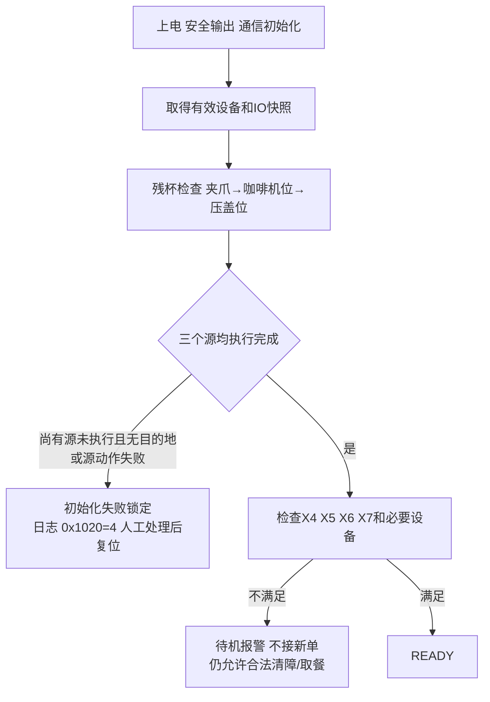
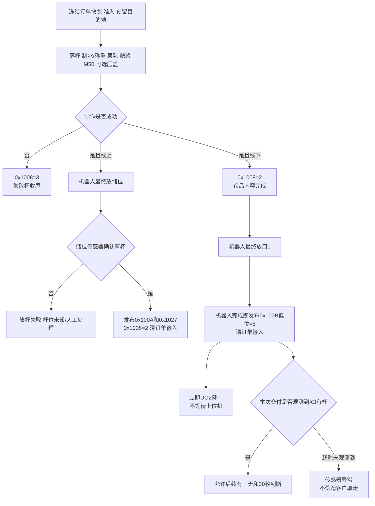
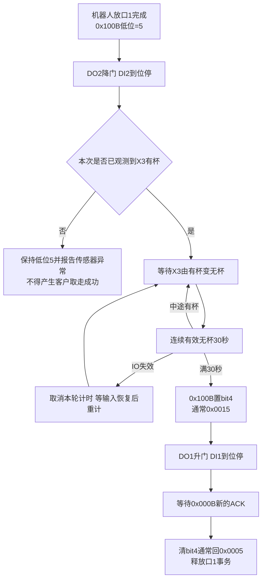

# Coffee3Close 第四版详细业务流程设计

> 版本：V4.0；日期：2026-09-03；状态：FOURTH_DRAFT / 待用户审核。  
> 输入：V3审核稿、最新上位机协议、Coffee1 v2.7/v2.8业务源码与日志，以及用户最新确认的“按Coffee1实机流程执行”。  
> 边界：本文是Coffee3Close业务基线候选，不代表源码已经实现；不修改Coffee2、Coffee1或公共设备库。

## 1. 第四版的核心变化

第四版严格采用已经实机验证的Coffee1业务时序，只按Coffee3物理差异裁剪：一个出餐口、没有杯托升降、只有出餐门、X8暂不参与、客户取走采用连续有效无杯30秒。

1. **线下单**：饮品内容完成后，机械手最终放杯前即可报告`0x1008=2`；不等待上位机确认，继续放到口1。
2. **线上单**：先选择并上报储位，再让机械手放杯；机器人放储位完成后才报告`0x1008=2`并更新储位占用。
3. **放杯完成**：机械手完成出餐口动作后写`0x100B`低4位为5，立即启动门流程；不等待上位机确认。
4. **客户取走**：本次X3由有杯变无杯并连续有效无杯30秒，置`0x100B bit4`，通常从`0x0005`变为`0x0015`。
5. **唯一业务ACK**：上位机写`0x000B bit0`确认客户取走；下位机清`0x100B`高4位并自清输入位，成功低位5仍保留。

因此，用户上一条消息中举例的“制作完成后等ACK再放杯、放杯后等ACK再开门”不再采用。Coffee1源码和历史运行日志均证明不存在这两个等待门槛；最新指示“按Coffee1即可”优先。

### 1.1 审核稿批复的处理结果

| 审核批复 | V4处理 |
| --- | --- |
| X4有信号才允许开单；制作中丢失不立刻中断 | 固化为准入条件；制作中锁存缺水，完成当前内容后报警并回失败结果 |
| 门碰撞由机器人内部管理 | 主控只等待机器人动作成功/失败，不推断机器人几何轨迹；门动作仍等待机器人业务动作完成 |
| `0x1008`按订单状态机管理 | 严格保留Coffee1的0/1/2/3；更细阶段只在Coffee3私有状态/日志中维护，不扩协议 |
| `0x100B`按Coffee1 | 保留低阶段+bit4取餐完成组合：常见`0x0005→0x0015→0x0005` |
| `0x0208`低8位，DOCX已同步 | 采用`0x0001—0x0080` |
| 门只用口1页面 | 只使用`0x1090`低半字节及`0x1091`；`0x1092`为0 |
| 果乳/糖浆、Y4奶路、占位分类参照Coffee1 | 复用其业务原则和协议语义，不复制旧IO号、旧机型分支和旧设备数量 |
| DO按Coffee2且已实物验证 | Coffee3逻辑1表示激活，底层极性沿用已验证的Coffee2实现 |
| 打印、紫外、多水桶、多出餐口不支持 | 非零请求明确拒绝，不执行空步骤 |

## 2. 业务完成不是一个布尔量

### 2.1 五种完成

| 名称 | 严格条件 | 后续动作 |
| --- | --- | --- |
| 设备动作完成 | 本次M50/制冰/糖浆/机器人命令进入匹配终态 | 只推进当前步骤，不直接报告整单完成 |
| 饮品内容完成 | 该单全部配料、出液、可选压盖均已完成，杯仍可能在夹爪/压盖位 | 线下单可发布`0x1008=2`并继续放杯；线上单继续入储位 |
| 放杯完成 | 机器人最终放杯动作成功；线上更新储位状态，线下写`0x100B低位=5` | 线上发布制作成功；线下立即启动门流程 |
| 客户取餐完成 | 本次X3曾有杯，之后连续有效无杯30秒 | 置`0x100B` bit4，升门并等待主机确认 |
| 事务完成 | 制作请求已由下位机收尾；出餐口交付上下文独立保留到客户ACK | 可接满足资源条件的新单，但不能覆盖同一出餐口 |

任何“写命令成功”“TCP已发送”“机器人返回完成”“传感器有杯”都只能证明表中对应一层，不能替代其他层。

### 2.2 公共寄存器与私有阶段

现有协议的`0x1008`只有四个兼容值：

| 值 | 含义 |
| --- | --- |
| 0 | 无活动订单/结果已回收 |
| 1 | 制作中，包括配料、出液、压盖 |
| 2 | 制作成功；线下可早于最终放杯，线上在入储位后置位 |
| 3 | 制作失败 |

更细阶段只保存在Coffee3私有上下文并输出日志，不占用未定义的公共寄存器：

| 私有枚举 | 阶段 |
| --- | --- |
| `ORDER_IDLE` | 无活动订单 |
| `ORDER_ACCEPTED` | 订单快照已冻结 |
| `ORDER_MAKING` | 杯、冰、配料、M50、压盖步骤 |
| `FINAL_PLACING` | 机械手正在放储位/出餐口 |
| `STORED_ONLINE` | 线上成品已经入储位 |
| `WAIT_CUSTOMER_TAKE` | 口1有杯、门已开放，等待顾客 |
| `CUSTOMER_TAKE_WAIT_ACK` | 已确认连续无杯30秒，高成功位待主机ACK |
| `DELIVERY_FINISHED` | 交付链完成 |
| `ORDER_FAILED` | 制作失败或杯位未知 |

私有枚举不是新增RTOS任务，也不要求修改DOCX；`0x1018`继续保持协议现状，V4不擅自定义新值。

## 3. Coffee1兼容的确认和防重复

### 3.1 制作请求的收尾

Coffee1在制作业务到达各机型规定终点后，由下位机调用`order_make_finish()`清`0x0007`和`0x0008`。这不是上位机ACK。Coffee3按该所有权处理：

- `0x0008=1`只在开单前表示订单核对正确；
- 下位机完成对应制作分支后清`0x0007/0x0008`；
- 上位机读取`0x1008`、位置和设备状态，不需要回写制作完成ACK；
- 重连或重复写1必须通过订单上下文/边沿防止重复制作，但不新增确认阶段。

### 3.2 唯一客户取餐ACK

```text
机器人放到口1完成
  → 0x100B低4位=5（放杯完成）
  → 立即启动出餐门流程，不等待0x000B
  → X3有杯变无杯且连续有效无杯30秒
  → 0x100B |= 0x0010，通常0x0005→0x0015
  → 上位机写0x000B bit0=1
  → 下位机清0x100B高4位，通常0x0015→0x0005；并自清0x000B bit0
```

只有最后一步是上位机业务ACK。提前写`0x000B`不能许可放杯、开门或伪造客户取走；重复写不重复机器人/门动作。`0x100B`没有订单号，因此同一个口1的旧交付链未结束时不能用新杯覆盖。

### 3.3 “一个未ACK事件占用反馈槽”的直白解释

`0x100B`只能描述一杯。如果A杯的客户取走成功位尚未被确认，此时又让B杯使用同一个寄存器，B会覆盖A，主机将无法判断状态属于哪一杯。

因此：

- A的物理门流程和客户取走ACK未完成时，口1仍归A所有；
- 可以并行制作一个目的地为储位的线上B单；
- 不可以把B或另一杯送到口1；
- 主机确认A的客户取走事件后才释放口1反馈槽；
- 若业务要求主机不确认也连续交付，必须扩展事件序号/订单号，当前协议做不到可靠区分。

## 4. 总业务流程图

### 4.1 上电到待机



残杯目的地每次动态按储位1→储位2→出餐口选择。搬出残杯只WARN并占位；尚有源未查却三处均不可用才锁定。最后一个源执行完后恰好三处全满，初始化检查本身完成，但容量报警禁止新制作。

### 4.2 订单制作与放杯



线上放入储位后不自动进入客户取餐；后续`0x0009+0x000A`构成新的取餐搬运请求。不存在“入储位ACK”。

### 4.3 客户取餐和门



X8安全光栅本版只采样/显示，不参与门控。机器人内部处理其点位和碰撞，主控只根据动作事务返回成功、失败或超时，不自己计算轨迹。

## 5. 线上、线下及取餐的完整时序

### 5.1 线上订单

1. `0x0007=1 && 0x0008=1`时冻结订单；高位规则识别线上单。
2. 开单前确认X4有信号、X5/X6有效、X7未满、配方依赖设备正常、X1/X2至少一个可用；预留储位1优先，否则储位2。
3. 执行配方；每个设备命令以匹配本次事务的终态完成，不能只看写ACK。
4. 内容成功后不先置`0x1008=2`，而是选择/保持预留储位，写`0x100A=1/2`及机器人目标。
5. 无条件进入最终放储位，不等待上位机ACK；动作完成并确认X1/X2=1。
6. 更新`0x1027`对应位，写`0x1008=2`，下位机清`0x0007/0x0008`，内部位置类别为线上成品并释放制作资源。
7. 不降门、不产生`0x100B`客户取餐成功。以后主机提交取储位/口1请求。
8. 独立取餐：核对源储位仍有绑定成品、X3空、门可用；机器人搬到口1，确认源变空且X3有杯；发布低位5并立即降门，后续按顾客取走流程。

### 5.2 线下订单

1. 冻结订单并预留唯一出餐口；口1有杯、门未复位或旧确认链未结束时拒绝开单。
2. 完成配料和压盖后发布`0x1008=2`；此时杯仍由机器人/压盖工位控制，没有完成最终放杯。
3. 不等待上位机ACK，机器人继续执行放口1。
4. 机器人动作完成后发布`0x1009=1`、`0x100D=1`和`0x100B低位=5`；若X3不为有杯，同时报告传感器异常，但不伪造客户取走。
5. 下位机清`0x0007/0x0008`并立即启动DO2降门，不等待`0x000B`。
6. 客户拿杯后，X3连续有效无杯30秒，置取餐成功bit4并升门。
7. 门到DI1后仍保留取餐事件，直到收到`0x000B bit0`客户取走ACK；清bit4、释放口1链。
8. 内容完成、最终放杯、门和顾客阶段使用同一订单号日志，但不让新制作覆盖口1状态。

### 5.3 X4制作中丢失

V4按审核批复执行：

- 开单前X4无信号：不接单，整机报警；
- 制作中X4从有变无：不强行中断当前设备命令，因为内部水箱仍有储备；立即锁存`WATER_SOURCE_LOST_DURING_ORDER`，禁止新单和新的抽水动作；
- 当前内容步骤继续到安全结束，不因X4恢复就自动清除本次锁存；
- 内容完成时发布报警和`0x1008=3`制作失败；
- 为避免一杯已经实际制作却遗留在无传感器工位，下位机按失败杯规则搬到空储位并标废杯，不等待主机ACK、不向顾客交付；无空位则报警人工处理；
- X4恢复且本次失败杯已明确、报警清除后，才允许新订单。

“实际饮品做完但协议返回失败”可能触发上位机重下单，因此必须用原订单号、失败原因和废杯占位防重；见A03审核项。如果产品希望仍交付这杯，应改为成功+水源报警，不能两种策略混用。

## 6. 所有业务任务及逐项细节

下表的“任务”是业务状态/职责，不等于新增FreeRTOS线程。

| ID | 任务 | 进入/前置 | 动作和中间反馈 | 完成/确认 | 异常处理 |
| --- | --- | --- | --- | --- | --- |
| T01 | 平台设备初始化 | 上电 | 安全输出、Server、Robot、UART2—5总线、状态镜像 | 必要快照有效后进T02 | 按对象输出一次错误；必要设备失败锁定 |
| T02 | 残杯检查 | T01完成 | 源顺序夹爪/咖啡机/压盖；每源按X1/X2/X3找空位并执行完整动作 | 三源均执行即完成；残杯WARN占位 | 尚有源未查且无目的地、动作失败、状态失效→锁定，复位重来 |
| T03 | IO采样投影 | 周期 | 本机约50ms、外部串行预算约200ms；记录有效期和变化日志 | 0x10F0—0x10FF持续可读 | 失联不伪造0；依赖动作停止推进 |
| T04 | 条件/报警监视 | 持续 | X4—X7、液位、设备在线、门限位 | 条件恢复仅允许进入清警评估 | 制作中X4按§5.3延迟失败；危险输出先停 |
| T05 | 订单接收 | 0x0007=1、0x0008=1 | 冻结全部字段、订单号和epoch，校验线上/线下 | 成功进入制作，0x1008=1 | 重复请求不重复执行；非法字段返回失败 |
| T06 | 资源预留 | T05 | 线上X1优先X2；线下口1；锁机器人/接液设备 | 预留写入私有上下文 | 无位在落杯前拒绝，不边做边赌位置 |
| T07 | 冷热杯 | 配方需要 | 机器人到点，合体杯盖机出对应杯 | 原生事务终态及可用反馈 | 结果不明不自动重发，转失败杯处理 |
| T08 | 出冰称重 | 冰量>0 | 去皮、出冰、稳重、有限补冰 | 重量在标定范围 | 秤失联/超重/停止失败则停流程 |
| T09 | 果乳A/B出液 | 对应量>0 | A:X12/Y5=0/Y10；B:X13/Y6=0/Y11；先选路后启泵 | 时间/标定量到，先停泵确认 | 缺料/通信/取消先停泵；不盲重出 |
| T10 | 糖浆出液 | 通道量>0 | 按Coffee1字段语义逐通道调用糖浆机 | 设备匹配本次命令的完成态 | 超时不重发双份；保存通道和已出量语义 |
| T11 | M50饮品 | 菜单有效、M50空闲 | 下发菜单，等接受→运行→结束 | M50结束只代表内容设备步骤完成 | 保存M50错误ID；状态未知不强取杯 |
| T12 | 落盖压盖 | 订单要求加盖 | 合体设备落盖，机器人取盖/压盖 | 机器人事务完成 | 杯位未知不盲Home，人工或安全回收 |
| T13 | 内容结果和路由 | 所有内容步骤结束 | 线下先写0x1008=2；线上保持制作中并进入储位放杯 | 不等待主机ACK | 失败写3并进入失败杯收尾 |
| T14 | 线上最终放杯 | 储位已选 | 机器人放预留储位 | 动作完成后写0x100A/0x1027及0x1008=2，清订单输入 | 无杯反馈→失败/位置未知；不报入库成功 |
| T15 | 线下最终放杯 | 内容成功 | 机器人放唯一口1 | 动作完成写位置及0x100B低位5，清订单输入 | 传感器不符记录异常，不产生取走成功 |
| T16 | 独立线上取餐 | 0x0009=1/2、0x000A=1 | 源绑定/有杯、目的空；搬源到口1 | 源空+X3有杯；低位5并清取餐请求 | 任何一端不符保留杯位未知并停 |
| T17 | 门降下 | 机器人放口1完成 | 立即DO2，DI2到位停；DO1互斥 | 门开放，进入客户监视 | 双限位/超时停双输出，口1不释放 |
| T18 | 客户取走监视 | 本次X3曾有杯 | 有→无后连续有效无杯30秒；有杯重计、失联取消计时 | 置0x100B bit4 | 不因上电空口、旧空值产生成功 |
| T19 | 门升起 | T18完成 | 置bit4后DO1到DI1；保持0x0015 | DI1到位停DO1 | 门故障与已取走事实分开报告 |
| T20 | 客户取走ACK | bit4已置 | 等0x000B bit0；下位机自清输入位 | 清bit4通常回5，释放交付链 | 提前/重复ACK不触发物理动作 |
| T21 | M50水箱补水 | DI4需求、X4有信号 | DO4开启，DI3到位或20秒关闭 | 高位到达 | X4丢失立即停；不周期无限重启 |
| T22 | 热水桶注水加热 | 0x0080请求 | DO3到DI6，DI5为溢出；再Y1按0x0081分钟 | 发布0x1082阶段 | 任一水位/超时关闭DO3/Y1并报警 |
| T23 | 清洗调度 | 制作请求间隙 | 合并重复请求，当前制作安全退出后执行 | 每类清洗独立完成/失败 | 不打断在制杯；不让维护永久饥饿 |
| T24 | M50/奶/果乳/糖浆清洗 | 水源和废液条件满足 | Y4奶路参照Coffee1；果乳阀1后泵；糖浆原生命令 | 先停动力确认，再恢复选路 | 废液满/阀泵失败进入安全停止 |
| T25 | 取消/失败杯 | 取消或任一步失败 | 停当前设备，确认杯位；优先空储位1/2标废杯 | 杯位置明确、失败状态已发布并清制作输入 | 无位/未知位置报警人工处理，不把废杯交付 |
| T26 | 手动调试 | 维护模式且自动资源空闲 | 单次请求/响应，复用设备原子动作和IO位图 | 设备结果另反馈 | 拒绝DO1+DO2、自动业务冲突和不支持硬件 |
| T27 | 通信/重连 | 断线或恢复 | 保留order_epoch、动作ID、业务阶段和位置状态 | 重连查询，不重复动作 | 已确认订单按Coffee1继续；客户取走高位保留到0x000B确认；见A04 |
| T28 | 电能/版本/OTA | 低频/维护请求 | 电能只监测；版本随时读；OTA需安全空闲 | 对应结果发布 | 电表失联不阻断饮品；OTA不在活动订单执行 |

## 7. 清洗、水路和配方细节

### 7.1 果乳和糖浆订单字段

按Coffee1的使用哲学：订单中每个实际通道是独立用量，0表示跳过，非0按单位和标定系数执行；不能把“果乳种类”字段又当用量。Coffee3实际只有果乳A/B，其他果乳通道非0明确拒绝。糖浆只允许当前糖浆机协议实际支持的通道。

当前DOCX把`0x000D`同一格写成“通道1量/果乳种类”，仍有文字歧义。V4业务上采用：`0x000D`=果乳A用量、`0x000E`=果乳B用量，其余果乳量保留且Coffee3拒绝非0；最终单位/字段名须在协议中同步后才冻结。

### 7.2 Y4奶路清洗

参照Coffee1而不复制旧Y号：

1. 确认M50空闲、废液桶存在且未满；
2. 停止可能使用奶路的动作；
3. Y4=1选择清洗水路，确认输出后等待阀切换；
4. 下发M50对应奶管/奶系统清洗命令；
5. 等M50接受、运行，按其协议完成或停止；
6. 先确认M50内部动力停止，再将Y4恢复0；
7. 记录清洗结果并清一次性触发。

Coffee1历史32秒、三次写阀等常数不直接复制；Coffee3按M50协议和实机标定。Y4=0正常奶路、1清洗路按审核通过方向执行。

### 7.3 果乳A/B清洗

- A使用Y5+Y10，B使用Y6+Y11；阀1选择热水清洗路，泵提供动力。
- A/B按Coffee1串行清洗：同时收到请求时先A后B，前一路完整停止并确认阀、泵均回正常态后才启动后一路。
- 每一路必须分为“本路泵关→本路阀设置并确认→本路泵启动”两个事务阶段。
- 结束顺序是“停泵并确认→阀恢复0”，不能一帧同时切阀和停泵冒充先后关系。
- X6丢失、X7满、热水不可用或输出失联时禁止启动；运行中立即进入停止路径。
- 清洗时长和热水容量需实机标定；未经新一轮水路、供水和排水验证不得改为并行。

### 7.4 水源和订单

X4业务真值已经审核：1=水源允许工作，0=缺水报警。订单前必检；订单中丢失按§5.3。自动补水不能在X4=0时启动。该业务真值已经确认，不再列为UNKNOWN；但电气输入归一化仍必须沿用已验证IO层，业务层只读取逻辑值。

## 8. IO和寄存器映射

### 8.1 实际IO

| 组 | 点位、宏名和用途 |
| --- | --- |
| 本机DI | DI1 `DI1_OUTLET_DOOR_UPPER_LIMIT`；DI2 `DI2_OUTLET_DOOR_LOWER_LIMIT`；DI3 `DI3_COFFEE_WATER_TANK_HIGH_LEVEL`；DI4 `DI4_COFFEE_WATER_TANK_LOW_LEVEL`；DI5 `DI5_HOT_WATER_TANK_HIGH_LEVEL`；DI6 `DI6_HOT_WATER_TANK_LOW_LEVEL`；DI7/DI8 RESERVED |
| 本机DO | DO1 `DO1_OUTLET_DOOR_UP`；DO2 `DO2_OUTLET_DOOR_DOWN`；DO3 `DO3_HOT_WATER_TANK_SUPPLY_PUMP`；DO4 `DO4_COFFEE_WATER_TANK_SUPPLY_PUMP`；DO5—DO8 RESERVED |
| 外部X | X1储位1杯；X2储位2杯；X3口1杯；X4水源；X5废渣箱；X6废液桶；X7废液高；X8光栅占位；X9/X10 RESERVED；X11奶；X12果乳A；X13果乳B；X14—X16 RESERVED |
| 外部Y | Y1热水加热；Y2/Y3 RESERVED；Y4奶路阀；Y5果乳A阀；Y6果乳B阀；Y7—Y9 RESERVED；Y10果乳A泵；Y11果乳B泵；Y12—Y16 RESERVED |

外部编号统一X1/Y1，不再写X01或旧N01/Y11。X3只代表出餐口杯，果乳B为X13。

### 8.2 页面投影

| 地址 | Coffee3内容 |
| --- | --- |
| `0x10F0` | 本机DI1—8低8位 |
| `0x10F1` | 未安装输入高半区=0 |
| `0x10F2` | 外部X1—16 |
| `0x10F3—0x10F7` | 未安装输入=0 |
| `0x10F8` | 本机DO1—8低8位 |
| `0x10F9` | 未安装输出高半区=0 |
| `0x10FA` | 外部Y1—16实际回读 |
| `0x10FB—0x10FF` | 未安装输出=0 |
| `0x1090` | 口1状态只用低半字节：0离线、1待机、2忙、3报警 |
| `0x1091` | bit0=X3；bit3=DI2开门到位；bit4=DI1关门到位；bit5=X8显示；不存在的杯托升降位0 |
| `0x1092` | 无口2，全0 |

`0x0208`板载DO使用低8位，`0x0005`表示DO1和DO3；`0x0209`外部Y1—16。支持多点但拒绝DO1+DO2同时激活。不存在的通道返回0不等于已安装模组失联；失联必须有在线状态/报警，不能用全0伪造安全。

## 9. 故障、取消、断线和并行

### 9.1 失败结果和收尾

任何失败都至少记录订单号、阶段、设备、动作、原错误码、杯可能位置、停止是否确认。`0x1008=3`后由下位机执行允许的失败杯收尾并清制作输入；没有失败结果ACK。清订单输入不清报警、不证明杯已处理。

设备命令结果不明时不自动重发可能重复出料的命令。机器人位置未知不盲目Home。远程IO失联时不能宣称继电器已经关，只能记录控制结果未知并进入硬件处置。

### 9.2 并行规则

| 组合 | V4 |
| --- | --- |
| A杯等待顾客 + 线上B制作到储位 | 允许，口1状态仍属于A |
| A杯取走ACK未完 + 另一杯到口1 | 禁止，避免覆盖0x100B |
| 制作 + 独立机器人取餐 | 首版串行，共用机器人 |
| 制作 + 清洗 | 清洗排队，当前制作安全结束后优先执行 |
| 果乳A/B清洗 | 按Coffee1串行，A完成安全停止后再执行B；不默认并行 |
| 制作 + M50水箱补水 | X4有效且水源能力允许时可并行；异常独立处理 |
| 自动业务 + 冲突手动IO | 拒绝 |

### 9.3 上位机断线

按Coffee1已验证流程，上位机断线不引入新的制作/放杯ACK门槛：已确认订单继续制作并按线上/线下路径放杯。结果寄存器持续保留，重连后上位机读取；出餐口客户取走高位保持到`0x000B`确认。断线期间不接收新订单，但不让机器人因为等待不存在的ACK而长期持杯。

Robot断线保留动作ID，不重发；RTU断线停止依赖步骤；掉电不恢复进行中的动作，重启重新残杯检查。

## 10. 日志与可测试性

关键日志必须区分发布和确认：

```text
[C3Order] Drink content completed; published make result=SUCCESS; continuing final placement. order=123
[C3Outlet] Robot placement completed; published state=0x0005; opening outlet door. order=123
[C3Outlet] X3 became empty; starting 30 s continuous-empty timer. order=123
[C3Outlet] Customer take published; state=0x0015; raising door and waiting host pickup ACK. order=123
[C3Outlet] Host pickup ACK consumed; state=0x0005; delivery transaction released. order=123
```

周期等待不刷屏；只在发布、客户取走ACK、超时、状态改变和恢复时打印。`0x000B`日志必须明确它只确认客户取走，不是放杯许可。

### 10.1 必测状态用例

| 用例 | 预期 |
| --- | --- |
| 线下内容完成但0x0007仍为1 | 置0x1008=2并继续最终放杯，不等待主机 |
| 线上内容完成 | 先放储位；机器人完成后才置0x1008=2/0x1027 |
| 放杯完成前0x000B为1 | 消费/WARN，不许可放杯、不伪造取走 |
| 低位5发布 | 只启动一次降门；不等待0x000B |
| X3空29秒再有杯 | 清计时，不置bit4 |
| X3空30秒 | `0x0005→0x0015`，升门；不清0x1008 |
| 顾客ACK | `0x0015→0x0005`，清输入ACK，释放口1链 |
| A等待取餐、B线上制作 | B可进行且不覆盖A的0x100B/order_epoch |
| X4开单前为0 | 拒绝订单并报警 |
| X4制作中变0 | 完成当前内容、回失败、禁止新单；失败杯不交付 |
| TCP在内容完成后断线 | 已确认订单继续放杯；结果保持；不重复订单 |
| 复位时有未完成杯 | 不恢复旧动作；按残杯初始化重新识别 |
| 同时请求果乳A/B清洗 | A先执行；A泵阀安全停止并恢复后才执行B，不并行 |

## 11. 新增审核事项

| ID | 必须审核的问题 | V4建议 | 影响 |
| --- | --- | --- | --- |
| A01 | 是否确认不增加制作完成ACK和放杯ACK？ | 确认，完全按Coffee1；仅保留客户取走ACK | 最新指示已回答，可标APPROVED |
| A02 | 线上入储位完成是否需要独立ACK？ | 不需要；0x1008/0x100A/0x1027供读取，后续取餐命令独立 | Coffee1一致，建议APPROVED |
| A03 | X4制作中丢失后，已做出的杯是交付还是废弃？ | 按批复回失败，放空储位标废杯，不交付 | 防止上位机重单造成客户拿到双杯 |
| A04 | TCP断线是否继续已确认订单？ | 按Coffee1继续，状态保留；只缺客户ACK时保留高位 | 不再让机器人等待不存在的ACK |
| A05 | 是否使用`0x1018`扩展详细协议状态？ | 不使用；详细阶段留在私有状态和日志 | 避免未经协议批准扩展 |
| A06 | 失败状态`0x1008=3`是否需要ACK？ | 不需要；下位机按Coffee1收尾订单输入 | 不新增失败握手 |
| A07 | 放杯后是否立即降门？ | 是；写低位5后立即启动，不等0x000B | Coffee1一致，建议APPROVED |
| A08 | 客户取走成功是在30秒满时还是升门到位时发布？ | 30秒满时置bit4；门到位单独反馈 | 已取走事实不被门故障覆盖 |
| A09 | 门动作阶段是否需要新增协议状态？ | 不新增；用现有0x1090资源状态、0x100B位域及私有日志表达 | 保持Coffee1位域兼容，避免擅自扩协议 |
| A10 | 果乳字段是否正式定为0x000D=A量、0x000E=B量？ | 是，其余Coffee3未装通道只接受0 | 需同步DOCX字段名和单位 |
| A11 | Y4正常/清洗位置及M50命令映射是否按Coffee1原则冻结？ | 正常0、清洗1；具体命令按M50协议 | 实机确认阀型和清洗程序 |
| A12 | 门动作超时、ACK超时、IO去抖、冰重容差、清洗时间 | 分设备标定，不复制统一旧常数 | 实施前参数表仍需完成 |
| A13 | 入储位/出餐口传感器有杯稳定时间 | 建议连续有效多个样本后确认，时间待实测 | 防抖和防假完成 |
| A14 | 不支持硬件的订单字段 | 非零即订单不合法 | 防止静默少做步骤 |
| A15 | 是否批准本文取代V3作为后续实现输入？ | 审核通过后标记V4为BASELINE | V4区分线上/线下的0x1008置位时点 |
| A16 | DOCX第5.2节仍写“上位机清0x0007后才能接新单”，是否同步为Coffee1所有权？ | 应同步为：下位机在对应制作分支结束时清0x0007/0x0008；上位机只读取结果 | 当前示例与用户确认的Coffee1流程、正文状态表均冲突 |
| A17 | DOCX的0x0208板载输出位图是否统一为低8位？ | 应统一为0x0001—0x0080；删除同一条目内残留的0x0100—0x8000枚举 | 当前条目“范围/输出”与逐点枚举互相矛盾，实施时以用户已确认的低8位为准 |
| A18 | DOCX订单完成示例和0x100B范围是否修订？ | 0x1008完成应为2而非示例中的1；0x100B范围必须覆盖低位5及bit4组合值 | 避免上位机按示例把制作中误判为完成，或拒绝0x0015 |

## 12. Coffee1核对结论

| Coffee1事实 | 证据 | V4处理 |
| --- | --- | --- |
| `order_make_finish()`由下位机清`0x0007/0x0008` | `v2.7 modbus/order.c:27-34` | Coffee3沿用同一所有权：结果发布后由下位机清制作输入，不等待主机再清 |
| 压盖后部分直出分支先置`0x1008=2` | `v2.7 control_flow.c:4797-4818` | 线下沿用“内容完成先上报”，随后直接执行最终放杯，不新增ACK门槛 |
| 入储位前先发布位置，但WAIT分支没有ACK判断 | `v2.7 control_flow.c:4834-4900` | 不把传播等待误写成主机确认 |
| 放出餐口后低位写5并启动出餐机构 | `v2.7 control_flow.c:5229-5254` | 保留低位5；机器人放杯完成后立即降门，不新增放杯ACK |
| 顾客取走后置bit4，形成0x15 | `v2.7 modbus/io_output.c:1352-1362`及历史日志 | 保留位域；改成连续无杯30秒，X8不参与 |
| 0x000B确认清高位，通常0x15回0x05 | `v2.7 control_flow.c:3085-3099` | 客户取走ACK保持相同；增加阶段防串 |
| 线上取餐清`0x0009/0x000A`与制作订单清理分离 | `v2.7 modbus/order.c:36-40` | 保留独立取餐事务 |
| 奶路清洗先切阀、执行M50清洗、停止后恢复阀 | `v2.7 control_flow.c:6109-6214` | 复用原则，不复制旧IO号和时间常数 |
| 果乳清洗在非空闲时延后/收尾，A/B互斥 | `v2.7 control_flow.c:6242-6508` | 制作后执行；同时请求按A后B串行，不擅自扩成并行 |

结论：Coffee3 V4不复制Coffee1的软件架构，但**完整沿用其已实机验证的业务时序、结果发布所有权、位置/取餐位域和清洗经验**；只按Coffee3现有设备、单出餐口、门机构和“无杯连续30秒”要求做产品适配。

## 13. 文档边界与后续

- V3审核稿原样保留，批注意见已转为V4规则或A01—A18审核项。
- 当前DOCX正文把`0x1008`定义为0/1/2/3，V4保持该定义；不新增`0x1018`业务枚举，也不把`0x000B`扩成双阶段ACK。
- 只读复核发现DOCX示例仍存在三处内部冲突：第5.2节要求上位机清`0x0007`且把`0x1008=1`写成完成；`0x0208`低8位范围下仍残留高字节逐点枚举；`0x100B`范围未覆盖低位5和`0x0015`。这些列为A16—A18，不在本次悄悄改写协议。
- 本版未修改源码、Keil、GCC、IOC或DOCX，未编译、烧录或实机验证。
- 审核通过后，下一步应先冻结A01—A18并同步协议冲突，再设计Coffee3私有状态结构、事件表、转移表和测试桩；不为28个业务任务建立28个线程或28层接口。
